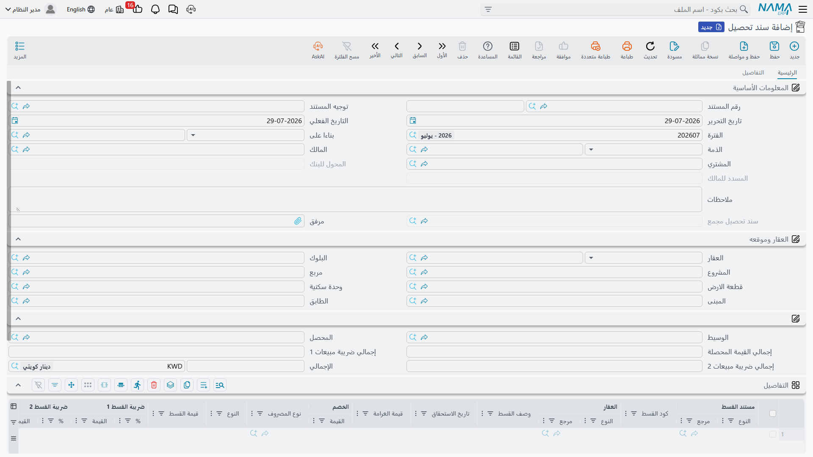
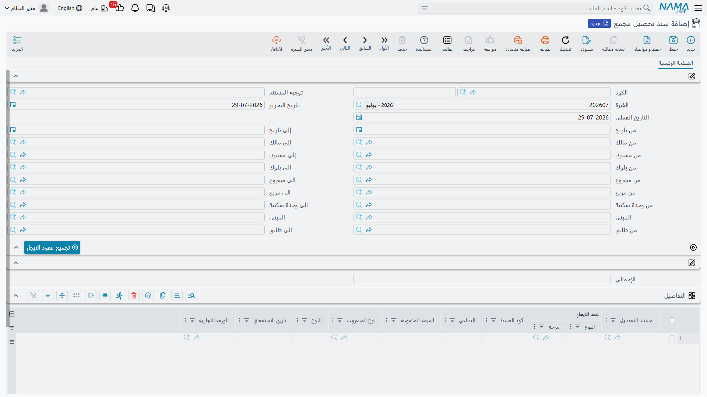

# سندات التحصيل والتحصيل المجمع

سند التحصيل هو الموضع الذي يجري فيه الجانب المالي من وحدة العقارات فعلياً. وكل ما عداه في هذا القسم صيغة منه: طلب التحصيل سند تحصيل أُطفئت آثاره، وسند الإعفاء سند تحصيل لا يحصّل نقداً، وسند التحصيل المجمع آلة تُنتج سندات التحصيل بالعشرات.

قبل المتابعة، تأكّد من استيعاب الآلية الموصوفة في [كيف يتم تحصيل الأقساط](/ar/modules/realestate/collections/realestate-collection-basics.md) — خصوصاً أن أعمدة المدفوع على العقد يعاد حسابها من مستندات التحصيل، وأن خيار **تأثير الأقساط** في التوجيه هو ما يحدد العمود الذي يتحرك.

ومثالنا في النصف الثاني من الصفحة: مديرة أملاك تدير 120 محلاً وتحصّل إيجارها كله في أول كل شهر.

## سند التحصيل

تجده في **العقارات و الممتلكات > المستندات > سند تحصيل**، وهو متاح برخصة `realestate` الأساسية.

### كيف تملؤه

1. **اختر الدفتر والتوجيه والتواريخ كالمعتاد.** التوجيه هنا أهم منه في معظم المستندات: فهو يحمل الحسابات، وخيار تأثير الأقساط، وقواعد ترتيب السداد. وإذا حدّد التوجيه نوع قسط، امتلأ حقل **النوع** في المستند منه، ولن يُعتمد مستند نوعه مخالف لنوع توجيهه.
2. **اختر العقد في حقل «بناءا على».** اختياره يملأ المالك والمشتري والذمة والعقار ومكوّنات موقعه، ويقترح قيمة مبنية على القسط المطابق لتاريخ الاستحقاق والنوع في الرأس. أما حقل المالك فيُملأ لك ولا يمكن تعديله، لأنه يأتي من العقد.
3. **أضف سطر تفاصيل لكل قسط.** يعرض عمود **كود القسط** قائمة اقتراحات بأكواد العقد المختار. واختيار أحدها ينسخ تاريخ استحقاق القسط وقيمته وغرامته وخصمه ونوعه ونسب ضرائبه إلى الأعمدة الاسترشادية غير القابلة للتحرير، ثم — وهذا هو المفيد — يضع في عمود **القيمة المحصلة** ما تبقّى على ذلك القسط.
4. **اكتب فوق القيمة المحصلة في السداد الجزئي.** اكتب 8٬000 أمام قسط قيمته 10٬000 فتتبعها الضرائب وصافي السطر وإجمالي الرأس في الحال.
5. **أدخل خصم التحصيل** في عمود الخصم التالي للقيمة المحصلة، إن كنت تتنازل عن جزء من الرصيد لإقفال السطر. فهو يُقلّص ما يستحقه القسط بدل أن يسدّده — راجع [صفحة الأساسيات](/ar/modules/realestate/collections/realestate-collection-basics.md).
6. **احفظ واعتمد.** يُنشأ الأثر المحاسبي بوصفه طلب أعمال يُعالج في الخلفية، وتُكتب قيود الأقساط، ويُعاد بناء أعمدة المدفوع والمتبقي على العقد.

ويتيح جدول التفاصيل أيضاً تحديد **الورقة التجارية** (الشيك) المرتبطة بالقسط، و**نوع المصروف** الذي يحدد أين تُقيَّد ضرائب السطر، ووصفاً حراً يظهر في المستند المطبوع.

### تحصيل عدة عقود في مستند واحد

حقل «بناءا على» ليس السبيل الوحيد للإشارة إلى عقد. فلكل سطر تفاصيل عمود عقد خاص به، والمستند الذي يحمل كل سطر فيه عقده لا يحتاج إلى عقد في الرأس أصلاً. وهكذا تحصّل من عميل واحد يملك ثلاث وحدات، أو تجمع أقساطاً متفرقة في إيصال واحد.

والقاعدة التي يجب تذكّرها هي الأولوية: **إذا امتلأ حقل «بناءا على» في الرأس فهو الغالب**، ويُنسخ إلى كل السطور. فإما أن تعمل من الرأس بعقد واحد، وإما أن تترك الرأس فارغاً وتقود كل شيء من السطور.

وقائمة اختيار العقد في السطور متعاونة: عقود الإيجار الملغاة مخفية، وإذا وُضع مشترٍ في الرأس عُرضت عقوده هو فقط.

### تحويل التحصيل إلى نقد

اعتماد سند التحصيل ينشئ حركة المديونية لا القبض. وزرّان يكملان المهمة:

- **إنشاء سند قبض** يفتح سند قبض جديداً غير محفوظ بإجمالي المستند، باسم المشتري، يحمل مسبقاً سطر أقساط لكل سطر تحصيل، وسطر ورقة تجارية لكل سطر ذُكر فيه شيك. تراجعه أنت وتحفظه بنفسك.
- **إنشاء طلب قبض** يفعل الشيء نفسه في نافذة منبثقة على هيئة طلب قبض، للمنشآت التي تمرّر المقبوضات عبر طلب أولاً. وهو ينسخ القيمة والطرف فقط.

أما الصفحة الثانية من المستند، «التفاصيل»، فتسرد سندات القبض وطلبات القبض ومستندات تحويل الملكية المرتبطة به، لتعرف من واقع التحصيل نفسه هل وصل المال فعلاً أم لا.

### وهو فاتورة أيضاً

سند التحصيل مستند ضريبي قائم بذاته: يمكن التحقق منه لدى مصلحة الضرائب، وعرضه على موقع الفوترة الإلكترونية، ورفعه للسداد الإلكتروني. وسياسة الضريبة تُلتمس بالترتيب — سياسة المشتري أولاً، ثم سياسة العقار، ثم سياسة التوجيه في الأخير. وتُحسب الضرائب من السياسة على كل سطر، إلا إذا فُعِّل في التوجيه خيار **يمكن تعديل الضريبة** (Editable Taxes)، فتبقى النسب التي تكتبها كما هي.

### اختصار يستحق المعرفة

لست مضطراً للبدء من سند التحصيل. ففي شاشة العقد، علِّم سطور الأقساط المطلوبة (ويعينك على ذلك إجراء **اختيار جميع الاقساط**) ثم اضغط **إنشاء سند تحصيل للاقساط المختارة**، فيصلك سند التحصيل معبّأً بتلك السطور.

## طلب التحصيل

**العقارات و الممتلكات > المستندات > طلب تحصيل** هو الشاشة نفسها، مبنية بالطريقة نفسها، ناقصةً حقلاً نظامياً واحداً. الرأس نفسه، وجدول التفاصيل نفسه، والزرّان نفسهما.

والغرض منه هو التعليمة «اذهب وحصّل هذه الأقساط» — يصدره فرع أو مشرف تحصيل ويسلّمه لمحصّل، ثم يُحرَّر سند التحصيل الحقيقي عند وصول المال.

وخاصيته الفارقة أنه **بلا آثار على الإطلاق**:

- لا ينشئ قيداً محاسبياً؛
- ولا يكتب قيود سداد أقساط، فلا يتغير مدفوع أو متبقٍّ على أي عقد؛
- ويتخطى تحققات عائلة التحصيل بالكامل — لا اشتراط لعقد، ولا فحص لكود القسط، ولا فحص للزيادة في السداد، ولا فحص لترتيب السداد.

كما أنه بلا إعدادات محاسبية عقارية خاصة؛ فتوجيه طلب التحصيل لا يحمل سوى خيارات الدفتر والتوجيه العامة.

::: info لا يوجد تحويل تلقائي
لا يوجد زر يحوّل طلب التحصيل إلى سند تحصيل. سند التحصيل يُدخل منفصلاً بالإشارة إلى العقد وأكواد الأقساط نفسها. فتعامل مع الطلب بوصفه قائمة عمل لا مسودة.
:::

## سند التحصيل المجمع

نعود إلى المحلات الـ 120. كتابة 120 سند تحصيل في أول كل شهر ليست خطة، لذا توفّر وحدة الإيجارات **العقارات و الممتلكات > المستندات > سند تحصيل مجمع**، وهو يحتاج رخصة `realestate-rent`.

الشاشة صفحة واحدة من أزواج المدى — من/إلى تاريخ، من/إلى مالك، من/إلى مشترٍ، ومن/إلى لكل مستوى من شجرة العقار (مشروع، مربع، بلوك، مبنى، طابق، وحدة) — إضافة إلى جدول تفاصيل وزر واحد.

### الدورة الشهرية

1. **حدّد المديات.** تضع مديرة الأملاك في مثالنا مدى التاريخ من 1 إلى 31 مارس، وتترك مدى المالك والموقع مفتوحاً لأنها تريد كل المحلات.
2. **اضغط زر التحصيل.** يجب حفظ المستند أولاً. يقرأ النظام كل عقد إيجار وعقد إيجار افتتاحي غير ملغى ومطابق للمديات، ويمرّ على أقساطها، ويضيف سطراً لكل قسط غير مسدَّد — يحمل العقد وكود القسط وقيمته الصافية ونوعه وتاريخ استحقاقه وشيكه ونوع مصروفه، مع تعبئة عمود **القيمة المدفوعة** بما تبقّى على ذلك القسط.
3. **راجع وعدّل.** الزر يملأ الجدول فقط ولا يحفظ شيئاً. احذف السطور غير المرغوبة، أو أنقص قيمة سطر يسدّد صاحبه جزءاً، أو أضف سطراً يدوياً — فعمود كود القسط يعرض قائمة الاقتراحات نفسها الموجودة في سند التحصيل.
4. **اعتمد.**

وثمة تفصيلان في عملية الجمع يستحقان الانتباه: الأقساط المؤشَّر عليها بالسداد لا تُجمع أبداً؛ و**إذا تركت التاريخين فارغين لم يُجمع إلا ما استحق فعلاً**، لأن الجمع يقارن تاريخ الاستحقاق بتاريخ القيمة في المستند. أما إذا ملأت مدى التاريخ فتحصل على تلك النافذة بالضبط.

وإذا كنت تكرر ذلك شهرياً، ففعِّل في التوجيه خيار **استثناء الأقساط التي تم تجميعها سابقا في سند قبض مجمع**. عندئذ يسأل الزر الخادم عن كل كود قسط هل سبق تجميعه في مستند آخر ويتخطى ما سبق تجميعه، فلا تُجمع الأجرة نفسها مرتين في الشهر الواحد.

### ماذا يفعل الاعتماد فعلاً

هذه النقطة تحدد طريقة ضبط المنظومة كلها. فالمستند المجمع **بلا أثر محاسبي خاص به**. وعند الاعتماد ينزل على الجدول سطراً سطراً، و**ينشئ ويعتمد سند تحصيل واحداً عن كل سطر**:

- مختوماً بـ**الدفتر والتوجيه المذكورين في توجيه المستند المجمع نفسه** — وهما الحقلان المطلوبان **دفتر سند تحصيل** و**توجيه سند تحصيل**. وإذا خلا أحدهما فشل الاعتماد وأخبرك بذلك؛
- حاملاً الفترة المالية وتاريخ القيمة وتاريخ الإصدار نفسها؛
- مبنياً على عقد الإيجار، بعقاره المؤجَّر ومالكه ومشتريه ومكوّنات موقعه كاملة؛
- بسطر تفاصيل واحد بالضبط: كود القسط، والقيمة المدفوعة من السطر المجمع، والنوع، وتاريخ الاستحقاق، والشيك، ونوع المصروف.

فكل السلوك الحقيقي — الحسابات، وتأثير الأقساط، وقواعد ترتيب السداد، وفحص الزيادة في السداد — يقع على التوجيه **المولَّد** لا على التوجيه المجمع. التوجيه المجمع مُشغِّل بثلاثة إعدادات، والتوجيه المولَّد هو موضع المحاسبة. اضبطه بالعناية نفسها التي تعطيها لسند تحصيل مكتوب باليد، ودع [صفحة التوجيهات](/ar/modules/realestate/document-terms/realestate-terms-other.md) تسير بك خلاله.

وبالنسبة لمحلاتنا الـ 120 فالنتيجة: مستند مجمع واحد على الشاشة، و120 سند تحصيل في قائمة سندات التحصيل، و120 مجموعة قيود أقساط، و120 عقداً تنخفض أرقام المتبقي فيها.

::: warning التعديل أو الإلغاء يحذف المستندات المولَّدة
إعادة اعتماد المستند المجمع بعد التعديل تعيد التوليد كله: السطور الباقية يعاد كتابتها، و**كل سند تحصيل ولّده سطر حذفته يُحذف**. وإلغاء المستند المجمع يحذف كل سندات التحصيل التي أنتجها. بهذا يبقيان متطابقين — لكن ذلك يعني أيضاً أن المستند المجمع ليس مكاناً آمناً لتصحيح صغير بعد الحقيقة. فإن كان رقم مستأجر واحد خاطئاً، فالأنظف عادةً تصحيح سند التحصيل المولَّد الخاص به.
:::

ويكتمل المشهد بحدّين. الجمع يقرأ **عقود الإيجار فقط** — أقساط البيع لا تُجمَّع، وتحصيل البيع يُكتب سند تحصيل عادياً. و**كل سطر يجب أن يذكر عقداً**: السطر الذي خانة عقده فارغة لا يمكنه توليد شيء وسيُسقِط الاعتماد، فاحذف السطور الشاردة بدل تركها فارغة.

والمستند المجمع لا يجري تحققاً خاصاً به؛ كل الفحص يجري داخل سندات التحصيل التي يولّدها. فإذا كان أحدها غير صالح — كود قسط لم يعد موجوداً، أو زيادة في السداد، أو عقد ألغي — فمن هناك تأتي رسالة الخطأ، و[صفحة عقد الإيجار](/ar/modules/realestate/rent/realestate-rent-contract.md) هي موضع التحقق مما تغيّر تحته.
