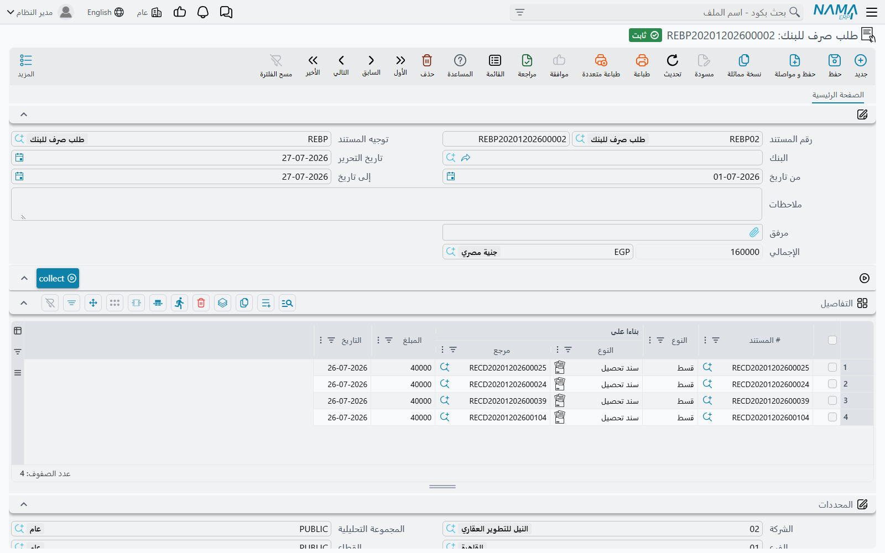
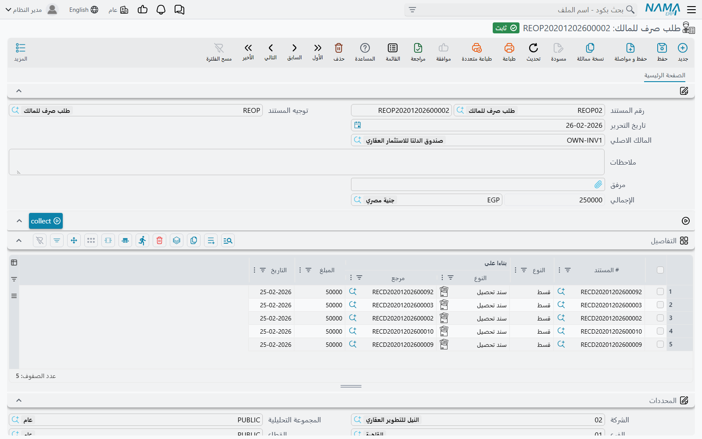

# توريد المحصل للبنك أو للمالك

تحصيل الإيجار نصف يوم شركة إدارة الأملاك فقط. أما النصف الآخر فهو إخراج هذا المال مرة أخرى: إلى البنك في آخر الأسبوع، وإلى المالك في آخر الشهر. ويتولى هذين المسارين مستندان متشابهان عن قصد — مدى، وزرّ يجمع سندات التحصيل، وقيد محاسبي واحد على الإجمالي.

وكلاهما يحتفظ برقم متراكم على كل سند تحصيل، وهو ما يمنع توريد المال نفسه أو صرفه مرتين. افتح أي سند تحصيل تجد في رأسه حقلين غير قابلين للتحرير: **المحول للبنك** (Transfered To Bank Amount) و**المسدد للمالك** (Transfered To Owner Amount). يبدآن من الصفر ويكبران كلما التقط أحد هذين المستندين ذلك التحصيل.

ومثالنا: شركة إدارة أملاك صغيرة حصّلت 78٬000 خلال الأسبوع الأول من مارس عبر اثني عشر سند تحصيل، تورّدها للبنك يوم الخميس، وفي آخر الشهر تسدّد 42٬000 للمالك أحمد عن المحلات التي تديرها نيابةً عنه.

## طلب صرف للبنك

**العقارات و الممتلكات > المستندات > طلب صرف للبنك**، متاح برخصة `realestate` الأساسية.

الرأس قصير: الدفتر والكود، والتوجيه، و**البنك** الذي يذهب إليه المال، وتاريخ الإصدار، وزوج **من تاريخ** / **إلى تاريخ**، والملاحظات، ومرفق، والإجمالي. والإجمالي محسوب لك ولا يمكن كتابته.

### توريد تحصيلات أسبوع

1. احفظ المستند، ثم اضبط **من تاريخ** على 1 مارس و**إلى تاريخ** على 7 مارس. لا بد من ملء أحد التاريخين على الأقل — فالضغط على زر التحصيل والتاريخان فارغان يتوقف برسالة «From Date and To Date Required»، لأن جمعاً بلا حدود سيسحب كل ما حصّلته الشركة منذ نشأتها.
2. **اضغط زر التحصيل.** يبحث النظام عن سندات التحصيل التي قيمتها المحصلة أكبر مما وُرِّد منها للبنك، ويقع تاريخ قيمتها داخل المدى، ويضيف سطراً لكل منها — بقيمة تساوي **الجزء الذي لم يورَّد بعد**، لا القيمة الكاملة. فسند التحصيل الذي وُرِّد نصفه الأسبوع الماضي يساهم بالباقي فقط.
3. **راجع الجدول.** يعرض كل سطر مستند التحصيل، ونوع القسط، والعقد المبني عليه، والتاريخ؛ وهذه يملؤها الجمع ولا تُحرَّر. أما القيمة فمتروكة مفتوحة، فيمكنك إنقاص سطر إذا كنت تورّد جزءاً منه فقط، ويبقى الباقي متاحاً للتوريد التالي.
4. **اعتمد.** إجمالي الرأس هو حاصل جمع السطور، والأثر المحاسبي سطر مدين واحد وسطر دائن واحد **على ذلك الإجمالي** — لا زوج لكل سطر. ويُعالج في الخلفية بوصفه طلب أعمال، فالفشل يُعاد من شاشة قائمة طلبات الأعمال لا بإعادة الإدخال.

وعند الاعتماد يزيد حقل **المحول للبنك** في كل سند تحصيل مشار إليه بقيمة السطر؛ ويُنقص عند إلغاء الاعتماد؛ وتعديل مستند معتمد يستبدل مجموعة السطور القديمة بالجديدة. وهذه هي كل الحسبة: يخرج التحصيل من دائرة الجمع في اللحظة التي يورَّد فيها بالكامل.

أما حقل **البنك** فيسمّي البنك الذي يذهب إليه الإيداع ويغذّي الطرف المحاسبي عبر مصدر الحساب في التوجيه. والجمع نفسه تقوده مديات التاريخ والمتبقي غير المورَّد — فاختر البنك لأن القيد يحتاجه، لا بوصفه فلتراً.

وبالنسبة لشركتنا في المثال: مستند واحد بتاريخ الخميس، واثنا عشر سطراً، وإجمالي 78٬000، واثنا عشر سند تحصيل لن تظهر في جمع الأسبوع القادم.

## طلب صرف للمالك

**العقارات و الممتلكات > المستندات > طلب صرف للمالك**، وهو أيضاً على رخصة `realestate` الأساسية.

هذا هو وجه الوكالة في العمل: الشركة تحصّل الإيجار نيابةً عن مالك، وعليها الآن تسليمه نصيبه. وشكل الشاشة هو نفسه مع فارقين دالّين.

**المستند مبني حول مالك لا حول فترة.** يحمل الرأس حقل **المالك الاصلي** — والقائمة لا تعرض إلا الأطراف المؤشَّر عليها بأنها ملّاك — والضغط على زر التحصيل بلا مالك يتوقف برسالة «Owner Required». و**لا يوجد مدى تواريخ إطلاقاً**. يجد الجمع كل سند تحصيل يخصّ ذلك المالك وقيمته المحصلة أكبر مما سُدِّد له، ويضيفه بالمتبقي غير المسدَّد. أي إنه يسأل السؤال نفسه دائماً: *ماذا ما زلنا مدينين به لهذا المالك؟*

**وجدول التفاصيل غير قابل للتحرير بالكامل.** فخلافاً لطلب البنك، حتى عمود القيمة مغلق: تسوية المالك كلّ أو لا شيء لكل تحصيل. فإن احتجت إلى صرف جزء مما تحتفظ به له، فالطريق العملي أن تسوّي سندات التحصيل التي تريد الإفراج عنها وتترك البقية للشهر القادم.

والاعتماد يقيّد مديناً واحداً ودائناً واحداً على إجمالي الرأس، تماماً كطلب البنك، ويرفع حقل **المسدد للمالك** في كل سند تحصيل. وإلغاء الاعتماد يعكس ذلك.

فتسوية أحمد إذن: اختر أحمد، اضغط زر التحصيل، فتحصل على كل تحصيل غير مسدَّد على محلاته، وترى 42٬000 في الإجمالي، ثم تعتمد — وفي الشهر القادم تختفي تلك التحصيلات من الجمع بينما تظهر الجديدة تلقائياً.

## أين يلتقي الرقمان

لأن المستندين يديران رقمين مستقلين على سند التحصيل نفسه، يمكن أن يكون التحصيل مورَّداً للبنك بالكامل وغير مسدَّد لمالكه بعد، أو العكس. وهذا مقصود: التوريد يخصّ مكان وجود النقد فعلياً، وتسوية المالك تخصّ صاحب المال. وقراءتهما معاً على شاشة سند التحصيل تروي قصة التحصيل الواحد كاملة بنظرة واحدة.

ولا يمسّ أيٌّ من المستندين العقود أو الأقساط. فالمديونية سُوِّيت عند اعتماد سند التحصيل — راجع [كيف يتم تحصيل الأقساط](/ar/modules/realestate/collections/realestate-collection-basics.md) — وهذان ينقلان مالاً سبق الاعتراف به. والحسابات التي يستخدمانها تأتي من توجيه كلٍّ منهما، وهو صفحة أثر واحدة بمجموعة مدين ومجموعة دائن؛ وتصفها [صفحة توجيهات مستندات التحصيل والصيانة والاستثمار والتكاليف](/ar/modules/realestate/document-terms/realestate-terms-other.md) مع بقية العائلة.

كما لا ينشئ أيٌّ منهما التحويل البنكي الفعلي ولا شيك المالك. فكما في كل موضع من هذه الوحدة، السند الذي يحرّك النقد خطوة منفصلة في وحدة الحسابات، مبنية على القيد الذي ينشئه هذان المستندان. أما التحصيلات التي يستهلكانها فمشروحة في [صفحة سندات التحصيل](/ar/modules/realestate/collections/realestate-collect-documents.md).
