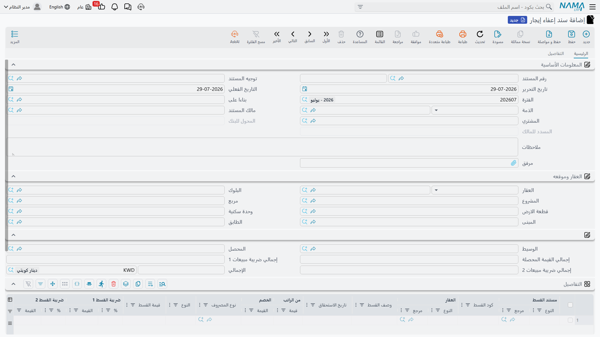
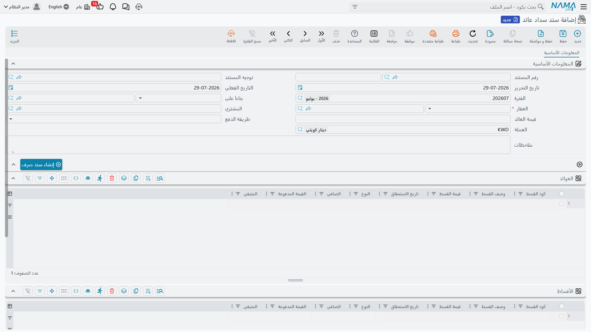

# الإعفاءات ورد المبالغ للمشتري

ليس كل قسط يُقفل بالنقد. فأحياناً تقرر الشركة ألا تُحصّله أصلاً — ثلاثة أشهر إيجار مجاني ريثما يُجهَّز المحل، أو تنازل تقديرياً بعد سنة سيئة. وأحياناً يسير المال في الاتجاه المعاكس، فتكون الشركة مدينة للمشتري بردّ رسوم سبق أن حصّلتها منه.

يغطي هذين الوضعين مستندان لا يكاد يجمع بينهما شيء سوى أن أياً منهما ليس تحصيلاً عادياً. وكلاهما يفترض أنك تعرف كيف يعمل التحصيل — وتشرح [صفحة الأساسيات](/ar/modules/realestate/collections/realestate-collection-basics.md) لماذا كانت أعمدة المدفوع على العقد خلاصة يعاد حسابها لا حقلاً تُحرِّره.

## سند إعفاء الإيجار

**العقارات و الممتلكات > المستندات > سند إعفاء إيجار**. وهو تابع لوحدة الإيجارات ويحتاج رخصة `realestate-rent`.

أول ما يُلاحَظ أن الشاشة هي سند التحصيل من أوله إلى آخره: الرأس نفسه، والعقار وموقعه، وجدول التفاصيل نفسه بقائمة اقتراحات أكواد الأقساط، والصفحة الثانية نفسها للسجلات المرتبطة. **والفارق الظاهر الوحيد هو مسمّى عمود واحد** — ففي سند التحصيل «القيمة المحصلة»، وفي سند الإعفاء **القيمة المعفاه** (Exemption Value).

وليس هذا تغييراً شكلياً في التسمية. فالإعفاء من حيث الآلية سند تحصيل لا يحصّل نقداً:

- يتحقق مثله تماماً — أكواد الأقساط يجب أن تكون على العقد، والزيادة في السداد مرفوضة، وترتيب السداد مُلزِم ما لم يقل التوجيه غير ذلك، والعقد الملغى أو المتنازل عنه مغلق أمامه؛
- ويكتب قيود سداد الأقساط نفسها، فتتحرك أعمدة المدفوع والمتبقي على العقد كما لو كان سداداً، عبر خيار **تأثير الأقساط** في التوجيه؛
- وينشئ الشكل نفسه من الأثر المحاسبي، ويُعالج في الخلفية بوصفه طلب أعمال — والفرق في حسابات توجيهه فقط، إذ تُوجَّه القيمة المعفاة عادةً إلى حساب مصروف أو خصم من الإيراد مقابل ذمة المستأجر.

### فترة سماح ثلاثة أشهر

استأجر مستأجر محلاً بـ 10٬000 شهرياً، ومنحه العقد ثلاثة أشهر مجانية ريثما يجهّزه. والجدول يحوي هذه الأقساط الثلاثة أصلاً — فإثبات الاستحقاق والفاتورة الضريبية للفترة يفترضان وجودها — فحذفها ليس خياراً.

1. أنشئ سند إعفاء بتوجيه تشير حساباته إلى حيث يريد المحاسب أن تقع الأجرة المعفاة.
2. اختر عقد الإيجار في حقل «بناءا على»، فيمتلئ الرأس بالمستأجر والمالك والوحدة وموقعها.
3. أضف ثلاثة سطور باختيار أكواد أقساط الأشهر الثلاثة. يصل كل سطر بكامل المبلغ المتبقي في عمود **القيمة المعفاه** — وهو تحديداً المطلوب حين يُعفى القسط كله.
4. اعتمد. تُقيَّد 30٬000 إعفاءً، وتتوقف الأقساط الثلاثة عن الظهور مستحقة، وينخفض متبقي العقد بـ 30٬000.

وإن كان المعفى جزءاً من الشهر فقط، فاكتب الرقم الأصغر ويبقى الباقي قابلاً للتحصيل بالطريقة المعتادة.

### إعفاء أم خصم تحصيل؟

يكثر الخلط بينهما، والدقة في الفرق مهمة لأنهما ينتجان أرقاماً مختلفة على العقد نفسه.

|  | خصم التحصيل | سند الإعفاء |
|---|---|---|
| أين تُدخله | عمود في سطر سند التحصيل بجوار القيمة المحصلة | مستند مستقل |
| أثره على القسط | **يُقلّص** ما يُعتبر القسط مديناً به | **يسوّي** القسط تماماً كما يفعل السداد |
| هل هو سداد؟ | لا — يخفض الهدف فيُقفل السطر بنقد أقل | نعم بكل معنى، سوى أن نقداً لم يصل |
| الاستخدام المعتاد | «ادفع اليوم وأخصم لك 500» | «لا تستحق عليك أجرة هذه الأشهر الثلاثة» |

وبالأرقام: قسط قيمته 10٬000 قوبل بـ 8٬000 نقداً و500 خصم تحصيل يتبقى عليه 1٬500 — إذ صار الدين 9٬500 وسُدِّد منه 8٬000. والقسط نفسه لو قوبل بإعفاء 10٬000 لم يتبقّ عليه شيء — إذ بقي الدين 10٬000 واستهلكه الإعفاء كله.

ولأن الإعفاء يستهلك الرصيد، فكل قواعد التحصيل تسري عليه. فلا يمكنك بالذات إعفاء أكثر مما يستحقه القسط، ولا إعفاء قسط متأخر وقسط أسبق منه غير مسدَّد، ما لم يحمل التوجيه خيار **تجاهل دفع الأقساط بالترتيب**.

::: tip أيهما يريد محاسبك؟
اسأل أين يجب أن يقع المال المتنازل عنه في الدفاتر، وهل يُقرأ خفضاً لما فُوتر أصلاً أم تكلفةً من تكاليف النشاط. فخصم التحصيل له طرفا مدين ودائن خاصان به في توجيه التحصيل، والإعفاء له توجيه كامل خاص به. وتغطي [صفحة توجيهات مستندات التحصيل والصيانة والاستثمار والتكاليف](/ar/modules/realestate/document-terms/realestate-terms-other.md) الاثنين.
:::

## سند سداد العائد

**العقارات و الممتلكات > المستندات > سند سداد عائد**. وهذا تابع لوحدة المبيعات ويحتاج رخصة `realestate-sales`.

هنا يعود المال فعلاً إلى المشتري. والحالة المعتادة أقساط **قيمة السعي** (Fees) التي يستحقها المشتري على عقد البيع لا التي تُستحق عليه — ردّ رسم سبق تحصيله، كله أو بعضه.

الرأس قصير: الدفتر والتوجيه، والتواريخ، والعقد في حقل «بناءا على»، والعقار (مطلوب)، والمشتري، و**قيمة العائد** المحسوبة لك، والعملة، و**طريقة الدفع** التي تحكم كل ما عداها في الشاشة.

### جدولان وسؤالان

- **العوائد** يجيب عن سؤال *بماذا نحن مدينون للمشتري؟* وقائمة اقتراحات أكواد الأقساط فيه لا تعرض إلا **الأقساط من نوع قيمة السعي**، وهي طريقة الوحدة في إبقاء المستند في غرضه. ومجموع هذا الجدول هو قيمة عائد المستند.
- **الأقساط** يجيب عن سؤال *أي أقساط المشتري المستحقة نخصم منها؟* ولا تملؤه بيدك عادةً — بل تملؤه طريقة الدفع.

### صرف أم خصم من أقساط العقد؟

**صرف** (Issue) يعني إخراج المال. اختياره يفرّغ جدول الأقساط لأن لا شيء يُخصم، ويفعّل زر **إنشاء سند صرف**: يجب حفظ المستند، ثم يبني الزر سند صرف جديداً بقيمة العائد باسم المشتري، بسطر عن كل سطر عوائد. ومع سداد تلك السندات يتابع الحقلان **المدفوع بسندات** و**المتبقي** أسفل الشاشة ما تم صرفه.

**خصم من أقساط العقد** (Discount From Contract Installments) يعني المقاصّة بدل الصرف. اختياره يملأ جدول الأقساط من العقد بكل قسط ما زال عليه متبقٍّ، ثم تختصر تلك القائمة إلى الأقساط التي تُطبَّق عليها المقاصّة. ولا يوجد سند صرف في هذا الطريق — فالزر يرفض لأن لا نقد يخرج — ويبقى رقما متابعة السندات دون تغيير.

ويحمل هذا الطريق الثاني تحققاً ستقابله فوراً: **يجب أن يتوازن الجدولان**. فمجموع العوائد يساوي مجموع الأقساط المخصوم منها، والاختلاف يُذكر في رسالة الخطأ بالرقمين معاً. وهو ليس هامش تقريب — اجعل الطرفين متساويين.

### ردّ رسوم بقيمة 15٬000

حُصِّل من مشترٍ 15٬000 رسوماً على عقد الفيلا، ووافقت الشركة على ردّها. وما زالت عليه أقساط، فالمقاصّة أبسط من إصدار شيك.

1. في عقد البيع، علّم سطر قسط الرسوم واضغط **إنشاء سداد عائد للأقساط المختارة**، فيُفتح سند سداد العائد وذلك السطر في جدول العوائد بقيمته المتبقية.
2. اضبط طريقة الدفع على «خصم من أقساط العقد»، فيمتلئ جدول الأقساط بأقساط المشتري المفتوحة.
3. أبقِ السطور التي مجموعها 15٬000 — قسطين بـ 7٬500 مثلاً — واحذف البقية.
4. اعتمد.

النتيجة: يُسوّى استحقاق المشتري للرسوم، ويُسوّى في الوقت نفسه 15٬000 من أقساطه القادمة. والجدولان كلاهما يغذّيان متابعة أقساط العقد، فيظهر طرفا المقاصّة على أعمدة المدفوع فيه؛ وإذا ترك التوجيه خيار **تأثير الأقساط** فارغاً، رجع هذا المستند إلى عمود **المحصل نظاميا** بدل ألا يفعل شيئاً.

والأثر المحاسبي مدين ودائن **لكل سطر عوائد**، من زوج طرفي قيمة سداد العائد الوحيد في التوجيه. وثمة تفصيل يستحق التخطيط له: يُقيَّد القيد بـ**العملة الرئيسية لدفاتر الشركة**، أياً كانت عملة المستند نفسه. وفي التطبيق أحادي العملة لا يظهر هذا أصلاً، أما في متعدد العملات فهو ما يحدد بأي عملة يُقاس الردّ.

وما عدا ذلك يسلك المستند مسلك بقية العائلة — الأثر طلب أعمال يُعالج في الخلفية، والفشل يُعاد من شاشة قائمة طلبات الأعمال لا بإعادة الإدخال. أما الاتجاه المعتاد، اتجاه دخول المال، فتغطيه [صفحة سندات التحصيل](/ar/modules/realestate/collections/realestate-collect-documents.md).
