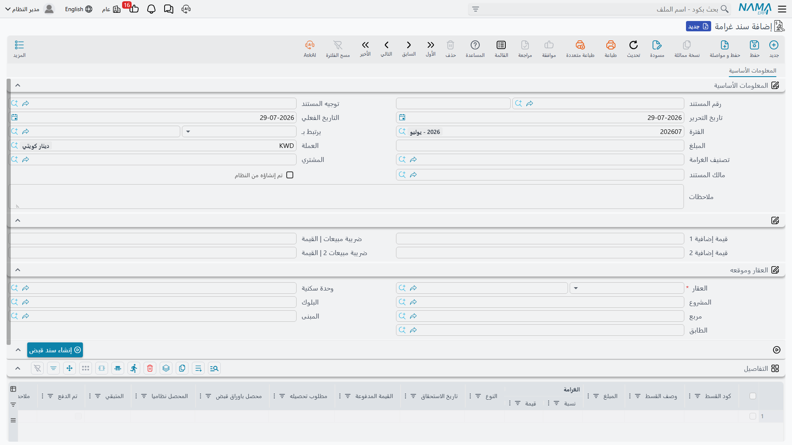

# غرامات التأخير

العميل المتأخر ثلاثة أشهر عن قسط قيمته 50٬000 ما زال مديناً بـ 50٬000. أما ما يستحق عليه **إضافةً** إلى ذلك — إن نصّ العقد — فهو غرامة، وهذه الغرامة ليست جزءاً من القسط. إنها مطالبة جديدة، تُحرَّر في مستند مستقل، وتُفوتَر على حدة، وتُحصَّل بسند قبض خاص بها.

هذا الفصل هو تصميم سند الغرامة كله، وهو ما ينبغي أن تمسك به وأنت تقرأ هذه الصفحة: **الغرامة مديونية ثانية تقف بجوار العقد، لا تعديل عليه**.

## سند الغرامة

**العقارات و الممتلكات > الغرامات > سند غرامة**، متاح برخصة `realestate` الأساسية.

يبيّن الرأس على من الغرامة وعلامَ:

- **يرتبط بـ** — المستند الذي تتبعه الغرامة، ويقبل عقد بيع، أو عقد بيع افتتاحياً، أو عقد إيجار، أو عقد إيجار افتتاحياً، أو مستند تنازل.
- **العقار** — مطلوب، ويمكن أن يكون أي مستوى من وحدة أو قطعة أرض صعوداً إلى بلوك أو مبنى أو طابق أو مجموعة وحدات.
- **قيمة الغرامة** وعملتها، و**تصنيف الغرامة**، و**المشتري** و**المالك**، ومكوّنات الموقع أسفلها.
- وسطرا ضريبة، لكل منهما نسبة وقيمة، ومؤشّر **مولد من النظام** يخبرك بنظرة هل حرّر الغرامةَ إنسانٌ أم أنتجتها الدورة المجدولة الموصوفة أدناه.

ويسرد جدول التفاصيل الأقساط التي تُفرض الغرامة عليها. يحمل كل سطر كود القسط ووصفه، وقيمة القسط نفسه، و**نسبة الغرامة** (الغرامة|نسبة) و**قيمة الغرامة** (الغرامة|قيمة)، والنوع وتاريخ الاستحقاق — ثم مجموعة أعمدة تُظهر ما سُدِّد وما تبقّى على ذلك القسط.

### كيف تُحدَّد القيمة

يمكنك العمل من أي طرف. اكتب نسبة فتُشتق القيمة من قيمة القسط، أو اكتب قيمة فتُشتق النسبة عكسياً. ويظلان متلازمين أثناء التحرير، و**عند الحفظ تغلب النسبة**: فكلما حمل السطر نسبة غير صفرية أُعيد اشتقاق قيمته منها.

ثم **يُكتب فوق قيمة الغرامة في الرأس بمجموع غرامات السطور** كلما وُجد سطر تفاصيل واحد على الأقل. فالقيمة المكتوبة يدوياً في الرأس لا تبقى إلا على غرامة بلا سطور أصلاً — وهي طريقة سليمة تماماً لفرض غرامة مقطوعة غير مرتبطة بقسط بعينه. أما متى وُجد سطر، فالسطور هي التي تقرر.

واختيار كود قسط (وقائمة الاقتراحات تأتي من المستند المذكور في «يرتبط بـ») ينسخ إلى السطر قيمة ذلك القسط ونوعه وصافيه وتاريخ استحقاقه وضرائبه وأرقام المدفوع والمتبقي الحالية. وكل كود تستخدمه يجب أن يكون موجوداً على المستند المرتبط، وإلا فشل الاعتماد وذكر الكود.

وضرائب الرأس تتبع قيمة الغرامة: اترك قيمة الضريبة صفراً فتُحسب من نسبتها، أو اكتب قيمة فتُشتق النسبة منها.

::: warning الغرامة لا تغيّر ما يُظهره العقد مستحقاً
أعمدة المدفوع والمطلوب تحصيله والمحصل بأوراق القبض والمحصل نظامياً والمتبقي في سطور تفاصيل الغرامة **مرايا للقراءة فقط** لسطور أقساط العقد، تُحدَّث من العقد الحيّ في كل حفظ. وجودها ليريك حالة القسط الذي تُغرِّم عليه، لا أكثر.

واعتماد الغرامة لا يكتب قيود سداد أقساط ولا يحرّك أرقام المدفوع أو المتبقي على العقد بوحدة واحدة. فالغرامة تُحصَّل بوصفها مستندها الخاص، وجدول العقد لا يتأثر في الحالين.
:::

### فوترتها وتحصيلها

الغرامة مستند بدرجة فاتورة: يمكن التحقق منه لدى مصلحة الضرائب، وعرضه على موقع الفوترة الإلكترونية، ورفعه للسداد الإلكتروني، وسياسة ضريبته من المشتري أولاً ثم من العقار.

ولتحصيلها اضغط **إنشاء سند قبض**، فيُفتح سند قبض جديد بقيمة الغرامة بعملتها باسم المشتري. وهو لا يحمل سطور أقساط عن قصد — إذ لا قسط عقد يُسوَّى هنا، بل الغرامة ذاتها.

كما تُسرد الغرامات المفروضة على عقد في شاشة ذلك العقد نفسه، فيرى موظف التحصيل وهو ينظر إلى عميل متأخر غراماته دون مغادرة العقد.

### إنشاء غرامة من العقد

زرّان في شاشات العقود يوفران عليك إعادة الكتابة:

- **إنشاء سند غرامة** يفتح غرامة في نافذة منبثقة، معبّأة بالمالك والمشتري والعقار والموقع، مرتبطة بذلك العقد، وحاملةً **كل** سطور أقساط العقد. وإن كان ذلك أكثر مما تريد، ففعِّل في توجيه الغرامة خيار **عدم نسخ الأقساط مع اختيار يرتبط بـ**، فتصل الغرامة بجدول فارغ.
- **إنشاء سند غرامة للأقساط المختارة** يفعل الشيء نفسه لسطور الأقساط التي علّمتها — والتي ما زال عليها متبقٍّ فقط. فإن علّمت سطراً مسدَّداً بالكامل رفض الزر وطلب منك اختيار قسط له قيمة متبقية.

## تصنيفات الغرامات

**العقارات و الممتلكات > الغرامات > تصنيف الغرامة** ملف أساسي بسيط: كود، واسم عربي، واسم إنجليزي، ومرفقات، ومحددات.

ويجدر التصريح بما **ليس** هو. فتصنيف الغرامة لا يحمل **نسبة ولا قيمة ولا حساباً**. إنه يصنّف الغرامات — «تأخر إيجار»، «إخلال بالعقد»، «مخالفة انتظار» — لتتمكن من الفلترة والتقرير عليها. أما المال والحسابات فمن سند الغرامة وتوجيهه، ولا شيء يُشتق من التصنيف.

## توليد الغرامات تلقائياً

ملاحقة المتأخرين يدوياً لا تتوسّع، لذا توفّر الوحدة مسار كيان يُنشئ الغرامات على جدول زمني. تربطه بمهمة مجدولة، وتعطيه المدخلات التالية، وتتركه يعمل — والإيقاع المعتاد شهري.

المدخلات بترتيب ظهورها:

| المُدخل | وظيفته |
|---|---|
| Fields Map | مطلوب. القيم التي تُختم بها كل غرامة مولَّدة — وأقلها دفتر المستند والتوجيه الذي يستخدمه. |
| Grace Period | كم يوماً يجب أن يتأخر القسط قبل أن يُغرَّم أصلاً. |
| Add Grace Period To Fine | هل تُحتسب أيام السماح نفسها ضمن أيام التأخير المحمَّلة. |
| Fine Is Value Not Percent | يحوّل المُدخل التالي من نسبة إلى مبلغ مقطوع. |
| Fine Percent/Value Per | هل يُحمَّل المعدّل عن **يوم** أم **شهر** أم **سنة**. |
| Fine Percent/Value | المعدّل نفسه. |
| Fine Calculation Query | اختياري. متى امتلأ حلّت نتيجته محل الحساب المدمج كلياً، للمنشآت التي لا تنضبط معادلة غرامتها بمعدّل بسيط. |
| Contracts To Search In | أنواع العقود التي تُفحص. والافتراضي: عقود البيع، وعقود البيع الافتتاحية، وعقود الإيجار، وعقود الإيجار الافتتاحية. |

### ماذا تفعل الدورة

تأخذ الدورة تاريخ اليوم، وترجع بمقدار فترة السماح، وتبحث عن العقود المعتمدة من الأنواع المذكورة التي فيها قسط واحد على الأقل ما زال عليه متبقٍّ وتاريخ استحقاقه أسبق من ذلك الحد. ولكل عقد كهذا تُنشئ غرامة — أو تعيد استخدام الغرامة التي أنشأتها سابقاً في الشهر نفسه، إذ تؤشّر الدورة على كل ما تنتجه بأنه **مولد من النظام** وتبحث عن إنتاجها السابق قبل إنشاء جديد.

والقيمة معدّلٌ مضروبٌ في مقدار التأخير. وتُحسب أيام التأخير من تاريخ استحقاق القسط (مضافاً إليه فترة السماح، ما لم تطلب تحميل أيام السماح) أو من بداية الشهر، أيهما أحدث، حتى اليوم. ثم يُحوَّل عدد الأيام إلى الوحدة التي اخترتها — فالمعدّل الشهري يقسم الأيام على 30، والسنوي على 360 — ويُضرب في الأساس: إما القيمة المقطوعة التي ضبطتها، وإما نسبتك مطبَّقة على ما زال القسط مديناً به.

**خذ قسطنا البالغ 50٬000 بمعدّل 0.5% شهرياً، متأخراً 90 يوماً.** الأساس 0.5% × 50٬000 = 250. ومعامل التكرار 90 ÷ 30 = 3. فالغرامة 750.

وأمران في النتيجة يستحقان التخطيط لهما. كل دورة تنتج **سند غرامة واحداً لكل عقد في الشهر** — فالمسار التلقائي رسم على مستوى العقد، فاستخدم الزرّين اليدويين أعلاه حين تحتاج غرامة مفصّلة قسطاً قسطاً. و**الغرامات المولَّدة من النظام في دورة سابقة والتي لم تعد مطابقة لأي عقد متأخر تُحذف**، وبذلك يتوقف ملاحقة من سدَّد؛ فالغرامة التي تريد إبقاءها دائماً لا ينبغي أن تُترك بيد الدورة التلقائية.

## أين يذهب المال

توجيه الغرامة صفحة أثر واحدة بمجموعة مدين ومجموعة دائن، والقيد الذي ينتجه هو ذلك بالضبط: سطر مدين واحد وسطر دائن واحد بقيمة الغرامة، والمشتري عميلاً والمالك مورّداً على الطرفين. وكما في كل مستندات هذه الوحدة، يُنشأ الأثر بوصفه طلب أعمال يُعالج في الخلفية، والفشل يُعاد من شاشة قائمة طلبات الأعمال (قائمة المزيد ← إعادة معالجة / إعادة اعتماد) لا بإعادة الإدخال.

ويُشرح التوجيه نفسه مع بقية العائلة في [صفحة توجيهات مستندات التحصيل والصيانة والاستثمار والتكاليف](/ar/modules/realestate/document-terms/realestate-terms-other.md). ولمعرفة كيف تُحصَّل الأقساط العادية — التي تُفرض الغرامة عليها — وكيف تُتابَع، راجع [كيف يتم تحصيل الأقساط](/ar/modules/realestate/collections/realestate-collection-basics.md)، وللعقود التي تتبعها الغرامات راجع [عقد البيع](/ar/modules/realestate/sales/realestate-sales-contract.md) و[عقد الإيجار](/ar/modules/realestate/rent/realestate-rent-contract.md).
