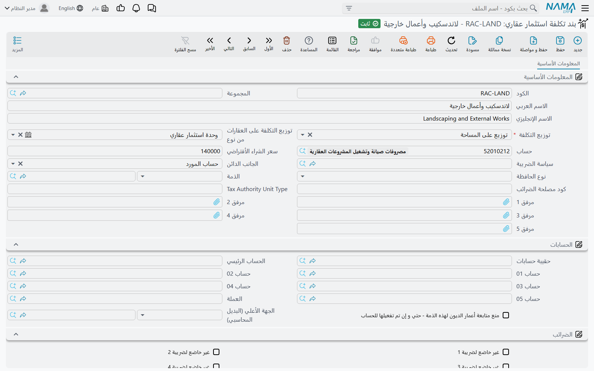
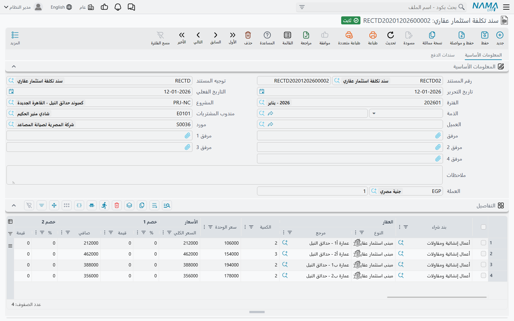

# توزيع تكاليف المشروع على العقارات

المطوّر العقاري لا يشتري مصعداً للشقة رقم ١٢. هو يوقّع عقداً واحداً لمصاعد المبنى B3، ويدفع لمورد
واحد ٣٠٠٬٠٠٠ بفاتورة واحدة، ثم يحفظها. والأمر نفسه ينطبق على الأرض وعقد الإنشاء الرئيسي وشبكة
الكهرباء ورخصة البناء والحملة التسويقية وأتعاب الاستشاري: التكلفة تصل دائماً على مستوى مشروع أو
بلوك أو مبنى.

لكن الإدارة المالية تسأل سؤالاً مختلفاً تماماً — *كم كلّفتنا الشقة رقم ١٢، وكم ربحنا منها؟* والإجابة
تعني أخذ كل مبلغ إجمالي تحمّله المشروع ودفعه إلى أسفل على الوحدات، بحيث تأخذ كل وحدة النصيب العادل
لها. هذا الدفع إلى أسفل هو سبب وجود منطقة التكاليف في وحدة العقارات.

## ثلاثة أجزاء، ودور كل منها

الآلية مقسّمة عمداً إلى ثلاثة أجزاء، حتى تُكتب القاعدة مرة واحدة وتُدخل الأموال مرات كثيرة.

1. **بند تكلفة استثمار عقاري (RE Additional Cost)** — كتالوج بنود التكلفة: «تركيب مصاعد»، «شبكة
   كهرباء»، «شراء أرض»، «حملة تسويقية». كل بند يحمل **قاعدة التوزيع**: على أي أساس يُوزَّع، وإلى أي
   مستوى في شجرة العقارات ينزل.
2. **سند تكلفة استثمار عقاري (RE Cost Document)** — السند نفسه. كل سطر فيه يجمع بند تكلفة مع عقار
   ومبلغ. هنا تُدخل الأموال.
3. **سطور التكلفة لكل عقار** التي ينشئها النظام عند الاعتماد — سطر لكل عقار لكل مستند، تُعرض للقراءة
   فقط على سند التكلفة نفسه، وتتراكم في حقل **التكلفة المخصصة (Assigned Cost)** على كل عقار.

الثلاثة تعيش تحت **العقارات و الممتلكات > التكلفة**، إلى جوار المستند الثالث في نفس القائمة:
[سند التكلفة الافتتاحي](/ar/modules/realestate/opening/realestate-opening-balances) الذي يكتب في
نفس المكان تماماً، حتى تجتمع التكلفة التاريخية مع التكلفة الجديدة في موضع واحد.

## بند التكلفة هو الذي يحمل القاعدة

بند التكلفة ملف رئيسي صغير، لكن حقلين فيه يقومان بكل العمل.

### توزيع التكلفة (Cost Distribution)

هذا هو الأساس — الرقم الذي يقرأه النظام من كل عقار مستهدف ويستخدمه كوزن لذلك العقار في القسمة. الحقل
إجباري، وأمامك سبعة اختيارات:

| الاختيار | ما يقرأه النظام على كل عقار |
|---|---|
| توزيع على المساحة (Distribute On Area) | مساحة العقار |
| توزيع على السعر (Distribute On Price) | سعر وحدة العقار |
| توزيع على N1 | الحقل الرقمي الحر الأول على العقار |
| توزيع على N2 | الحقل الرقمي الحر الثاني |
| توزيع على N3 | الحقل الرقمي الحر الثالث |
| توزيع على N4 | الحقل الرقمي الحر الرابع |
| توزيع على N5 | الحقل الرقمي الحر الخامس |

المساحة والسعر يغطيان معظم ما يحتاجه المطوّر — الإنشاء والتشطيب يتبعان المساحة، والتسويق وقيمة الأرض
يتبعان السعر. أما الحقول الرقمية الخمسة فهي منفذ الحرية: كل سجل عقار في الوحدة (وحدة سكنية، أرض،
بلوك، مبنى، طابق، مجموعة وحدات) يحمل خمسة أرقام حرة، تضع فيها ما تشاء من أوزان — عدد الغرف، نصيب
الوحدة من المساحات المشتركة، وزن هندسي، فرق الإطلالة — ثم توزّع عليه.

::: info لا يوجد اختيار «التوزيع بالتساوي»
القائمة أعلاه هي القائمة كاملة. إذا أردت توزيع تكلفة مصعد بالتساوي على ٤٠ شقة، فالطريقة أن تضع
**نفس الرقم في نفس الحقل الرقمي على كل شقة من الأربعين** — اكتب `1` في N1 على كلٍّ منها ثم وزّع على
N1. النتيجة قسمة متساوية، لكنك تُعدّها بنفسك؛ النظام لن يفعلها نيابة عنك.
:::

وهناك عادة مرتبطة بذلك تستحق الترسيخ: **حقل الأساس يجب أن يكون مملوءاً على العقارات التي توزّع
عليها.** فإن وزّعت على N3 ولم يملأ أحد N3، تصبح كل الأوزان أصفاراً، ولا يبقى شيء يُقسم بالتناسب،
وينتهي مبلغ السطر كاملاً على آخر عقار مرّ عليه النظام. راجع الأساس قبل اعتماد توزيع كبير.

### توزيع التكلفة على العقارات من نوع (Distribute Value On Estates Of Type)

الحقل الثاني يقرر **إلى أي عمق ينزل المبلغ في الشجرة**، ويقبل ثلاثة مستويات: وحدة سكنية، أو مبنى،
أو قطعة أرض.

- اتركه فارغاً، أو سجّل السطر على عقار من نفس النوع المذكور فيه، فيبقى المبلغ حيث وضعته بلا توزيع.
- املأه، فينفجر عقار السطر إلى **كل ما تحته من عقارات من ذلك النوع**، ويُوزَّع المبلغ عليها.

وهكذا فإن بند «تركيب مصاعد» المضبوط على *توزيع على المساحة* + *وحدة سكنية* يتيح لك تسجيل سطر واحد
على **المبنى B3** ويتولّى النظام العثور على كل شقة تحته. أنت لا تعدّد الوحدات أبداً.

بقية حقول البند هي قيم افتراضية يدفعها إلى سطر سند التكلفة عند اختياره: **سعر الشراء الأفتراضي
(Default Purchase Price)**، **حساب (Account)**، **الجانب الدائن (Credit side)**، **الذمة
(Subsidiary)**، **نوع الحافظة (Subsidiary account type)** و**سياسة الضريبة (Tax Plan)** — إضافة إلى
مجموعة حسابات كاملة، فيمكن استخدام بند التكلفة نفسه كذمة محاسبية حين تريد أن يقف الالتزام أمام البند
لا أمام مورد.

## سند التكلفة

سند التكلفة مصمَّم على هيئة فاتورة مشتريات متنوعة، ويتصرّف مثلها. يحمل رأس المستند الدفتر والكود
و**توجيه المستند (Document Term)** وتاريخي الإصدار والقيمة والفترة المحاسبية و**المشروع (Project)**
و**الذمة (Subsidiary)** و**مندوب المشتريات (Purchases Man)** و**العميل (Customer)** و**مورد
(Supplier)** والعملة وسعر تحويلها.

وفي جدول **التفاصيل (Details)** توصف التكلفة:

| العمود | الغرض منه |
|---|---|
| بند شراء (Purchase Element) | بند التكلفة — **إجباري**، وهو مصدر قاعدة التوزيع |
| العقار (Estate) | العقار الذي تحمّل التكلفة: وحدة سكنية أو أرض أو بلوك أو مبنى أو طابق أو مجموعة وحدات |
| الكمية (Quantity) | إجباري |
| سعر الوحدة والسعر وثمانية مستويات خصم وأربع ضرائب | كتلة الأموال المعتادة في الفاتورة |
| **الصافي (Net value)** | **هذا هو الرقم الذي يُوزَّع** — بعد خصوم السطر وضرائبه، لا الإجمالي |
| حساب (Account) و الجانب الدائن (Credit side) و الذمة (Subsidiary) | أين يقع الطرف الدائن |

اختيار بند التكلفة يملأ لك السطر: سعر الوحدة من سعر الشراء الافتراضي للبند (فقط إذا كان السعر ما زال
فارغاً)، والجانب الدائن دائماً، والحساب أو الذمة حين يستدعيهما الجانب الدائن المختار ويكون العمود
فارغاً، ونوع الحافظة إذا كان فارغاً، ونسبتَي الضريبة ١ و٢ من سياسة الضريبة الخاصة بالبند بحسب الشركة
الحالية.

وعمود **الجانب الدائن (Credit side)** هو الذي يحدد لمن يُستحق المبلغ: حساب المورد، أو حساب محدد، أو
ذمة المستخدم الحالي، أو ذمة محددة.

أما الصفحة الثانية **سندات الدفع (Payment Documents)** فهي جانب السداد: **نموذج الدفع (Payment
Template)**، وزر **إنشاء الدفعات (Generate Payments)** الذي يحوّله إلى جدول دفعات، وجدول الدفعات
نفسه، وقائمة سندات الدفع الخارجية. وتحمل كتلة الأزرار ما تحمله أي فاتورة: **ادفع الفاتورة (Pay
Invoice)** و**دفع جزء من الفاتورة (Pay Part Of Invoice)** و**إنشاء سند صرف (Generate payment
voucher)** و**تجميع سندات الصرف (Collect Payment Vouchers)**، إلى جانب **تجميع الأصناف (Collect
Items)** وزرَّي الضرائب **احتساب الضرائب (Restore Taxes)** و**حذف الضرائب (Remove Taxes)**.

## المثال العملي خطوة بخطوة

المبنى B3 يضم ٤٠ شقة بإجمالي مساحة ٤٬٨٠٠ م². ومقاول المصاعد أصدر فاتورة بـ ٣٠٠٬٠٠٠.

1. أنشئ بند تكلفة **تركيب مصاعد**، توزيع التكلفة = *توزيع على المساحة*، وتوزيع التكلفة على العقارات
   من نوع = *وحدة سكنية*.
2. أدخل سطراً واحداً في سند التكلفة: بند شراء = تركيب مصاعد، العقار = **المبنى B3**، الكمية ١،
   السعر ٣٠٠٬٠٠٠. فيخرج الصافي ٣٠٠٬٠٠٠.
3. اعتمد السند. تُعالَج آثاره في الخلفية، ويظهر التوزيع في قائمة **توزيع تكلفة العقار (Estate Cost
   Distribution)** للقراءة فقط في الصفحة الأولى.

ولكل شقة يحسب النظام:

> نصيب الشقة = صافي السطر × مساحة الشقة ÷ إجمالي مساحة الأربعين شقة

فتتحمّل شقة مساحتها ١٨٠ م² مبلغ `300,000 × 180 ÷ 4,800 = 11,250`، وتتحمّل شقة مساحتها ٩٦ م² مبلغ
٦٬٠٠٠. و**آخر** شقة في القائمة تستوعب فرق التقريب، فتظل الأنصبة الأربعون تجمع إلى ٣٠٠٬٠٠٠ بالضبط لا
إلى ٢٩٩٬٩٩٩٫٩٧.

وهناك سلوكان آخران يظهران مع كبر المستندات:

- التوزيع يُحسب **لكل سطر تفاصيل على حدة**، وكل سطر يُوزَّع مستقلاً. عشرة سطور في مستند واحد تعني
  عشر عمليات توزيع منفصلة.
- إذا تكرر العقار نفسه في أكثر من سطر، تُدمج أنصبته في **سطر واحد** لذلك المستند بدل أن تُسرد مراراً.

## أين يستقر الرقم في النهاية

في كل مرة يُعتمد فيها سند التكلفة أو يُعدَّل أو يُلغى، يعيد النظام كتابة سطور ذلك المستند، ثم يعيد
حساب إجمالي كل سطور التكلفة من كل المستندات لكل عقار مسّه المستند. هذا الإجمالي هو **التكلفة المخصصة
(Assigned Cost)** على العقار.

والتكلفة المخصصة للقراءة فقط — لا تُكتب يدوياً أبداً — وهي متاحة كعمود في شاشة قائمة الوحدات السكنية
بجوار قيمة الشراء والقيمة الحالية، وهذه أسرع طريقة لرؤية أساس تكلفة طابق أو مبنى كامل بنظرة واحدة.
وإذا ألغيت اعتماد المستند اختفت سطوره وانخفضت التكلفة المخصصة مرة أخرى.

وللاطلاع على بقية القيم التي يحملها العقار راجع
[كيف يُمثَّل العقار في النظام](/ar/modules/realestate/properties/realestate-estate-model).

## القيد المحاسبي، والجزء الذي يفاجئ الجميع

هنا النقطة التي يقع فيها معظم الناس أول مرة.

**التوزيع نفسه لا ينتج قيداً محاسبياً.** هو ينتج سطور التكلفة لكل عقار ورقم التكلفة المخصصة، ولا
شيء غير ذلك.

سند التكلفة **له** أثر محاسبي بالفعل، لكنه أثر الفاتورة المعتاد: الجانبان المدين والدائن المضبوطان
على [توجيه المستند](/ar/modules/realestate/document-terms/realestate-terms-other)، ويُسجَّلان **لكل
سطر من سطور المستند** — بند تكلفة، وحساب، ومورد — تماماً كما تسجّل فاتورة المشتريات. ولا يُسجَّل
لكل عقار.

فبعد اعتماد فاتورة المصاعد بـ ٣٠٠٬٠٠٠، يُظهر دفتر الأستاذ ٣٠٠٬٠٠٠ تكلفة مشروع أمام المقاول، ولا
يُظهر ١١٬٢٥٠ أمام الشقة ١٢. التفصيل على مستوى الوحدة يعيش في سطور التوزيع وفي التكلفة المخصصة.

وهذا كافٍ في العادة — معظم العملاء يريدون دفتر الأستاذ على مستوى المشروع وتكلفة الوحدة داخل شاشات
العقارات وتقاريرها. أما حين تحتاج فعلاً إلى قيد محاسبي لكل وحدة أيضاً، فتضيفه عبر مسار كيان يقرأ
سطور التوزيع ويسجّل سطراً لكل واحد منها. وصفحة
[أسئلة شائعة عن الاستثمار العقاري](/ar/modules/realestate/real-estate-fq) تشرح هذا الإعداد بالضبط،
ويستحق أن تقرأها وهذه الصفحة أمامك: تلك تشرح **كيف** تحصل على القيد، وهذه تشرح **ما الذي** يُسجَّل.

## جدول التكلفة الموازي القادم من وحدة المقاولات

إذا كانت وحدة المقاولات مركّبة، فإن تكلفة الإنشاء تصل إلى العقارات عبر طريق ثانٍ منفصل تماماً، ولها
جدولها الخاص. ومن المفيد معرفة وجوده حتى لا يختلط الاثنان.

في الوضع الافتراضي يأتي الربط من **عقد المشروع**: كل سطر بند فيه يسمّي عقاراً، وتُخصَّص تكلفة ذلك
البند هناك. وإذا فعّلت إعداد المقاولات **حساب تكلفة العقارات الفعلية من الكارت التحليلى (Calculate
Estate Cost From Term Analysis Card)** جاء الربط من **الكارت التحليلي** بدلاً من ذلك — ووجب حينها
ترك عمود العقار فارغاً في جدول بنود عقد المشروع؛ فملء الاثنين مرفوض، والرسالة تسمّي الإعداد الذي
سبّب الرفض. وفي الحالتين تنزل تكلفة العقار الأب إلى أبنائه بحسب المساحة، أو بحسب التكلفة التقديرية
للمقاولات إذا طلب الإعداد المصاحب ذلك.

والموضع الوحيد الذي يلتقي فيه العالمان هو البيع نفسه: تكلفة المقاولات المتراكمة على الوحدة **قبل**
تسليمها متاحة لعقد البيع الذي يمكنه تسجيلها كتكلفة ما قبل التسليم، أما التكلفة التي تصل **بعد**
التسليم فيجمعها مستند خاص بها — راجع
[تسليم الوحدة](/ar/modules/realestate/sales/realestate-handover).

ولمعرفة الكتالوجات التي تغذّي جداول الرسوم والعمولات والمصروفات في بقية الوحدة راجع
[أنواع الرسوم والعمولات والوسطاء والمصروفات](/ar/modules/realestate/costs/realestate-fee-commission-and-expense-types).
