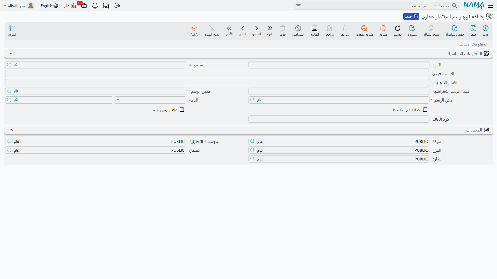
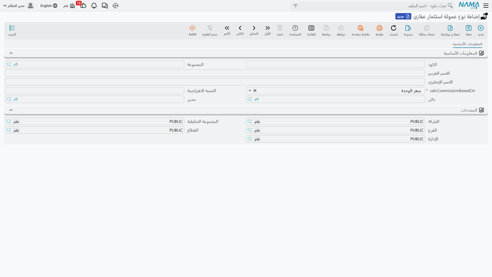
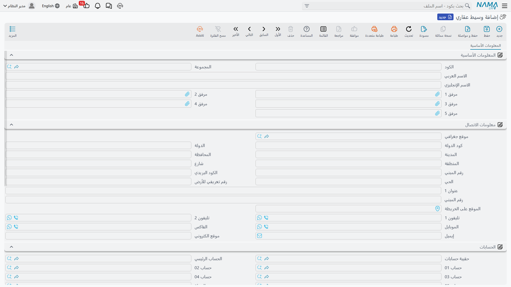
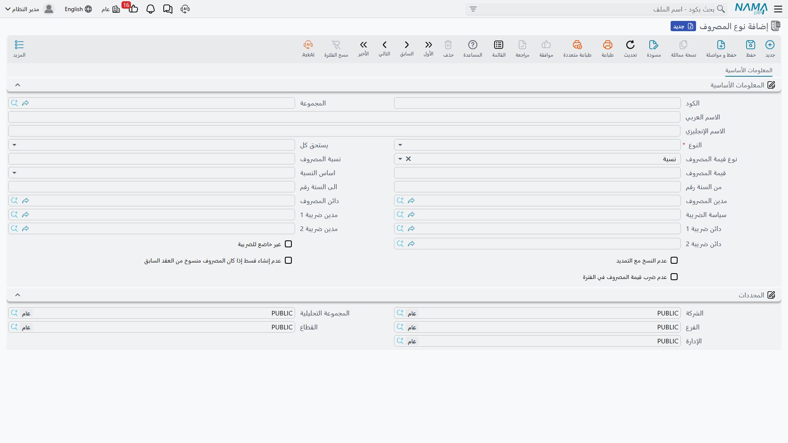
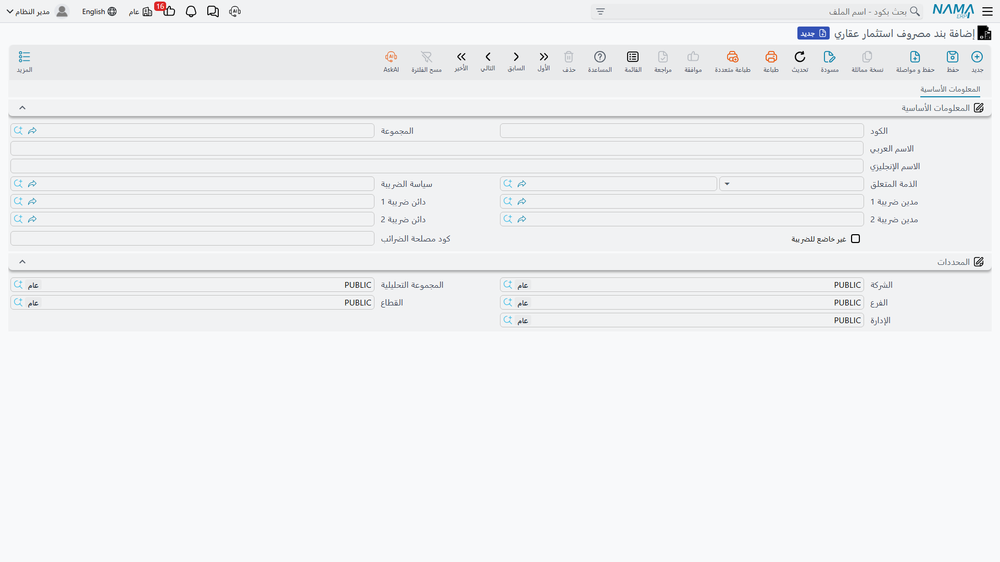

# أنواع الرسوم والعمولات والوسطاء والمصروفات

خمسة ملفات رئيسية صغيرة تحت **العقارات و الممتلكات > الملفات** لا تظهر في العمل اليومي كشاشات
مستقلة، بل تظهر كقوائم اختيار — في جدول الرسوم على عقد البيع، وفي جدول العمولات، وفي جدول المصروفات
على عقد الإيجار، وفي تفاصيل فاتورة الصيانة. وكلٌّ منها موجود لكي تُكتب قيمة أو حساب أو قاعدة مرة
واحدة على يد من يعرفها، ثم يختارها بعد ذلك من لا يعرفها.

ومن السهل الخلط بينها لأن ثلاثة منها تحمل كلمة «رسم» أو «مصروف» بصورة أو بأخرى. وأسرع طريقة للتفريق
هي المكان الذي تلتقي فيه كلاً منها:

| الكتالوج | أين تلتقي به |
|---|---|
| نوع رسم استثمار عقاري (Real Estate Fee Type) | جدول *رسوم أخري* على عقود البيع والإيجار |
| نوع عمولة استثمار عقاري (Real Estate Commission Type) | جدول *العمولات* على عقد البيع |
| وسيط عقاري (Real Estate Broker) | الطرف الذي يتقاضى العمولة |
| نوع المصروف (Expense Type) | جدول المصروفات المتكررة على عقد **الإيجار** |
| بند مصروف استثمار عقاري (RE Expense Item) | تفاصيل مستند مصروف **الصيانة** |

وهناك سادس موثّق في صفحة أخرى لأن سلوكه مختلف تماماً: كتالوج بنود التكلفة الذي يحمل قاعدة توزيع،
وهو موصوف في
[توزيع تكاليف المشروع على العقارات](/ar/modules/realestate/costs/realestate-cost-distribution).

## نوع رسم استثمار عقاري — الرسم لمرة واحدة

نوع الرسم هو مبلغ يرافق العقد: رسم تسجيل، رسم صك، رسم توصيل مرافق، رسم إداري. لنفترض أنك تحصّل من كل
مشترٍ رسم تسجيل قدره ٥٬٠٠٠. تنشئه مرة واحدة:

| الحقل | وظيفته |
|---|---|
| قيمة الرسم الافتراضية (Default Fee Value) | تُدفع إلى سطر الرسم بمجرد اختيار النوع |
| **مدين الرسم (Fee Debit)** و**دائن الرسم (Fee Credit)** | **إجباريان** — الحسابان اللذان يُسجَّل عليهما الرسم |
| الذمة (Subsidiary) | المستفيد الافتراضي: طرف آخر أو موظف |
| إضافة إلى الأقساط (Add To Installments) | إدراج الرسم ضمن جدول الأقساط المولَّد بدلاً من تركه منفصلاً |
| عائد وليس رسوم (Return Not Fees) | المبلغ عائد **إلى** العميل لا محصَّل منه |
| كود العائد (Return Code) | كود تجميع للعوائد |

والحسابات هي الجزء اللافت. ففي كل مكان آخر تقريباً داخل العقارات تأتي الحسابات من توجيه المستند، أما
هنا فتأتي **من الملف الرئيسي نفسه**. كل سطر رسم على العقد يُسجَّل بالجانبين المدين والدائن الخاصين
بنوع الرسم، ولهذا يستطيع العقد الواحد أن يرسل رسم التسجيل إلى حساب ورسم التوصيل إلى حساب آخر دون
المساس بالتوجيه إطلاقاً. (وبإمكان توجيه العقد أن يوقف كتلة الرسوم بأكملها إذا أراد العميل أن تكون
تلك السطور للتوثيق فقط.)

وستلتقي بنوع الرسم في ثلاثة مواضع: جدول **رسوم أخري (Other Fees Lines)** على
[عقد البيع](/ar/modules/realestate/sales/realestate-sales-contract) وعلى عقد البيع الافتتاحي وسند
التنازل وعقود الإيجار؛ وكعمود **نوع رسم استثمار عقاري (Real Estate Fee Type)** في كل جدول أقساط،
يبيّن أي رسم ولّد ذلك القسط؛ وفي مولّد جدول الرسوم على عقد البيع الذي يوزّع الرسم على عدة أقساط
مؤرَّخة.

ويستحق حقل **عائد وليس رسوم (Return Not Fees)** جملة مستقلة. فتفعيله يقلب دلالة الإشارة على السطر:
يصبح المتبقي السالب أمراً مشروعاً لا خطأ، وتُتابَع قيمة السطر كقيمة مطلقة. وهذا هو ما يجعل الودائع
المستردة والمبالغ المعادة تعمل — راجع
[الإعفاءات ورد المبالغ للمشتري](/ar/modules/realestate/collections/realestate-exemptions-and-returns).

## نوع عمولة استثمار عقاري — كم، وعلى أي أساس، وإلى أي حساب

نوع العمولة يجيب عن ثلاثة أسئلة دفعة واحدة: ما النسبة المعتادة، وعلى أي رقم تُطبَّق، وإلى أي حسابين
تُسجَّل. أنشئ نوعاً باسم «عمولة مبيعات» بـ **النسبة الافتراضية (Default Percentage)** ٢٪ مع زوج
**مدين (Debit)** و**دائن (Credit)**، ولن يكتب مندوب المبيعات بعدها شيئاً يُذكر.

أما الحقل الذي يحدد أساس احتساب العمولة (**Calculate Commission Based On**) فهو الذي يشكّل الحساب،
ويقدّم اثني عشر أساساً:

| الأساس | الرقم الذي تُطبَّق عليه النسبة |
|---|---|
| سعر الوحدة (Unit Price) *(الافتراضي)* | إجمالي سعر العقد |
| الصافي (Net Value) | القيمة المتبقية على العقد |
| رقم ١..٥ من الوحدة (Unit N1..N5) | أحد الأرقام الحرة الخمسة على العقار المُباع |
| رقم ١..٥ من العقد (Contract N1..N5) | أحد الأرقام الحرة الخمسة على رأس العقد |

والأسس المبنية على الأرقام الحرة موجودة من أجل الصفقات التي لا تُحسب فيها العمولة على السعر المعلن —
عمولة على المساحة المبنية، أو على تقييم متفاوَض عليه، أو على تعرفة ثابتة لكل وحدة تحفظها على العقار.

وعلى العقد، يسمّي كل سطر عمولة نوعَ العمولة والمستفيدَ (موظف أو وسيط أو طرف آخر) ونسبةً وقيمة، مع
مربع اختيار **احتساب النسبة من القيمة (Calculate Percentage From Value)** يقرر أيّ الاثنين تكتبه
أنت. فإذا تركته فارغاً كتبتَ النسبة وحسب النظام القيمة، وإذا فعّلته كتبتَ المبلغ المتفق عليه وحسب
النظام النسبة التي يمثّلها. واختيار النوع يملأ النسبة من قيمته الافتراضية ويحسب القيمة فوراً.

والتوقيت هو ما يفاجئ الناس: **العمولة تُسجَّل عند اعتماد عقد البيع، لا عند دفعها للوسيط.** المدين
والدائن يأتيان من حسابات نوع العمولة نفسه، ويصير المستفيد هو الذمة، ودفع الوسيط لاحقاً سند صرف عادي
على حسابه. وإذا تُنُوزل عن البيع بعد ذلك، يمكن ضبط
[سند التنازل](/ar/modules/realestate/sales/realestate-waiver-and-cancellation) ليسجّل نفس أنواع
العمولات بجانبين معكوسين.

وهناك حدّان يجدر معرفتهما. أنواع العمولات تنتمي إلى عائلة **البيع** — عقد البيع وسند التنازل. أما
عقد البيع الافتتاحي فليس فيه جدول عمولات أصلاً، فالبيعة التاريخية المُرحَّلة لا تحمل عمولة. وعقود
الإيجار لا تستخدم أنواع العمولات كذلك؛ فعمولة الإيجار قيمة على العقد نفسه تُعالَج عبر توجيه الإيجار
— راجع [إنشاء جدول الإيجارات](/ar/modules/realestate/rent/realestate-rent-schedule).

## وسيط عقاري — طرف له حساب

سجل الوسيط في معظمه بيانات اتصال — عنوان وهواتف وجوال وفاكس وبريد إلكتروني وموقع — إضافة إلى كتلتين
تجعلانه أكثر من مجرد دفتر عناوين: كتلة **الحسابات (Accounts)** الكاملة، فالوسيط ذمة محاسبية حقيقية
يمكن أن تُقيَّد عمولته مباشرة على حسابه وتُسدَّد بسند صرف؛ وكتلة **معلومات الضرائب (Tax
Information)** لأرقام السجل التجاري والتسجيل الضريبي عند تفعيل ضريبة المبيعات.

وهناك أمر عن الوسطاء يسهل افتراضه على غير وجهه. عقود البيع والإيجار تحمل حقلاً في رأس المستند اسمه
**وسيط (Broker)**، وهو حقل معلوماتي: يُنسخ عند إنشاء مستند من آخر — من عرض السعر إلى العقد، ومن
الحجز إلى مستند البيع — ولا يفعل شيئاً غير ذلك. فهو لا ينشئ سطر عمولة ولا يسجّل قيداً. **سطور
العمولة تُدخل يدوياً في جدول العمولات**، وعلى السطر تسمّي من يتقاضى المبلغ.

## نوع المصروف — الرسم المتكرر على عقد الإيجار

نوع المصروف رسم يتكرر طوال عمر عقد **الإيجار**: رسم نظافة، رسم أمن، مساهمة في كهرباء المناطق
المشتركة. وهو الوحيد بين هذه الكتالوجات الذي يحمل جدولاً زمنياً لا قيمة مفردة.

| الحقل | وظيفته |
|---|---|
| النوع (Type) | **إجباري** — نوع القسط الذي تحمله السطور المولَّدة |
| يستحق كل (Paid Every) | **إجباري** — دورية التكرار |
| نوع قيمة المصروف (Expense Value Type) | *نسبة (Percentage)* وهو الافتراضي، أو *قيمة (Value)* |
| نسبة المصروف (Expense Percentage) و قيمة المصروف (Expense Value) | أيّهما يستدعيه نوع القيمة |
| اساس النسبة (Percentage Basis) | *قيمة الايجار لأول سنة (First Year Rent)* أو *قيمة الايجار لنفس السنة (The Same Year Rent)* |
| من السنة رقم / الى السنة رقم (From/To Year Number) | قصر الرسم على سنوات معيّنة من العقد |
| مدين المصروف / دائن المصروف (Expense Debit/Credit) | الحسابان، مع سياسة ضريبة وجانبَي ضريبة ١ و٢ وعلامة *غير خاضع للضريبة (Not Taxable)* |
| عدم النسخ مع التمديد (Do Not Copy With Extension) | إسقاط هذا المصروف عند تجديد العقد |
| عدم إنشاء قسط إذا كان المصروف منسوخ من العقد السابق | عدم إعادة تحصيله على عقد مُرحَّل |
| عدم ضرب قيمة المصروف في الفترة | تحصيل القيمة مرة لكل فترة بدل مرة لكل شهر فيها |

ويقدّم حقل **يستحق كل** الخيارات: *سنوية* و*نصف سنوي* و*ربع سنوية* و*شهرية* و*ثلث سنوي* و*سنتين*
و*ثلاث سنوات* و*خمس سنوات* و*مرة واحدة* و*مع كل قسط*.

ويستحق الحساب الذي يحوّل هذه الإعدادات إلى مال أن يُفهم مرة واحدة، لأنه يفسّر لماذا ينتج نوع المصروف
الواحد مبالغ مختلفة على عقدين:

- النسبة على **قيمة الايجار لأول سنة** تثبت لحظة إنشاء العقد — قيمة الإيجار الشهري × النسبة — ولا
  تتغير بعدها ولو تصاعد الإيجار.
- النسبة على **قيمة الايجار لنفس السنة** تُعاد حسابها لكل قسط مولَّد على إيجار تلك السنة، فترتفع مع
  الزيادة السنوية.
- **القيمة** الثابتة تُستخدم كما كُتبت.
- ثم — ما لم تكن الدورية فارغة أو *مرة واحدة* أو *سنوية* — يُضرب المبلغ في عدد أشهر العقد الواقعة
  في الفترة، وهذا بالضبط ما يوقفه خيار *عدم ضرب قيمة المصروف في الفترة*.

واختيار نوع المصروف على عقد إيجار ينسخ نوعه ودوريته ونوع قيمته وقيمته ونسبته وأساسها ونطاق سنواته
وعلامة عدم الضرب إلى سطر الجدول، حيث يمكن تعديلها لذلك العقد وحده. ثم تسير السطور المولَّدة إلى ما
بعدها: كل قسط يسجّل نوع المصروف الذي أنشأه، وكذلك مستند التحصيل الذي يسدّده.

## بند مصروف استثمار عقاري — كتالوج تكاليف الصيانة

آخرها هو أقصرها. بند المصروف سطر في فاتورة صيانة: «صيانة مصاعد»، «سولار مولد»، «عقد نظافة»،
«كيماويات حمام سباحة». ويحمل **الذمة المتعلق (Related Subsidiary)** — المالك أو المورد أو الطرف
الآخر أو الحساب الذي يُستحق له هذا المصروف عادة — و**سياسة الضريبة (Tax Plan)** وجانبَي المدين
والدائن لضريبة ١ و٢ وعلامة **غير خاضع للضريبة (Not Taxable)** وكود مصلحة الضرائب.

ولاحظ ما **لا** يحمله: زوج مدين ودائن رئيسي. فحسابات تكلفة الصيانة نفسها، وحسابات القسمة بين ما
تتحمله الشركة وما يتحمله العميل، تأتي من توجيه مستند الصيانة نفسه؛ والبند لا يتجاوز إلا جانبَي
الضريبة. وموضع استخدام البند وكيفية عمل هذه القسمة موصوفان في
[طلبات ومصروفات الصيانة](/ar/modules/realestate/maintenance/realestate-maintenance-expenses).

::: tip ثلاثة كتالوجات، ثلاثة عوالم
**نوع الرسم** مبلغ لمرة واحدة على العقد بحساباته الخاصة. و**نوع المصروف** رسم متكرر على عقد إيجار
بجدول زمني. و**بند المصروف** سطر في فاتورة صيانة. ولا يغني أحدها عن الآخر، ولا واحد منها هو **بند
التكلفة** الذي يحمل قاعدة توزيع.
:::
