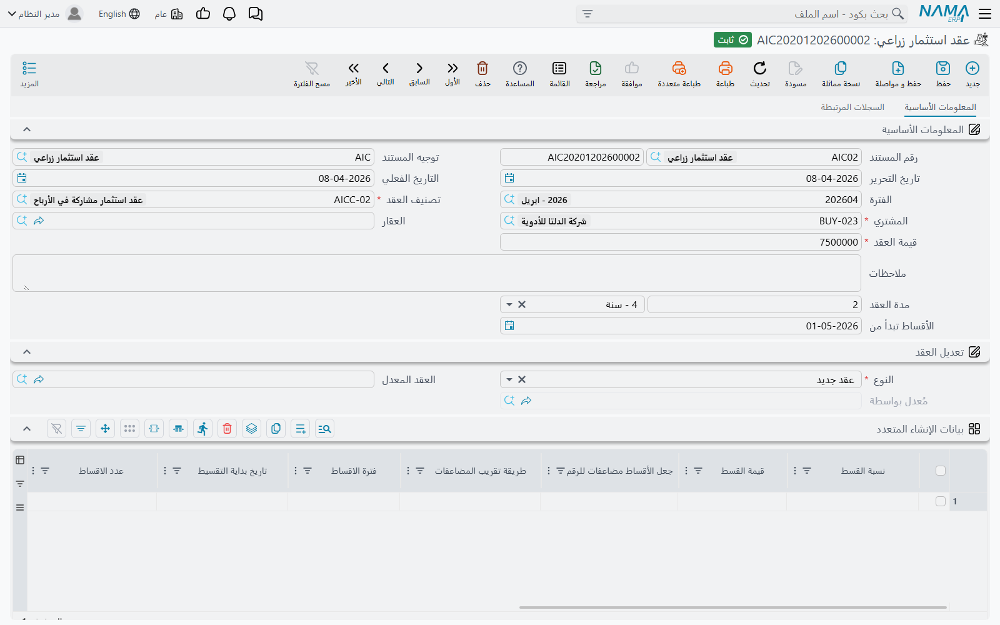
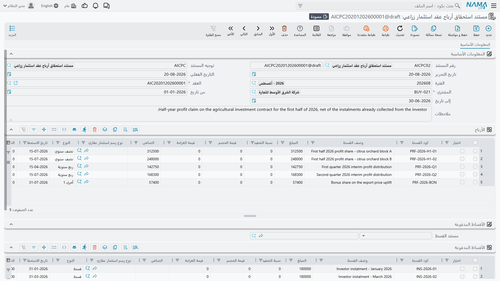

# عقود الاستثمار الزراعي

لنبدأ بما **ليس** هذا، لأن القائمة تضلل فعلًا.

قائمة الاستثمار تضم منتجين متجاورين. الأول هو
[صندوق الاستثمار](/ar/modules/realestate/investment/realestate-investment-funds) المشترك، حيث يضع
عدة مستثمرين أموالهم في وعاء واحد، فيشتري الوعاء عقارًا، ويأتي عائدهم من إعادة تقييم ذلك العقار
صعودًا. والثاني هو **عقد الاستثمار الزراعي**، ولا علاقة له بشيء من ذلك.

هنا يوقّع مستثمر واحد عقدًا مع الشركة: يدفع مبلغًا مقطوعًا، وتَعِده الشركة في مقابله **بجدول أقساط
أرباح** على مدة محددة، مقابل قطعة أرض زراعية بعينها في المعتاد. لا وعاء ولا مستثمرين آخرين ولا إعادة
تقييم ولا حصة في شيء. هو إلى أدوات العائد الثابت أقرب منه إلى الصندوق.

ويفصل بينهما أمران آخران:

- **رخصة مختلفة.** كل ما في هذه الصفحة يحتاج `realestate-agri-investmnent` — منقولة كما تُشحن
  بالضبط، بالخطأ الإملائي وكل شيء. أما الصندوق فيحتاج `realestate` المجردة. وبدون الرخصة الزراعية لا
  تظهر هذه الشاشات إطلاقًا.
- **معنى مختلف لـ "Agr".** فبادئة `Agr` في أسماء الشاشات والكيانات تعني **الزراعي**
  (Agricultural)، لا "المجمّع". فهو عقد عن أرض زراعية.

## المثال العملي

مستثمر يضع **500,000** في عقد استثمار زراعي مدته خمس سنوات. والعائد المتفق عليه 10% من قيمة العقد
سنويًا تُدفع ربع سنوية — أي **20 قسط أرباح قيمة كل منها 25,000**، تبدأ في 01/01/2026.

ثم يشتري المستثمر نفسه فيلا من الشركة لاحقًا، وبدل أن تدفع له ربحَ ربعٍ نقدًا يتفق الطرفان على خصم
تلك الـ 25,000 مما عليه في الفيلا.

## تصنيف العقد

قبل أن يُكتب أي عقد تحتاج إلى `تصنيف عقد استثمار زراعي` واحد على الأقل، من
`العقارات و الممتلكات > استثمار > تصنيف عقد استثمار زراعي`.

وهو ملف صغير جدًا — كود واسم وقرار عمل واحد: `يعمل على العقارات` (Work With Estates).

وهذا الخيار ليس زينة، بل يُفحص عند اعتماد كل عقد:

- **مؤشَّر** ← يصير حقل `العقار` في العقد **إلزاميًا**؛
- **غير مؤشَّر** ← يجب أن يكون حقل `العقار` **فارغًا**، ويُرفض الحفظ برسالة تسمّي التصنيف إن كان فيه
  شيء.

فالتصنيف إذن هو ما يفصل "العقود المرتبطة بقطعة مسمّاة" عن "العقود على النشاط عمومًا". أنشئ واحدًا من
كل نوع إن كنت تبيع الاثنين، وسيتكفل النظام بضبطهما.

## العقد

`العقارات و الممتلكات > استثمار > عقد استثمار زراعي` هو الصفقة نفسها. ورأسه قصير:

| الحقل | في مثالنا |
|---|---|
| `تصنيف العقد` | "مضمون بأرض، 5 سنوات" |
| `المشتري` | المستثمر |
| `العقار` | القطعة — إلزامي أو ممنوع بحسب التصنيف |
| `قيمة العقد` | 500,000 |
| `مدة العقد` | 5 سنوات |
| `الأقساط تبدأ من` | 01/01/2026 |

::: info قطع الأراضي فقط
حقل `العقار` لا يقبل إلا **قطع الأراضي** — لا المباني ولا الطوابق ولا الوحدات العقارية. وهذا متسق مع
طبيعة المنتج، ويفرضه المنتقي نفسه.
:::

### توليد جدول الأرباح

أسفل الرأس جدولان يسهل الخلط بينهما، فيجدر تسميتهما بوضوح.

الأول، `بيانات الإنشاء المتعدد` (Multiple Construction Info)، ليس هو الجدول. هو **وصفة** بناء الجدول
— سطر لكل مجموعة أقساط، يقول كم عددها وما المدة بينها وكم قيمة كل منها ومن أين تبدأ المجموعة. وأعمدته
هي نفسها المستخدمة في عقود البيع والموصوفة في
[إنشاء خطة الأقساط](/ar/modules/realestate/sales/realestate-installment-plans): نسبة أو قيمة، وفترة،
وعدد أقساط، وقاعدة تدوير، وخيار يقول إن القيمة المكتوبة **إجمالية** لا لكل قسط، وإزاحة تدفع تاريخ
بداية هذه المجموعة إلى الأمام قبل أن تبدأ.

وفي عقدنا يكفي سطر واحد: 10% من القيمة، ربع سنوي، 20 قسطًا، والقيمة إجمالية.

والجدول الثاني، المعنون `الأرباح` (Profits)، هو الجدول الفعلي — أقساط الأرباح الفردية بأكوادها
ومبالغها وتواريخ استحقاقها وأعمدة سدادها. ويملؤه زر `إنشاء الاقساط` الواقع بين الجدولين.

والضغط عليه يمشي على أسطر الوصفة بالترتيب، فيحسب من أين تبدأ كل مجموعة انطلاقًا من تاريخ `الأقساط
تبدأ من` في العقد ومن إزاحة كل سطر وفترته، ثم يسلّم العمل إلى محرك الأقساط نفسه الذي تستخدمه عقود
البيع، وقيمة العقد أساسًا. فينتج سطرنا الواحد عشرين قسطًا قيمة كل منها 25,000، ربع سنوية اعتبارًا من
01/01/2026.

::: warning زر إنشاء الأقساط يستبدل جدول الأرباح كاملًا
الزر يعيد بناء الجدول من الصفر، فيُستبدل كل ما في جدول الأرباح أصلًا. شغّله مرة واحدة في البداية، قبل
أن يُطالَب بأي ربح على العقد.
:::

والتحققات التي تلتقط أكثر الأخطاء تستحق المعرفة سلفًا: جدول الأرباح لا يجوز تركه فارغًا، وأكواد
الأقساط يجب أن تكون فريدة وصحيحة، ولا يجوز أن يحمل سطر الوصفة قيمة **ونسبة** معًا، ولا يجوز تغيير كود
قسط موجود بالفعل، ولا المساس بسطر عليه مدفوعات.

### تعديل عقد

العقود تتغير. والنظام لا يسمح بتعديل عقد قائم في موضعه، بل يستخدم آلية إحلال تترك أثرًا واضحًا
للمراجعة.

للتعديل تنشئ عقدًا **جديدًا** وتضبط نوعه على `تعديل لعقد موجود`، ثم توجّه حقل `العقد المعدل` إلى العقد
القديم. وهذا:

1. ينسخ المشتري والتصنيف وقيمة العقد والعقار والمدة؛
2. ينسخ **الأقساط غير المسددة فقط**، ومعها أسطر الوصفة المقابلة — فيبدأ العقد الجديد حياته حاملًا
   بالضبط جدول القديم المتبقي؛
3. ويضع عند الاعتماد علامة "معدَّل" على العقد القديم، و**يقفل جدوله المتبقي كله** بتأشير تلك الأقساط
   مسددةً، **ويقفله نهائيًا**.

::: warning العقد المُحَل مقفل إلى الأبد
ما إن يُعدَّل عقد بعقد آخر حتى يتعذر تعديله أو حذفه، ويتعذر كذلك تعديل أو حذف أي مستند استحقاق أرباح
حُرِّر عليه. فإن احتجت التراجع عن تعديل، ألغِ العقد **المعدِّل** أولًا — فذلك يعكس الإحلال ويفك قفل
الأصل.
:::

والقواعد حول ذلك صارمة عن قصد: العقد لا يُعدَّل إلا **مرة واحدة**، والعقد المعدَّل يجب أن يكون
**أقدم** من الذي يعدّله، والعقد من نوع `عقد جديد` لا يجوز أن يسمّي عقدًا معدَّلًا إطلاقًا، ومنتقي
`العقد المعدل` لا يعرض إلا عقود المشتري نفسه والتصنيف نفسه التي لم تُحَل بعد.

وقيد آخر: لا يجوز إرجاع التاريخ الفعلي للعقد إلى ما قبل مستند استحقاق أرباح معتمَد. فإن وُجد مستند
استحقاق في التاريخ الجديد أو قبله رُفض الحفظ وسُمّي المستند.

::: info العقد لا يقيّد شيئًا
عقد الاستثمار الزراعي **بلا أثر محاسبي** خاص به. هو يُنشئ جدول الأرباح ولا شيء غير ذلك. والاعتراف
بالمال يتم عبر مستندات استحقاق الأرباح التي تُحرَّر عليه.
:::

## المطالبة بالأرباح

في كل ربع تحرر الشركة `مستند استحقاق أرباح عقد استثمار زراعي` من
`العقارات و الممتلكات > استثمار > مستند استحقاق أرباح عقد استثمار زراعي` للاعتراف بالربح الذي استحق.

تملأ المشتري والعقد و`من تاريخ` و`إلى تاريخ` — 01/01/2026 إلى 31/03/2026 في ربعنا الأول. واختيار
العقد يحمّل جدول `الأرباح` بأقساط العقد التي لم تُسدَّد بعد ويقع تاريخ استحقاقها داخل ذلك المدى. سطر
واحد بـ 25,000. ويُطالَب بكل سطر مُحمَّل **بكامل قيمته المتبقية**، فلا حساب جزئي عليك.

### مقاصتها بما على المستثمر

هنا يصير المستند أكثر من مجرد إثبات استحقاق. فالمستثمر الذي له 25,000 ربحًا قد يكون عليه في الوقت
نفسه مال للشركة عن عقار يشتريه. وبدل تحريك النقد في الاتجاهين، يستطيع المستند أن يقاصّ أحدهما بالآخر.

في مجموعة `الأقساط المدفوعة` اختر `مستند القسط` (Installment doc) — وهو
[عقد بيع](/ar/modules/realestate/sales/realestate-sales-contract) أو
[مستند بيع افتتاحي](/ar/modules/realestate/opening/realestate-opening-sales)، ولا يُقبل غيرهما. عندها
يأخذ النظام إجمالي أرباح المستند ويمشي على أقساط ذلك المستند غير المسددة بالكامل **بالترتيب**، مخصصًا
لكل قسط حتى ينفد المال، ويبني جدول `الأقساط المدفوعة` من الناتج.

فتهبط الـ 25,000 عندنا على أقدم الأقساط غير المسددة في عقد فيلا المستثمر.

::: tip يجوز أن تطالب بربح أكثر مما تقاصّ، لا أقل
المستند يفرض أن يكون إجمالي الأرباح **أكبر من أو يساوي** إجمالي الأقساط المدفوعة. فالمطالبة بـ 25,000
ومقاصّة 25,000 مقبولة، أما المطالبة بـ 25,000 ومقاصّة 30,000 فمرفوضة، وتخبرك الرسالة بالرقمين.
:::

واعتماد المستند يؤشّر المال بأنه **محصَّل نظاميًا** على **الجانبين** — فترتفع قيمة `المحصل نظاميا`
وينخفض `المتبقي` في أقساط أرباح العقد وفي أقساط مستند البيع معًا، عبر قيود سداد يكتبها النظام ويزيلها
مع المستند. وإلغاء المستند يزيلها مجددًا.

### ماذا يُقيَّد

المستند يحمل **مربعَي قيد مستقلين تمامًا**، ولا يعمل أيهما إلا إذا ضُبط جانبا حساباته على التوجيه:

| المربع | سطر مدين وسطر دائن لكل… | بقيمة |
|---|---|---|
| `الأرباح` | سطر في جدول **الأرباح** | مبلغ ذلك السطر |
| `الأقساط المدفوعة` | سطر في جدول **الأقساط المدفوعة** | مبلغ ذلك السطر |

والترتيب المعتاد يقيّد مربع الأرباح تكلفةً مقابل ذمة المستثمر الدائنة، ويقيّد مربع الأقساط المدفوعة
تسويةً لتلك الذمة مقابل مدين البيع — وهذه هي المقاصة التي يصفها المستند بالضبط. لكن يمكنك ضبط مربع
الأرباح وحده، فيصير المستند إثبات استحقاق خالصًا بلا مقاصة.

وتُقيَّد المبالغ بعملة الدفتر الرئيسية للشركة، وتجري المعالجة على هيئة طلب أعمال في الخلفية — ويُعاد
المحاولة عند الفشل من شاشة عرض طلبات الأعمال عبر قائمة **المزيد ← إعادة المعالجة / إعادة الاعتماد**.
والتوجيه نفسه موثّق في
[توجيهات مستندات التحصيل والصيانة والاستثمار والتكاليف](/ar/modules/realestate/document-terms/realestate-terms-other).

::: info المستند لا يحرّك نقدًا
هو يُنشئ إثبات استحقاق أو مقاصة أو كليهما. فإن كان المستثمر سيُدفع له فعلًا مبلغ الـ 25,000، فذلك
مستند سداد منفصل. والمستند لا يقول إلا إن الربح استحق، وإن جزءًا منه استُهلك في دَين إن اخترت ذلك.
:::

وكل مستند استحقاق يُحرَّر على عقد يُسرَد على تبويب `السجلات المرتبطة` في العقد، فالعقد نفسه هو موضع
معرفة كم من جدوله جرت المطالبة به.

## المثال من أوله إلى آخره

1. يُنشأ تصنيف "مضمون بأرض، 5 سنوات" وخيار `يعمل على العقارات` مؤشَّر.
2. يُكتب عقد للمستثمر: 500,000، خمس سنوات، تبدأ 01/01/2026، مقابل قطعة مسمّاة. سطر وصفة واحد — 10%،
   ربع سنوي، 20 قسطًا، القيمة إجمالية — وزر `إنشاء الاقساط` ينتج 20 سطرًا بـ 25,000.
3. في 31/03/2026 يُحمِّل مستند استحقاق عن 01/01–31/03 قسطًا واحدًا بـ 25,000.
4. يُختار عقد فيلا المستثمر مستندًا للقسط، فتُخصَّص الـ 25,000 على أقدم أقساط الفيلا غير المسددة.
5. الاعتماد يؤشّر مجموعتَي الأقساط بأنها محصَّلة نظاميًا، ويقيّد التوجيه الربح والتسوية في مربعين
   منفصلين.
6. وبعد تسعة عشر ربعًا يستنفد الجدول؛ ولو كانت الشروط تغيرت في الطريق لحمل عقد من نوع `تعديل لعقد
   موجود` المتبقي غير المسدد إلى عقد جديد وأقفل هذا.
