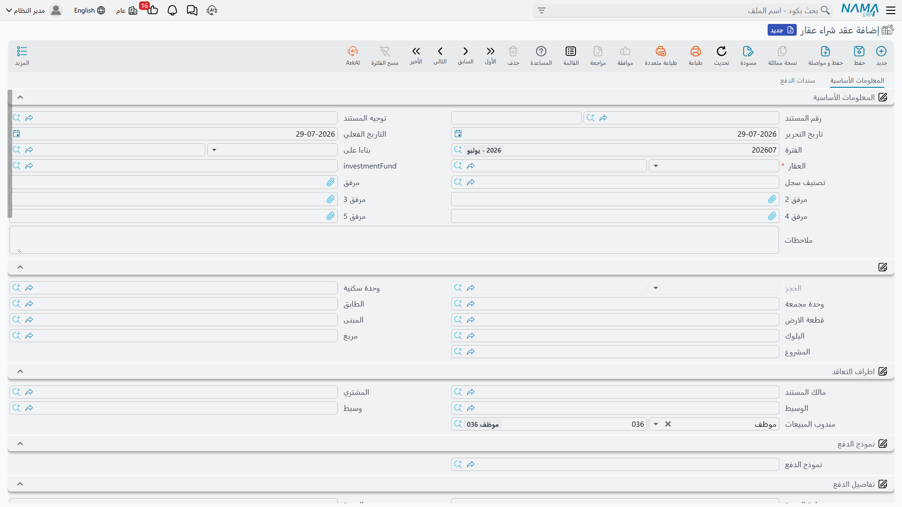
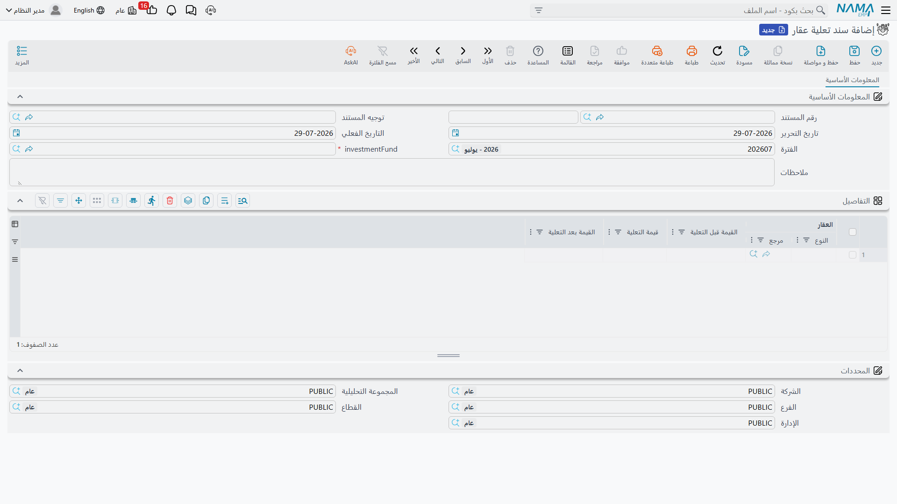
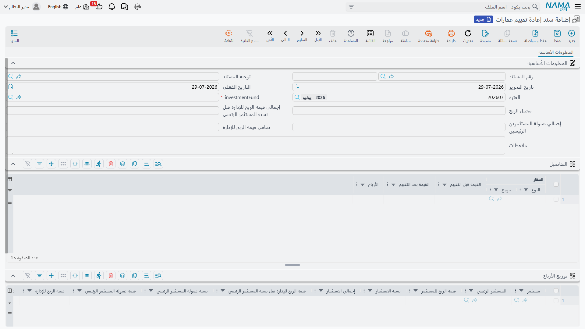

# قيم العقارات والتعلية وإعادة التقييم

كل عقار يملكه صندوق استثمار يحمل **قيمة دفترية** — ما تقول الدفاتر إنه يساويه اليوم. وهذه القيمة ليست
حقلًا يكتبه أحد على العقار، بل هي آخر حلقة في سلسلة من قيود القيمة، وكل حلقة يكتبها مستند.

والمستندات في السلسلة أربعة، والترتيب الذي يجوز أن تظهر به **مُتحقَّق منه**. وهذا التحقق هو أكثر ما
يتعثر فيه المستخدمون في هذا الجزء من الوحدة، ولذلك نبدأ به.

## سلسلة القيمة وقواعد ترتيبها

خلف كل عقار مملوك لصندوق يحتفظ النظام بقائمة زمنية من قيود القيمة، تكتب فيها أربعة مستندات:

| المستند | ما يسجله |
|---|---|
| `عقد شراء عقار` | الصندوق اشترى العقار بهذه القيمة |
| `سند تعلية عقار` | تحسين رُسمل على العقار |
| `سند إعادة تقييم عقارات` | أُعيد تقييمه بالسوق صعودًا أو هبوطًا |
| عقد البيع (أو البيع الافتتاحي) | خرج من الصندوق |

وكلما اعتُمد أحدها أو أُلغي أو عُدِّل، أُعيدت قراءة السلسلة كاملة لذلك العقار، ورُتِّبت بالتاريخ
الفعلي ثم بتاريخ الإنشاء، وأُعيد ربطها حتى تتفق "القيمة السابقة" و"الفرق" في كل قيد مع القيد الذي
قبله. و**القيمة الحالية** للعقار هي ببساطة قيمة آخر قيد، و**قيمة الشراء** هي قيمة آخر قيد شراء.

وإعادة الربط هذه هي سبب ضبط الترتيب. فاعتماد أي مستند يشغّل هذه الفحوص الأربعة:

1. **أول مستند للعقار يجب أن يكون عقد شراء.** لا يمكنك إعادة تقييم أو بيع شيء لم يشتره الصندوق قط.
2. **إعادة التقييم لا تأتي إلا بعد شراء أو إعادة تقييم أخرى.** لا يمكنك إعادة تقييم عقار سبق بيعه.
3. **الشراء لا يأتي إلا بعد بيع.** فشراء العقار نفسه مرتين متتاليتين مرفوض — لا بد أن يكون قد خرج من
   الصندوق بينهما.
4. **البيع لا يأتي إلا بعد إعادة تقييم، وقيمة تلك الإعادة يجب أن تساوي قيمة البيع.**

::: tip القاعدة الرابعة هي التي تُوجِع
بيع عقار مملوك لصندوق عملية من مستندين. تعيد تقييمه إلى سعر البيع المتفق عليه أولًا، ثم تبيعه بذلك
السعر بعينه. وإن بعت بسعر لا يطابقه آخر تقييم رُفض العقد، مع ذكر الوحدة والمستند والقيمة المتوقعة.
وهذه ليست عقبة تُلتَف حولها — بل هي ما يضمن الاعتراف بالربح وتوزيعه على المستثمرين **قبل** أن يخرج
العقار من الصندوق.
:::

وإلغاء أي من هذه المستندات يحذف قيوده ويعيد ربط ما بقي، فيمكن التراجع عن شراء خاطئ بنظافة.

## الشراء — عقد شراء العقار



عقد الشراء هو **الصورة المرآتية لعقد البيع**. مبني على الأساس نفسه، ويستخدم مجموعة الأسعار نفسها،
وجدول بيانات الإنشاء المتعدد نفسه، وزر `إنشاء الاقساط` نفسه الموصوف في
[إنشاء خطة الأقساط](/ar/modules/realestate/sales/realestate-installment-plans).

والفارق هو الاتجاه. فالشركة هنا هي المشتري، ولذلك فالأقساط مبالغ **تدفعها** الشركة — ومربع الإجراءات
يعكس ذلك: فبدل سندات القبض يعرض `إنشاء سند صرف من السطر المحدد`. وتبويب ثانٍ باسم `سندات الدفع` يسجل
المدفوعات التي تمت خارج تلك الآلية، لكل منها تاريخها وقيمتها وخيار يمنع الدفعة من تخفيض المتبقي حين
لا ينبغي لها ذلك.

تجده في `العقارات و الممتلكات > استثمار > عقد شراء عقار` تحت رخصة `realestate`. ويحمل الرأس `صندوق
الاستثمار` الذي يقوم بالشراء — وهو ما يربط العقار بالصندوق في كل ما يأتي بعد.

والعقد أبسط من نظيره البيعي في وجه واحد: لا بنود تعاقد قياسية فيه، ولا أسطر شروط، ولا جدول رسوم.

### أي رقم يصير القيمة الدفترية

كل عقد شراء يكتب قيد قيمة بلا استثناء. وأي رقم يكتبه قرارٌ في التوجيه: فتوجيه عقد الشراء يحمل خيار
`حقل قيمة العقار` (Estate Value Field) يسمّي الحقل الذي يُقرأ منه، وإن لم يُضبط استُخدم سعر العقد.
اضبطه حين تكون قيمتك المرسملة مقصودًا بها أن تشمل ما لا يشمله السعر المجرد — راجع
[توجيهات مستندات البيع](/ar/modules/realestate/document-terms/realestate-terms-sales)، فهي تغطي
توجيه عقد الشراء مع بقية عائلة البيع.

وفي مثالنا: يشتري الصندوق قطعة أرض بـ **1,000,000**. فتصبح تلك هي القيمة الدفترية للعقار، وأول حلقة
في سلسلته.

## التحسين — سند تعلية العقار



"التعلية" في أصل معناها رفع المبنى بدور إضافي، وهذه هي الحالة التي سُمّي المستند من أجلها بالضبط:
الصندوق يملك مبنى من أربعة أدوار، فيُبنى دور خامس، وتكلفة بنائه تنتمي إلى قيمة العقار لا إلى مصروفات
هذه السنة.

وبصورة أعم، فإن `سند تعلية عقار` في `العقارات و الممتلكات > استثمار > سند تعلية عقار` يُرسمل تحسينًا
على عقار يملكه الصندوق أصلًا. تسمّي الصندوق، ثم تسرد العقارات وما اكتسبه كل منها من قيمة:

| `العقار` | `القيمة قبل التعلية` | `قيمة التعلية` | `القيمة بعد التعلية` |
|---|---|---|---|
| المبنى 4 | 6,000,000 | 800,000 | 6,800,000 |

ولا تكتب إلا العمود الأوسط. فالقيمة قبل التعلية تُعبَّأ من آخر قيد قيمة للعقار قبل تاريخ هذا المستند،
والقيمة بعد التعلية هي مجموع الاثنين.

::: info لا أثر محاسبي
سند التعلية يغيّر القيمة الدفترية للعقار ولا شيء غير ذلك — فلا ينتج عنه قيد دفتري. أما تكلفة الدور
الخامس فتُثبَت حيث سجلتها فعلًا (مستند تكلفة، فاتورة مورّد)؛ وهذا المستند هو ما يخبر الصندوق أن قيمة
العقار ارتفعت. ولا يزال يحتاج دفترًا وتوجيهًا كأي مستند، لكن التوجيه لا يحمل جوانب حسابات عقارية خاصة.
:::

## إعادة التقييم — حيث يُصنع ربح الصندوق



`سند إعادة تقييم عقارات` في `العقارات و الممتلكات > استثمار > سند إعادة تقييم عقارات` يؤدي عملين في
آن واحد، وثانيهما هو سبب كون هذا المستند أهم مستندات منطقة الاستثمار جميعًا.

العمل الأول بديهي: إعادة تقرير ما تساويه عقارات الصندوق.

والعمل الثاني أن **هذا هو السبيل الوحيد الذي يكسب به الصندوق شيئًا.** لا فائدة ولا تجميع إيجارات ولا
كوبونات. فعائد مستثمر الصندوق يأتي كله من أرباح إعادة التقييم، التي يحسبها المستند ويقسمها على
المستثمرين في اللحظة نفسها. وفهم هذه القسمة هو فهم المنتج كله.

### الخطوة 1 — إعادة تقرير قيم العقارات

الجدول الأول يسرد العقارات التي يُعاد تقييمها:

| `العقار` | `القيمة قبل التقييم` | `القيمة بعد التقييم` | `الأرباح` |
|---|---|---|---|
| قطعة A-7 | 1,000,000 | 1,200,000 | 200,000 |

تكتب القيمة بعد التقييم، والربح هو الفرق. أما القيمة قبل التقييم فيعبّئها النظام من آخر قيد قيمة
للعقار — مضافًا إليها ما سُدد فعلًا من أقساط شرائه قبل هذا التاريخ، فيُقاس العقار الذي ما زال يُسدَّد
ثمنه بما دخل فيه حقيقة.

وعلى مستوى المستند كله، فإن `مجمل الربح` هو مجموع أرباح الأسطر: 200,000.

### الخطوة 2 — قسمة الربح على المستثمرين

الجدول الثاني يعيد النظام توليده في كل حفظ للمستند. يقرأ كل معاملات الصندوق المؤرخة **قبل** التاريخ
الفعلي لهذا المستند، ويجمعها لكل مستثمر، ويُسقط من رصيده صفر، ثم يمر بالسلسلة التالية لكل مستثمر
بدوره.

وباستخدام صندوقنا — علي 600,000، وسارة 400,000، ونسبة الربح للإدارة 10%، وعلي دخل خلف مستثمر رئيسي
بعمولة 25%:

**أ. نسبة الاستثمار.** علي يملك 600,000 من 1,000,000 ← 60%. وسارة ← 40%.

**ب. قيمة الربح للمستثمر** = رصيد المستثمر × مجمل الربح ÷ مجموع أرصدة المستثمرين.

```
علي:  600,000 × 200,000 ÷ 1,000,000 = 120,000
سارة: 400,000 × 200,000 ÷ 1,000,000 =  80,000
```

**ج. قيمة الربح للإدارة قبل نسبة المستثمر الرئيسي** = ربح المستثمر × نسبة الربح للإدارة في الصندوق.

```
علي:  10% من 120,000 = 12,000
سارة: 10% من  80,000 =  8,000
```

**د. عمولة المستثمر الرئيسي** = تلك القيمة الإدارية × نسبة عمولة المستثمر الرئيسي الخاصة بالمستثمر.
وهي تخرج من أتعاب الإدارة لا من جيب المستثمر.

```
علي:  25% من 12,000 = 3,000
سارة: لا مستثمر رئيسي ← 0
```

**هـ. قيمة الربح للإدارة** = القيمة الإدارية ناقص عمولة المستثمر الرئيسي — **أو صفر** إن كان سطر
المستثمر يحمل `عدم خصم نسبة الإدارة`.

```
علي:  12,000 − 3,000 = 9,000
سارة:  8,000 − 0     = 8,000
```

**و. صافي الربح** = ربح المستثمر − قيمة الربح للإدارة − عمولة المستثمر الرئيسي.

```
علي:  120,000 − 9,000 − 3,000 = 108,000
سارة:  80,000 − 8,000 − 0     =  72,000
```

**ز. الموزَّع والمعاد استثماره.** هذا هو العمود الوحيد الذي تملؤه في الجدول. تكتب كم من صافي الربح
يُدفع فعلًا في `قيمة الأرباح الموزعة`، فيصير الباقي `قيمة الأرباح المعاد استثمارها` تلقائيًا.

```
علي:  موزَّع 50,000  ←  معاد استثماره 58,000
```

وتُكتب الـ 58,000 المعاد استثمارها في الصندوق معاملةً على سطر علي، فيرتفع استثماره الحالي من 600,000
إلى **658,000** — وترتفع معه نسبته في إعادة التقييم التالية. وإعادة الاستثمار هي الطريق الذي يراكم به
مستثمر الصندوق أرباحه.

وإجماليات الرأس تتبع الأسطر: إجمالي قيمة الربح للإدارة، وإجمالي عمولة المستثمرين الرئيسيين، وصافي
قيمة الربح للإدارة بوصفه الفرق بينهما.

::: warning جدول التوزيع يُعاد بناؤه في كل حفظ
جدول توزيع الأرباح كله يُعاد توليده في كل مرة يُحفظ فيها المستند، فيُكتب فوق كل ما تكتبه في أعمدته
المحسوبة. والاستثناء الوحيد هو `قيمة الأرباح الموزعة` — فهي تبقى، ويُشتق منها المبلغ المعاد استثماره.
فإن احتجت قسمة مختلفة، غيّر نسبة الإدارة على الصندوق أو إعدادات المستثمر في سند إضافة تمويل، ولا
تحرّر الجدول بيدك.
:::

### ماذا يُقيَّد

إعادة التقييم هي المستند الوحيد في هذه السلسلة الذي له أثر محاسبي كامل، وهو يقيّد **لكل سطر مستثمر**
لا لكل عقار. ويعرض توجيهه أربعة أزواج:

| القيمة المقيَّدة | الزوج |
|---|---|
| `قيمة الربح للإدارة` | زوج ربح الإدارة |
| `قيمة عمولة المستثمر الرئيسي` | زوج عمولة المستثمر الرئيسي |
| `قيمة الأرباح الموزعة` | زوج الأرباح الموزعة |
| `قيمة الأرباح المعاد استثمارها` | زوج الأرباح المعاد استثمارها |

ولا يُنتج الزوج قيدًا إلا إذا ضُبط جانباه معًا، وإن تُركت الأزواج الأربعة فارغة لم يقيّد المستند شيئًا
إطلاقًا. والمبالغ بعملة الدفتر الرئيسية للشركة، والمستثمر في السطر هو الذمة على جانبَي القيد.

والتوجيه موصوف في
[توجيهات مستندات التحصيل والصيانة والاستثمار والتكاليف](/ar/modules/realestate/document-terms/realestate-terms-other)،
وميكانيكا أي جانب محاسبي مشتركة في
[كيف تعمل توجيهات مستندات العقارات](/ar/modules/realestate/document-terms/realestate-terms-basics).
وتجري المعالجة على هيئة طلب أعمال في الخلفية، ويُعاد المحاولة من شاشة عرض طلبات الأعمال عبر قائمة
**المزيد ← إعادة المعالجة / إعادة الاعتماد**.

## البيع خارج الصندوق

حين تُباع قطعة الأرض أخيرًا، يكون البيع
[عقد بيع](/ar/modules/realestate/sales/realestate-sales-contract) عاديًا — أو
[مستند بيع افتتاحي](/ar/modules/realestate/opening/realestate-opening-sales) إن كنت تحمّل بيانات
سابقة. وما يميزه أنه الحلقة الأخيرة في سلسلة القيمة فحسب، وتنطبق عليه القاعدة الرابعة: لا بد أن يكون
آخر تقييم يحمل قيمة البيع بعينها.

فتقرأ حياة القطعة كاملة هكذا:

1. **عقد شراء** بـ 1,000,000 — الصندوق يشتريها، وتبدأ السلسلة.
2. **سند تعلية** عند الاقتضاء — يُرسمل تحسين عليها.
3. **إعادة تقييم** إلى 1,200,000 — يُقسم ربح الـ 200,000 على علي وسارة، وتخرج منه أتعاب الإدارة
   وعمولة المستثمر الرئيسي، وتعود حصة كل مستثمر المعاد استثمارها إلى رصيده.
4. **عقد بيع** بـ 1,200,000 — يخرج العقار من الصندوق بالرقم المُعاد تقييمه بعينه.

والصندوق وأرصدة المستثمرين التي تغذي الخطوة الثالثة موضوع صفحة
[صناديق الاستثمار العقاري](/ar/modules/realestate/investment/realestate-investment-funds)؛ أما كيف
يحمل العقار قيمةً أصلًا، إلى جانب حالته ومساحته، فتغطيه
[كيف يُمثَّل العقار في النظام](/ar/modules/realestate/properties/realestate-estate-model).
