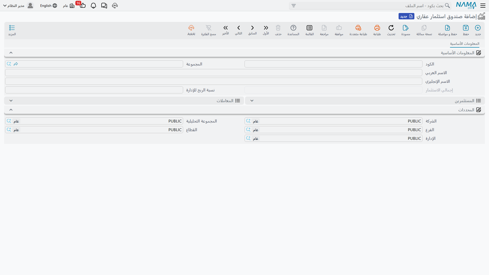
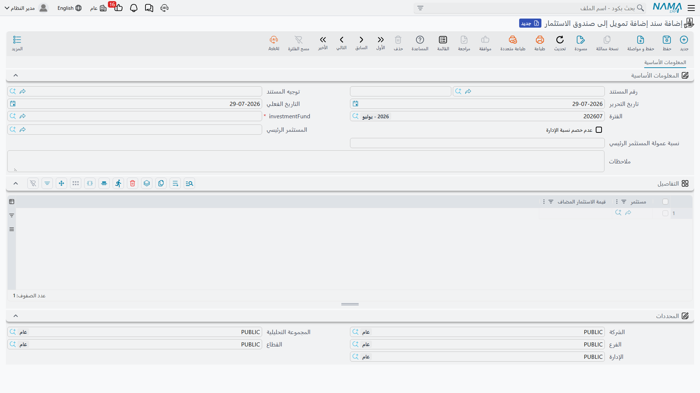
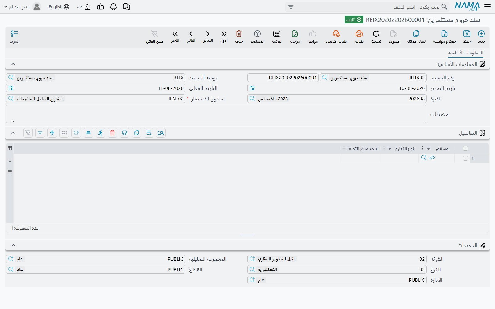

# صناديق الاستثمار العقاري

فكرة الصندوق بسيطة: يضع عدة أشخاص أموالهم في وعاء واحد، فيشتري الوعاء عقارًا، ويرتفع العقار قيمةً،
ثم يعود الربح إليهم بنسبة ما وضع كل منهم.

والكلمة المهمة في هذه الجملة هي **المال**. فصندوق الاستثمار في نظام نما لا يُصدر أسهمًا ولا وحدات —
ولا يوجد في النظام عدّ حصص إطلاقًا. كل مستثمر يملك **رصيدًا نقديًا** في الصندوق، وكل حساب يجريه
الصندوق ينطلق من هذا الرصيد ونسبته إلى الإجمالي. فمبلغ علي البالغ 600,000 في صندوق قيمته 1,000,000
يجعله مستثمرًا بنسبة 60% بسبب نسبة المبالغ، لا لأنه يملك ستين شهادة من مئة.

احتفظ بهذا في ذهنك في الصفحة كلها: كل ما يفعله الصندوق هو حساب على الأرصدة.

## المثال العملي

مستثمران يؤسسان صندوقًا:

- **علي** يضع **600,000**
- **سارة** تضع **400,000**

فيصبح إجمالي الصندوق 1,000,000، ونصيب علي 60% ونصيب سارة 40%. ثم يسحب علي لاحقًا 200,000. وسنتابع
هذه الحركات الثلاث عبر المستندات الثلاثة التي تنتجها.

## الصندوق نفسه نحيل عمدًا

يعيش ملف الصندوق في `العقارات و الممتلكات > الملفات > صندوق استثمار عقاري` تحت رخصة `realestate`،
وقد تتساءل عند فتحه لأول مرة أين ذهبت بقية الشاشة. فيه كود واسم، وجدولان، ورقم **واحد** فقط يُسمح
لك بكتابته.

هذا الرقم هو `نسبة الربح للإدارة` (Management Profit Percentage) — حصة إدارة الصندوق من ربح كل
مستثمر. وهو الرقم الوحيد الذي يُدخله المستخدم في السجل، ويُقرأ في موضع واحد لا غير: توزيع الأرباح في
مستند إعادة التقييم. وما عداه على الصندوق لا يُكتب.

لا يوجد هنا حساب بنكي، ولا عملة، ولا رأس مال مستهدَف، ولا تاريخ إقفال. فإن كنت تتوقع أن يكون الصندوق
وعاءً للإعدادات فليس كذلك؛ هو اسم تتعلق به المستندات.

### الجدولان يُبنيان ولا يُملآن

أسفل الرأس جدولان قابلان للطي، وليس أيهما جدولًا تحرره:

`المعاملات` (Transactions) هو السجل الخام — سطر لكل سطر مستند حرّك مالًا داخل هذا الصندوق أو خارجه.
ويسجل كل سطر المستثمر والمستند المصدر و`التغير في قيمة الاستثمار` بإشارته ونوع الحركة وتاريخها الفعلي.

`المستثمرين` (Investors) هو التجميع — سطر لكل مستثمر، يحمل `قيمة الاستثمار الحالية` و`تاريخ دخول
الصندوق` و`تاريخ الخروج الكلي من الصندوق` إن وُجد، إضافة إلى إعدادات المستثمر الرئيسي المرتبطة به.

ويُعاد بناء جدول المستثمرين بإعادة تشغيل جدول المعاملات بالترتيب: يُصفَّر السطر ثم يُضاف تغير كل
معاملة إلى الرصيد الجاري. ومعاملة الدخول تختم تاريخ الدخول، ومعاملة الخروج الكلي تختم تاريخ الخروج
الكلي، وتغلب إعدادات المستثمر الرئيسي الأحدثَ ظهورًا.

ثم يكون `إجمالي الاستثمار` في الرأس مجموع الاستثمارات الحالية للمستثمرين. يُعرض ولا يُكتب أبدًا،
ويُعاد حسابه كلما اعتُمد مستند استثمار أو عُدِّل أو أُلغي. ألغِ سند إضافة تمويل يهبط الإجمالي لحظة
معالجة الإلغاء — فرقم الصندوق مشتق من المستندات دائمًا، ولذلك لا يمكن أن ينحرف عنها.

## دخول المال — سند إضافة التمويل

`العقارات و الممتلكات > استثمار > سند إضافة تمويل إلى صندوق الاستثمار` هو الطريق الذي يدخل منه المال
إلى الصندوق، ويستحق الأمر صراحةً: هو **الطريق الوحيد** الذي ينضم به مستثمر. لا يوجد زر "إضافة مستثمر"
على الصندوق. فمن لم يرد اسمه في سند إضافة تمويل ليس في الصندوق.

المستند قصير. تسمّي الصندوق الذي يخصه، ثم تسرد المستثمرين وما يضيفه كل منهم:

| `مستثمر` | `قيمة الاستثمار المضاف` |
|---|---|
| علي | 600,000 |
| سارة | 400,000 |

اعتمدْه فتُكتب معاملتا دخول بـ +600,000 و +400,000، ويُعاد بناء أسطر المستثمرين، ويقرأ إجمالي الصندوق
1,000,000.

::: tip لا يُختار إلا الملاك المؤشَّر عليهم بأنهم مستثمرون
كلٌّ من منتقي المستثمر في السطر ومنتقي المستثمر الرئيسي مقصور على سجلات الملاك التي تحمل علامة
`مستثمر`. فإن غاب أحدهم عن القائمة فالإصلاح في سجل المالك — راجع
[الملاك والمشترون وبنود التعاقد القياسية](/ar/modules/realestate/properties/realestate-owners-and-contract-clauses).
:::

### الإعدادات الثلاثة التي تلاحق المستثمر

فوق الجدول ثلاثة إعدادات لا تخص أموال هذا المستند إطلاقًا. تُنسخ على كل سطر معاملة يكتبه المستند، ومن
ثَم على سطر التجميع الخاص بالمستثمر، وتبقى هناك حتى يكتب فوقها سند إضافة تمويل آخر:

- `المستثمر الرئيسي` (Main Investor) — الوسيط أو المستثمر القائد الذي دخل هذا المال خلفه.
- `نسبة عمولة المستثمر الرئيسي` (Main Investor Commission Percentage) — الشريحة التي تُمرَّر من أتعاب
  الإدارة إلى ذلك المستثمر الرئيسي.
- `عدم خصم نسبة الإدارة` (Do Not Deduct Management Percentage) — يُعفي هذا المستثمر من حصة الإدارة
  كليًا.

وتُستهلك الثلاثة لاحقًا في مستند إعادة التقييم عند توزيع الأرباح، وهي مشروحة في الموضع الذي تعمل فيه
فعلًا، أي في
[قيم العقارات والتعلية وإعادة التقييم](/ar/modules/realestate/investment/realestate-estate-values-and-revaluation).

::: info الأحدث من سندات إضافة التمويل هو الذي يغلب
لأن التجميع يعيد تشغيل المعاملات بالترتيب ويحتفظ بآخر قيمة غير فارغة يراها، فإن إعدادات المستثمر
الرئيسي وخصم الإدارة تأتي من **أحدث** سند إضافة تمويل للمستثمر لا من أوّله. حرّر سندًا ثانيًا لعلي
بمستثمر رئيسي مختلف يتغير سطره بأثر رجعي على كل توزيع قادم. فإن أردت زيادة رصيد مستثمر دون تغيير
شروطه، انسخ إعدادات المستند السابق إلى المستند الجديد.
:::

### ماذا يُقيَّد

لسند إضافة التمويل أثر محاسبي: زوج مدين/دائن واحد **لكل سطر تفصيل**، بقيمة الاستثمار المضاف في ذلك
السطر، بعملة الدفتر الرئيسية للشركة، من جانبَي الحساب المضبوطين في توجيه المستند. والضبط المعتاد يجعل
النقدية أو البنك مدينًا وحساب رأس مال الشريك دائنًا. واترك الجانبين فارغين فلا يُقيَّد شيء.

ونقطة تحتاج ضبطًا صحيحًا عند إعداد التوجيه: الجوانب التي يُشتق حسابها من العميل تستخدم `المستثمر
الرئيسي` في الرأس — لا مستثمر السطر. فإن كان المقصود اختيار الحسابات لكل مستثمر على حدة، فاقُد ذلك من
ذمة السطر لا من جانب العميل، وتذكّر أن خلوّ المستثمر الرئيسي يترك جانب العميل بلا ما يشتق منه. والتوجيه
نفسه موثّق في
[توجيهات مستندات التحصيل والصيانة والاستثمار والتكاليف](/ar/modules/realestate/document-terms/realestate-terms-other).

وتجري المعالجة في الخلفية على هيئة طلب أعمال، ويُعاد المحاولة عند الفشل من شاشة عرض طلبات الأعمال عبر
قائمة **المزيد ← إعادة المعالجة / إعادة الاعتماد**.

## خروج المال — سند خروج المستثمرين

`العقارات و الممتلكات > استثمار > سند خروج مستثمرين` يفعل العكس. تسمّي الصندوق، ثم تسرد من يخرج وبكم:

| `مستثمر` | `نوع التخارج` | `قيمة مبلغ التخارج` |
|---|---|---|
| علي | تخارج جزئي | 200,000 |

ويُخزَّن التخارج تغيرًا **سالبًا** في الاستثمار، فيهبط استثمار علي الحالي بـ 200,000 لحظة اعتماد
المستند. و`تخارج كلي` يفعل الشيء نفسه ويختم زيادةً على ذلك تاريخ الخروج الكلي على سطره.

وأمران في هذا المستند يختلفان بحدة عن سند إضافة التمويل، وكلاهما مهم:

**لا أثر محاسبي له إطلاقًا.** لا توجيه ولا أسطر دفتر. هو يعدّل أرصدة مستثمري الصندوق ولا شيء غير ذلك.
أما النقد الخارج فعليًا من الشركة فيجب تسجيله على حدة، بسند صرف عادةً.

**قيمة التخارج تُكتب باليد ولا تُراجع مقابل الرصيد.** فالنظام لا يبحث عمّا يملكه المستثمر ولا يعترض
إن كتبت أكثر منه أو أقل.

::: tip اقرأ جدول المستثمرين قبل اعتماد التخارج
لأن شيئًا لا يتحقق من المبلغ، فإن `تخارج كلي` بمبلغ أقل من رصيد المستثمر يترك رصيدًا متبقيًا على سطر
مختوم بأنه خرج كليًا — فيبدو مقفلًا وهو ما زال يحمل مالًا. افتح الصندوق، واقرأ `قيمة الاستثمار
الحالية` للمستثمر، واكتب ذلك الرقم بعينه في التخارج الكلي.
:::

### التواريخ أهم مما تتوقع

توزيع الأرباح لا يحسب إلا معاملات الصندوق المؤرخة **قبل** التاريخ الفعلي لمستند إعادة التقييم. ولذلك
فالتخارج المؤرخ في تاريخ إعادة التقييم أو بعده لا يخفض حصة المستثمر الخارج في ذلك التقييم — إذ يظل
معامَلًا على أنه يحمل المال في تاريخ التقييم. فإن كان المقصود ألا ينال المستثمر ربحًا ما، فلا بد أن
يكون تاريخ تخارجه سابقًا له.

## من أين يأتي الربح

لا شيء في هذه الصفحة يصنع مالًا. فالصندوق الذي فيه مستثمرون ونقد قابع لا يكسب شيئًا إطلاقًا حتى يشتري
عقارًا ويُعاد تقييم ذلك العقار صعودًا — ومستند إعادة التقييم هو **محرك الربح الوحيد** للصندوق، وهو
أيضًا ما يعيد الأرباح المعاد استثمارها إلى رصيد كل مستثمر.

وهذا، مع مستندات الشراء والتحسين التي تبني القيمة الدفترية للعقار أصلًا، موضوع صفحة
[قيم العقارات والتعلية وإعادة التقييم](/ar/modules/realestate/investment/realestate-estate-values-and-revaluation).

::: info ليس هو عقد الاستثمار الزراعي
قائمة الاستثمار تضم أيضًا `عقد استثمار زراعي`، وهو رغم جواره في القائمة لا علاقة له بالصندوق المشترك
في هذه الصفحة — رخصة مختلفة ومنتج مختلف ومال مختلف. راجع
[عقود الاستثمار الزراعي](/ar/modules/realestate/investment/realestate-agricultural-investment).
:::
