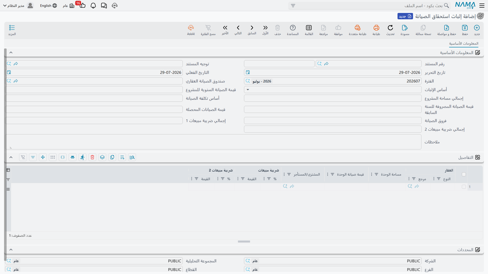

# إثبات استحقاق الصيانة السنوية

المجمّع السكني يحتاج إلى من يديره. المصاعد تحتاج عقود صيانة، والحدائق تحتاج ماءً، والحراس يحتاجون
رواتب، وحمام السباحة يحتاج مواد كيميائية كل أسبوع. يجمع أحدهم ذلك كله في بداية السنة فيصل إلى موازنة،
ثم يواجه السؤال الوحيد المهم: **كم يخص كل شقة من هذه الموازنة؟**

مستند `إثبات استحقاق الصيانة` يجيب عن هذا السؤال بالضبط، ويجيب عنه بطريقة واحدة محددة: **بالتناسب مع
مساحة الوحدة**. لا رسمًا ثابتًا لكل وحدة، ولا نسبة من قيمتها. فالشقة التي مساحتها 180 م² تدفع ضِعف ما
تدفعه الشقة التي مساحتها 90 م²، بصرف النظر عن الدور الذي هي فيه أو الثمن الذي بيعت به.

هذا هو المسار الثاني من مسارَي أموال الصيانة الموصوفين في
[ودائع الصيانة وصناديق الصيانة](/ar/modules/realestate/maintenance/realestate-maintenance-deposits-and-funds).
ولا علاقة له بالوديعة المحصَّلة عند البيع، والوديعة لا تُخصم لتغطيته.



تحرره من `العقارات و الممتلكات > المستندات > إثبات استحقاق الصيانة`، ويحتاج رخصة `realestate`.

## المثال العملي

موازنة صيانة "مجمع النخيل" لسنة 2026 هي **1,250,000**، ومساحته الخاضعة للصيانة **12,500 م²** موزعة
على 70 وحدة. إذن:

```
1,250,000 ÷ 12,500 م²  =  100 لكل متر مربع
```

فالشقة التي مساحتها 180 م² يُثبت عليها استحقاق **18,000** عن السنة، يُحمَّل على من يحوزها — المشتري
إن كانت مباعة، والمستأجر إن كانت مؤجّرة. والاستوديو الذي مساحته 90 م² يُثبت عليه 9,000. سنحمل هذه
الأرقام معنا في بقية الصفحة.

## تعبئة المستند

### 1. اختر الصندوق

`صندوق الصيانة العقاري` هو أول ما تختاره، واختياره هو الذي يقوم بالعمل الثقيل. يجمع النظام كل وحدة
عقارية تشير إلى ذلك الصندوق **و** مؤشَّر عليها بأنها خاضعة للصيانة، ثم:

- يجمع مساحاتها في `إجمالي مساحة المشروع` (Total Project Area) — 12,500 م² في مثالنا؛
- يولّد **سطرًا واحدًا لكل وحدة**، معبّأً مسبقًا بالوحدة ومساحتها والمشتري أو المستأجر الذي ستُحمَّل
  عليه.

::: tip الأسطر تُولَّد مرة واحدة في جدول فارغ
لا تظهر الأسطر إلا إذا كان جدول التفاصيل ما زال **فارغًا**. وتغيير الصندوق في مستند يحمل أسطرًا
بالفعل يعيد جمع المساحة لكنه لا يعيد بناء الأسطر. فإن اخترت الصندوق الخطأ، أفرغ الجدول قبل إعادة
الاختيار.
:::

::: info قائمتا وحدات مختلفتان
شاشة الصندوق نفسها تسرد وحدات **مشروعه**، أما الاستحقاق فيسرد الوحدات التي يشير حقل `صندوق الصيانة
العقاري` فيها إلى ذلك الصندوق. وهما معياران مختلفان يعطيان النتيجة نفسها على بيانات مرتّبة. فإن ظهرت
وحدة في قائمة دون الأخرى فلأن مشروعها ومرجع صندوقها غير متفقين — والإصلاح يتم على الوحدة نفسها، في
مجموعة الحالة حيث يجتمع مرجع الصندوق مع خيار `تخضع للصيانة`.
:::

### 2. اكتب القيمة السنوية

`قيمة الصيانة السنوية للمشروع` (Annual Maintenance Value) هي الموازنة: 1,250,000. وما إن تُدخلها حتى
يقسمها النظام على إجمالي المساحة ويكتب الناتج في `أساس تكلفة الصيانة` (Maintenance Cost Basis) —
100 للمتر، محسوبًا بخمسة أرقام عشرية حتى تستقيم المساحات الكسرية.

وأساس التكلفة غير مقفل، إذ يمكنك الكتابة فوقه فتُعاد الأسطر إلى الحساب على أساس ما كتبت. وهكذا تُحمِّل
سعرًا مدوَّرًا: تضبط الأساس على 100 بدل 99.87342 وتترك الإجمالي حيث يستقر.

### 3. اقرأ الأسطر

كل سطر يحمل الآن مساحة وحدته مضروبة في أساس التكلفة:

| العقار | مساحة الوحدة | قيمة صيانة الوحدة | المشتري/المستأجر |
|---|---|---|---|
| شقة B-302 | 180 | 18,000 | مشتري الشقة |
| استوديو C-104 | 90 | 9,000 | مستأجر الاستوديو |

عمود `المشتري/المستأجر` يُعبَّأ من مشتري الوحدة، وإن خلا فمن المشتري المذكور في عقد الوحدة. وهو أهم
مما يبدو: إذ هو الطرف الذي يُقيَّد عليه المدين، فالوحدة التي يخلو فيها هذا العمود يُثبت استحقاقها على
لا أحد.

وإن كانت ضريبة المبيعات مفعّلة في تركيبك، ظهر زوجان إضافيان من أعمدة النسبة والقيمة للضريبة. والنسب
تأتي من سياسة الضريبة المسمّاة في توجيه المستند، وتُحسب الضريبة على قيمة صيانة الوحدة.

## أسس الإثبات الثلاثة

حقل `أساس الإثبات` (Accrual Basis) يحدد **الغرض** من المستند:

**صيانة السنة** (Year Maintenance) هي الدورة السنوية المعتادة الموصوفة أعلاه، وقيمة السطر فيها
`مساحة الوحدة × أساس تكلفة الصيانة`.

أما الأساسان الآخران — **فروقات صيانة مدينة** (Debit Maintenance Difference) و**فروقات صيانة دائنة**
(Credit Maintenance Difference) — فللتسوية اللاحقة. ففي نهاية السنة تعرف ما صرفته فعلًا (إجمالي
[مصروفات الصيانة](/ar/modules/realestate/maintenance/realestate-maintenance-expenses) خلال السنة) وما
أثبتّه استحقاقًا. فإن اختلفا، حسبت الفرق **للمتر المربع**، وكتبته في حقل `فروق الصيانة` (Maintenance
Difference)، وحرّرت مستند فروق. عندئذ تصبح قيمة السطر `مساحة الوحدة × فروق الصيانة`، ولا تُستخدم
القيمة السنوية إطلاقًا.

لنفترض أن الصرف الفعلي بلغ 1,325,000 مقابل 1,250,000 مُثبتة — أي عجزًا قدره 75,000 على 12,500 م²، أو
6 للمتر. فمستند فروق بقيمة فروق 6 يحمّل شقتنا ذات الـ 180 م² مبلغًا إضافيًا قدره 1,080.

::: info الاتجاه يأتي من التوجيه لا من الأساس
كلا أساسَي الفروق يحسب المبلغ بالطريقة نفسها. والذي يفصل "الفروق المدينة" عن "الفروق الدائنة" عمليًا
هو **التوجيه الذي تختاره** — ومن ثَم الحسابات التي يُقيَّد عليها المبلغ مدينًا ودائنًا. أنشئ توجيهين،
واحدًا لكل اتجاه، واختر الأساس المطابق حتى يقرأ المستند صحيحًا لمن يفتحه بعدك.
:::

## ماذا يفعل المستند عند معالجته

حفظ الاستحقاق يُنشئ أثره المحاسبي على هيئة طلب أعمال يُعالَج في الخلفية. وكل سطر تفصيل يُنتج:

- `قيمة صيانة الوحدة` على زوج مدين/دائن واحد — المدين على المشتري أو المستأجر مقابل إيراد الصيانة أو
  التزام صندوق الصيانة، بحسب ضبط توجيهك؛
- **قيم الضرائب** على زوجَيها الخاصين، زوج لكل ضريبة.

ويُختم قيد كل سطر بالوحدة بوصفها مصدره، فتستطيع وحدة تحمل حافظة حسابات خاصة أن تقود اختيار الحساب،
كما يُختم بالمشتري أو المستأجر بوصفه ذمة السطر. وتُقيَّد المبالغ بعملة الدفتر الرئيسية للشركة — إذ
ليس للاستحقاق حقل عملة خاص به.

وكما هو الحال في أي زوج على توجيهات العقارات، **لا يُنتج الزوج قيدًا إلا إذا ضُبط جانباه المدين
والدائن معًا**؛ والزوج نصف المضبوط يُتجاوَز في صمت. وتوجيه الاستحقاق وأزواج حساباته موصوفة في
[توجيهات مستندات التحصيل والصيانة والاستثمار والتكاليف](/ar/modules/realestate/document-terms/realestate-terms-other)،
وميكانيكا أي جانب محاسبي مشتركة في
[كيف تعمل توجيهات مستندات العقارات](/ar/modules/realestate/document-terms/realestate-terms-basics).

وإذا فشلت المعالجة، أعِد المحاولة من شاشة عرض طلبات الأعمال: رشِّح الأسطر الفاشلة، وحدِّدها، ثم
استخدم قائمة **المزيد ← إعادة المعالجة / إعادة الاعتماد**.

## موضعه في السنة

لا يوجد جدول مهام خلف هذا المستند — لا أحد يولّده نيابة عنك. والإيقاع العملي هو:

1. **بداية السنة** — تضبط الموازنة وتحرر إثبات استحقاق من نوع "صيانة السنة" لكل صندوق. فتحمل كل وحدة
   مدينًا عليها.
2. **خلال السنة** — تحصّل هذه المديونيات من المشترين والمستأجرين كأي مال مستحق، بسندات القبض أو
   [مستندات التحصيل](/ar/modules/realestate/collections/realestate-collect-documents).
3. **خلال السنة** — تصرف من الموازنة عبر
   [مستندات مصروف الصيانة](/ar/modules/realestate/maintenance/realestate-maintenance-expenses).
4. **نهاية السنة** — تقارن المُثبت بالمصروف، وتحسب الفرق للمتر المربع، وتحرر مستند فروق في الاتجاه
   المناسب.

وقبل أن يعمل أي من ذلك، لا بد أن يوجد الصندوق وأن تكون وحداته مرتبطة به — راجع
[ودائع الصيانة وصناديق الصيانة](/ar/modules/realestate/maintenance/realestate-maintenance-deposits-and-funds).
