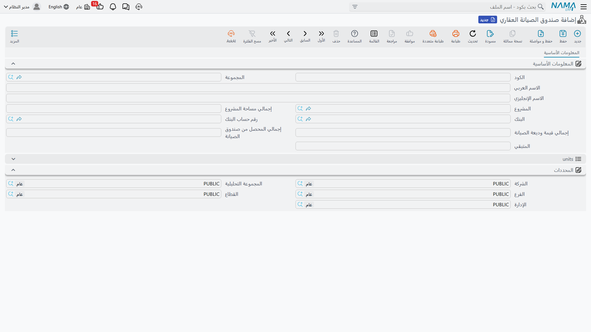
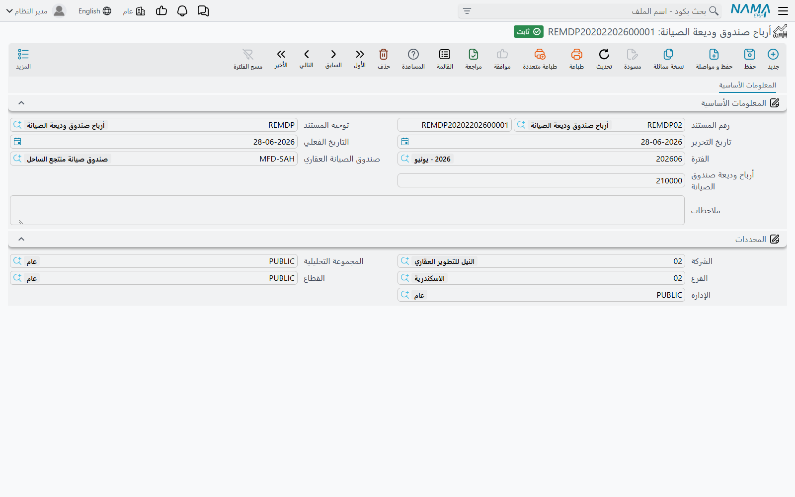

# ودائع الصيانة وصناديق الصيانة

قبل أي شيء آخر، هناك تصحيح واحد يوفّر كثيرًا من اللبس: وحدة العقارات تدير **مسارين منفصلين لأموال
الصيانة**، وليس دورة واحدة.

المسار الأول هو **وديعة الصيانة** — مبلغ يُتفق عليه لحظة البيع، ويُحصَّل من المشتري إلى جانب الثمن،
ويُودَع في حساب بنكي حتى تُستدعى الحاجة إليه. والمسار الثاني هو **استحقاق الصيانة السنوي** — موازنة
الخدمات السنوية التي تُحمَّل على كل وحدة ثم تُصرف على إصلاحات فعلية.

يبدو للوهلة الأولى أن المسارين يلتقيان في المنتصف، وهما لا يلتقيان. الوديعة يُثبتها **توجيه مستند
البيع**، أما الاستحقاق السنوي فيُثبته مستند خاص به ويُصرف بمستند آخر. لا شيء في النظام يخصم الصرف
السنوي تلقائيًا من الوديعة، ولا توجد شاشة تعرض أحدهما مقابل الآخر. تعامل معهما كدفترين يجمعهما لفظ
"الصيانة" فقط.

هذه الصفحة تخص المسار الأول. أما الثاني فتغطيه صفحتا
[إثبات استحقاق الصيانة السنوية](/ar/modules/realestate/maintenance/realestate-maintenance-accrual)
و[طلبات ومصروفات الصيانة](/ar/modules/realestate/maintenance/realestate-maintenance-expenses).

## الوديعة تبدأ من عقد البيع

لنأخذ فيلا يبلغ ثمنها 1,200,000 بوديعة صيانة 2%. هذه النسبة تعيش داخل مجموعة الأسعار في عقد البيع،
بجوار الثمن نفسه، في حقلين متلازمين: `% نسبة وديعة الصيانة` (Maintenance Deposit Percentage)
و`قيمة وديعة الصيانة` (Maintenance Deposit Value). تكتب 2 في النسبة فتمتلئ القيمة تلقائيًا بـ 24,000.

وإلى جوارهما حقلان آخران يحددان **كيف** يدفع المشتري هذا المبلغ:

- **قسط واحد** — كامل الـ 24,000 يستحق في تاريخ واحد تكتبه في حقل تاريخ سداد الوديعة.
- **موزعة على الأقساط** — تُحمَّل الوديعة على خطة السداد وتُحصَّل مع الأقساط العادية.

في مثالنا سنستخدم **موزعة على الأقساط**، فتسير الـ 24,000 مع الأقساط الستين الشهرية بدل أن تهبط
دفعة واحدة على الشهر الأول للمشتري.

### أي الحقلين هو الأصل

الوضع الافتراضي أن **النسبة** هي الحقل الأصل: في كل إعادة حساب للعقد يضرب النظام النسبة في الثمن
ويكتب الناتج فوق القيمة. وهذا هو الصحيح لمنشأة تسعّر بمنطق "2% من ثمن الوحدة".

لكن بعض المنشآت تسعّر بالعكس تمامًا — "وديعة الصيانة في هذا المشروع 25,000 وانتهى الأمر". ولهؤلاء
يوجد في سجل إعدادات وحدة العقارات خيار **يعكس الاتجاه**: `احتساب نسبة وديعة الصيانة من قيمة الوديعة
مع الحفظ` — عندها تصبح القيمة هي الأصل وتُشتق النسبة من المبلغ الذي كتبته. فعِّله حين تسعّر بمبلغ
ثابت، واتركه مغلقًا حين تسعّر بنسبة. راجع
[إعدادات وحدة العقارات](/ar/modules/realestate/realestate-configuration) لموضع الخيار.

وفي مجموعة الأسعار نفسها خيار آخر `وديعة الصيانة بعد احتساب الخصم` يحدد ما إذا كانت الوديعة تُحسب من
الثمن الكامل أم من الثمن **بعد** خصم رأس المستند. في فيلا بـ 1,200,000 بيعت بخصم رأسي قدره 50,000،
الفارق بين الحالتين هو وديعة 24,000 مقابل وديعة 23,000.

::: tip من أين يأتي الرقم فعليًا
كلا الخيارين لا يعملان إلا على إبقاء القيمة والنسبة متسقتين. المبلغ الذي يُحصَّل فعليًا هو **القيمة**
دائمًا — فإن بدا رقم ما غريبًا، انظر إلى حقل القيمة لا إلى النسبة.
:::

## الوديعة تتحول إلى أقساط

الوديعة ليست مستندًا مستقلًا وليس لها جدول خاص. عند حفظ العقد يكتبها النظام في جدول الأقساط العادي
على هيئة سطر أو أكثر من نوع القسط **تكاليف صيانة** (Maintance Cost) — والنوع هو ما يميّزها بوصفها
مال وديعة لا مال ثمن.

ومن تلك اللحظة تتصرف كأي قسط آخر: يسددها المشتري بسندات القبض أو بمستندات التحصيل، وتظهر في الجداول
نفسها، وتتقادم بالطريقة نفسها. والعمود الذي يُعوَّل عليه في التقارير هو `المحصل نظاميا` — المبلغ الذي
طبّقه النظام نفسه على السطر، لا رقمًا كتبه أحد بيده. وكيفية بناء هذه الأقساط وسدادها موضوع صفحتَي
[إنشاء خطة الأقساط](/ar/modules/realestate/sales/realestate-installment-plans)
و[عقد البيع](/ar/modules/realestate/sales/realestate-sales-contract).

والآلية نفسها تخدم الإيجارات: عقد الإيجار يحمل نسبة صيانة وقيمة صيانة خاصتين به، إضافة إلى خيار
`معاملة تكاليف الصيانة معاملة الأقساط`، وينتج نوع السطر **تكاليف صيانة** نفسه في جدول الإيجارات.

## أي حسابات تتأثر بالوديعة

هذه أكثر نقطة يُخطئ فيها المستخدمون، فلنقلها صراحة: **وديعة الصيانة يثبتها توجيه مستند البيع، لا أي
من توجيهات مستندات الصيانة.**

توجيه البيع يحمل زوج مدين/دائن مخصصًا لوديعة الصيانة، وهذا الزوج — الذي يُضبط مرة واحدة لكل توجيه
بيع — هو الذي يقرر أين تستقر الأموال. والمعتاد أن يجعل ذمة المشتري مدينة وحساب التزام ودائع الصيانة
دائنًا، لأن المال محتفَظ به لحساب جماعة الملاك لا مكتسَبًا للشركة. ويُعاد استخدام الزوج نفسه بالعكس
عند إنهاء العقد أو إلغاء الحجز، فيأتي القيد العكسي متسقًا مع الأصل تلقائيًا.

أما توجيهات الصيانة الثلاثة — توجيه الاستحقاق وتوجيه المصروف وتوجيه أرباح الوديعة — فلا علاقة لها
بهذا الزوج، وهي موثّقة في
[توجيهات مستندات التحصيل والصيانة والاستثمار والتكاليف](/ar/modules/realestate/document-terms/realestate-terms-other)،
بينما زوج البيع نفسه موثّق في
[توجيهات مستندات البيع](/ar/modules/realestate/document-terms/realestate-terms-sales).

## سجل صندوق الصيانة

ما إن تبدأ الودائع في التحصيل حتى يلزم تحديد **أين تُودَع الأموال**. وهذه وظيفة ملف `صندوق الصيانة
العقاري`: سجل واحد لكل مشروع، يسمّي البنك ورقم الحساب الذي يحتفظ بأموال ودائع المشروع.

تجده في `العقارات و الممتلكات > الملفات > صندوق الصيانة العقاري`، ويحتاج رخصة `realestate`.

ولا يوجد فيه سوى مُدخل واحد ذي أثر حقيقي وهو **المشروع**. اخترْه فتمتلئ بقية الشاشة من تلقاء نفسها:

| ما تراه | من أين يأتي |
|---|---|
| `إجمالي مساحة المشروع` (Total Project Area) | مجموع مساحات وحدات المشروع المؤشَّر عليها بأنها خاضعة للصيانة |
| `إجمالي المحصل من صندوق الصيانة` (Total Collected Maintenance Amount) | أموال أقساط تكاليف الصيانة التي طبّقها النظام فعليًا على عقود بيع المشروع |
| جدول الوحدات | الوحدات الخاضعة للصيانة نفسها، بمساحتها وسعرها والمشتري |
| `البنك` / `رقم حساب البنك` | تكتبهما بنفسك — وهما الحساب الذي تُودَع فيه أموال الودائع |

في مشروعنا "مجمع النخيل" يبلغ إجمالي المساحة 12,500 م² موزعة على 70 وحدة، وينمو إجمالي المحصَّل كلما
سدد مشترٍ أحد أسطر **تكاليف صيانة**.

وهناك أمران يجدر استيعابهما في هذا السجل. الأول أن الصندوق نفسه **لا يحمل رصيدًا محاسبيًا** — هو سجل
مرجعي وقراءة، لا حساب. النقد يعيش في الحساب البنكي الذي سمّيته، والالتزام يعيش في الحساب الذي يجعله
توجيه البيع دائنًا. والثاني أن الأرقام المحسوبة **لقطات لحظية**: تتحدث عند اختيار المشروع ثم عند
الحفظ. ففتح الصندوق وإعادة حفظه هو ما يُحدِّث الأرقام.

### كيف تنضم الوحدة إلى صندوق

تنضم الوحدة إلى الصندوق من شاشة الوحدة نفسها لا من شاشة الصندوق. في مجموعة الحالة داخل شاشة الوحدة
العقارية يوجد حقلان متجاوران: مرجع `صندوق الصيانة العقاري` وخيار `تخضع للصيانة`. والوحدة تحتاج
الاثنين معًا — الخيار هو ما يُدخلها في إجمالي المساحة، ومرجع الصندوق هو ما يقرأه الاستحقاق السنوي.
وضبط أحدهما دون الآخر هو السبب الأشيع في اختفاء وحدة من دورة الصيانة. راجع
[المباني والطوابق والوحدات](/ar/modules/realestate/properties/realestate-buildings-floors-and-units).

## إثبات عائد الأموال المودعة

أموال الوديعة القابعة في حساب بنكي تُدرّ عائدًا. ولأن المال ملك جماعة الملاك لا الشركة، فالمعتاد أن
يُضاف هذا العائد إلى التزام ودائع الصيانة بدل أن يُؤخذ إيرادًا للشركة — لكن هذا قرار دليلك المحاسبي
لا قرار النظام.

ولهذا الغرض تحديدًا يوجد مستند `أرباح صندوق وديعة الصيانة` في
`العقارات و الممتلكات > المستندات > أرباح صندوق وديعة الصيانة`. وهو أبسط مستندات الوحدة: اختر
الصندوق، اكتب المبلغ، احفظ.

وعند معالجة المستند يُنتج زوج قيد **واحدًا** لكامل المبلغ، بعملة الدفتر الرئيسية للشركة، من جانبَي
المدين والدائن المضبوطين في توجيه المستند. فإن حقق حساب الصندوق عائدًا قدره 12,500 في الربع الأول،
حرّرت مستندًا واحدًا بـ 12,500 وترك للتوجيه أن يجعل البنك مدينًا والتزام ودائع الصيانة دائنًا.

::: info لا توزيع ولا ارتداد
المستند لا يفصّل الأرباح على الوحدات ولا على الملاك، ولا يغيّر شيئًا في سجل الصندوق. هو قيد محاسبي
خالص. وإن احتاج مشروعك توزيعًا لعائد الوديعة على كل مالك، فذلك يُحسب خارج المستند.
:::

## المسار كاملًا من أوله إلى آخره

1. يتفق البائع على وديعة 2% في فيلا بـ 1,200,000، فتُظهر مجموعة الأسعار 24,000.
2. يُعتمد العقد، فتظهر أقساط **تكاليف صيانة** بقيمة 24,000 في خطة السداد، ويُثبت توجيه البيع الوديعة
   في حساب التزام الودائع.
3. يسدد المشتري تلك الأسطر على مدى الخطة، فينمو إجمالي المحصَّل في صندوق صيانة المشروع مع كل دفعة
   تُطبَّق.
4. يبقى النقد في الحساب البنكي المسمّى على الصندوق، ويُسجَّل عائده كل ربع بمستند أرباح صندوق وديعة
   الصيانة.

ولاحظ ما **لا** يوجد في هذه القائمة: لا شيء هنا يدفع ثمن إصلاح مصعد معطل. ذلك هو المسار الآخر،
ويبدأ من
[إثبات استحقاق الصيانة السنوية](/ar/modules/realestate/maintenance/realestate-maintenance-accrual).
