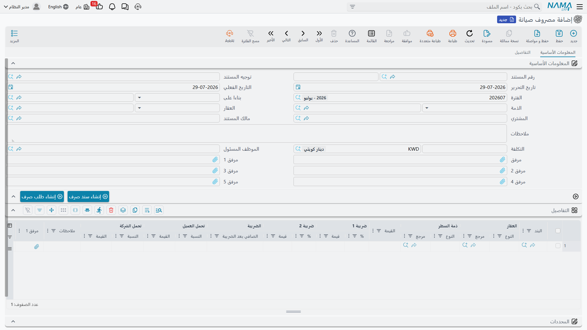
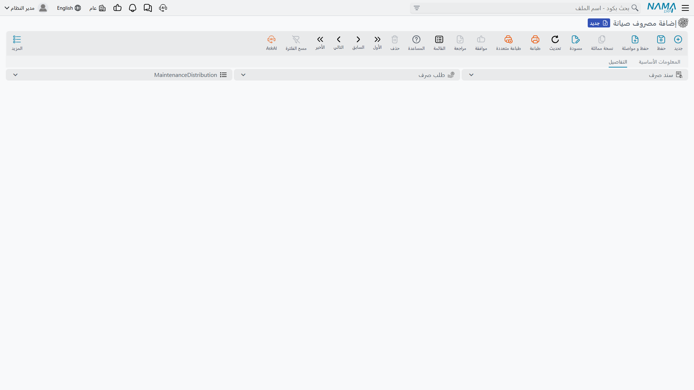

# طلبات ومصروفات الصيانة

إثبات الاستحقاق السنوي يخبرك بما على جماعة الملاك. وهذه الصفحة تخص النصف الآخر — الصرف الفعلي، وتحديد
من يتحمل كل سطر منه، ثم دفع التكلفة إلى الوحدات التي تخصها.

يقوم بالعمل مستندان. **طلب مصروف صيانة** هو سجل "نحتاج إلى صرف هذا"، و**مصروف صيانة** هو سجل "صرفنا
هذا فعلًا". الأول بلا أي أثر مالي إطلاقًا، والثاني يثبت كل شيء.

ولنحمل معنا مهمة واحدة في الصفحة كلها: **لوحة تحكم المصعد في المبنى C تعطلت، وعرض سعر الاستبدال من
شركة المصاعد 4,200. وشقق المبنى الأربعون كلها تستخدم المصعد، والشركة تتحمل التكلفة كاملة هذه المرة
دون إعادة تحميلها على العملاء.**

## الطلب — الإذن بالصرف

مدير الموقع الذي يكتشف عطل المصعد يحرر طلبًا لا مصروفًا. وهو مستند بسيط: تختار العقار، وتفصّل العمل
بنودًا، وترفق عروض الأسعار وصور العطل، وتسمّي الموظف المسؤول الذي سيتابع.

تحرره من `العقارات و الممتلكات > المستندات > طلب مصروف صيانة` برخصة `realestate`.

وما **لا** يملكه عمدًا لا يقل أهمية:

- **لا توجيه مستند ولا أثر محاسبي** — لا يُقيَّد شيء، ولا يوجد سطر دفتر، ولا التزام تجاه مورّد؛
- **لا أزرار سندات صرف** — لا يمكنك الدفع من طلب؛
- **لا توزيع** — لم يُوزَّع شيء على الوحدات بعد.

::: info لا يوجد حقل حالة على الطلب
الطلب لا يتنقل بين حالات "مُقدَّم ← معتمَد ← مرفوض" خاصة به. الاعتماد يتم بآلية الاعتمادات العامة في
نظام نما، تُطبَّق على هذا المستند كما تُطبَّق على أي مستند آخر — تُعرِّف قاعدة اعتماد وتستخدم إجراءات
الاعتماد القياسية. وفي كثير من التركيبات يكون الاعتماد العملي أبسط من ذلك: يُنشئ صاحب الصلاحية مستند
المصروف من الطلب، وهذا الفعل **هو** الاعتماد.
:::

### الأسطر

المستندان يتشاركان الرأس نفسه والجدول نفسه تمامًا، فتعلُّم أحدهما تعلُّم للآخر. وكل سطر يحمل:

| العمود | الغرض منه |
|---|---|
| `البند` (Item) | بند المصروف من كتالوج الصيانة — "لوحة تحكم مصعد" |
| `العقار` (Real Estate) | العقار الذي يخصه هذا السطر |
| `ذمة السطر` (Line Subsidiary) | الطرف المقابل في القيد — المقاول أو مورّد أو مالك |
| `القيمة` (Value) | المبلغ قبل الضريبة |
| `ضريبة 1` / `ضريبة 2` (نسبة وقيمة) | تُعبَّأ من سياسة ضريبة البند |
| `الصافي بعد الضريبة` (Value After Tax) | إجمالي السطر |
| `تحمل العميل` (نسبة وقيمة) | الحصة المعاد تحميلها على العميل |
| `تحمل الشركة` (نسبة وقيمة) | الحصة التي تستوعبها الشركة |

::: tip اختر البند في كل سطر دائمًا
البند هو ما يمد السطر بسياسة الضريبة وبالذمة الافتراضية، والحساب يمر خلاله في كل حفظ. فسطر بلا بند
لن يُعاد حسابه بنظافة. اجعل "لا سطر بلا بند" قاعدة بيت — وراجع
[أنواع الرسوم والعمولات والوسطاء والمصروفات](/ar/modules/realestate/costs/realestate-fee-commission-and-expense-types)
لمعرفة كيف يُبنى الكتالوج.
:::

في حالة المصعد: سطر واحد، البند "لوحة تحكم مصعد"، العقار المبنى C، ذمة السطر شركة المصاعد، القيمة
4,200، تحمل الشركة 100%، تحمل العميل 0%.

## المصروف — إثبات الصرف

ما إن يُقبل عرض السعر حتى تنشئ `مصروف صيانة` من الطلب عبر حقل `بناءا على` (From Document). هذا
الاختيار وحده ينسخ **كل شيء**: المبلغ والعملة، والمشتري، والعقار، والمالك، والذمة، والملاحظات، وكل
سطر تفصيل ببنده وقيمته وضرائبه ونسب وقيم التحمل. لا شيء يُعاد كتابته.



يعيش المصروف في `العقارات و الممتلكات > المستندات > مصروف صيانة`، وخلافًا للطلب فهو يحمل توجيه مستند.

ويمكنك كذلك أن تبدأ مصروفًا من عقد إيجار أو عقد بيع بدل الطلب. عندها يُجلب العقار والأطراف؛ ويجلب عقد
الإيجار قيمة صيانته بوصفها التكلفة، بينما يجلب عقد البيع الأطراف والعقار ويترك التكلفة صفرًا لتملأها.

### ثلاثة سلوكيات تعرفها قبل أن تكتب

**عقار الرأس يكتب فوق كل الأسطر.** إذا امتلأ حقل `العقار` في الرأس، نُسخ هذا العقار إلى عمود العقار
في كل سطر عند كل إعادة حساب. فلا يمكنك خلط عقارات مختلفة على الأسطر ما دام عقار الرأس مضبوطًا — إما
أن تفرّغ عقار الرأس وتضبط كل سطر، وإما أن تقبل عقارًا واحدًا للمستند كله.

**تكلفة الرأس يُعاد حسابها.** حقل `التكلفة` يُشتق دائمًا من مجموع قيم الأسطر ما دام هناك سطر واحد على
الأقل. والتكلفة المكتوبة باليد لا تبقى إلا في مستند بلا أسطر إطلاقًا.

**كل سطر يجب أن يبلغ 100%.** نسبة تحمل الشركة زائد نسبة تحمل العميل يجب أن تساوي 100 بالضبط في **كل**
سطر، وإلا مُنع الاعتماد برسالة خطأ على عمود تحمل الشركة. تكتب إحداهما فتتبعها الأخرى، ثم تُشتق
عمودا القيمة من قيمة السطر. وسطر مصعدنا هو 100 / 0.

### إعادة تحميل حصة العميل

قسمة التحمل هي قلب المستند. فالسطر الذي تتحمل فيه الشركة 100% تكلفة تبتلعها الشركة، والسطر الذي يتحمل
فيه العميل 60% تكلفة تدفعها الشركة ثم تعيد تحميلها — وللتوجيه **زوج حسابات منفصل لكل حصة**، فتستقر
الحصة التي تتحملها الشركة والحصة التي يتحملها العميل في حسابين مختلفين من السطر نفسه.

وهذا مهم لأن المصروف يُعامَل أيضًا معاملة **فاتورة ضريبية تجاه المشتري**. فحين يُرفع المستند إلى
الهيئة الضريبية أو يُعرض للسداد الإلكتروني، يكون المبلغ المفوتر **حصة العميل فقط** — ولا تظهر حصة
الشركة على الفاتورة إطلاقًا. اضبط القسمة قبل أن ترسل شيئًا.

## ما الذي يُقيَّد

عند حفظ المصروف يُنشأ أثره المحاسبي على هيئة طلب أعمال يُعالَج في الخلفية. وانطلاقًا من كل **سطر
تفصيل** تتوفر خمسة أزواج مدين/دائن مستقلة:

| القيمة المقيَّدة | مصدرها |
|---|---|
| قيمة السطر | زوج المدين والدائن الرئيسي على التوجيه |
| قيمة الضريبة 1 | زوج الضريبة 1 |
| قيمة الضريبة 2 | زوج الضريبة 2 |
| قيمة تحمل الشركة | زوج حصة الشركة |
| قيمة تحمل العميل | زوج حصة العميل |

ولا يُنتج الزوج قيدًا إلا إذا ضُبط **جانباه** معًا؛ والزوج نصف المضبوط يُتجاوَز بلا رسالة. وهذه هي
القاعدة العامة لتوجيهات العقارات، الموضَّحة في
[كيف تعمل توجيهات مستندات العقارات](/ar/modules/realestate/document-terms/realestate-terms-basics)،
أما صفحة توجيه هذا المستند نفسه — الصفحة التي تضبط فيها حسابات التكلفة والضرائب وحصتَي التحمل — فهي
مغطاة في
[توجيهات مستندات التحصيل والصيانة والاستثمار والتكاليف](/ar/modules/realestate/document-terms/realestate-terms-other).

وهناك تفصيل جدير بالمعرفة: **حسابات الضريبة تُؤخذ من بند المصروف أولًا**، ولا تعود إلى التوجيه إلا
عند خلوّها. فالبند الذي يحمل حسابات ضريبة خاصة به يتجاوز التوجيه في الأسطر التي تستخدمه، وبهذا توجّه
ضريبة الخدمات المتعاقد عليها مثلًا إلى مسار غير مسار ضريبة قطع الغيار.

ويُختم كل سطر دفتر بعقار السطر بوصفه مصدره وبذمة السطر بوصفها ذمته، بعملة المستند نفسه، وبملاحظات
السطر شرحًا (وإن خلت فبملاحظات الرأس). وتُعاد محاولة المعالجة الفاشلة من شاشة عرض طلبات الأعمال عبر
قائمة **المزيد ← إعادة المعالجة / إعادة الاعتماد**.

### سداد المقاول

زران في مربع إجراءات المستند يحوّلان المصروف إلى مال خارج: `إنشاء سند صرف` (Create Payment Voucher)
و`إنشاء طلب صرف` (Create payment voucher Request). كلاهما يبني السند من مبلغ المستند وعملته، وبالمشتري
ذمةً، ويفتحه سجلًا جديدًا لتكمله وتعتمده. والسندات المولَّدة تُسرَد على تبويب `التفاصيل` في المستند،
فترى دائمًا ما سُدد مقابل هذا المصروف.

## توزيع التكلفة على الوحدات

قيد 4,200 على المبنى C صحيح لكنه ليس نافعًا كثيرًا. فأحدهم سيحتاج في النهاية إلى معرفة حصة الشقة
B-302 من إصلاح ذلك المصعد — لكشف حساب خدمات، أو لنزاع، أو لمستند فروق السنة القادمة.

وهذا ما يفعله `توزيع تكلفة الصيانة` تلقائيًا عند معالجة المستند.



والقاعدة هي:

- إن كان **عقار الرأس** مضبوطًا والتكلفة غير فارغة، وُزِّعت التكلفة كلها تحت ذلك العقار؛
- وإلا وزّع **عقار كل سطر** قيمة سطره وحده.

و"التوزيع تحت عقار" يعني: جمع كل وحدة عقارية تقع تحته في شجرة العقارات — أو العقار نفسه إن كان وحدة
أصلًا — ثم قسمة المبلغ **بالمساحة**:

```
نسبة الحصة   = مساحة الوحدة × 100 ÷ إجمالي المساحة
المبلغ الموزع = المبلغ × مساحة الوحدة ÷ إجمالي المساحة
```

شقق المبنى C الأربعون مجموع مساحاتها 4,000 م². فالشقة التي مساحتها 120 م² تمثل 3% منها، وحصتها من
إصلاح الـ 4,200 هي 126. وتُكتب الأسطر بالعقار الأب والوحدة ومساحتها وإجمالي المساحة ونسبة الحصة
والمبلغ الموزع، وتظهر على تبويب `التفاصيل` في المستند.

وتفصيلان يجعلان الحساب أمينًا:

- **باقي التقريب يوضع على السطر الأخير**، فتساوي مجموع الأسطر المبلغ تمامًا بدل أن يبقى كسر شارد.
- **إذا كان إجمالي المساحة صفرًا** — لأن أحدًا لم يملأ مساحات الوحدات — رجع التوزيع إلى **قسمة
  متساوية**، حصة واحدة متساوية لكل وحدة. وهو تراجع معقول لكنه ليس ما طلبته، فاملأ مساحات الوحدات.

::: info التوزيع يستخدم المبلغ الإجمالي
القسمة تتجاهل نسب تحمل الشركة والعميل تمامًا — فهي توزع قيمة السطر أو الرأس كاملة. قسمة التحمل تقرر
**من يدفع**، والتوزيع يقرر **أي وحدة تخصها التكلفة**. وهما سؤالان مختلفان لا يُجمعان.
:::

## المصعد من أوله إلى آخره

1. يحرر مدير الموقع طلبًا على المبنى C: سطر واحد، لوحة تحكم مصعد، 4,200، عروض الأسعار مرفقة، تحمل
   الشركة 100%. ولا يُقيَّد شيء.
2. يُعتمد الطلب فينشئ مدير الأملاك منه مستند مصروف الصيانة — وتُنسخ كل الأسطر.
3. الاعتماد يقيّد 4,200 على حساب تكلفة الصيانة مقابل شركة المصاعد، ويحمل زوج حصة الشركة الـ 4,200
   كاملة تكلفةً تتحملها الشركة. ولا يُفوتر شيء على المشترين لأن حصة العميل صفر.
4. تُكتب أربعون سطر توزيع تحت المبنى C؛ فتظهر الشقة ذات الـ 120 م² بـ 126، ويساوي مجموع الحصص 4,200
   بالضبط.
5. زر `إنشاء سند صرف` يحرر السداد لشركة المصاعد.
6. وفي نهاية السنة تكون هذه الـ 4,200 أحد الأرقام التي تدخل في مقارنة الصرف بـ
   [الاستحقاق السنوي](/ar/modules/realestate/maintenance/realestate-maintenance-accrual).
