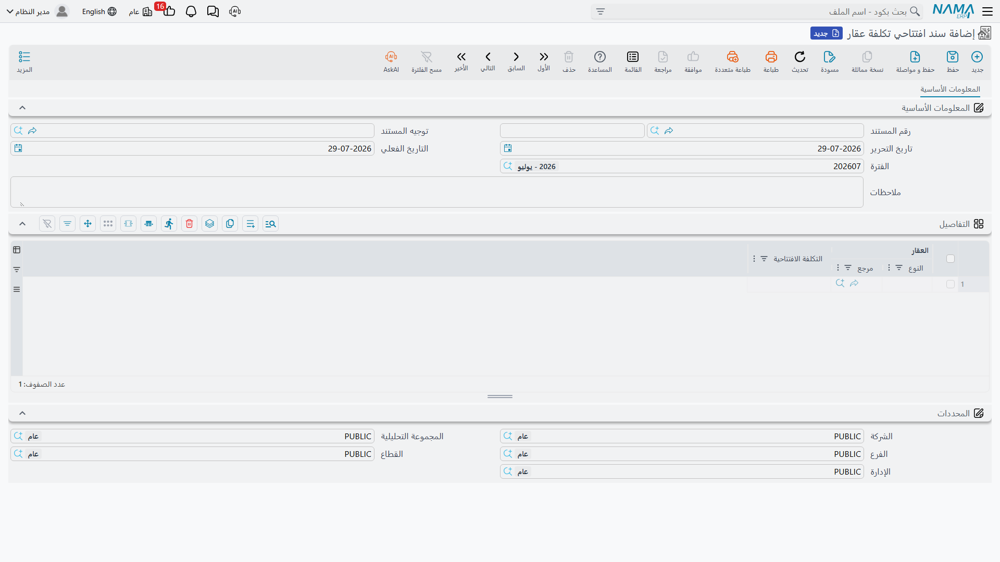

# بدء التشغيل: الأرصدة الافتتاحية في العقارات

يوم ينتقل المطوّر العقاري إلى النظام، لا شيء في محفظته جديد. فالمجمّع بُني قبل ثلاث سنوات، و١٢٠
وحدة من وحداته الثلاثمائة مباعة بالفعل ومسدَّد نصفها، و٤٠ محلاً على عقود إيجار سارية، وكل وحدة تحمل
تكلفة تراكمت في النظام القديم عبر مئات فواتير الموردين التي لا يريد أحد إعادة إدخالها.

الأرصدة الافتتاحية هي الطريق الذي يدخل منه هذا التاريخ من الباب الرئيسي: عدد قليل من المستندات تعلن
أين تقف الأمور يوم بدء التشغيل، دون أن تدّعي أن الماضي وقع داخل النظام.

## ابنِ الشجرة أولاً ثم حمّل الأرصدة

الترتيب مهم، لأن كل مستند افتتاحي يشير إلى شيء يجب أن يكون موجوداً سلفاً.

1. **شجرة العقارات.** المشاريع والمربعات والبلوكات وقطع الأراضي والمباني والطوابق والوحدات، بمساحاتها
   وأسعارها، لأن هذه هي الأرقام التي تحسب عليها الوحدة كل شيء بعد ذلك. وأزرار التوليد في كل مستوى
   تجعل هذه الخطوة أيسر بكثير مما تبدو؛ راجع
   [كيف يُمثَّل العقار في النظام](/ar/modules/realestate/properties/realestate-estate-model).
2. **الملاك والمشترون.** ملف طرف واحد يغطي الملاك والمشترين والمستأجرين، والمستندات الافتتاحية لن
   تسمح لك بتسمية مشترٍ غير موجود بعد.
3. **الدفاتر وتوجيهات المستندات** الخاصة بالمستندات الافتتاحية، حتى تُحسم الحسابات التي تصيبها
   القيود الافتتاحية قبل أول اعتماد لا بعد المائة.
4. **إعدادات الوحدة**، وبخاصة تاريخ الحد الفاصل الموصوف أدناه — راجع
   [إعدادات وحدة العقارات](/ar/modules/realestate/realestate-configuration).
5. **ثم** المستندات الافتتاحية الثلاثة.

## المستندات الافتتاحية الثلاثة

| المستند | ما الذي يُدخله |
|---|---|
| **عقد بيع افتتاحي (Opening sales doc)** | وحدة بيعت سلفاً: المشتري والسعر وجدول الأقساط وأي الأقساط سُدِّد بالفعل — راجع [عقود البيع الافتتاحية](/ar/modules/realestate/opening/realestate-opening-sales) |
| **عقد ايجار افتتاحي (Opening rent contract)** | عقد إيجار كان سارياً: المستأجر والمدة والجدول والفترات المحصَّلة — راجع [عقود الإيجار الافتتاحية](/ar/modules/realestate/opening/realestate-opening-rent-contracts) |
| **سند افتتاحي تكلفة عقار (RE Estate Opening Cost)** | التكلفة التاريخية القائمة على كل عقار |

وهي مستقلة بعضها عن بعض. فالوحدة المباعة التي تريد تحميل تكلفتها أيضاً تحتاج واحداً من كلٍّ، والوحدة
التي لم تُبع ولم تُؤجَّر لا تحتاج إلا مستند التكلفة.

## قاعدتان تحكمان العملية كلها

### مكانها الفترة المحاسبية الافتتاحية

كلا المستندين ذوَي شكل العقد يرفضان عادةً الاعتماد خارج **فترة محاسبية افتتاحية**، والرسالة تقولها
صراحة: *Fiscal period must be openning*. وهذا مقصود — فالقيود الافتتاحية يجب أن تستقر في الفترة التي
تحمل بقية الترحيل، لا في أول شهر تشغيل حقيقي حيث تشوّهه.

فأنشئ الفترة المحاسبية الافتتاحية قبل أن تبدأ، واخترها على المستندات. وهناك منفذ واحد، على عقد البيع
الافتتاحي وحده: توجيهه يحمل خيار **السماح بفترات محاسبيه غير افتتاحيه في عقد البيع الإفتتاحي (Allow
Non Opening Fiscal Period In Opening Sales)** الذي يرفع القيد عن الدفاتر التي تستخدم ذلك التوجيه.
استخدمه للحالات المتأخرة — العقد الذي لم يذكره أحد إلا بعد ثلاثة أشهر من بدء التشغيل — لا كإعداد
معتاد.

### إيقاف مسار حالات العقار بالنسبة للتاريخ المُرحَّل

تحتفظ الوحدة بسلسلة زمنية لحالات كل عقار: محجوز، ثم مؤجَّر، ثم ملغى، ثم مؤجَّر من جديد. وهي تراقب
هذه السلسلة، وترفض أي مستند لا يستقيم موضعه في التتابع — إلغاء لا يسبقه شيء، أو تأجير لوحدة تقول
السجلات إنها مؤجَّرة بالفعل.

وهذا بالضبط ما تريده للمستندات المُدخَلة داخل النظام، وبالضبط ما لا تريده لعقد كامل من التاريخ
المستورد الذي لم تُدخل حلقاته الأولى أصلاً. ولذلك تحمل إعدادات الوحدة تاريخ حد فاصل، يظهر على الشاشة
بعنوانه الإنجليزي **Do Not Validate Estate Before**. اضبطه على تاريخ بدء التشغيل فيتوقف المدقّق عن
فحص أي زوج من السطور يقع أولهما قبل ذلك التاريخ، فتُعتمد العقود المُرحَّلة دون أن يُطلب منها تبرير
ماضٍ لم يُحمَّل قط.

::: warning تعامل مع تاريخ الحد الفاصل كقرار يُتخذ مرة واحدة
الحقل مصنَّف إعداداً حساساً: فتغييره أو إفراغه بعد استخدامه يُظهر تحذير «تغيير خطير»، لأن تحريكه
بأثر رجعي يغيّر أي المستندات يقبل المدقّق مراقبتها. اضبطه مرة واحدة، عند بدء التشغيل، على تاريخ بدء
التشغيل.
:::

## تحميل التكلفة التاريخية

**سند افتتاحي تكلفة عقار (RE Estate Opening Cost)** يقع تحت **العقارات و الممتلكات > التكلفة**،
بجوار سند التكلفة العادي، وهو أبسط مستند في الوحدة. صفحة واحدة، ورأس يحمل الدفتر والكود و**توجيه
المستند (Document Term)** وتاريخي الإصدار والقيمة والفترة المحاسبية والملاحظات، وجدول تفاصيل من
عمودين فقط لا غير:

- **العقار (Estate)** — وحدة سكنية أو أرض أو بلوك أو مبنى أو طابق أو مجموعة وحدات
- **التكلفة الافتتاحية (Opening Cost)** — الرقم

لا مشروع ولا مورد ولا كميات ولا ضرائب. تذكر رقماً لكل عقار وانتهى الأمر.

وما يجعله مفيداً هو المكان الذي يستقر فيه الرقم. فالتكلفة الافتتاحية تُكتب في **نفس سطور التكلفة لكل
عقار** التي يكتب فيها سند التكلفة العادي، فتصبح **التكلفة المخصصة (Assigned Cost)** على العقار هي
تكلفته التاريخية زائد كل ما وُزِّع عليه بعد ذلك، في رقم واحد ومكان واحد. وراجع
[توزيع تكاليف المشروع على العقارات](/ar/modules/realestate/costs/realestate-cost-distribution)
لتعرف ما يحدث لهذا الرقم فيما بعد.

وثلاثة أمور تختلف هنا عن سند التكلفة العادي:

- **لا يوجد توزيع.** المبلغ الذي تكتبه يستقر على العقار الذي سمّيته كما هو. ولتحميل تكلفة افتتاحية
  لمبنى كامل إما أن تُدخل المبنى نفسه برقم واحد، أو تعدّد وحداته ويأخذ كلٌّ منها سطره. ولا شيء ينزل
  إلى أسفل.
- **مستند افتتاحي واحد لكل عقار.** فإن كان العقار مذكوراً في سند تكلفة افتتاحي آخر رُفض الاعتماد،
  والرسالة تسمّي المستند المتعارض لتفتحه. أما سندات التكلفة العادية فلا قيد عليها — يمكن أن يصيب
  العقار الواحد منها ما شئت.
- **الأثر المحاسبي سطر مدين وسطر دائن لكل سطر تفاصيل** بقيمة التكلفة الافتتاحية، والعقار نفسه محمول
  كذمة السطر حتى تُستنتج الحسابات من سجل العقار. والجانبان يأتيان من صفحة التوجيه الوحيدة: **مدين
  التكلفة الافتتاحية (Opening Cost Debit)** و**دائن التكلفة الافتتاحية (Opening Cost Credit)** —
  وعادة يكون الأول حساب أصول عقارية تحت التنفيذ والثاني حساب تسوية أرصدة افتتاحية. واترك أياً من
  الجانبين فارغاً فلا يُنشأ قيد محاسبي إطلاقاً؛ ومع ذلك تُكتب سطور التكلفة وتتحدث التكلفة المخصصة.

وإلغاء اعتماد المستند يحذف سطوره ويخفض التكلفة المخصصة من جديد، فيصبح التراجع عن دفعة ترحيل خاطئة
أمراً يسيراً.

## الترحيل من أوله إلى آخره

خذ مجمّعنا: ٣٠٠ وحدة، منها ١٢٠ مباعة، و٤٠ محلاً على عقود إيجار سارية، وتاريخ تكلفة لكل وحدة.

1. أنشئ المشروع وولّد المباني والطوابق والوحدات، بمساحة وسعر لكل منها.
2. أنشئ الملاك: البائع، والمشترين المئة والعشرين، والمستأجرين الأربعين.
3. افتح الفترة المحاسبية الافتتاحية، واضبط تاريخ الحد الفاصل في إعدادات الوحدة على يوم بدء التشغيل.
4. **التكلفة.** أدخل سندات التكلفة الافتتاحية — سطر لكل وحدة، ٣٠٠ سطر، موزّعة على ما يريحك من
   المستندات، بشرط ألا تظهر وحدة في اثنين منها. اعتمدها، ثم راجع عمود التكلفة المخصصة في شاشة قائمة
   الوحدات: ٣٠٠ وحدة، ٣٠٠ رقم.
5. **المبيعات.** أدخل عقود البيع الافتتاحية المئة والعشرين. كل عقد يحمل جدول الأقساط التاريخي كاملاً،
   مع تعليم الأقساط المسدَّدة بأنها مدفوعة بالكامل حتى لا يبقى قابلاً للتحصيل إلا المفتوح فعلاً.
6. **الإيجارات.** أدخل عقود الإيجار الافتتاحية الأربعين، وولّد جداولها، وعلّم الفترات المحصَّلة.
7. راجع الأرصدة: الوحدات المعلَّمة كمباعة يجب أن تكون ١٢٠، والمعلَّمة كمؤجَّرة ٤٠، وإجمالي الأقساط
   القائمة في العائلتين يجب أن يطابق المدينين الذي رحّلته إلى دفتر الأستاذ.

ومن اليوم التالي لا يعود شيء «افتتاحياً». فالتحصيل يجري على العقود المُرحَّلة تماماً كما يجري على
عقد وُقّع بالأمس، وسندات التكلفة الجديدة تُوزَّع على نفس العقارات، وأول تجديد لعقد إيجار افتتاحي
يُنتج عقد إيجار عادياً.
