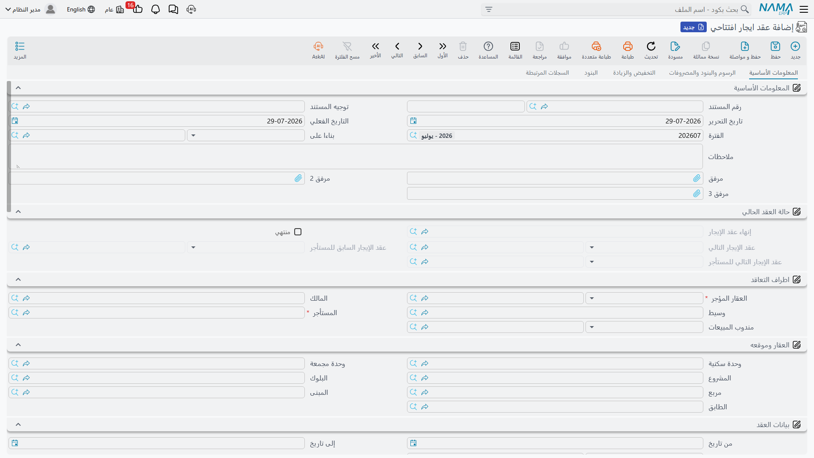

# عقود الإيجار الافتتاحية

محل في برج النخيل مؤجَّر منذ مطلع ٢٠٢٤: ثلاث سنوات بـ ١٢٠٬٠٠٠ سنوياً تُسدَّد ربع سنوية، وقد حُصِّلت
السنة الأولى كاملة. ويوم بدء التشغيل ما زال أمام هذا العقد ثمانية أرباع، ويحتاج مدير الأملاك أن
يراها ويثبت استحقاقها ويحصّلها — دون أن يثبت النظام إيراداً عن أربعة أرباع استُحقت وحُصِّلت قبل أن
يوجد.

**عقد ايجار افتتاحي (Opening rent contract)**، تحت **العقارات و الممتلكات > الايجارات**، هو المستند
المخصص لهذا بالضبط.

## مطابق لعقد الإيجار عن قصد

ليس هنا كثير مما يُتعلَّم، لأن العقد الافتتاحي **هو** عقد الإيجار. الصفحات الخمس نفسها — المعلومات
الأساسية، والشروط والرسوم والمصروفات، والخصم والزيادة السنوية، والبنود، والسجلات المرتبطة. وكتلة قيم
العقد نفسها، وجدول المصروفات نفسه، والزيادة والخصم السنويان أنفسهما، وبنود التعاقد القياسية نفسها.
وزر **إنشاء الايجارات (Create Rents)** يبني الجدول بنفس المحرك ونفس القواعد، وقيود إثبات الاستحقاق
تُولَّد بنفس الطريقة، وزرّا **تمديد العقد** و**انهاء العقد** موجودان.

فاقرأ الصفحات العادية للمضمون:

- [عقد الإيجار](/ar/modules/realestate/rent/realestate-rent-contract) للشاشة وكتلة القيم وما يفعله
  الاعتماد.
- [إنشاء جدول الإيجارات](/ar/modules/realestate/rent/realestate-rent-schedule) لكيفية تحويل زر
  *إنشاء الايجارات* عقدَ إيجار إلى أقساط مؤرَّخة.
- [قيود إثبات استحقاق أقساط الإيجار](/ar/modules/realestate/rent/realestate-rent-accrual-ledger)
  للمستندات التي يولّدها العقد لإثبات الإيراد فترة بفترة.
- [تمديد عقد الإيجار وإنهاؤه](/ar/modules/realestate/rent/realestate-rent-renewal-and-termination)
  للتمديد والإنهاء.

وثلاثة أمور مختلفة، وثلاثتها موجودة لأن عقد الإيجار بدأ قبل النظام.

## ١. لا يُعتمد إلا في فترة محاسبية افتتاحية

يشترط عقد الإيجار الافتتاحي **فترة محاسبية افتتاحية**، ويقولها حين لا يجدها: *Fiscal period must be
openning*. وخلافاً لعقد البيع الافتتاحي، لا يوجد هنا خيار في التوجيه يرفع هذا القيد — فأنشئ الفترة
الافتتاحية قبل أن تبدأ إدخال العقود، وخطّط لإدخالها جميعاً قبل إقفالها. وترتيب بدء التشغيل الأشمل في
[بدء التشغيل: الأرصدة الافتتاحية في العقارات](/ar/modules/realestate/opening/realestate-opening-balances).

## ٢. قيمة المدفوع مسبقاً للإيجار المحصَّل قبل بدء التشغيل

يحمل رأس المستند مبلغ **المدفوع مسبقا (Prepaid)**: الإيجار الذي كان المستأجر قد سلّمه قبل الترحيل،
وهو قائم في الدفاتر كالتزام بتمكينه من الانتفاع لا كإيراد ما زال قادماً. ولتوجيه المستند صفحة خاصة
بالأثر المحاسبي لهذه القيمة — *تأثيرات المدفوع مسبقا (Pre paid effects)* — حتى يضع القيد الافتتاحي
المبلغ المدفوع مسبقاً حيث يتوقعه دليلك المحاسبي. وبقية التوجيه هي توجيه عقد الإيجار المعتاد، الموصوف
في [توجيهات مستندات الإيجار](/ar/modules/realestate/document-terms/realestate-terms-rent).

## ٣. مدفوع بالكامل، وأثره على قيود الاستحقاق

يحمل جدول الأقساط نفس مربع **مدفوع بالكامل (Fully Paid)** الموجود على عقد البيع الافتتاحي، ويتصرف
بالطريقة نفسها: علّمه على قسط فيغلق النظام السطر عند الحفظ — يصفّر المدفوع، ويعيد حساب المتبقي، ثم
يجعل المدفوع مساوياً للمتبقي — فلا يبقى على ذلك السطر شيء قائم.

لكنه على عقد الإيجار يفعل شيئاً إضافياً ومهماً: **الأقساط المعلَّمة كمدفوعة بالكامل تُستبعد من قيود
إثبات الاستحقاق المولَّدة.** فالفترة التي استُحقت **و** حُصِّلت قبل بدء التشغيل يجب ألا تنتج إثبات
إيراد داخل النظام؛ ولو أنتجته لأُثبتت السنة الأولى من عقد محلّنا مرتين — مرة في النظام القديم ومرة
هنا.

فيبدو ترحيل ذلك العقد هكذا:

1. أدخل العقد: ثلاث سنوات من يناير ٢٠٢٤، ١٢٠٬٠٠٠ سنوياً، ربع سنوي.
2. اضغط *إنشاء الايجارات*. فتظهر اثنا عشر قسطاً ربع سنوي بقيمة ٣٠٬٠٠٠ لكل منها، تمتد إلى نهاية
   ٢٠٢٦.
3. علّم **مدفوع بالكامل** على أرباع ٢٠٢٤ الأربعة.
4. اعتمد. فتُعلَّم الوحدة مؤجَّرة، ويصير الجدول حياً، ويبقى ثمانية أرباع بإجمالي ٢٤٠٬٠٠٠ قابلة
   للتحصيل، وتُولَّد قيود الاستحقاق لهذه الثمانية وحدها.

وعمودان في الجدول يساعدانك على مراجعة النتيجة بعد ذلك: **التاريخ الفعلي لقيد الاستحقاق (Ledger
Installment Value Date)** الذي يتيح إثبات استحقاق قسط في تاريخ غير تاريخ استحقاقه، وعمود يبيّن مستند
الاستحقاق المولَّد للسطر — وهو فارغ في كل سطر علّمته.

::: tip التحصيل يظل على العقد
كما في أي عقد إيجار، يُحصَّل المال على أقساط العقد لا على مستندات قيود الاستحقاق. راجع
[كيف يتم تحصيل الأقساط](/ar/modules/realestate/collections/realestate-collection-basics).
:::

## التجديد هو ما يحوّله إلى عقد عادي

هنا الجزء الذي يجعل التصميم كله يتضح. اضغط **تمديد العقد** على عقد إيجار افتتاحي فيخرج لك **عقد
إيجار عادي** — إذ تُحوَّل النسخة أثناء إنشائها — بكل التواريخ مُزاحة إلى الأمام بمقدار فترة عقد
واحدة، والقيم المدفوعة مصفَّرة.

وهذا يعطي الترحيل شكلاً نظيفاً: **عقد افتتاحي واحد لكل إيجار يغطي المدة التاريخية، ثم عقود إيجار
عادية اعتباراً من أول تجديد.** فيحتفظ محلّنا بعقده الافتتاحي للفترة ٢٠٢٤–٢٠٢٦، وحين يُجدَّد في ٢٠٢٧
يصير عقداً عادياً كأي عقد آخر، ولا يبقى في السلسلة أثر للترحيل سوى الرابط إلى العقد الذي حلّ محله.

كما يفرض التمديد إلغاء العقد السابق تلقائياً، وهو ما يعني أن التوجيه يجب أن يسمّي دفتراً وتوجيهاً
لمستند الإنهاء وإلا فشل الحفظ — والتفاصيل في
[تمديد عقد الإيجار وإنهاؤه](/ar/modules/realestate/rent/realestate-rent-renewal-and-termination).
