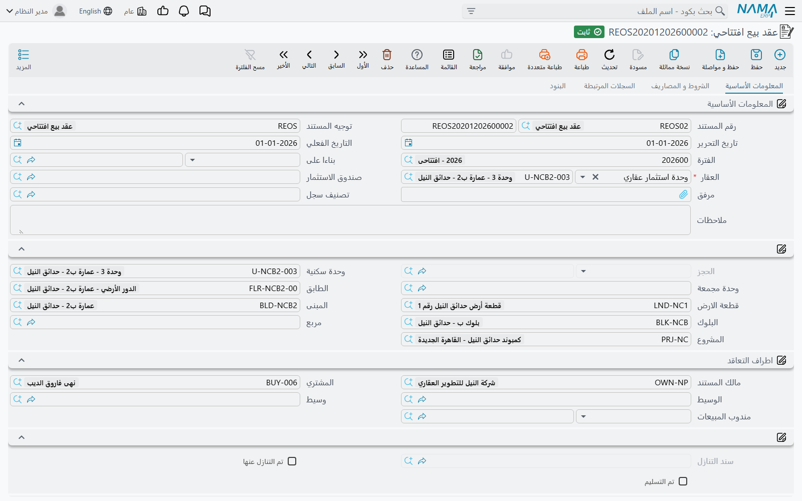

# عقود البيع الافتتاحية

فيلا بيعت في ٢٠٢٣. دفع المشتري ٢٠٪ مقدَّماً وظل يسدّد ٩٦٬٠٠٠ سنوياً منذ ذلك الحين؛ أربعة أقساط
وراءه وستة ما زالت أمامه. لم يحدث شيء من ذلك داخل النظام، ومع هذا يجب أن يتمكّن موظف التحصيل اعتباراً
من الأحد القادم من فتح ذلك العقد ورؤية الأقساط الستة القائمة وتحصيل المال عليها.

**عقد بيع افتتاحي (Opening sales doc)**، تحت **العقارات و الممتلكات > مبيعات**، هو المستند الذي
يجعل ذلك ممكناً. فهو يعلن بيعاً تمّ بالفعل كما هو يوم بدء التشغيل: من اشترى الوحدة، وبأي سعر، وكم
سُدِّد، وكم بقي.

## هو عقد البيع نفسه بمهمة مختلفة

الشاشة هي شاشة عقد البيع. الصفحة الأولى تحمل رأس المستند، ومسار العقار للقراءة فقط، و**اطراف
التعاقد (Contracting Parties)** من مالك ومشترٍ ووسيط ووسيط عقاري ومندوب مبيعات، و**نموذج الدفع
(Sales Payment Method)**، وكتلة **تفاصيل الدفع (Payment Details)** كاملة، وكتلة بيانات إنشاء الأقساط
وجدول الإنشاء المتعدد، وكتلة الأزرار وجدول **الدفعات (Installments)**. والصفحة الثانية *الشروط و
المصاريف* وبها جدول **رسوم أخري (Other Fees Lines)**، والثالثة تسرد سندات التحصيل وسندات سداد
الدفعات وسندات الغرامة والملحقات المرتبطة، والرابعة تحمل بنود التعاقد القياسية.

وكل ما تعرفه عن تلك الشاشة ينطبق هنا بلا تغيير، وبدلاً من تكراره تحيلك هذه الصفحة إلى الصفحتين اللتين
تملكانه:

- [عقد البيع](/ar/modules/realestate/sales/realestate-sales-contract) لرأس المستند والأطراف وما
  يفعله الاعتماد.
- [إنشاء خطة الأقساط](/ar/modules/realestate/sales/realestate-installment-plans) لكتلة الأسعار
  وقواعد الإنشاء وزر **إنشاء الأقساط** الذي يستبدل الجدول بالكامل تماماً كما يفعل على عقد حي.

وما يلي هو المختلف فقط.

## عمود مدفوع بالكامل

أنفع ما في هذا المستند مربع اختيار واحد على كل سطر قسط: **مدفوع بالكامل (Fully Paid)**.

تكتب الجدول التاريخي *كاملاً* — أقساط فيلتنا العشرة كلها بتواريخها ومبالغها الحقيقية — ثم تعلّم
«مدفوع بالكامل» على الأربعة التي سدّدها المشتري فعلاً. وعند الحفظ يغلق النظام تلك السطور نيابة عنك:
يصفّر المدفوع، ويعيد حساب المتبقي، ثم يجعل المدفوع مساوياً للمتبقي، فينتهي كل سطر معلَّم ولا شيء
قائم عليه.

والنتيجة عقد يبدو مطابقاً للحقيقة تماماً. تاريخ الـ ١٬٢٠٠٬٠٠٠ كاملاً ظاهر، والأقساط الأربعة المسدَّدة
تظهر مسدَّدة، ولا يقبل التحصيل إلا الستة المفتوحة — ٥٧٦٬٠٠٠. فلا يحتاج أحد إلى إعادة بناء الماضي من
سندات القبض، ولا يستطيع أحد أن يحصّل بالخطأ قسطاً سُدِّد قبل سنتين.

::: tip أدخل الجدول قبل أن تعلّم
زر *إنشاء الأقساط* يعيد بناء الجدول من الصفر، وإعادة بنائه تمحو العلامات مع كل شيء آخر. ولّد الجدول
أو اكتبه أولاً، ثم مُرّ عليه معلّماً ما سُدِّد.
:::

## الفترة المحاسبية الافتتاحية

كسائر المستندات الافتتاحية، يرفض هذا المستند الاعتماد خارج **فترة محاسبية افتتاحية**، والرسالة تقول
*Fiscal period must be openning*. أنشئ الفترة الافتتاحية أولاً واخترها على المستند.

والاستثناء الوحيد في عائلة المستندات الافتتاحية كلها يعيش هنا: خيار التوجيه **السماح بفترات محاسبيه
غير افتتاحيه في عقد البيع الإفتتاحي (Allow Non Opening Fiscal Period In Opening Sales)**. فالدفاتر
التي تستخدم توجيهاً مفعَّلاً فيه هذا الخيار تقبل فترة عادية، وهذه هي طريقة التعامل مع العقد الذي
يظهر بعد أشهر من إقفال الترحيل. وراجع
[بدء التشغيل: الأرصدة الافتتاحية في العقارات](/ar/modules/realestate/opening/realestate-opening-balances)
لبقية خطوات بدء التشغيل.

## لا عمولات

عقد البيع العادي يحمل جدول عمولات، وتُسجَّل العمولات عند اعتماده. أما العقد الافتتاحي فليس فيه **جدول
عمولات إطلاقاً**. وهذا هو السلوك الصحيح للترحيل — فوسيط بيعة ٢٠٢٣ قُبض له في ٢٠٢٣ عبر النظام القديم
— لكنه يعني أنه إذا كانت هناك عمولة ما زالت مستحقة فعلاً على بيعة تاريخية، فإنها لا تعبر مع هذا
المستند ويجب إدخالها كالتزام عادي.

أما جدول الرسوم فموجود: **رسوم أخري (Other Fees Lines)** يعمل تماماً كما يعمل على عقد حي، ويُسجَّل
كل رسم على حسابات نوع الرسم الخاص به.

## الترخيص وما يفعله الاعتماد

عقد البيع الافتتاحي مقيَّد بترخيص **`realestate-sales`**، لا بترخيص `realestate` الأساسي الذي يكفي
لسند التكلفة الافتتاحي. فالعميل المرخَّص للإيجارات وحدها لا يستطيع استخدامه.

وعند الاعتماد يفعل المستند ما كانت ستفعله البيعة التي يمثّلها: يُعلَّم العقار **مباعاً** ويُختم
بالمشتري، ويصبح جدول الأقساط حياً، ويُنشأ قيد افتتاحي من الحسابات المضبوطة على التوجيه — السعر،
وجدول الأقساط، وسعي المالك وسعي المشتري، ووديعة الصيانة، والخصومات والغرامات. وصفحات الحسابات في التوجيه موصوفة في
[توجيهات مستندات البيع](/ar/modules/realestate/document-terms/realestate-terms-sales).

وهناك تحقق يستحق معرفته قبل إدخال مائة عقد من هذه: ما لم يوقفه التوجيه، يجب أن يساوي إجمالي جدول
الأقساط القيمة المتبقية على العقد، في حدود سماح التقريب المضبوط في
[إعدادات الوحدة](/ar/modules/realestate/realestate-configuration). والجداول المُرحَّلة التي قُرِّبت
بطريقة مختلفة في النظام القديم هي السبب المعتاد لرفض دفعة من العقود الافتتاحية.

ومن لحظة اعتماده لا يعود في العقد شيء خاص. فسندات التحصيل وسندات القبض والغرامات وردّ الدفعات تعمل
عليه تماماً كما تعمل على عقد وُقّع هذا الصباح — راجع
[كيف يتم تحصيل الأقساط](/ar/modules/realestate/collections/realestate-collection-basics).
