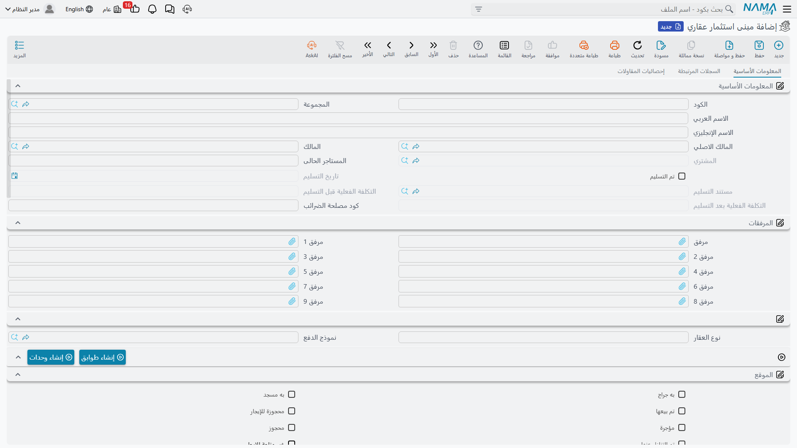
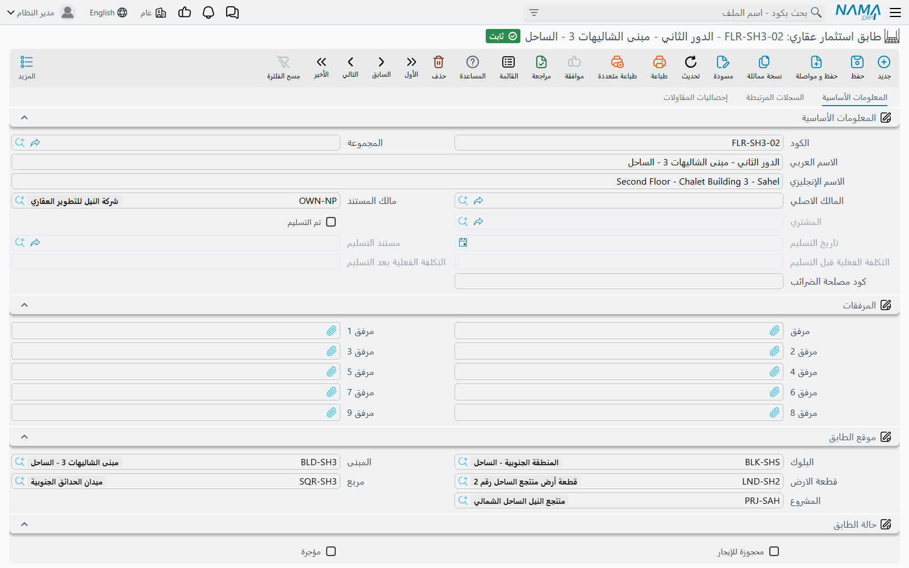
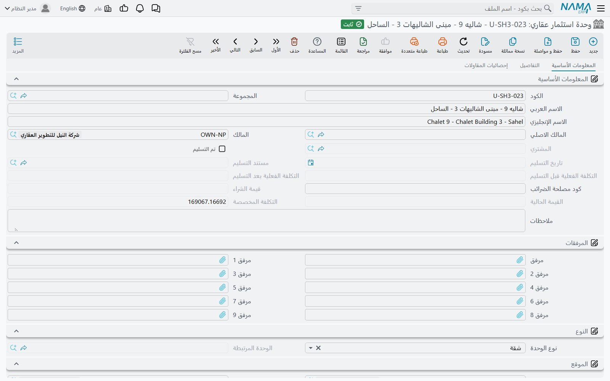
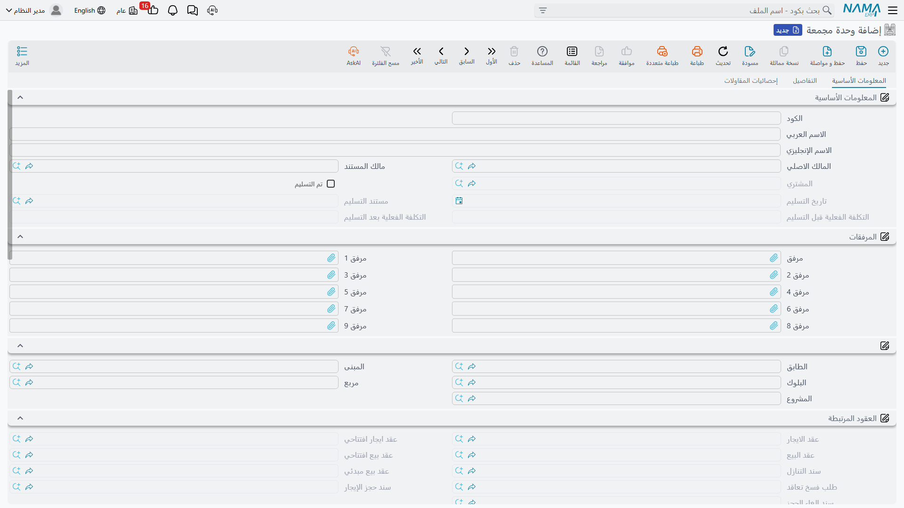
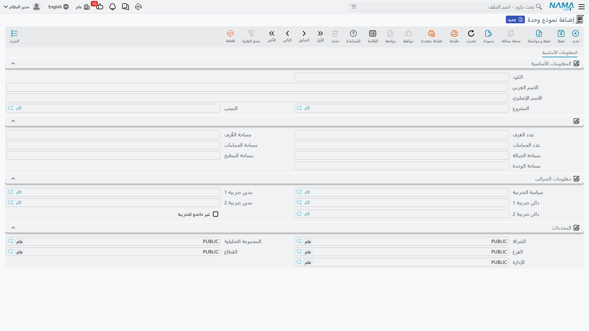

# المباني والطوابق والوحدات

النصف الآخر من شجرة العقارات يمتد إلى أعلى لا إلى الجانبين. فبينما يقسّم مطوّر الأراضي الأرض إلى
قطع، يرصّ مطوّر المباني الطوابق في مبنى والشقق في طابق — ولأن هذه الشقق متطابقة في العادة، فإن هذا
النصف من الوحدة مبنيّ كله حول ألّا تكتب التخطيط نفسه مئتي مرة.

المثال العملي لهذه الصفحة: **برج النخيل**، مبنى من 20 طابقًا في كل طابق 10 شقق، و200 من هذه الشقق
بالتخطيط نفسه — **النموذج (أ): 3 غرف، 2 دورة مياه، 145 م²**. سنعرّف هذا التخطيط مرة واحدة وندع
النظام يُنشئ الوحدات المئتين منه.

وإن لم تكن قد قرأت
[كيف يُمثَّل العقار في النظام](/ar/modules/realestate/properties/realestate-estate-model.md) بعد،
فابدأ منها: المباني والطوابق والوحدات والوحدات المجمعة كلها عقارات، ومؤشرات الإتاحة وقواعد التتابع
الموصوفة هناك تنطبق على كل واحد منها.

## مبنى استثمار عقاري — العقار وأوراقه

*العقارات و الممتلكات > الملفات > مبنى استثمار عقاري*

المبنى يقع داخل بلوك. ويمكن تأجيره أو بيعه كاملًا لطرف واحد، أو تقسيمه إلى طوابق ووحدات وبيعه شقة
شقة. وما يميّز شاشة المبنى عن كل شاشات العقارات الأخرى أنها المستوى الذي يعيش عنده السجل **القانوني**
للعقار.

### مجموعة التراخيص

خمسة مستندات قانونية محفوظة على المبنى، لكل منها رقمه وتاريخا إصداره وانتهائه ومرفقه الخاص:

- الرخصة البلدية
- رخصة البناء
- رخصة الدفاع المدني
- فتح الإنشاء
- إتمام الإنشاء

وإلى جوارها رقم **صك الملكيه** ومرفقه. وهذه الحقول السبعة معًا هي الملف الرقابي للعقار: ما يطلبه
المراجع أو مفتش البلدية، محفوظًا على السجل بدل أن يكون في درج.

### الرأس التجاري

مجموعة ثانية تسجّل ما دفعته الشركة وما يدرّه المبنى ككل: **سعر الشراء** (Purchase Price) وتاريخ
الشراء، و**قيمة الايجار السنوي** (Annual Rent Amount) مع تاريخي بدء الإيجار ونهايته، و**عدد الاقساط**،
و**نوع العقار** (Realty Type) وهو نص حرّ لتصنيفك الخاص، و**المستاجر الحالى** (Current Renter).

كما توجد **حالة** بقيمتين: **شاغر** (Free) و**مشغول** (Occupied). وهي حقل تضبطه بيدك لتقاريرك الخاصة؛
أمّا رؤية النظام نفسه لكون المبنى مؤجَّرًا أو مباعًا فهي مؤشرات **مؤجرة** و**مباع** الموصوفة في صفحة
نموذج العقار، وهذان المؤشران هما ما تقرؤه بوابات الإتاحة.

### المولّدان

| الزر | ما يفعله |
|---|---|
| **إنشاء طوابق** (Create floors) | العدد والبادئة وطول اللاحقة والرقم الأول ← يُنشئ هذا العدد من الطوابق تحت المبنى، وكل منها يحمل المبنى والبلوك والمربع والمشروع |
| **إنشاء وحدات** (Generate Units) | الأسئلة الأربعة نفسها **إضافةً إلى نموذج وحدة**؛ يُنشئ وحدات تحت **المبنى** مباشرةً، وتُنسخ أعداد الغرف والمساحات من النموذج إلى كل واحدة منها |

والثاني هو موفّر الجهد، وفيه دقّة: الوحدات المولَّدة من **المبنى** ترتبط بالمبنى بلا طابق. وهذا هو
الصحيح في مجمّع فيلات أو صفّ محلات لا طوابق فيه أصلًا. أمّا في برج النخيل فتريد الطوابق أولًا — شغّل
**إنشاء طوابق** بعدد 20، ثم ولّد الوحدات من كل طابق.

وبيع المبنى أو تأجيره يتتابع نازلًا إلى طوابقه وإلى كل وحداته، بما فيها الوحدات التي لا طابق لها.
وحجزه يحجز كل وحداته ويُسجَّل عند البلوك الأب.

## طابق استثمار عقاري — مستوى من المبنى

*العقارات و الممتلكات > الملفات > طابق استثمار عقاري*

الطابق سجل رفيع: وجوده ليتمكن تأجير طابق كامل لمستأجر واحد، وليمكن توليد الوحدات في مكانها الصحيح.
وكل حقوله تقريبًا آتية من نموذج العقار — مجموعة **موقع الطابق** تحمل مؤشرات الصعود في الشجرة،
ومجموعة **حالة الطابق** تحمل مؤشرات الإتاحة، ومجموعة **العقود المرتبطة** تجمع ما مسّه من مستندات.

ويحمل الطابق زر **إنشاء وحدات** (Generate Units) نفسه الذي على المبنى، بحارس إضافي: يرفض العمل على
طابق مؤجَّر بالفعل ("The floor is rented") أو مباع ("The floor is sold"). والوحدات المولَّدة هنا
يُملأ لها الطابق والمبنى والبلوك والمشروع.

وفي المثال العملي هذه عشرون تشغيلة، عشر وحدات في كل مرة — أو، إن ولّدت الطوابق بأكواد `F-01` حتى
`F-20`، عشر وحدات لكل طابق بأكواد `F-03-01` و`F-03-02` وهكذا، باستخدام سؤال البادئة لتبقى أكواد
الشقق ناطقة بموضعها.

## وحدة استثمار عقاري — الشيء الذي يشتريه العميل

*العقارات و الممتلكات > الملفات > وحدة استثمار عقاري*

هذا طرف الشجرة وأكثر سجل يُشار إليه في الوحدة كلها: شقة، أو مكتب، أو محل، أو صالة، أو جراج. وكل
مستند في وحدة العقارات تقريبًا ينتهي إلى الإشارة إلى واحدة منها.

### نوعان اسمهما "النوع"، وواحد منهما فقط يفعل شيئًا

تحمل الوحدة **نوع الوحدة** (Unit type) و**النوع** (Type)، والفرق بينهما يوقع الجميع مرة.

- **نوع الوحدة** هو الذي يقود السلوك. وقيمه: **وحدة** (Unit)، **جراج** (Garage)، **محل تجاري**
  (Shop)، **صالة** (Hall)، **معرض** (Exhibition)، **ملحق** (Extension)، **غرفة** (Room)، **شقة**
  (Flat)، **مكتب** (Office)، **مطبخ** (Kitchen)، وخمس خانات إضافية. والوحدة الجديدة تُنشأ بقيمة
  **وحدة**.
- **النوع** يعرض قائمة شبه مطابقة وهو وصفي بحت — تصنيف ثانٍ لتقاريرك أنت.

### الجراجات والوحدة التي تخدمها

ضبط **نوع الوحدة** على **جراج** يفعّل حقل **الوحدة المرتبطة**، وبه يُربط الجراج بالشقة التي يخدمها.
ومُنتقي هذا الحقل يضيّق الخيارات عمدًا: لا يعرض إلّا الوحدات التي نوعها **وحدة** (أو بلا نوع)
**والتي** مُشغَّل فيها مؤشر امتلاك جراج. أي أنك تُعلِم على الشقة بأن لها جراجًا، وعندها فقط يستطيع
سجل الجراج أن يشير إليها. وإن غيّرت نوع الوحدة بعيدًا عن **جراج** مُسح الربط لك.

### العدادات والتفاصيل المادية

ثلاثة حقول تحمل أرقام عدادات المرافق: **رقم عداد المياة** و**رقم عداد الكهرباء** و**رقم عداد الغاز**.
وهي أهم مما تبدو: عند التسليم وعند نهاية الإيجار تكون قراءة العداد هي ما يُحاسَب عليه المستأجر.

ومجموعة **تفاصيل الوحدة** تحمل المساحات وأسعار المتر، ويُشتقّ منها سعر الوحدة بالطريقة الموصوفة في
[صفحة نموذج العقار](/ar/modules/realestate/properties/realestate-estate-model.md).

### نموذج الوحدة — من أين تأتي المساحات

بدل كتابة التخطيط على كل شقة، تختار **نموذج وحدة** فتُنسخ منه إلى الوحدة أعداد الغرف ودورات المياه
ومساحة الصالة ومساحة المطبخ ومساحة الوحدة. ومُنتقي النموذج لا يعرض إلّا النماذج التي يطابق مشروعها
ومبناها مشروع الوحدة ومبناها (أو التي تُركت عامة)، فلا تتصفّح في موقع كبير تخطيطات مشاريع أخرى.

### مؤشرات الصيانة

حقلان يربطان الوحدة بجانب الصيانة في الوحدة: **تخضع للصيانة** (subject to maintenance)، ويقرّر ما إذا
كانت الوحدة تُلتقط عند إثبات استحقاق الصيانة السنوية، و**صندوق الصيانة العقاري** (Maintenance Fund)
الذي يسمّي الصندوق الذي تتبعه الوحدة. وكلاهما مشروح في
[ودائع الصيانة وصناديق الصيانة](/ar/modules/realestate/maintenance/realestate-maintenance-deposits-and-funds.md).

وفي مجموعة الحالة أيضًا **إتاحة الوحدة المباعة للإيجار** (allow sold unit for rent). وهو يعمل مع
الخيار المقابل في [توجيه](/ar/modules/realestate/document-terms/realestate-terms-rent.md) عقد الإيجار
ليقرّرا معًا ما إذا كانت الوحدة المباعة يجوز تأجيرها — وهو الترتيب المعتاد حين تدير الشركة وحدات
نيابةً عمّن اشتروها.

### الأزرار الأربعة

كتلة الإجراءات في أسفل الصفحة الأولى هي كيف تُطرح الوحدة في السوق دون فتح أي شاشة أخرى. وكل زر يفتح
المستند المناسب والوحدة ومالكها وموقعها مملوءة فيه:

| الزر | يفتح | يرفض حين |
|---|---|---|
| *(التأجير)* | عقد إيجار جديدًا، والعقد السابق على الوحدة مربوط فيه كسابق له | — |
| **بيع** (Sell) | عقد بيع جديدًا | الوحدة مباعة بالفعل ("it is sold before !!") |
| **حجز** (Reserve) | سند حجز جديدًا، في نافذة منبثقة | الوحدة مباعة أو محجوزة |
| **بيع مبدئي** (Initial Sale) | عقد بيع مبدئيًا جديدًا | الوحدة مباعة بالفعل |

والصفحة الثانية للوحدة تجمع كل ما جرى لها: عقود إيجارها وعقود بيعها وسندات حجزها وجراجاتها وقوائم
الأسعار التي تذكرها وعروض إيجارها والوحدات المجمعة التي تنتمي إليها وحركات الإيجار والبيع.

## وحدة مجمعة — بيع عدة وحدات كوحدة واحدة

*العقارات و الممتلكات > الملفات > وحدة مجمعة*

أحيانًا لا يكون المبيع وحدة واحدة. مستأجر يأخذ شقتين متجاورتين والجراج بينهما بعقد واحد؛ شركة تشتري
جانبًا كاملًا من طابق. **الوحدة المجمعة** حزمة من الوحدات تُعامَل بوصفها **عقارًا واحدًا** — لها
مالكها وموقعها وإعداداتها الضريبية وذمتها المحاسبية، وهي ما يشير إليه العقد.

وجدول **تفاصيل الوحدات** هو مغزى السجل كله: سطر لكل وحدة عضو. واختيار وحدة في سطر يملأ في ذلك السطر
طابقها ومبناها وبلوكها ومربعها ومشروعها من الوحدة نفسها، والمنتقيات متسلسلة من المشروع نزولًا إلى
الوحدة فتضيّق القائمة وأنت تتقدّم.

::: warning جدول الوحدات يُجمَّد بمجرد وجود عقد
بمجرد استخدام المجموعة في عقد إيجار أو عقد إيجار افتتاحي أو عقد بيع أو عقد بيع افتتاحي أو سند تنازل،
لا يعود جدول الوحدات قابلًا للتغيير — وأي تعديل على القائمة يُرفض عند الحفظ. وهذا مقصود: العقد وُقّع
على مجموعة محددة من الوحدات، والسماح بتغييرها بعد ذلك يعني إعادة كتابة ما بيع في صمت. فإن تغيّرت
الحزمة فعلًا، فهي مجموعة جديدة وعقد جديد.
:::

وبيع المجموعة أو تأجيرها يتتابع إلى وحداتها الأعضاء كالمعتاد.

## نموذج وحدة — التخطيط الذي تعرّفه مرة واحدة

*العقارات و الممتلكات > الملفات > نموذج وحدة*

نموذج الوحدة قالب قابل لإعادة الاستخدام لتخطيط ما: غرف ودورات مياه وصالة ومطبخ ومساحة كلٍّ منها. وهو
ليس عقارًا — لا مالك له ولا حالة ولا سعر. وجوده لكي يُنسَخ.

اكتب مساحة الغرف ومساحة الصالة ومساحة المطبخ ومساحة دورات المياه فتُجمَع لك في **مساحة الوحدة**.
ويمكنك اختياريًا حصر النموذج في مشروع ومبنى فلا يعرض نفسه إلّا حيث ينتمي.

::: info المثال العملي
أنشئ نموذجًا واحدًا، **النموذج (أ)**: 3 غرف، 2 دورة مياه، مساحة الغرف 78، مساحة الصالة 32، مساحة
المطبخ 14، مساحة دورات المياه 21 — فتخرج مساحة الوحدة 145 م².

ثم افتح الطابق `F-03` من برج النخيل واضغط **إنشاء وحدات** بعدد 10 وبادئة `F-03-` وطول لاحقة 2 ورقم
أول 1 ونموذج وحدة **النموذج (أ)**. تظهر عشر وحدات بأكواد `F-03-01` حتى `F-03-10`، كل منها 145 م²
بثلاث غرف ودورتَي مياه، وكل منها يشير إلى الطابق الثالث وبرج النخيل وبلوكه ومشروعه. كرّر ذلك على
التسعة عشر طابقًا الباقية فتوجد الشقق المئتان وقد كُتب التخطيط مرة واحدة بالضبط.

ولاحقًا، حين يُثبَت استحقاق الصيانة على البرج، تُحمَّل كل شقة منها على أساس 145 م² — ولهذا فإن ضبط
النموذج أهم مما يبدو.
:::

وتُستخدم النماذج كذلك مفاتيحَ لقواعد الضريبة الاحتياطية في إعدادات الوحدة، فيمكن أن يحمل النموذج (أ)
والنموذج (ب) معاملة ضريبية مختلفة دون لمس أي وحدة.

## إلى أين بعد ذلك

- [المشاريع والمربعات والبلوكات وقطع الأراضي](/ar/modules/realestate/properties/realestate-projects-blocks-lands.md)
  — المستويات التي فوق المبنى.
- [الملاك والمشترون وبنود التعاقد القياسية](/ar/modules/realestate/properties/realestate-owners-and-contract-clauses.md)
  — الأطراف التي تشير إليها كل وحدة.
- [دورة بيع العقار](/ar/modules/realestate/sales/realestate-sales-cycle.md) و
  [دورة التأجير](/ar/modules/realestate/rent/realestate-rent-cycle.md) — طرح الوحدة في السوق.
