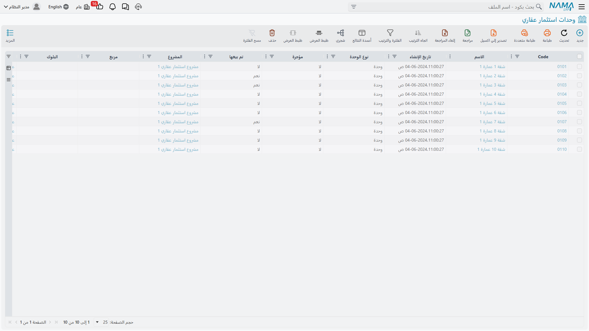

# كيف يُمثَّل العقار في النظام

كل ما تفعله وحدة العقارات — بيع، تأجير، تحصيل، صيانة، إعادة تقييم — يبدأ من سؤال واحد: *ما هو
الشيء الذي نبيعه بالضبط؟* ويجيب نظام نما عن هذا السؤال بفكرة واحدة مكرّرة على ثمانية مستويات من
التفصيل، ومعظم المفاجآت التي يصطدم بها المستخدمون لاحقًا سببها أنهم لم يستوعبوا هذه الفكرة أولًا.
هذه الصفحة هي الأساس، وعشر دقائق تقضيها هنا توفّر عليك ساعات على شاشات المستندات.

كل الملفات والمستندات المذكورة في هذه الصفحة يفتحها ترخيص `realestate`.

## كلمة واحدة لثمانية أشياء

كلمة **عقار** في هذه الوحدة لا تعني "شقة". إنها تعني *أيًّا* من المستويات التي تُبنى منها المحفظة
العقارية:

| المستوى | اسم الشاشة | ما هو عادةً |
|---|---|---|
| المشروع | مشروع استثمار عقاري (RE Project) | مجمّع سكني، أو مجموعة أبراج، أو تطوير أراضٍ |
| المربع | مربع (Square) | قطاع من المشروع يجمع عددًا من البلوكات |
| البلوك | بلوك (Block) | تقسيم يحتوي نفسه — إمّا بلوكات فرعية وإمّا قطع أراضٍ |
| قطعة الأرض | قطعة أرض (RE Land) | قطعة أرض واحدة معروضة للبيع |
| المبنى | مبنى استثمار عقاري (RE Building) | مبنى واحد بتراخيصه وصك ملكيته |
| الطابق | طابق استثمار عقاري (RE Floor) | طابق كامل، يُؤجَّر أو يُباع كوحدة واحدة |
| الوحدة | وحدة استثمار عقاري (Rental Unit) | الطرف الأخير — شقة، مكتب، محل، جراج، صالة |
| الوحدة المجمعة | وحدة مجمعة (RE Unit group) | عدة وحدات تُباع أو تُؤجَّر كحزمة واحدة |

الثمانية جميعًا تتشارك البنية نفسها. للمشروع مالك ومشترٍ وسعر ومجموعة من مؤشرات الإتاحة وإعدادات
ضريبية ومرفقات وذمة محاسبية خاصة به — تمامًا كما للشقة. ولهذا يمكن بيع مشروع بعقد مثلما تُباع شقة،
ولهذا تتكرر الحقول نفسها وأنت تصعد وتنزل في الشجرة.

والنتيجة العملية: **المشروع عقار بقدر ما الشقة عقار.** فحين تقول لك الشاشة أو المستند "العقار"،
اقرأها على أنها "أيّ المستويات الثمانية اخترت". أما المستندات التي تبيع العقار أو تعيد تقييمه أو
تُعلّي قيمته أو توزّع عليه التكلفة فتقبل المستويات الستة من **البلوك فنازلًا**: البلوك، وقطعة
الأرض، والمبنى، والطابق، والوحدة، والوحدة المجمعة. أمّا المشروع والمربع فوجودهما للتنظيم ولتجميع
الأرقام صعودًا.

## عنوان الوحدة مجموعة مؤشرات، لا رابط أب

هذه هي الفكرة الثانية، وهي التي تُربك الناس حين يبنون فلاتر أو يتساءلون لماذا امتلأ حقل من تلقاء
نفسه.

العقار **لا** يحمل رابطًا إلى "الأب" الخاص به، بل يحمل مجموعة صغيرة من حقول الموقع — المشروع
والمربع والبلوك والمبنى والطابق وقطعة الأرض والوحدة — ويملأ *كل ما ينطبق منها في وقت واحد*. فالشقة
رقم 12 في الطابق الثالث من مبنى (ب) لا تشير إلى الطابق الثالث وتتوقف عنده، بل تشير إلى المشروع
والبلوك والمبنى **والطابق** في السجل نفسه.

ونادرًا ما تكتبها كلها بنفسك. فحين تختار المبنى في الوحدة يملأ النظام فورًا المشروع والبلوك من ذلك
المبنى؛ وحين تختار البلوك في قطعة الأرض يأتي معه المربع والمشروع. وما بقي فارغًا عند الحفظ يُملأ من
الأب الذي اخترته فعلًا. كذلك يُنسخ العنوان نفسه (الدولة والمدينة والشارع وموقع الخريطة) وتُنسخ
المحددات التحليلية (الشركة والفرع والقطاع والإدارة ومجموعة التحليل) من الأب إلى الابن، فتضبطها مرة
واحدة في الأعلى وترثها فيما تحتها.

::: tip لماذا يهمّك هذا يوميًا
لأن المؤشرات مسطّحة، يمكنك الفلترة أو التقرير عند أي مستوى دون المرور بالشجرة كلها — "كل الوحدات في
مجمّع النخيل" معيار واحد على حقل المشروع، مهما كان عدد البلوكات والمباني والطوابق بينهما.
:::

ويسجّل كل عقار كذلك حدوده الأربعة: **الحد الشرقي** (Eastern Neighbor) و**الحد الغربي**
(Western Neighbor) و**الحد الشمالي** (Northern Neighbor) و**الحد الجنوبي** (Southern Neighbor)،
بطول وعرض لكل حدّ في المستويات التي تحتاج هذا التفصيل. وهذا بالضبط ما يُكتب في صك الملكية وفي العقد
المطبوع.

## لا يوجد حقل حالة على العقار

اقرأ العنوان مرتين، فمنه تأتي أغلب الأسئلة عن الإتاحة.

إن بحثت عن قائمة منسدلة تقول "متاح / محجوز / مباع / مؤجر" على شقة فلن تجدها. الإتاحة مسجَّلة بدلًا
من ذلك في صورة **مؤشرات مستقلة**، يشغّلها ويطفئها المستند الذي قام بالفعل:

| المؤشر | يضبطه |
|---|---|
| **مباع** (Sold) | عقد بيع أو عقد بيع افتتاحي |
| **محجوز** (Reserved) | سند حجز مؤكَّد |
| **مؤجرة** (Is Rented) | عقد إيجار |
| **محجوزة للإيجار** (Reserved For Rent) | عرض إيجار يحجز الوحدة |
| **تنازل** (Waivered) | سند تنازل |
| **مباع جزئيا** (partially Sold) | بيع أحد ما تحته |
| **مؤجر جزئيا** (partially Rented) | تأجير أحد ما تحته |

وإلى جوارها مؤشران تضبطهما بيدك: **غير متاحة للبيع** (Unavailable For Sale) و**غير متاحة للإيجار**
(Unavailable For Rent)، وبهما تسحب وحدة من السوق دون أي مستند — شقة محجوزة لمهندس الموقع، أو محل
تحت التشطيب.

ولأنها مستقلة، فإن التركيبات التي يستحيل تمثيلها بحقل حالة واحد طبيعية تمامًا هنا: يمكن أن تكون
الوحدة **مباعة ومؤجَّرة** في الوقت نفسه (اشتراها العميل وأجّرها من خلالك)، ويمكن أن يكون البلوك
**مباعًا جزئيًا** وهو نفسه متاح. لا شيء يجبرها على الاصطفاف في سطر واحد.

### الحالة المشتقّة الوحيدة — وهي لقطع الأراضي والبلوكات فقط

قطع الأراضي والبلوكات هي الاستثناء. فتجارة تقسيم الأراضي تحتاج كلمة واحدة تُطبع على خريطة القطع،
ولذلك يحمل هذان المستويان حقل حالة حقيقيًا يملؤه النظام:

| القيمة | بالإنجليزية | متى |
|---|---|---|
| **متاح** | Avaliable | قابل للحجز أو البيع |
| **محجوز** | Reserved | يحجزه سند حجز |
| **مباعة** | Sold | باعه مستند بيع |
| **غير متاح** | Un Avaliable | مشتقّة: أحد ما تحته مباع أو مؤجر أو محجوز |

(الكتابة الإنجليزية *Avaliable* هي ما يظهر فعلًا على الشاشة — ابحث عنها هكذا بالضبط.)

والترتيب مهم: البيع يغلب الحجز، والحجز يغلب "أحد أبنائي مأخوذ". فالبلوك الذي بيعت عشر قطع من أربعين
قطعة فيه يظهر **غير متاح** — لأنه لم يعد قابلًا للبيع قطعة واحدة، فقد ذهبت أجزاء منه. وبجانب كل من
الحقلين حقل تجاوز يدوي (**حالة قطعة الأرض المدخلة** / **حالة البلوك المدخلة**)؛ ما تضعه فيه يغلب ما
اشتقّه النظام. استخدمه بحساب وعن قصد.

## البيع يتدفّق نازلًا، و"مباع جزئيا" يصعد

هاتان الحركتان تجريان في اتجاهين متعاكسين في اللحظة نفسها، وفهمهما يفسّر عمليًا كل سؤال من نوع
"لماذا لا أستطيع بيع هذا؟".

**نازلًا — البيع يأخذ كل ما تحته.** بِع بلوكًا فلن يكون البلوك وحده هو ما يُوسَم مباعًا: كل قطعة أرض
فيه، وكل مبنى فيه، وكل طابق من تلك المباني، وكل وحدة في تلك الطوابق تُوسَم مباعة أيضًا. واحجز
البلوك فتنزل موجة الحجز نفسها. وأجّر مبنى فتصبح طوابقه وكل وحداته مؤجَّرة. هذا هو السلوك الوحيد
المنطقي — لا يمكنك بيع مبنى لمشترٍ وبيع طابقه الثالث لمشترٍ آخر — لكنه يعني أن نقرة واحدة قد تغيّر
مئات السجلات.

**صاعدًا — الآباء يعرفون أن جزءًا منهم قد ذهب.** لحظة بيع أحد الأبناء يُوسَم كل مستوى فوقه بـ**مباع
جزئيا**: الطابق والمبنى والبلوك والمربع والمشروع. ويحدث المثل مع **مؤجر جزئيا** عند التأجير.
وتحتفظ البلوكات إضافةً إلى ذلك بثلاثة عدّادات لعدد ما بيع وما أُجّر وما حُجز مما تحتها، وهي بالضبط
ما يغذّي الحالة المشتقّة **غير متاح** الموضّحة أعلاه.

::: info المثال العملي
مجمّع النخيل ← المربع (أ) ← البلوك 3، وهو بلوك يقبل عناصر ويضم 40 قطعة أرض مساحة كل منها 400 م².

- **بِع القطعة LX-04.** تصبح حالة القطعة **مباعة**، ويرتفع عدّاد الأبناء المباعين في البلوك 3 إلى 1،
  فيقرأ البلوك 3 الآن **غير متاح** — لم يعد قابلًا للبيع قطعة واحدة. ويُوسَم المربع (أ) ومجمّع
  النخيل كلاهما بـ**مباع جزئيا**. أما القطع الـ39 الباقية فلم يمسسها شيء وما زالت **متاح**.
- **والآن احجز البلوك 3 كاملًا بدلًا من ذلك.** يقرأ البلوك **محجوز**، وينزل الحجز إلى القطع الأربعين
  دفعة واحدة — كل واحدة منها تُوسَم محجوزة، ولا يمكن بيع أو حجز أي منها منفردة حتى يُفكّ الحجز.
:::

وإلغاء اعتماد العقد أو إلغاؤه يشغّل الآلية نفسها في الاتجاه المعاكس، فيُلغى البيع الخاطئ على كل
مستوى مسّه، لا على قمّته فقط.

## ما الذي يمنع البيع أو الإيجار أو الحجز

المؤشرات ليست زينة؛ ثلاث بوابات تقرؤها قبل أن تسمح للمستند بالمرور.

1. **قبل عقد البيع.** يُرفض العقار إن كان هو — *أو أي عقار تحته* — مباعًا أو محجوزًا أو موسومًا بغير
   متاح للبيع. هذه هي البوابة التي تفحص ما تحت العقار، ولهذا يفشل بيع مبنى كامل بمجرد أن تُحجز شقة
   واحدة فيه.
2. **قبل عقد الإيجار.** يُرفض العقار إن كان مؤجَّرًا بالفعل. وإن كان **مباعًا** يُرفض الإيجار كذلك —
   إلّا إذا كان [توجيه](/ar/modules/realestate/document-terms/realestate-terms-rent.md) عقد الإيجار
   يسمح بتأجير عقار مباع، وهي الطريقة التي تدير بها الشركة وحدات نيابةً عمّن اشتروها.
3. **قبل الحجز.** ترفض قطع الأراضي والبلوكات الحجز حين تكون **محجوز** أو **مباعة** أو **غير متاح**
   ("It is reserved before" / "It is sold before" / "It is unavailable")، وترفضه الوحدات حين تكون
   محجوزة أو مباعة، مع ذكر اسم الوحدة في الرسالة.

فإذا فشل الاعتماد بسبب الإتاحة، فالسبب في الغالب ليس في السجل الذي تنظر إليه بل في أحد أبنائه. افتح
صفحة السجلات المرتبطة للعقار وانزل منها.

## المساحات

هناك شيئان مختلفان يحملان اسم "المساحة"، ويُملآن بطريقتين مختلفتين.

في جانب الأراضي — المشروع والمربع والبلوك وقطعة الأرض — تكتب **الطول** و**العرض**، فتُحسب
**المساحة** لك بمجرد خروجك من أي من الحقلين. وتحمل البلوكات والمربعات إضافةً إلى ذلك **المساحة
المحسوبة** (Calculated Area) وهي لا تُكتب مطلقًا: إنها مجموع مساحات قطع الأراضي التي تحتها، ويُعاد
حسابها كلما حُفظت واحدة من تلك القطع. فمساحة البلوك هي "ما يقيسه البلوك على الخريطة"، ومساحته
المحسوبة هي "ما تجمعه قطعه فعلًا" — والمقارنة بينهما فحص سريع لسلامة التقسيم.

أما في جانب المباني فالمساحة خاصية من خصائص تخطيط الوحدة: مساحة الغرف، ومساحة دورات المياه، ومساحة
المطبخ، ومساحة الصالة، و**مساحة الوحدة** التي هي مجموعها. وهذه أيضًا لا تُكتب عادةً، بل تأتي من
[نموذج الوحدة](/ar/modules/realestate/properties/realestate-buildings-floors-and-units.md) المطبَّق
على الوحدة. ومساحة الوحدة هي الرقم الذي يقود لاحقًا استحقاق الصيانة وتوزيع التكاليف بالمساحة، فيستحق
الضبط الجيد عند النموذج.

## الأسعار

يصل العقار إلى سعره بثلاث طرق لا تتنافس، لأن كلًّا منها تعمل عند مستوى مختلف.

- **مكتوب.** المشاريع والمربعات والبلوكات وقطع الأراضي تحمل سعرًا بسيطًا بعملته.
- **محسوب من التخطيط.** **سعر الوحدة** (Unit Price) في وحدة الاستثمار العقاري يُشتقّ من
  `مساحة الوحدة × سعر متر الوحدة` مضافًا إليه `مساحة الحديقة × سعر متر الحديقة`، ويُعاد حسابه وأنت
  تكتب أيًّا من سعري المتر. أدخل 145 م² بسعر 6,000 للمتر فيصبح سعر الوحدة 870,000 دون أن تلمس شيئًا.
- **متراكم من الأبناء.** يحمل البلوك مفتاح **احتساب سعر البلوك تلقائياً** (Price Is Calculated).
  شغّله فتُضيف كل قطعة أرض تُحفظ تحت البلوك سعرها إلى سعر البلوك — ويُخصم منه ثانيةً إن انتقلت القطعة
  إلى بلوك آخر أو تغيّرت قيمتها. وبه تبقى إجابة "كم يساوي هذا البلوك" صحيحة دون صيانة يدوية.

وبمعزل عن الثلاثة، يعرض كل عقار حقلًا للقراءة فقط اسمه **السعر من قوائم الأسعار**
(Current Price From Price Lists). هذا الرقم غير مخزَّن، بل يُقرأ لحظيًا من
[قائمة الأسعار](/ar/modules/realestate/sales/realestate-price-lists-and-payment-methods.md) السارية
لهذا العقار بتاريخ اليوم، وهو ما ينبغي أن يسعّر به مندوب المبيعات فعلًا.

## كل عقار هو أيضًا ذمة محاسبية

يحمل كل مستوى من المستويات الثمانية ذمة محاسبية خاصة به وإعداداته الضريبية الخاصة — الخطة الضريبية،
وزوجَي المدين والدائن للضريبة، ومؤشر عدم الخضوع للضريبة، وكود مصلحة الضرائب. وهذا ما يتيح ترحيل قيد
*على الشقة نفسها* بدل حساب إيرادات عام، وما يجعل العقار قابلًا للظهور كمحدد في أي أثر محاسبي تقريبًا
داخل الوحدة.

وتفصيلة تستحق المعرفة حين تخرج ضريبة على غير المتوقع: عندما يحتاج النظام خطة ضريبية لعملية على عقار،
فإنه يفضّل خطة **المشتري** على خطة العقار نفسه. خطة العقار هي البديل الاحتياطي لا الحاكم.

كما ترتبط العقارات بوحدة الأصول الثابتة عبر حقل الأصل الثابت وتكلفته، لما تحتفظ به الشركة من عقار
بدل أن تبيعه.

## للعقار أيضًا قيمة دفترية وتكلفة مخصصة

هناك رقمان آخران يحفظهما النظام على كل عقار، وهما ينتميان إلى قصص تُروى في صفحات أخرى:

- **قيمة الشراء** (Purchase Value) و**القيمة الحالية** (Current value) هما سلسلة القيمة الدفترية
  للعقار المملوك لصندوق استثمار. تكتبهما سلسلة زمنية من المستندات — عقد شراء، ثم تعليات، ثم إعادات
  تقييم، ثم البيع — وهذه السلسلة يتحقق النظام من ترتيبها، فترتيب إدخال المستندات مهم فعلًا. كل ذلك،
  بما فيه كيفية توزيع إعادة التقييم للأرباح على مستثمري الصندوق، في صفحة
  [قيم العقارات والتعلية وإعادة التقييم](/ar/modules/realestate/investment/realestate-estate-values-and-revaluation.md).
- **التكلفة المخصصة** (Assigned Cost) هي وجه المطوّر من العملة نفسها: إجمالي تكلفة المشروع التي
  وُزّعت نازلةً على هذا العقار بالذات. انظر
  [توزيع تكاليف المشروع على العقارات](/ar/modules/realestate/costs/realestate-cost-distribution.md).

كلاهما للقراءة فقط على شاشة العقار. فإن بدا أحدهما خاطئًا، فالمستند الذي كتبه هو ما تصلحه، لا الحقل.

## إلى أين بعد ذلك

- [المشاريع والمربعات والبلوكات وقطع الأراضي](/ar/modules/realestate/properties/realestate-projects-blocks-lands.md)
  — بناء جانب الأراضي من الشجرة من الأعلى إلى الأسفل.
- [المباني والطوابق والوحدات](/ar/modules/realestate/properties/realestate-buildings-floors-and-units.md)
  — جانب المباني، ونماذج الوحدات، والوحدات المجمعة.
- [الملاك والمشترون وبنود التعاقد القياسية](/ar/modules/realestate/properties/realestate-owners-and-contract-clauses.md)
  — ملف الأطراف الذي يشير إليه كل مستند.
- [دورة بيع العقار](/ar/modules/realestate/sales/realestate-sales-cycle.md) و
  [دورة التأجير](/ar/modules/realestate/rent/realestate-rent-cycle.md) — ما يحدث بعد أن تكتمل
  المحفظة.
