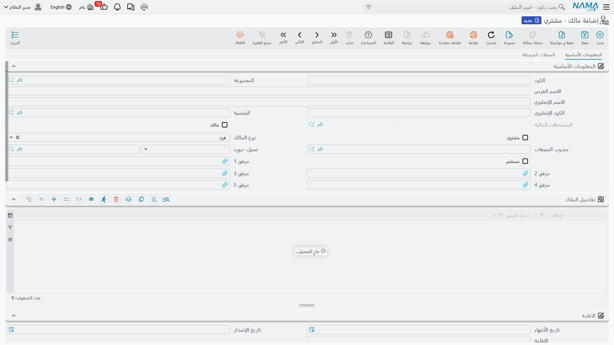
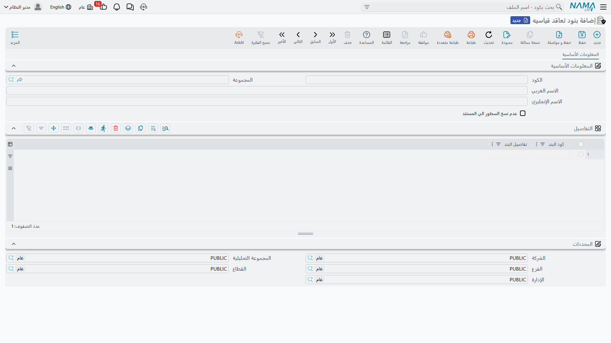

# الملاك والمشترون وبنود التعاقد القياسية

كل مستند في وحدة العقارات يسمّي أشخاصًا: المالك صاحب المبنى، والعميل الذي يشتري الشقة، والمستأجر
الذي يستأجر المحل، والمستثمر الذي وضع ماله في الصندوق. ونظام نما لا يحتفظ بأربعة ملفات لهذه الأدوار
الأربعة، بل يحتفظ بملف **واحد**، ويترك للسجل الواحد أن يلبس من الصفات بقدر ما يلبس صاحبه فعلًا.

ويغطي النصف الثاني من هذه الصفحة الشيء الآخر الذي يحتاجه كل عقد ولا يريد أحد إعادة كتابته: البنود
القياسية.

## ملف واحد، ثلاثة أدوار

*العقارات و الممتلكات > الملفات > مالك - مشتري*

اسم الشاشة العربي — "مالك - مشتري" — يقولها صراحةً. سجل واحد يصف طرفًا، وثلاثة مفاتيح مستقلة عليه
تقول ماذا يجوز أن يكون هذا الطرف:

| المفتاح | يجعل السجل قابلًا للاختيار بوصفه |
|---|---|
| **المالك** (Owner) | المالك أو المالك الأصلي في أي عقار، وطرفَي سند تحويل الملكية |
| **المشتري** (Buyer) | المشتري في عقد البيع والمستأجر في عقد الإيجار |
| **مستثمر** (Investor) | مستثمرًا في صندوق استثمار عقاري |

وهي مستقلة، فيمكن أن يكون الطرف الثلاثة معًا — وهو بالضبط ما يحدث مع شركة تملك برجًا، وتشتري شققًا في
برج آخر، ولها حصة في صندوق.

والمفاتيح ليست زينة: **كل مُنتقٍ في الوحدة يفلتر عليها.** فحقل المالك في العقار لا يعرض إلّا السجلات
التي فيها **المالك** مُعلَّم. وحقلا "من مالك" و"إلي مالك" في سند تحويل الملكية كذلك. ومنتقيات
المستثمرين في مستندات الصندوق لا تعرض إلّا السجلات التي فيها **مستثمر** مُعلَّم.

::: tip أشهر بلاغ: "العميل غير موجود في القائمة"
في تسع حالات من عشر يكون السجل موجودًا والمفتاح مطفأً. افتح الطرف، وعلّم الدور الذي تحتاجه، واحفظ،
وسيجده المنتقي.
:::

### ماذا يحمل السجل أيضًا

إلى جانب الأدوار، يحمل سجل الطرف ما يحتاجه العقار للطباعة: الأسماء وكودًا بديلًا، و**الجنسية**، وبيانات
الاتصال الكاملة، و**الأقامة** برقمها وتاريخي إصدارها وانتهائها، وصفًّا من خانات المرفقات لوثائق الهوية
والأوراق الموقّعة. ويمكن ربط **مندوب المبيعات** بالسجل لتكون للعمولات والمتابعة جهة. وهناك حقل
**المستحقات المالية** للقراءة فقط يحفظه النظام، ومجموعة معلومات ضريبية كاملة — الخطة الضريبية، ورقم
التسجيل، ورقم الملف، وكودا المأمورية وطريقة التعامل اللازمان للفوترة الإلكترونية.

وحقلان يربطان السجل بالخارج:

- **العميل / المورد** يربط الطرف بملف العميل أو المورد في الوحدة الأساسية، فيصبح الشخص نفسه رصيدًا
  واحدًا عبر النظام كله.
- **العميل المحتمل أو الفرصة** يربطه بإدارة علاقات العملاء. والطرف المُنشأ من عميل محتمل يبقى
  متزامنًا معه — فالاعتماد والحذف يحدّثان جانب إدارة علاقات العملاء — وبها يتحول استفسار زائر إلى
  مشترٍ دون أن يعيد أحد كتابة الاسم.

وكل طرف هو أيضًا ذمة محاسبية بذاته، وهذا ما يتيح ترحيل القيد على *هذا المشتري* بدل حساب مدينين عام.

أمّا الصفحة الثانية من الشاشة فملفّ بكل ما دخل فيه الطرف: عقود الإيجار، وعقود البيع، والبيع
الافتتاحي، وسندات التحصيل، وسندات التنازل من جهة المالك ومن جهة المشتري، وسندات الحجز، والمباني
والوحدات والمربعات والبلوكات والقطع التي يملكها، واستثماراته في الصناديق وحركاته.

## فرد ومجموعة — كيف تُرحَّل الملكية المشتركة

لحقل **نوع المالك** قيمتان، **فرد** (Individual) و**مجموعة** (Group)، والسجل الجديد يبدأ **فرد**.
والاختيار يفعل شيئًا حقيقيًا.

المالك **الفرد** هو المتوقَّع: شخص واحد، وذمة واحدة، ورصيد واحد. وجدول **تفاصيل الملاك** أسفله يكون
معطّلًا ويبقى فارغًا.

أمّا المالك من نوع **مجموعة** فطرف *مركّب*: لا يحمل رصيدًا خاصًا به، بل يحمل قائمة أعضاء. حوّل نوع
المالك إلى **مجموعة** فيصبح الجدول مطلوبًا — سطر لكل عضو، ومع كل عضو **عدد الاسهم** الخاص به. ومن
تلك اللحظة يُوزَّع كل أثر محاسبي على المجموعة على الأعضاء بنسبة أسهمهم.

::: info المثال العملي — ثلاثة ورثة
قطعة أرض ورثها ثلاثة بنسب 50 / 30 / 20.

أنشئ طرفًا واحدًا باسم "ورثة عبد الله"، واضبط نوع المالك على **مجموعة**، وأضف ثلاثة أسطر إلى جدول
**تفاصيل الملاك**: الوارث (أ) بخمسين سهمًا، والوارث (ب) بثلاثين، والوارث (ج) بعشرين. ثم اجعل هذه
المجموعة هي المالك الأصلي للقطعة.

وحين تُباع القطعة لاحقًا بمليون، لا يكون القيد على البائع سطرًا واحدًا على حساب مجموعة، بل يُقسَّم
500,000 و300,000 و200,000 على ذمم الورثة الثلاثة. فيحمل كل وارث رصيده وكشف حسابه، بينما يسمّي العقد
والقطعة ومستند البيع طرفًا واحدًا بسيطًا.
:::

وإعادة نوع المالك إلى **فرد** تمسح جدول الأعضاء، فاجعل هذا التغيير عن قصد.

::: tip جدولان اسمهما "تفاصيل الملاك"
الجدول الموجود على سجل **الطرف** يقسّم **المال** — وهو ما تتبعه المحاسبة. أمّا الجدول المشابه في
الاسم على **البلوك** أو **قطعة الأرض** فيسجّل نسبًا من العقار المادي للاستئناس. فإن أردت تقسيم
القيود، فسجل الطرف هو ما تعدّله.
:::

## بنود التعاقد القياسية

*العقارات و الممتلكات > الملفات > بنود تعاقد قياسيه*

كل عقد بيع وكل عقد إيجار تُصدره يحمل العشرين فقرة نفسها — شروط السداد، وأحكام التأخر، وما لا يجوز
للمستأجر فعله، وكيف تُحسم الخلافات. وكتابتها في كل مرة جهد ضائع ومخاطرة رقابية في آن، لأن النسخة في
العقد رقم 40 لن تطابق النسخة في العقد رقم 400.

سجل بنود التعاقد القياسية هو تلك الصياغة الجاهزة، محفوظة مرة واحدة. وجدول **التفاصيل** فيه قائمة
بسيطة من البنود: **كود البند** و**تفاصيل البند**. اكتب مجموعتك القياسية للبيع، ومجموعتك القياسية
للإيجار السكني، ومجموعتك القياسية للإيجار التجاري في ثلاثة سجلات، ثم اختر المناسب منها في كل عقد.

### انسخ البنود، أو أشِر إليها

يحمل السجل مفتاحًا واحدًا، وهو يقرّر السلوك كله: **عدم نسخ السطور الي المستند**
(Do Not Copy Lines To Document).

- **مطفأ (الوضع الافتراضي) — تُنسَخ البنود.** اختيار الملف في العقد ينسخ بنوده مباشرةً إلى جدول
  البنود في العقد نفسه. فيصير للعقد *لقطة* خاصة به: عدّل الملف الشهر القادم وتبقى العقود الموقّعة
  بالصياغة التي وُقّعت بها، وهو عادةً ما تريده تمامًا في مستند قانوني.
- **مُشغَّل — يُحفظ المرجع وحده.** يسجّل العقد *أيّ* مجموعة بنود تنطبق عليه ولا شيء غير ذلك. فتبقى
  الصياغة مُدارة مركزيًا، ويعني تعديل الملف تعديل ما يُفهم أن كل عقد يشير إليه يقوله. استخدم هذا حين
  تكون مجموعة البنود سياسةً حيّة لا نصًّا موقّعًا.

وتُختار مجموعة البنود في صفحة **البنود** (Terms and conditions) من المستند، وهي متاحة في عائلة العقود
كلها: عروض الإيجار وإلغاءاتها، وعروض البيع، وعقود البيع المبدئية، وعقود البيع، وعقود البيع
الافتتاحية، وعقود الإيجار، وعقود الإيجار الافتتاحية.

### جدول البنود القياسية — التزامات لها موعد

إلى جانب جدول البنود النصّي، تحمل تلك العقود جدولًا ثانيًا أصغر اسمه **البنود القياسية**. وهذا ليس
نصًّا، بل هو للالتزامات التي يجب *تتبّعها*. فكل سطر يسمّي بندًا قياسيًا و**تاريخ الانتهاء المخطط**
له؛ ثم يحفظ النظام **تاريخ الانتهاء بعد التمديد** و**تاريخ الإنجاز** و**غرامات التمديد** مع سير
العقد، ويعيد حساب تاريخ الانتهاء المخطط من فترة عمل البند نفسه كلما اعتُمد العقد أو مُدِّد.

استخدم جدول البنود لما *يقوله* العقد. واستخدم جدول البنود القياسية لما يجب على أحدهم *فعله* قبل
تاريخ.

## إلى أين بعد ذلك

- [كيف يُمثَّل العقار في النظام](/ar/modules/realestate/properties/realestate-estate-model.md) — أين
  تقع حقول المالك والمشتري على العقار نفسه.
- [تحويل الملكية بين الملاك](/ar/modules/realestate/properties/realestate-ownership-transfer.md) —
  نقل الملكية من طرف إلى آخر خارج دورة البيع.
- [عقد البيع](/ar/modules/realestate/sales/realestate-sales-contract.md) و
  [عقد الإيجار](/ar/modules/realestate/rent/realestate-rent-contract.md) — حيث تُستخدم الأطراف
  والبنود.
- [صناديق الاستثمار العقاري](/ar/modules/realestate/investment/realestate-investment-funds.md) — ماذا
  يفتح دور المستثمر.
