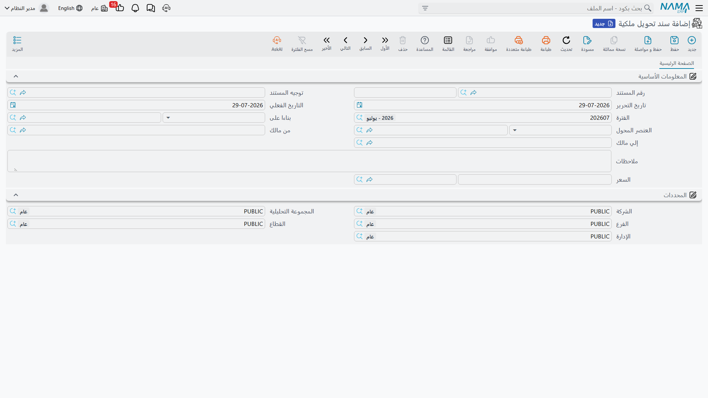

# تحويل الملكية بين الملاك

ليس كل تغيير للمالك بيعًا. فقطعة أرض تنتقل من أب إلى أبنائه. وشركتان في مجموعة واحدة تنقلان عقارًا
بينهما بسعر متفق عليه داخليًا. وشريك يُشترى نصيبه فتتبعه الملكية. ولا ينبغي لأيٍّ من هذه أن يمرّ عبر
دورة البيع — فلا حجز ولا خطة أقساط ولا عمولة ولا تسليم — ومع ذلك يجب أن تنتقل الملكية وأن يُثبَت
قيد.

ولهذا وُجد سند تحويل الملكية: شاشة واحدة، وأربعة حقول، وقيد واحد.

*العقارات و الممتلكات > المستندات > سند تحويل ملكية*

## ماذا على الشاشة

المستند قصير عن قصد:

| الحقل | ما فائدته |
|---|---|
| المستند المصدر | عقد البيع أو عقد البيع الافتتاحي الذي وضع العقار في يد المالك الحالي |
| العقار المحوَّل | العقار الذي تنتقل ملكيته — **قطعة أرض** أو **بلوك** أو **وحدة** |
| **من مالك** (From Owner) | من يحمل الملكية اليوم |
| **إلي مالك** (To Owner) | من سيحملها بعد هذا المستند |
| السعر والعملة | سعر التحويل المتفق عليه |

وحقلا المالك كلاهما لا يعرضان إلّا الأطراف التي فيها دور **المالك** مُعلَّم — انظر
[الملاك والمشترون وبنود التعاقد القياسية](/ar/modules/realestate/properties/realestate-owners-and-contract-clauses.md)
إن كان الطرف الذي تريده غائبًا عن القائمة.

### دع المستند المصدر يملأ النموذج

يمكنك كتابة الحقول الأربعة بيدك، لكن الطريق السريع أن تبدأ من **المستند المصدر**. اختر عقد البيع
الذي باع العقار أصلًا فتملأ الشاشة نفسها: يُؤخذ العقار المحوَّل من ذلك العقد — قطعته أو بلوكه —
ويصل "من مالك" و"إلي مالك" والسعر والعملة مملوءة من العقد نفسه. ثم تغيّر "إلي مالك" إلى من يستلم
الملكية فعلًا، وتعدّل السعر إلى ما اتُّفق عليه اليوم.

وإن تخطّيت المستند المصدر واخترت **العقار المحوَّل** أولًا، فإن حقلَي المالك يأخذان قيمتهما الافتراضية
من مالك العقار الحالي، وتكتب أنت "إلي مالك". وكلا الطريقين ينتهي إلى المكان نفسه؛ البدء من المستند
المصدر يوفّر الكتابة فحسب ويضمن أنك تحوّل الشيء الذي بيع فعلًا.

## ماذا يحدث عند الاعتماد

شيئان، بهذا الترتيب.

**1. تُعاد كتابة ملكية العقار.** يفتح النظام العقار المحوَّل ويضع **إلي مالك** في مالكه الأصلي، ويضع
**سعر** المستند في سعره، ثم يحفظه. ومن تلك اللحظة يعرض العقار الطرف الجديد بوصفه مالكه أينما ظهر —
على شاشته، وفي شاشات القوائم، وفي صفحة السجلات المرتبطة للمالك.

**2. يُسجَّل التحويل في الأستاذ.** ينشئ المستند سطرًا مدينًا وسطرًا دائنًا، كلاهما بسعر التحويل بعملة
المستند، مع **من مالك** في جانب المورد و**إلي مالك** في جانب العميل، وملاحظات المستند بيانًا للقيد.
وكما في كل أثر محاسبي في نما، يُنشأ هذا القيد بوصفه طلب أعمال يُعالَج في الخلفية؛ فإن أخفق أُعيدت
معالجته من شاشة قائمة طلبات الأعمال (قائمة المزيد ← إعادة المعالجة / إعادة الاعتماد).

أمّا الحسابات التي يصيبها السطران فتأتي من [توجيه](/ar/modules/realestate/document-terms/realestate-terms-other.md)
المستند نفسه. فصفحة الأثر الوحيدة فيه تحمل جانبَي المدين والدائن لسعر التحويل — الحسابات ومصدر الذمة
والمحددات لكل جانب. ولا بد من ضبط الجانبين معًا حتى يُنتَج القيد.

::: info قطع الأراضي والبلوكات تُعاد كتابتها، والوحدة لا
إعادة كتابة الملكية الموصوفة في الخطوة الأولى تنطبق على **قطع الأراضي والبلوكات**، حيث يعيش المالك
والسعر على السجل مباشرةً. أمّا وحدة الاستثمار العقاري فتتتبّع ملكيتها بطريقة أخرى — عبر مشتريها
وعقودها لا عبر مالك وسعر يمكن استبدالهما — ولذلك فإن تحويل وحدة يسجّل العملية وينتج قيدها، ويترك
حقلَي المالك والسعر في الوحدة كما كانا. فإن احتجت أن تُظهر الوحدة نفسها الطرف الجديد، فافعل ذلك على
شاشة الوحدة بعد اعتماد سند التحويل.
:::

## المثال العملي

قطعة الأرض **LX-04** في البلوك 3 من مجمّع النخيل بيعت في مارس 2024 إلى **المالك (أ)** بمليون على عقد
بيع عادي. وبعد سنة يحوّل المالك (أ) الملكية إلى **المالك (ب)** بمبلغ **1,200,000**.

1. افتح سند تحويل ملكية جديدًا واختر عقد بيع مارس 2024 مستندًا مصدرًا. تظهر القطعة LX-04 والمالك (أ)
   في "من مالك" والمالك (أ) في "إلي مالك" والمبلغ 1,000,000.
2. غيّر **إلي مالك** إلى المالك (ب) و**السعر** إلى 1,200,000.
3. اعتمد.

تعرض القطعة LX-04 الآن **المالك (ب)** مالكًا أصليًا و1,200,000 سعرًا لها. ويُعالَج قيد واحد بمبلغ
1,200,000، المالك (أ) في جانب المورد والمالك (ب) في جانب العميل، على الحسابات المسمّاة في توجيه سند
التحويل. أمّا **حالة قطعة الأرض** فلم تُمَسّ — كانت مباعة قبل هذا المستند وما زالت مباعة؛ الذي تغيّر
هو *من* يملكها.

## أين تظهر التحويلات بعد ذلك

لست مضطرًا للبحث في قائمة المستندات. فكل تحويل يظهر على العقار الذي نقله:

- **البلوك** يسرد تحويلاته في صفحة **السجلات المرتبطة**؛
- **قطعة الأرض** لها صفحة مخصصة لها باسم **سندات تحويل ملكية**.

وبينهما، ومع صفحة السجلات المرتبطة للطرف نفسه، تصير سلسلة حيازة القطعة كاملةً مقروءة من أي طرف بدأت.

## إلى أين بعد ذلك

- [كيف يُمثَّل العقار في النظام](/ar/modules/realestate/properties/realestate-estate-model.md) — ماذا
  تعني حقول المالك والمالك الأصلي والمشتري على العقار.
- [عقد البيع](/ar/modules/realestate/sales/realestate-sales-contract.md) — المستند الذي وضع العقار في
  يد مالكه الحالي، والطريق المعتاد لتغيّر الملكية.
