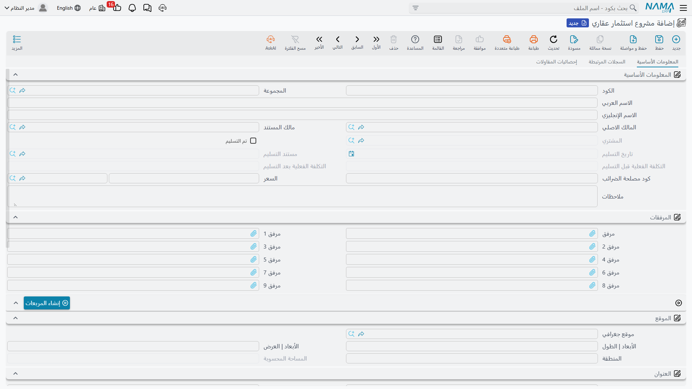
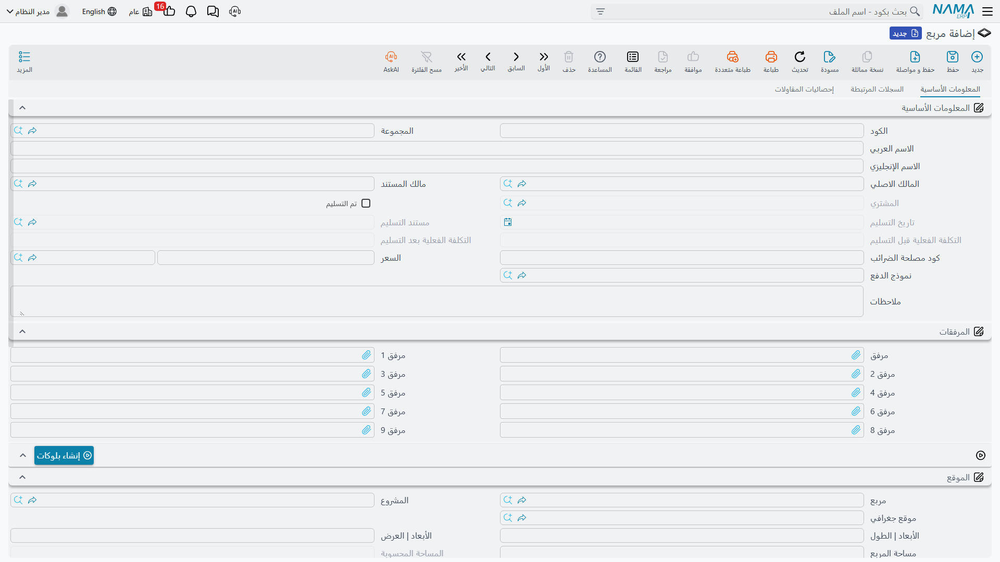
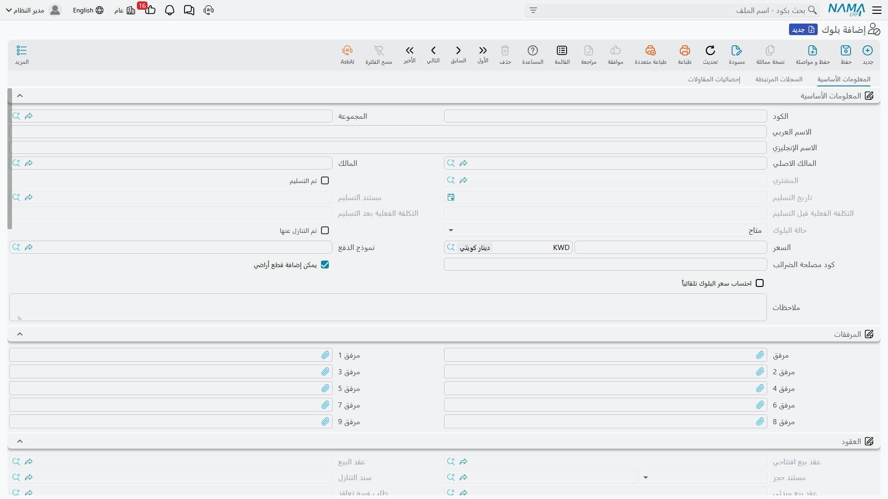
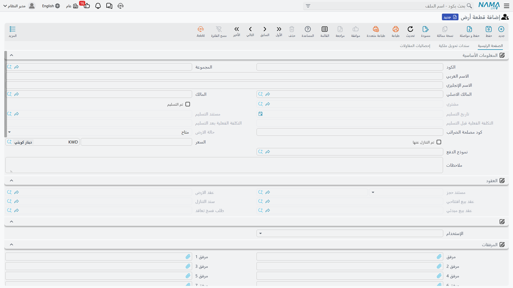

# المشاريع والمربعات والبلوكات وقطع الأراضي

شركة تقسيم الأراضي لا تُدخل محفظتها قطعةً قطعة. إنها تشتري أو تطوّر مساحة من الأرض، ثم تقسّمها إلى
قطاعات، ثم تقسّم القطاعات إلى بلوكات، ثم تقسّم البلوكات إلى قطع — ونظام نما يتيح لك بناء السجلات
بالطريقة نفسها، من الأعلى إلى الأسفل، بزر واحد عند كل مستوى يُنشئ لك المئة سجل التالية.

تغطّي هذه الصفحة جانب الأراضي من شجرة العقارات. وإن لم تكن قد قرأت
[كيف يُمثَّل العقار في النظام](/ar/modules/realestate/properties/realestate-estate-model.md) بعد،
فاقرأها أولًا: مؤشرات الإتاحة وقواعد التتابع الموصوفة هناك هي ما يجعل بقية هذه الصفحة مفهومة.

والمثال العملي يسري في الصفحة كلها: **مجمّع النخيل**، وهو تطوير مقسّم إلى **المربع (أ)** و**المربع
(ب)**، حيث يضم المربع (أ) **البلوك 3**، والبلوك 3 مقسّم إلى **40 قطعة مساحة كل منها 400 م²**.

## بناء الشجرة بأربعة أزرار

كل مستوى يحمل إجراءً يولّد المستوى الذي يليه، وهي تتسلسل في اتجاه واحد:

```
مشروع  ──إنشاء المربعات──►  مربع  ──إنشاء بلوكات──►  بلوك
                                                       ├──إنشاء أراضي──►  قطعة أرض
                                                       └──(إنشاء المباني)──►  مبنى
```

وكل هذه المولّدات تسأل الأسئلة الأربعة نفسها، فتعلُّم واحد منها تعلُّم لها جميعًا:

| السؤال | ما الذي يفعله | لقطع البلوك 3 |
|---|---|---|
| العدد | كم سجلًا يُنشأ | 40 |
| البادئة | النص الذي يتصدّر كل كود | `LX-` |
| طول اللاحقة | عدد الخانات التي يُكمَّل بها الرقم | 2 |
| الرقم الأول | من أين يبدأ الترقيم | 1 |

هذه الإجابات تُنتج `LX-01` حتى `LX-40` دفعة واحدة. وكل سجل جديد يُنشأ وهو يشير بالفعل إلى أبيه، ويرث
منه المشروع والمربع والعنوان والمحددات التحليلية، فتخرج القطع الأربعون من المولّد وهي تعرف أنها في
البلوك 3 من المربع (أ) في مجمّع النخيل.

::: tip احفظ أولًا
أزرار التوليد تعمل على سجل محفوظ. أنشئ المشروع، واحفظه، ثم ولّد مربعاته.
:::

## مشروع استثمار عقاري — قمة الشجرة

*العقارات و الممتلكات > الملفات > مشروع استثمار عقاري*

سجل واحد لكل تطوير عقاري. وكل ما تحته يشير إليه، وهو ما يجعل المشروع المكان الطبيعي لطرح أسئلة
المحفظة كلها: كم بيع من مجمّع النخيل، وكيف تبدو حركات الإيجار، وماذا تقول إحصائيات تكاليف المقاولات.



إلى جانب الحقول التي يحملها كل عقار، يحمل المشروع سعرًا بعملته و**طولًا** و**عرضًا** و**المساحة**
التي ينتجانها. ومجموعة **الموقع** (Location And Area) هي حيث تُدخلها، ومجموعة **العنوان** تحتها تحمل
العنوان البريدي الكامل والحدود الأربعة، وكلاهما يُنسخ نازلًا إلى كل ما تولّده من هنا.

أمّا الصفحة الثانية، **السجلات المرتبطة**، فهي التي ستعيش عليها فعلًا: قوائم منفصلة لمربعات المشروع
وبلوكاته ومبانيه ووحداته وقطع أراضيه، إضافةً إلى حركات الإيجار وحركات البيع. وتظهر صفحة ثالثة
لإحصائيات تكاليف المقاولات حين تكون وحدة المقاولات جزءًا من تنصيبك.

والإجراء الوحيد على الشاشة هو **إنشاء المربعات** (Generate Square).

## مربع — الطبقة الوسطى الاختيارية

*العقارات و الممتلكات > الملفات > مربع*

المربع يجمع البلوكات. وهو اختياري فعلًا — كثير من التنصيبات تنتقل من المشروع إلى البلوك مباشرةً —
لكنه يستحق وجوده بمجرد أن يصبح التطوير على مراحل أو يُباع بالقطاعات، لأنه يمنحك مستوًى تُقرّر عنده
وتحمل عنده عنوانًا.



للمربعات مجموعة السعر والطول والعرض والمساحة نفسها التي للمشروع، ولها كذلك **المساحة المحسوبة** التي
تجمع مساحات قطع الأراضي التي تحتها، ويُعاد حسابها كلما حُفظت واحدة منها. وصفحة السجلات المرتبطة تسرد
بلوكات المربع بحالتها ومساحتها وسعرها جنبًا إلى جنب، وهي أسرع إجابة عن "كم بقي قابلًا للبيع في
المربع (أ)".

والإجراء هنا هو **إنشاء بلوكات** (Generate Blocks). والبلوكات المولَّدة تصل ومشروع المربع وعنوانه
ومالكه الأصلي ومحدداته مملوءة فيها.

## بلوك — المستوى الذي يحتوي نفسه

*العقارات و الممتلكات > الملفات > بلوك*

البلوك أطرف سجل في هذه الصفحة، لسببين: يمكن أن يحتوي *نفسه*، وهو المستوى الذي يحتسب النظام عنده كم
بيع من العقار.



### يقبل عناصر — القاعدة التي تحدد ما يجوز أن يحمله البلوك

يُنشأ البلوك الجديد و**يقبل عناصر** (Accepts Elements) مُشغَّل. وهذا المفتاح وحده يحدد دور البلوك:

- **يقبل عناصر مُشغَّل** — البلوك *طرفي*. يجوز أن يحمل قطع أراضٍ، ولن يعرض عليك مُنتقي البلوك في
  قطعة الأرض إلا البلوكات الطرفية.
- **يقبل عناصر مُطفَأ** — البلوك *فرعي*. يجوز أن يحمل بلوكات تابعة، لكن قطعة أرض تُحفظ عليه تُرفض
  برسالة "This block Can not contains Lands".

وإن حاولت وضع بلوك تابع تحت بلوك طرفي رُفض الحفظ على حقل البلوك الأب برسالة "The Parent block Can
not be Aleaf". والقاعدة سهلة الحفظ حين ترى نصفيها معًا: **القطع تتبع البلوكات الطرفية، والبلوكات
التابعة تتبع البلوكات الفرعية.** وكلا النوعين يجوز أن يحمل مبانيَ أيضًا.

في المثال العملي، البلوك 3 بلوك طرفي، ولذلك أمكن تقسيمه إلى 40 قطعة. ولو احتاج مجمّع النخيل أن
يُقسَّم البلوك 3 أولًا إلى 3أ و3ب و3ج، لكان **يقبل عناصر** مُطفأً في البلوك 3، ولكان كل من 3أ و3ب
و3ج هو الطرفي.

ويحتفظ النظام خلف الكواليس بمسار هرمي ورقم مستوى، فيعرف البلوك دائمًا كل ما ينحدر منه مهما تعمّق
التداخل. وإن نقلت بلوكًا أُعيد حساب مستويات كل ما تحته.

### احتساب سعر البلوك تلقائياً

**احتساب سعر البلوك تلقائياً** (Price Is Calculated) يحوّل سعر البلوك إلى مجموع جارٍ. فمع تشغيله
تضيف كل قطعة تُحفظ سعرها إلى البلوك، ويُعدَّل المجموع إن انتقلت القطعة أو تغيّر سعرها. ومع إطفائه
يبقى سعر البلوك هو ما كتبته أنت.

وإلى جواره تجمع **المساحة المحسوبة** مساحات قطع البلوك — 40 × 400 م² = 16,000 م² للبلوك 3 — بينما
تبقى **المساحة** الخاصة بالبلوك هي ما يقوله الطول × العرض عن قياس البلوك نفسه.

### تفاصيل الملاك — أكثر من مالك لشيء واحد

يحمل كل من البلوك وقطعة الأرض جدول **تفاصيل الملاك** (Owner Details): سطر لكل مالك بنسبته وملاحظة.
وبه تسجّل الملكية المشتركة للأرض نفسها، بمعزل عن **المالك الاصلي** الواحد في الرأس. أمّا الملكية
المشتركة على الجانب **المحاسبي** فتُعالَج بطريقة أخرى، عبر مالك من نوع مجموعة — انظر
[الملاك والمشترون وبنود التعاقد القياسية](/ar/modules/realestate/properties/realestate-owners-and-contract-clauses.md).

### أزرار البلوك

| الزر | ما يفعله |
|---|---|
| **إنشاء أراضي** (Generate Lands) | أسئلة المولّد الأربعة؛ يُنشئ القطع تحت هذا البلوك |
| *(إنشاء المباني)* | الأسئلة الأربعة نفسها **إضافةً إلى** مفتاحين: إضافة مسجد وإضافة جراج؛ يُنشئ مبانيَ تحت البلوك بهذين المؤشرين، ومالكها هو المالك الأصلي للبلوك |
| **حجز** (Reserve) | يرفض إلّا إذا كان البلوك **متاح**؛ يفتح سند حجز جديدًا في نافذة منبثقة، وفيه هذا البلوك ومالكه وسعره وملاحظاته |
| **بيع** (Sell) | يرفض إن كان البلوك **مباعة**؛ يفتح عقد بيع جديدًا مملوءًا بالطريقة نفسها |
| **اتاحة للبيع** (Revert Sale) | يعمل فقط على بلوك حالته **مباعة**؛ يعيد الحالة المشتقّة والتجاوز اليدوي معًا إلى **متاح** |

وحجز البلوك أو بيعه هو التتابع في صورته العملية: ينزل الحجز أو البيع إلى بلوكاته التابعة وقطعه
ومبانيه وطوابق تلك المباني ووحداتها، كل ذلك دفعة واحدة.

## قطعة أرض — الشيء الذي يُباع

*العقارات و الممتلكات > الملفات > قطعة أرض*

قطعة مفردة داخل بلوك طرفي: أبعاد، وأربعة حدود مسمّاة، ونوع استخدام، وسعر. وهذا هو ما تبيعه شركة
التقسيم فعلًا.



حقول القطعة الخاصة قليلة. **الإستخدام** (Land Usage Type) يصنّفها **سكني** (Housing) أو **تجارى**
(Commercial) أو **سكني تجاري** (Housing Commercial)، مع أربع عشرة خانة إضافية لتصنيفات محلية.
و**الطول** و**العرض** ينتجان **المساحة** وأنت تكتب. والسعر يحمل عملته. وما عدا ذلك على الشاشة إمّا
موروث من نموذج العقار وإمّا تملؤه المستندات: فمجموعة **العقود** تجمع سندات الحجز والبيع والبيع
الافتتاحي والتنازل والعقد المبدئي التي مسّت هذه القطعة، فيصير تاريخها التجاري كله في نظرة واحدة.

وتبدأ **حالة قطعة الأرض** حياتها **متاح**، ثم تحرّكها المستندات: عقد البيع يجعلها **مباعة** ويكتب
المشتري في المالك الأصلي للقطعة؛ وسند الحجز يجعلها **محجوز**؛ وقد يعيدها سند التنازل إلى **متاح**
حين يردّ القطعة إلى الشركة. وزر **اتاحة للبيع** (Revert Sale) هو المخرج اليدوي — لا يقبل إلّا قطعة
حالتها **مباعة** حاليًا، ويعيد الحالة المشتقّة والتجاوز اليدوي معًا إلى **متاح**.

وزرّا **حجز** و**بيع** هما نفساهما اللذان على البلوك: يفتحان سند حجز أو عقد بيع في نافذة منبثقة،
مملوءًا بالقطعة وبلوكها ومربعها ومشروعها ومالكها وسعرها وملاحظاتها — وهي أسرع طريقة لبيع قطعة دون
إعادة كتابة شيء.

### ما الذي يتغيّر في مكان آخر عند حفظ قطعة

القطعة صغيرة، لكن اعتماد واحدة منها يمسّ عدة سجلات فوقها:

1. يُعاد حساب **المساحة المحسوبة** للبلوك الأب وللمربع الأب.
2. إن كانت القطعة على أي حال غير **متاح**، يُجبَر البلوك الأب على **غير متاح** — وهذا هو الصعود في
   أبسط صوره.
3. إن كان البلوك الأب يحمل **احتساب سعر البلوك تلقائياً**، يُضاف سعر القطعة إلى سعر البلوك (ويُخصم
   من البلوك الذي غادرته إن كانت قد انتقلت).
4. يُحدَّث موضع القطعة في هرم البلوكات.

::: info المثال العملي من أوله إلى آخره
يُنشأ مجمّع النخيل ويُحفظ، ثم **إنشاء المربعات** بعدد 2 وبادئة `SQ-` يُنتج المربع (أ) والمربع (ب).
وعلى المربع (أ) يُنتج **إنشاء بلوكات** بعدد 5 خمسة بلوكات، ويبقى **يقبل عناصر** مُشغَّلًا في البلوك
3. وعلى البلوك 3 يُنتج **إنشاء أراضي** بعدد 40 وبادئة `LX-` وطول لاحقة 2 ورقم أول 1 القطعَ `LX-01`
حتى `LX-40`. ويُعطى كل قطعة طول 20 وعرض 20، فتخرج مساحة كل منها 400 م² وتبلغ **المساحة المحسوبة**
للبلوك 3 مقدار 16,000 م².

ثم يشتري مشترٍ القطعة **LX-04**. فتصبح حالتها **مباعة**، ويصبح مالكها الأصلي هو المشتري، ويقرأ
البلوك 3 فورًا **غير متاح** — لم يعد قابلًا للبيع قطعة واحدة. ويُوسَم المربع (أ) ومجمّع النخيل
بـ**مباع جزئيا**. أمّا القطع الـ39 الباقية فلم تتأثر وما زالت **متاح** للبيع.
:::

## أين تحطّ التكاليف

كل ما تولّده في هذه الصفحة يحتاج في النهاية أساسًا للتكلفة. فالمطوّر يتحمّل التكلفة على مستوى
المشروع — طرق مجمّع النخيل، وسور المربع (أ) — لكنه يحتاج أن يعرف تكلفة القطعة LX-04. وهذا التوزيع،
و**التكلفة المخصصة** التي يكتبها على كل عقار، مشروح في
[توزيع تكاليف المشروع على العقارات](/ar/modules/realestate/costs/realestate-cost-distribution.md).

وللنصف الرأسي من الشجرة — المباني والطوابق والوحدات والوحدات المجمعة ونماذج الوحدات — انتقل إلى
[المباني والطوابق والوحدات](/ar/modules/realestate/properties/realestate-buildings-floors-and-units.md).
ولطرح قطعة في السوق انظر [دورة بيع العقار](/ar/modules/realestate/sales/realestate-sales-cycle.md).
