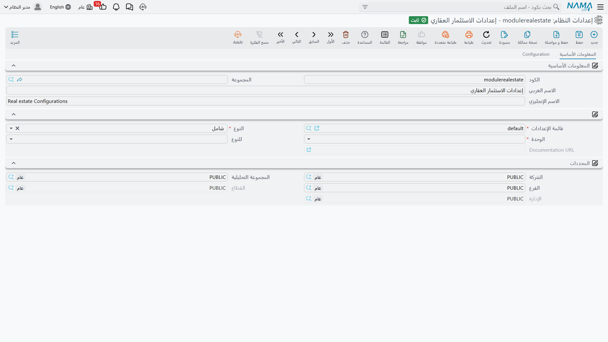

# إعدادات وحدة العقارات

أغلب ما تفعله وحدة العقارات يُقرَّر على مستوى دفتر المستند، أي في توجيه المستند. لكن قرارات قليلة أوسع من ذلك — هل ينتقل المبلغ المدفوع مع العقد حين يُولَّد من مستند سابق، وهل تُحتسب الضريبة ضمن ما يستحقه القسط، وكم فرق تقريب يُسمح به في العقد. هذه تعيش في سجلّ إعدادات واحد للوحدة كلها.

تفتحه من مجموعة **الإعدادات** في قائمة العقارات، أو من **إدارة النظام > الإعدادات > إعدادات النظام** ثم تختار السجلّ الذي كوده `modulerealestate` (**إعدادات الاستثمار العقاري**). وهو صفحة واحدة تضمّ مجموعة من ثمانية خيارات يتبعها ثلاثة جداول.

::: info مجموعة واحدة لكل قاعدة بيانات
يوجد سجلّ إعدادات عقارات **واحد فقط**، وهو يسري على كل شيء. وآلية الإعدادات في نما تسمح عادةً بسجلّ ثانٍ مقصور على شركة أو فرع أو قطاع — لكن وحدة العقارات لا تطلب مطابقة على المحددات أبدًا: كل قراءة فيها هي ببساطة "أعطني إعدادات الوحدة". ولذلك سيُتجاهَل أي سجلّ ثانٍ أضيق. **اضبطه مرة واحدة؛ ولا يوجد تخصيص لكل شركة.**

كما أن الشاشة ليست مقيّدة برخصة فرعية: ما دامت رخصة `realestate` موجودة فالشاشة كاملة أمامك، بما فيها خيارات أجزاء قد لا تكون مرخّصة لديك.
:::

## نقل المدفوع بين المستندات

خياران يجيبان عن السؤال نفسه على جانبي الوحدة: حين يُولَّد عقد من مستند سابق، هل تنتقل معه المبالغ التي دفعها العميل بالفعل؟

**نسخ المدفوع من الأقساط عند عمل عقد بيع بناء على عقد بيع مبدئي** يفعل ذلك في سلسلة البيع. يوقّع المشتري عقدًا مبدئيًا ويدفع عليه قسطين، ثم يُولَّد منه عقد البيع النهائي. فإذا كان الخيار مفعّلًا وصل القسطان إلى العقد الجديد معلَّمين كمدفوعين، وإذا كان مغلقًا — وهو الوضع الافتراضي — بدأ العقد الجديد خاليًا ووجب إعادة تسجيل ما دفعه المشتري فعلًا عليه.

**نسخ المدفوع من الأقساط عند عمل عقد إيجار بناء على عرض سعر** هو الآلية نفسها في جانب الإيجار: الضغط على *إنشاء عقد إيجار* من عرض السعر ينقل المدفوع على العرض إلى العقد المُولَّد.

كلا الخيارين مغلق ما لم تفعّله، فإن كان عملك يُحصّل عربونًا على المستند التمهيدي فعّل الخيار المناسب قبل تحويل أول عقد.

## هل تُحتسب الضريبة ضمن ما يستحقه القسط؟

**اعتبار الضرائب في احتساب صافي الاقساط عند الدفع** يحسم سؤالًا يتسبّب — بغيره — في بلاغات لا تنتهي من نوع "لماذا ما زال هذا القسط يظهر غير مسدَّد؟".

فحين يكون الخيار **مغلقًا** يكون المستحق على القسط هو صافيه، وتبقى الضريبة خارج حساب التحصيل. وحين يكون **مفعّلًا** يصبح المستحق على القسط قيمته *شاملةً* ضرائبه — فيستخدم المتبقي، وسقف "القيمة المدفوعة لا يمكن أن تتجاوز…"، واختبار السداد الكامل، الرقمَ الإجمالي.

اختر أحد الوضعين والتزم به: فثلاثة مواضع مختلفة في النظام تقرأ هذا المؤشر ويجب أن تتفق. وجانب التحصيل من القصة في [كيف يتم تحصيل الأقساط](/ar/modules/realestate/collections/realestate-collection-basics.md).

## كتابة الشيك على العقد

**نسخ الورقة التجارية إلى سطور الدفعات عند عمل سند قبض لورقة مالية شيك بنكي** يفعل ما يقوله: حين يسدّد سند قبض قسطًا على عقد ويكون السند مقابل شيك، يُكتب مرجع الشيك على سطر القسط. وإن أبقيته مغلقًا لم يسجّل سطر القسط سوى المبلغ، ولن يعرف أحد من العقد أي شيك سدّده.

## تاريخ حدّ الترحيل

يحمل كل عقار سلسلة زمنية من قيود حالة الإيجار والحجز — محجوز، مؤجّر، ملغى، مباع — ويرفض النظام التسلسلات غير المنطقية، كإلغاء لا يسبقه شيء. وهذا المدقّق تحديدًا هو ما *لا* تريده وأنت تستورد عشر سنوات من التاريخ لم تُدخَل في نما أصلًا.

حقل التاريخ قرب نهاية المجموعة هو حدّ الترحيل، وما زال عنوانه يظهر بالإنجليزية **Do Not Validate Estate Before** حتى على الشاشة العربية. اضبطه على تاريخ بدء التشغيل، فيتجاوز المدقّق أي زوج من القيود يسبق أوّلُه ذلك التاريخ، وبذلك تُقبل العقود المستوردة بينما يبقى كل ما أُدخل في نما بعدها تحت الرقابة.

ولأن الخطأ فيه يُعطِّل تدقيقًا حقيقيًا في صمت، يعامله النظام كحقل حرج وينبّهك عند تغييره أو مسحه بعد ضبطه. وأهمّ مواضعه [بدء التشغيل](/ar/modules/realestate/opening/realestate-opening-balances.md)، وهو أيضًا المفتاح خلف تسلسل حالة إيجار العقار الموصوف في [دورة التأجير](/ar/modules/realestate/rent/realestate-rent-cycle.md).

## اتجاه احتساب وديعة الصيانة

في عقد البيع لوديعة الصيانة نسبة وقيمة، ولا بدّ أن يكون أحدهما هو الحقل الأصل.

**احتساب نسبة وديعة الصيانة من قيمة الوديعة مع الحفظ** يقرّر أيّهما. فإذا كان مغلقًا — وهو الافتراضي — كانت النسبة هي ما تكتبه وتُحتسب القيمة من السعر (أو من السعر بعد خصم الرأس إذا كان خيار *وديعة الصيانة بعد احتساب الخصم* مفعّلًا على العقد). وإذا فعّلته انعكست العلاقة: تكتب المبلغ الذي اتفقت عليه فعلًا فيشتقّ النظام النسبة منه. فعّله للعملاء الذين يتفقون على مبلغ صيانة ثابت لا على نسبة. والوديعة نفسها مشروحة في [ودائع الصيانة وصناديق الصيانة](/ar/modules/realestate/maintenance/realestate-maintenance-deposits-and-funds.md).

## إبقاء السعر المكتوب يدويًا كما هو

في الوضع الافتراضي يكون سعر العقد حقلًا محسوبًا: كل إعادة احتساب تكتب فوقه ناتجَ مساحة الوحدة × سعر المتر + مساحة الحديقة × سعر متر الحديقة + قيمة التمييز + قيمة الجراج. وهذا صحيح لمطوّر يبيع من قائمة أسعار، وخاطئ لمن يتفاوض على مبلغ مقطوع.

الخيار الأخير في المجموعة — الخاص بعدم احتساب سعر الوحدة من مساحة الوحدة والحديقة — يوقف هذه الكتابة فوق السعر، فيبقى السعر المكتوب يدويًا على العقد بعد الحفظ حتى لو كانت المساحات وأسعار المتر مملوءة. (عنوان هذا الخيار مُولَّد آليًا من اسم الحقل، فقد تختلف صياغته قليلًا عمّا هو مكتوب هنا.) أما نسبتا التمييز والجراج فتُحتسبان في الحالتين.

## حدّ فرق التقريب — الخيار الذي يقابله الجميع

**السماح بحفظ العقود إذا كان الفرق بين الصافي و الأقساط أقل من** هو أول خيار يتعلّمه فريق الدعم، لأنه ما يقف بين عقد صحيح وحفظ يرفض.

يتحقّق عقد البيع عادةً من أن مجموع الأقساط يساوي المبلغ المتبقّي. خذ الشقة 12 بمبلغ **900,000** **بلا دفعة مقدمة**، مقسّمة على **7 أقساط متساوية**. ناتج القسمة 128,571.4285…، ويقرّبه النظام إلى **128,571.43**، ومجموع سبعة منها **900,000.01**. صارت الأقساط تتجاوز الصافي بقرش واحد، وتدقيقٌ صارم تمامًا كان سيرفض عقدًا سليمًا.

هذا الحقل هو سماحية ذلك التدقيق، وهو يُشحن بقيمة **0.05**، فيمرّ فرق القرش في صمت. ارفعه إذا كانت قواعد التقريب لديك أخشن، واضبطه على **0** ليصبح التدقيق تامًّا — عندئذ يفشل العقد أعلاه برسالة عدم تساوي مجموع الأقساط مع المتبقي حتى يعدّل أحدهم سطرًا إلى 128,571.42.

::: tip التدقيق نفسه يمكن إيقافه في التوجيه
السماحية لا تعني شيئًا إلا والتدقيق يعمل. أما تشغيله من أصله فخيار في توجيه عائلة البيع — انظر [توجيهات مستندات البيع](/ar/modules/realestate/document-terms/realestate-terms-sales.md). فالسماحية هنا مقياس حساسية على مستوى الوحدة، والتوجيه هو مفتاح التشغيل والإيقاف.
:::

## الجدول الأول — المستندات

جدول **المستندات** قائمة قصيرة بأنواع المستندات: عقود البيع المبدئية، وسندات التنازل، وعروض أسعار البيع، وسندات الغرامة، وعروض أسعار الإيجار وإلغاؤها، وعقود البيع الافتتاحية، ومستندات الحجز، وعقود البيع، وعقود الإيجار، وعقود الإيجار الافتتاحية.

وإدراج نوع هنا يُظهر **أعمدة الأوراق التجارية** داخل جدول أقساط ذلك المستند — كود الورقة ونوعها، ودفتر الأوراق التجارية، والمبلغ والعملة، وبنك العميل والحساب البنكي، والمستفيد، ورقم الشيك، والمُصدِر، وتاريخ الاستحقاق، والموقّع، وغيرها. وبملء هذه الأعمدة يستطيع العقد إنشاء الشيكات مباشرة من سطور أقساطه بدل إدخالها يدويًا في مكان آخر.

::: warning هذا الجدول يغيّر تصميم الشاشات لا السلوك
إضافة نوع مستند هنا تغيير في **تصميم الشاشة**. والأعمدة الجديدة لا تظهر إلا بعد إعادة توليد تصاميم الشاشات وإعادة فتح الشاشة — لذلك قد يضيف مسؤول النظام سطرًا ثم ينظر إلى العقد فيستنتج خطأً أن شيئًا لم يحدث.
:::

## الجدول الثاني — السياسة الضريبية

هذا هو المرجع الضريبي للوحدة كلها، وهو الجزء الذي يلتبس على الناس أكثر من غيره في إعداد العقارات، لذا تستحقّ الأولوية أن تُقال صراحة:

> **التوجيه يغلب، وهذا الجدول احتياطي.** فجانبا البيع والإيجار ينظران أولًا إلى جدول الضرائب على توجيه المستند نفسه، ولا يعودان إلى الجدول هنا إلا إذا كان جدول التوجيه **فارغًا**.

كل سطر سياسة تُطابَق بنوع القسط، ونموذج الوحدة، والنوع (أو قائمة الأنواع)، ومدى تاريخي من "تطبق من" إلى "تطبق الي"، ويعطي **ضريبة مبيعات 1** و**ضريبة مبيعات 2** كنسبتين. ومؤشرا *ضريبة خصم* يجعلان الضريبة مستقطعة لا مضافة، بينما يجعل **حساب الضريبة من السعر الأساسي** أساس الضريبة سعرَ العقد الأساسي بدل صافي السطر.

عمليًا: ضع السياسة العامة هنا مرة واحدة، ولا تضف جدول ضرائب إلى توجيه بعينه إلا حين يحتاج دفتر معيّن نسبة مختلفة فعلًا. وانتبه: سطر واحد في جدول ضرائب التوجيه يُلغي عمل هذا الجدول كله بالنسبة لذلك الدفتر — بما فيه السطور التي كنت تظنّها ما زالت سارية.

## الجدول الثالث — أنواع الأقساط المستثناة

الجدول الأخير قائمة بأنواع الأقساط، وهو موجود ليمنع تدقيق التوازن الموصوف أعلاه من الوقوف في طريقك.

فالقسط الذي يُدرَج نوعه هنا **يُستثنى من إجمالي أقساط العقد**، وهو الرقم الذي يقارنه تدقيق "الصافي مقابل الأقساط". لكنه يظلّ محسوبًا في كل ما عدا ذلك — في إجمالي المدفوع والمتبقي والخصومات والغرامات وإجمالي المستحق — فيبقى العميل مطالَبًا به ويُحصَّل منه كالمعتاد.

وهذا ما يتيح لك إضافة رسم مرافق أو رسم تسجيل أو قسط خدمة إلى العقد دون أن يرفض العقد الحفظ لأن أقساطه لم تعد تساوي سعره. ونوع القسط مطلوب في كل سطر، والتكرار مرفوض. أما أقساط تكلفة الصيانة فهي مستثناة من الإجماليات دائمًا سواء أُدرجت هنا أم لا.

أنواع الأقساط نفسها ومعنى كل نوع على الخطة في [إنشاء خطة الأقساط](/ar/modules/realestate/sales/realestate-installment-plans.md)، وكيفية توجيه كل نوع إلى حساباته في [كيف تعمل توجيهات مستندات العقارات](/ar/modules/realestate/document-terms/realestate-terms-basics.md).
