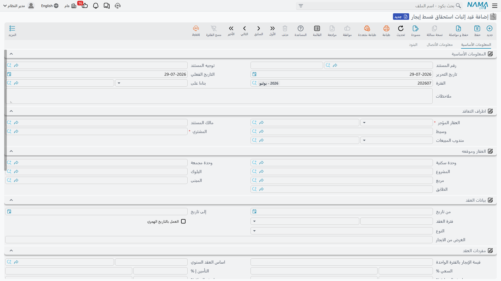
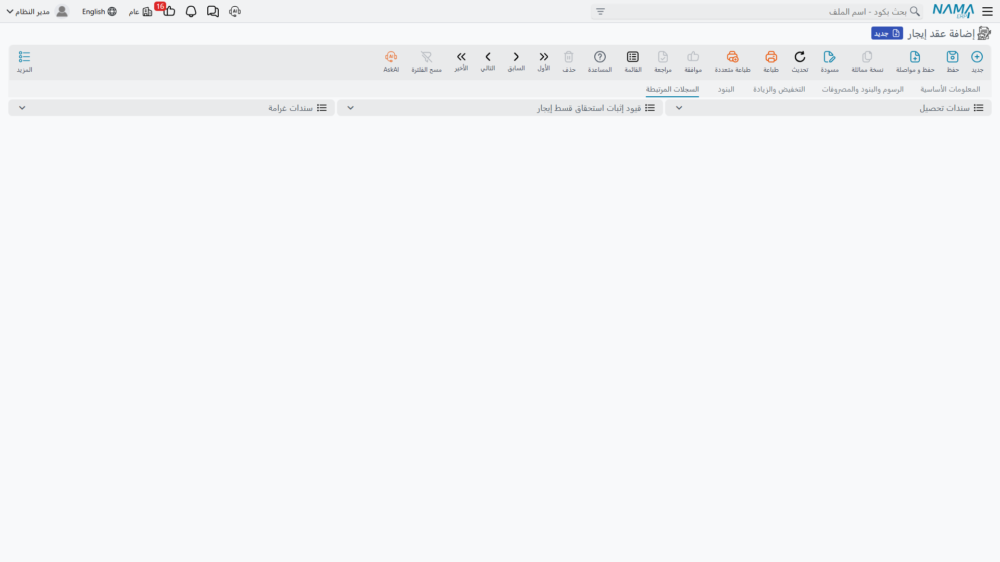

# قيود إثبات استحقاق أقساط الإيجار

عقد الإيجار مستند واحد بتاريخ واحد. عقد ثلاث سنوات مُوقَّع في 1 مارس 2026 تاريخه 1 مارس 2026، ولو
توقفت القصة عند هذا الحد لسقطت إيرادات الثلاث سنوات كلها في دفاتر 2026. والمحاسبة لا تعمل هكذا:
الإيجار يُكتسب شهراً بعد شهر، ولكل سنة نصيبها.

**قيد إثبات استحقاق قسط إيجار** هو حل النظام لذلك. يأخذ الجدول الذي أنتجه العقد ويقطعه إلى مستند لكل
فترة استحقاق، كلٌّ منها بتاريخ اليوم الذي يصبح فيه المبلغ مستحقاً فعلاً، وهذا المستند — لا العقد — هو
الذي يعترف بإيراد الفترة. اعتبره قيد إثبات الاستحقاق الآلي الذي يحوّل الإيجار المؤجل إلى إيراد إيجار
فترةً فترة. وهو في الوقت نفسه الفاتورة الضريبية لفترته، فالفاتورة الإلكترونية لربع من الإيجار تصدر من
هنا.

سنتابع عقد المحل نفسه المستعمل في بقية صفحات هذا القسم: برج النخيل، من 1 مارس 2026 إلى 28 فبراير
2029، بأساس سنوي 120,000 يُسدَّد ربع سنوياً.

## يُنشَأ آلياً ولا يُكتب يدوياً

هذه أول نقطة يجب ضبطها، ومنها يأتي أكثر اللبس في هذا الجزء من الوحدة. للقيد بند في القائمة وشاشة
تحرير كاملة، لكنك **لا تُنشئ سجلات من هناك**. النظام هو الذي يُنشئها، من العقد، ضمن عملية اعتماد
العقد.

يعمل التوليد مع كل اعتماد وإعادة اعتماد للعقد، سواء كان
[عقد إيجار](/ar/modules/realestate/rent/realestate-rent-contract.md) عادياً أو
[عقد إيجار افتتاحي](/ar/modules/realestate/opening/realestate-opening-rent-contracts.md). وضبطه كله
يأتي من [توجيه](/ar/modules/realestate/document-terms/realestate-terms-rent.md) العقد نفسه:

- **إنشاء قيد إثبات استحقاق قسط إيجار أليا** هو المفتاح الرئيسي. إذا تُرك بلا تأشير فلا توجد قيود
  استحقاق أصلاً، ويكون قيد العقد نفسه هو كل المحاسبة التي ينتجها التأجير.
- **نوع فترة قيد إثبات استحقاق الأقساط** يحدد كيف تُجمَّع الأقساط: **يومي** أو **شهري** أو **سنوي**.
  وتركه فارغاً يعني **يومي**، لا «بلا تجميع».
- **دفتر قيد إثبات استحقاق قسط الإيجار المنشأ** و**توجيه قيد إثبات استحقاق قسط الإيجار المنشأ**
  يسميان الدفتر والتوجيه اللذين تُنشأ بهما المستندات المولَّدة.

::: info الدفتر والتوجيه يأتيان من العقد لا منك
لأنك لا تفتح مستند استحقاق فارغاً أصلاً، فأنت لا تختار له دفتراً ولا توجيهاً. كلاهما يُؤخذ من الحقلين
أعلاه في توجيه **العقد**. وهناك أيضاً تُضبط حسابات قيد الاستحقاق نفسه — فإذا وصلت قيود الاستحقاق إلى
حسابات غير صحيحة فموضع البحث هو **توجيه قيد إثبات استحقاق قسط الإيجار المنشأ**، لا أي حقل على العقد.
:::

والمستندات المولَّدة معروضة على العقد نفسه في صفحة *السجلات المرتبطة*، وهي أسرع طريقة لرؤية ما أنتجه
الاعتماد:

## كيف يُقطَّع الجدول

يجمّع النظام سطور أقساط العقد حسب الفترة المختارة — يوم أو شهر أو سنة — ويُنشئ مستنداً لكل مجموعة
بترتيب التواريخ. وتاريخ المستند هو تاريخ المجموعة، مضبوطاً على بداية الشهر في التجميع **الشهري** وعلى
بداية السنة في **السنوي**. وتُنسخ سطور المجموعة كما هي: القيمة والخصم والغرامة والصافي وتاريخ
الاستحقاق وكود القسط والنوع ونوع المصروف والضرائب.

سطور عقد المحل تقع في 1 مارس و1 يونيو و1 سبتمبر و1 ديسمبر من كل سنة تعاقدية. فمع التجميع **الشهري**
تخرج اثنا عشر مستند استحقاق على عمر العقد، أربعة في السنة. وأولها بتاريخ 1 مارس 2026 يحمل إيجار الربع
30,000 مع سعي 6,000 وتأمين 12,000 وأول سطر صيانة، لأن الأربعة تقع في الشهر نفسه.

::: tip التجميع يجمع ولا يقسّم
الجدول ربع السنوي المجمَّع شهرياً يظل يعترف بإيجار ربع كامل في مستند واحد؛ الأشهر الثلاثة لا تُوزَّع.
فإذا أردت اعترافاً شهرياً بالإيراد فالجدول نفسه يجب أن يكون شهرياً. اختر دورية الأقساط على العقد،
واستعمل نوع فترة القيد لتحديد عدد المستندات التي تُحزَم فيها هذه الأقساط فقط.
:::

وإعادة التوليد آمنة بحكم تصميمها. عند إعادة الاعتماد يستعمل النظام المستند الذي يشير إليه السطر
بالفعل، أو مستنداً قائماً لهذا العقد بالتاريخ نفسه، قبل أن يُنشئ شيئاً جديداً؛ والمجموعة التي لم يعد
لها سطور يُحذف مستندها، وكذلك أي مستند قديم لم تعد له حاجة. وإلغاء العقد أو حذفه يحذف كل قيود
الاستحقاق المولَّدة منه، كما أن قيود الاستحقاق لا تمنع حذف العقد.

### نقل استحقاق قسط إلى تاريخ آخر

أحياناً لا يتطابق تاريخ استحقاق المبلغ مع الفترة التي يخصها الإيراد — ربع يبدأ في 1 يناير لكنه يغطي
ديسمبر المنتهي، أو قسط أُجِّل تاريخ استحقاقه للمستأجر. عمود **التاريخ الفعلي لقيد الاستحقاق** في جدول
الايجارات على العقد هو المخرج: املأه على السطر فيستعمل التجميع ذلك التاريخ بدل تاريخ الاستحقاق،
فينضم استحقاق السطر إلى مستند آخر **دون** أن يتحرك تاريخ الاستحقاق — ومن ثمّ دون أن يتحرك التحصيل.
واتركه فارغاً فيُستعمل تاريخ الاستحقاق، وهو ما يحدث في كل السطور تقريباً.

### المراجعة قبل الاعتماد

خيار **حفظ قيد إثبات استحقاق قسط الإيجار المنشأ كمسودة** في توجيه العقد يترك المستندات المولَّدة
مسودات بدل اعتمادها فوراً، فيتمكن المحاسب من مراجعة استحقاقات سنة كاملة قبل وصولها إلى الأستاذ.
وبدونه يُعتمد كل مستند فور توليده وتُعالَج محاسبته مباشرة. والمستند الذي سبق اعتماده لا يُعاد إلى حالة
المسودة عند توليد لاحق.

## لماذا يهم الفصل: التوجيه نفسه بتاريخ مختلف

يمر قيد الاستحقاق بمنطق المحاسبة نفسه الذي يمر به العقد، وهذا بالضبط هو المقصود. فقيد العقد يقسّم
أقساطه إلى **إيرادات** للسطور المستحقة داخل السنة المالية للمستند و**إيرادات مقدمة** للسطور المستحقة
في سنوات لاحقة، والمقارنة تجري بتاريخ **العقد** أي بداية التأجير. وقيد الاستحقاق يجري التقسيم نفسه،
لكن تاريخه هو تاريخ الاستحقاق، فيقارن كل مستند بسنته **هو**. فالإيجار الذي كان إيراداً مقدماً يوم
توقيع العقد يصبح إيراداً معترفاً به في المستند الذي يحمله.

ولهذا فصفحات توجيه قيد الاستحقاق قليلة عن قصد: تعرض إجمالي العقد والإيرادات والإيرادات المقدمة والقيمة
المدفوعة وسطور إعدادات التوجيه والسياسة الضريبية في صفحتها الأولى، وتأثيرات الضريبة في الثانية. أما
صفحات التأمين والسعي والصيانة والمياه وعمولة التحصيل فلا تظهر له — لأن تلك المبالغ تخص العقد، وقد
سجّلها مرة واحدة بالفعل.

وكسائر مستندات النظام، يُنشئ حفظ قيد الاستحقاق تأثيره بوصفه **طلب أعمال** يُعالَج في الخلفية. وإذا
فشل طلب فأعد معالجته من شاشة طلبات الأعمال عبر قائمة **المزيد ← إعادة المعالجة / إعادة الاعتماد**؛
ولا شيء يحتاج إلى إعادة إدخال.

## التحصيل يتم على العقد

هذه أكثر المفاهيم التباساً في قسم التأجير، ولذلك تُقال صراحة: **لا يُحصَّل المال أبداً على قيد
الاستحقاق**. فسندات التحصيل وسندات القبض وكل ما في
[سلسلة التحصيل](/ar/modules/realestate/collections/realestate-collection-basics.md) تسدد سطور أقساط
**عقد الإيجار**. العقد هو سجل المدين، وقيد الاستحقاق هو سجل الإيراد.

ولهذا نتيجة ظاهرة واحدة: أعمدة المدفوع والمحصل نظامياً والمتبقي على قيد الاستحقاق هي **لقطة** — نسخة
من حالة سطور العقد وقت آخر اعتماد له. فتحصيل المال يحدّث العقد لا النسخة، وتبقى تلك الأعمدة كما كانت
حتى يُعتمد العقد مرة أخرى وتُعاد قيود الاستحقاق من حالته الجديدة. وهي مخفية في الجدول افتراضياً، وهذا
متسق مع طبيعتها؛ فإن أظهرتها فاقرأها بوصفها تاريخاً لا رصيداً.

فحين يسأل أحدهم: «كم بقي على هذا العقد؟» فالجواب في جدول الايجارات على العقد. وحين يسأل: «كم أدرّ هذا
المحل من إيراد في الربع الثاني من 2027؟» فالجواب في قيد استحقاق ذلك الربع.

## ما الذي يتحقق منه النظام

لا يُعتمد قيد الاستحقاق وجدول سطوره فارغ، ويجب أن يكون كود كل سطر موجوداً في العقد الذي جاء منه وألا
يتكرر في المستند نفسه. أما قاعدة اتساق «من تاريخ / إلى تاريخ» التي يفرضها العقد فلا تُطبَّق هنا، كما
أن قيد الاستحقاق لا يشارك إطلاقاً في تسلسل حالة العقار الإيجارية — فهو لا يغيّر شيئاً في كون الوحدة
مؤجرة أو محجوزة أو متاحة.

وتُحدَّد سياسة الضريبة عليه بترتيب ثابت: سياسة المستأجر أولاً، ثم سياسة العقار، ثم السياسة المذكورة في
التوجيه.

::: info العقود الافتتاحية تتخطى الفترات المكتسبة سلفاً
في [عقد الإيجار الافتتاحي](/ar/modules/realestate/opening/realestate-opening-rent-contracts.md) يُستبعد
من التوليد كل قسط مؤشَّر بـ**مدفوع بالكامل** — فإيراد فترة اكتُسبت وحُصِّلت قبل بدء التشغيل مكانه
الأرصدة الافتتاحية لا قيد استحقاق جديد.
:::

## عند إنهاء العقد مبكراً

إنهاء التأجير يترك عادةً قيود استحقاق قائمة لفترات لن تُكتسب أبداً. ولمستند إنهاء العقد توجيه يحمل
خيارين لذلك: أحدهما يحذف مسودات قيود العقد المنتهي عند حفظ الإنهاء، والآخر يعيد بناء قيود العقد إذا
حُذف مستند الإنهاء لاحقاً. وكلاهما موصوف في
[تمديد عقد الإيجار وإنهاؤه](/ar/modules/realestate/rent/realestate-rent-renewal-and-termination.md).
