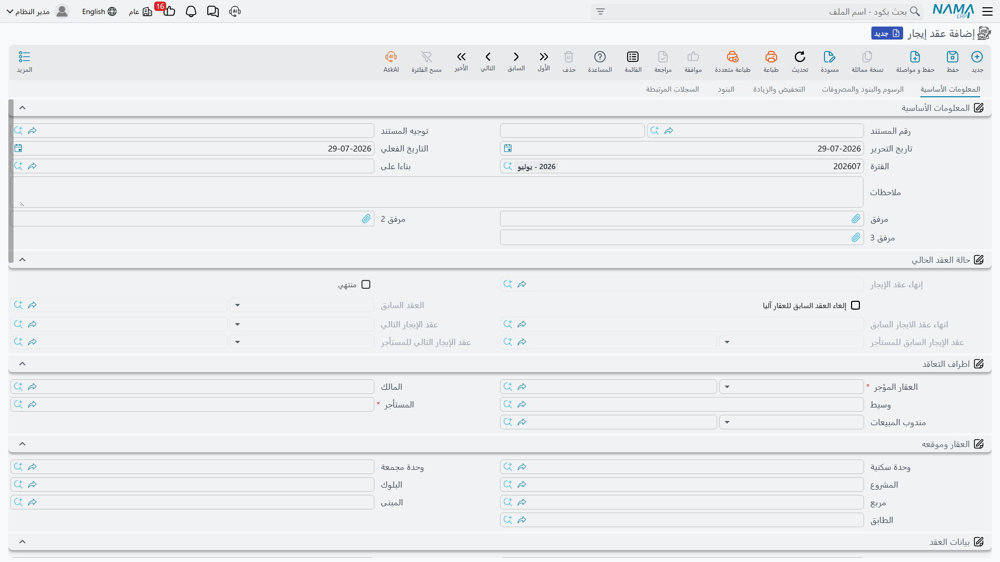

# عقد الإيجار

عقد الإيجار هو المستند الذي تدور حوله منطقة التأجير كلها. فهو العقد نفسه: من يستأجر ماذا، ولأي مدة، وبكم، وعلى أي إيقاع سداد. وكل ما يأتي بعده مشتق منه — جدول الأقساط، وقيود إثبات استحقاق الإيراد الدورية، والتحصيلات، والغرامات، والتمديد، والتصفية الختامية، كلها تقرأ أرقامها من هذا السجل الواحد.

وموضعه **العقارات و الممتلكات > الايجارات > عقد إيجار** (Rent Contract)، ويحتاج الرخصة `realestate-rent`. تستطيع إنشاءه من الصفر، أو — وهو الأكثر شيوعاً — توليده من [عرض سعر إيجار](/ar/modules/realestate/rent/realestate-rent-offers.md) بزر *إنشاء عقد إيجار* في تلك الشاشة، فيملأ المستند كاملاً ويضبط حقل **من مستند** نيابة عنك.

والمثال الجاري في هذه الصفحة عقد إيجار ثلاث سنوات للمحل G-07 في برج النخيل: **120,000 سنوياً**، بسداد **ربع سنوي**، وتأمين **10%**، وسعي 5%.

## الصفحة 0 — المعلومات الأساسية

هذه هي الصفحة التي ستقضي فيها معظم وقتك، وهي منظَّمة في مجموعات من أعلى إلى أسفل:

**رأس المستند.** الدفتر والكود، و[التوجيه](/ar/modules/realestate/document-terms/realestate-terms-rent.md)، وتاريخ الإصدار، وتاريخ القيمة، والسنة والفترة المالية، وحقل **من مستند** (عرض السعر الذي جاء منه العقد)، والملاحظات، وثلاث خانات مرفقات. والتوجيه أخطر حقل في الصفحة أثراً: فهو يحدد اتجاه المال، وهل تُولَّد قيود إثبات الاستحقاق، وكيف يُكوَّد جدول الأقساط، وأي حسابات تصيبها كل كتلة من كتل القيد.

**حالة التعاقد.** روابط يديرها النظام تتيح تتبع تاريخ الوحدة وتاريخ المستأجر: العقد السابق والتالي على **العقار**، والعقد السابق والتالي **للمستأجر**، وهل انتهى العقد وبأي مستند إنهاء، ومفتاح *إلغاء العقد السابق للعقار آليا* الذي يفعّله التمديد.

**أطراف التعاقد.** **المالك** — ويُتحقق منه أمام مالك العقار نفسه كما في قسم التحققات أدناه — و**المستأجر**، ومندوب المبيعات، والوسيط. وكما شُرح في [دورة التأجير](/ar/modules/realestate/rent/realestate-rent-cycle.md)، فحقل المستأجر هو حقل الطرف نفسه الذي تسميه شاشات البيع «المشتري»، ولذلك يجب أن يكون الشخص الذي تبحث عنه معلَّماً كمشترٍ/مستأجر في [سجل الطرف](/ar/modules/realestate/properties/realestate-owners-and-contract-clauses.md).

**العقار وموقعه.** حقل **العقار المؤجر** مطلوب، ويقبل وحدة إيجارية أو طابقاً أو مبنى كاملاً أو [مجموعة وحدات](/ar/modules/realestate/properties/realestate-buildings-floors-and-units.md). واختياره يملأ سطر الموقع للقراءة فقط — المشروع والمبنى والطابق والوحدة والمربع والبلوك ومجموعة الوحدات — فلا تكتب العنوان أبداً، وتستطيع كل القوائم والتقارير ترشيح العقود بالموقع.

**بيانات الايجار.** تاريخ البداية وتاريخ النهاية، و**فترة العقد** (قيمة ووحدة قياس)، و**نوع الايجار** الذي يحدد دورية الأقساط — شهرية، ربع سنوية، ثلث سنوي، نصف سنوي، سنوية، إضافة إلى الدوريات متعددة السنوات — والغرض من الايجار نصاً حراً، ومفتاح **العمل بالتاريخ الهجري**، و**طريقة الزيادة السنوية** التي تحكم التصعيد في الصفحة 2.

والتواريخ والفترة يشتق بعضها بعضاً: اكتب التاريخين تُملأ الفترة، واكتب الفترة يتبعها تاريخ النهاية. أما مفتاح التاريخ الهجري فيغيّر كل حسابات التواريخ في المستند لا طريقة عرضها فقط — انظر [إنشاء جدول الإيجارات](/ar/modules/realestate/rent/realestate-rent-schedule.md).

ثم تأتي **بيانات الايجار المالية** — كتلة قيم التعاقد، ولأهميتها أفردنا لها القسم التالي — ثم أزرار الإجراءات، وإجماليات الضريبة، وجدول **الايجارات**، وجدول **أنواع الايجارات سنوياً**، وقائمتان مدمجتان بسندات التحصيل وسندات سداد الدفعات المحرَّرة على هذا العقد، وإجماليات التعاقد، و[المحددات](/ar/modules/accounting/support/accounting-dimensions-and-distribution.md).

## قيم التعاقد — من أين يأتي كل رقم في الجدول

كتلة القيم هي جانب المدخلات في المستند كله. ومولّد الجدول لا يقرأ سواها.

| الحقل | التسمية الإنجليزية | ما هو |
|---|---|---|
| اساس العقد السنوي | Rent Value Per Year | **مطلوب — الأساس السنوي.** كل رقم آخر في العقد يُحسب منه، والجدول يوزّعه على الفترات بالتناسب. |
| قيمة الإيجار بالفترة الواحدة | Rent Value per period | حقل تيسيري. اكتب فيه إيجار الربع فتضربه Nama في عدد الفترات في السنة لتملأ الأساس السنوي. وتغيير نوع الايجار يعيد الحساب. |
| السعي % / قيمة السعي | Commission % / value | عمولة الوساطة أو المكتب، وتخرج سطراً مستقلاً مرة واحدة في أول تاريخ في الجدول. |
| التأمين % / التأمين | Insurance % / value | مبلغ التأمين المسترد، ويخرج كذلك مرة واحدة في التاريخ الأول. |
| مصاريف الصيانة % | Maintenance % / value | مصاريف الصيانة التي يحملها العقد. |
| مصاريف المياة % | Water Expenses % / value | مصاريف المياه. |
| معاملة تكاليف الصيانة معاملة الأقساط | Treat Maintenance Costs As Installments | حين تُفعَّل تُوزَّع قيمة الصيانة على كل الأقساط بنسبة طول الفترة؛ وحين تُطفأ تُحمَّل مرة واحدة سنوياً في شهر بداية العقد. |
| معاملة المياه معاملة الأقساط | Treat Water Costs As Installments | الاختيار ذاته للمياه. |
| عمولة التحصيل / نسبة عمولة التحصيل | Commission Collection Value / Percentage | عمولة التحصيل. موجودة على العقد ومخفية على عروض الأسعار. |
| إجمالي ايجارات العقد | Total Rent Value | **محسوب.** صافي أسطر الإيجار وحدها — أي الأسطر التي نوعها *قسط*. |
| إجمالي قيمة التعاقد | Total Contract Value | **محسوب.** صافي *كل* الأسطر، فيشمل السعي والتأمين والمياه والصيانة والمصروفات. |

وكل نسبة وقيمتها المقابلة تُبقيان متوافقتين في الاتجاهين أمام الأساس السنوي: اكتب 10% في نسبة التأمين على عقدنا البالغ 120,000 فتظهر 12,000 في القيمة، واكتب 12,000 في القيمة فتعود 10% إلى النسبة. وينطبق ذلك على السعي والتأمين والصيانة والمياه وعمولة التحصيل جميعاً.

::: tip إجماليان بمعنيين مختلفين
الفارق بين *إجمالي ايجارات العقد* و*إجمالي قيمة التعاقد* سؤال متكرر على الدعم. الأول ما يدفعه المستأجر مقابل شغل العقار، والثاني كل ما يلزمه العقد بدفعه شاملاً التأمين والمصاريف. فإن اختلفا بمقدار التأمين والسعي بالضبط فلا خلل هناك.
:::

## جدول الايجارات — خطة السداد

جدول **الايجارات** هو جدول العقد: سطر واحد لكل مبلغ يستحق على المستأجر في تاريخ. ونادراً ما تبنيه يدوياً — فزر *إنشاء الايجارات* يولّده من كتلة القيم، وصفحة [إنشاء جدول الإيجارات](/ar/modules/realestate/rent/realestate-rent-schedule.md) تشرح بالضبط ما يحسبه.

وتنقسم الأعمدة ثلاثة أقسام.

**ما تملؤه أنت (أو يملؤه المولّد):** مربع اختيار السطر، و**كود القسط** (مطلوب، وفريد داخل العقد)، ووصف القسط، و**القيمة**، وخصم وغرامة اختياريان، و**النوع** (يخرج المولّد أسطر الإيجار بنوع *قسط*، وأسطراً منفصلة للسعي والتأمين وتكاليف المياه وتكاليف الصيانة، إضافة إلى النوع الذي أعطيته لكل سطر مصروف)، و**تاريخ الاستحقاق** (مطلوب)، وأرقام الضريبة، وفي هذا المستند عمود **التاريخ الفعلي لقيد الاستحقاق** الذي يتيح إثبات استحقاق قسط في تاريخ غير يوم استحقاقه.

**ما تديره Nama نيابة عنك:** **الصافي** (القيمة زائد الغرامة ناقص الخصم)، والإجمالي بعد الضرائب، وأعمدة المطلوب تحصيله والمحصل بأوراق قبض والمحصل نظامياً والمتبقي، وعلامة تم الدفع، والرابط إلى قيد إثبات الاستحقاق الذي دخل فيه السطر. هذه تتحرك عند تحصيل المال — فلا تكتب فوقها. ويستثنى من ذلك عمود **القيمة المدفوعة** فهو قابل للتحرير يدوياً، لأن التهجير والأرصدة الافتتاحية تحتاجه.

**ما يربط السطر بمستندات أخرى:** الورقة التجارية (الشيك)، ونوع المصروف حين يكون السطر آتياً من جدول المصروفات، والملاحظات.

وأعمدة المتابعة هذه موضوع صفحة [كيف يتم تحصيل الأقساط](/ar/modules/realestate/collections/realestate-collection-basics.md) — وخلاصتها أن سند التحصيل يكتب قيود سداد، ثم تُعاد حوسبة أعمدة العقد منها، فالجدول انعكاس لتاريخ التحصيل لا شيء تحرره بيدك.

ويقع تحت الجدول جدول **أنواع الايجارات سنوياً**: أسطر من «من السنة / إلى السنة / النوع» تتجاوز نوع الايجار في الرأس لمدى من عمر العقد. وبه تكتب عقداً شهرياً في أول سنتين وربع سنوي من السنة الثالثة؛ فالمولّد يراجع هذا الجدول أولاً ثم يرجع إلى نوع الرأس.

## الصفحة 1 — الرسوم والبنود والمصروفات

ثلاثة جداول، كلها اختيارية، وكلها تغذّي الجدول أو الأوراق.

**مصروفات** هو جدول المصروفات المتكررة: مصاريف خدمات، حراسة، نظافة، وكل ما يدفعه المستأجر إلى جانب الإيجار. ويسمي كل سطر **نوع مصروف** من [كتالوج المصروفات](/ar/modules/realestate/costs/realestate-fee-commission-and-expense-types.md)، ثم يحدد دوريته (*يستحق كل*)، ولأي سنوات من العقد (*من/الى السنة رقم*)، وهل هو قيمة ثابتة أم نسبة — وإن كان نسبة، فهل تُقاس على إيجار السنة الأولى أم على إيجار السنة نفسها. واختيار نوع المصروف ينسخ كل هذه الإعدادات من ملف النوع، فتختار النوع عملياً ثم تعدّل. ويهمّ مفتاحان آخران: أحدهما يمنع ضرب القيمة في طول الفترة، والآخر يعلّم السطر بأنه منسوخ من عقد سابق ويضبطه التمديد نيابة عنك.

وأسطر المصروفات يحولها *إنشاء الايجارات* إلى أسطر في الجدول، ويُرحَّل كل سطر على حسابات **نوع المصروف نفسه** لا على حسابات توجيه العقد.

**رسوم أخري** تغطي الرسوم غير المتكررة — رسم تسجيل، رسم أوراق. ويسمي كل سطر نوع رسم وقيمة، وربما ذمة السطر وتاريخه، ومفتاحاً يضيفه إلى الأقساط. وكالمصروفات، يُرحَّل الرسم على حسابات نوع الرسم نفسه.

**البنود** نص حر: كود وبند، لصياغة ما يُطبع في العقد.

## الصفحة 2 — التخفيض والزيادة

نادراً ما تثبت العقود الطويلة على سعر واحد طوال عمرها، وفي هذه الصفحة تُعرَّف الحركة.

تحمل مجموعة **التخفيض** نسبةً لكل سنة من السنوات العشر الأولى، تُطبَّق على أسطر إيجار تلك السنة. وإن كان العقد أطول من عشر سنوات، أو فضّلت جدولاً، فجدول **التخفيضات** يأخذ رقم السنة والنسبة ويغطي أي سنة.

أما جانب الزيادة فتحكمه **طريقة الزيادة السنوية** في الصفحة 0، والخيارات الثلاثة تغيّر فعلاً ما تسمح لك به هذه الصفحة:

| طريقة الزيادة السنوية | English | ما يمكنك ملؤه |
|---|---|---|
| بدون | Without | لا شيء. فالإيجار لا يتصاعد. **وهي القيمة الافتراضية.** |
| قيمة ثابتة سنويا | Fixed | نسبة واحدة أو قيمة واحدة تُطبَّق كل سنة. |
| قيمة متغيرة سنويا | Variable | نسبة أو قيمة مختلفة لكل سنة — أزواج السنة 2 … السنة 10، وجدول **الزيادات السنوية** لما بعدها. |

ويحدد **الزيادة السنوية مركبة** ما إذا كانت زيادة كل سنة تُحسب على الأساس الأصلي أم على الأساس مضافاً إليه ما تراكم. فعلى زيادة 5% سنوياً لثلاث سنوات، تعطي الطريقة البسيطة 120,000 ← 126,000 ← 132,000، بينما تعطي المركبة 120,000 ← 126,000 ← 132,300.

::: warning جدول الزيادات وطريقة الزيادة يجب أن يتفقا
إن كان جدول **الزيادات السنوية** يحوي أسطراً وطريقة الزيادة السنوية غير *قيمة متغيرة سنويا*، فشل الاعتماد برسالة *يجب إفراغ جدول الزيادات أو تغيير طريقة الزيادة السنوية إلى متغيرة*. ويقع هذا كثيراً حين يجرّب أحدهم الزيادة المتغيرة ثم يعيد الطريقة دون إفراغ الجدول.
:::

## الصفحة 3 — البنود

يسجّل جدول **بنود التعاقد القياسية** الالتزامات التي تتابعها لا التي تطبعها فحسب: يسمي كل سطر بنداً قياسياً، وتاريخ انتهائه المخطط، وتاريخ انتهائه بعد التمديد، وتاريخ تنفيذه الفعلي، وغرامات التمديد. واختيار ملف **بنود تعاقد** في الصفحة 1 ينسخ بنوده إلى العقد دفعة واحدة — انظر [الملاك والمشترون وبنود التعاقد القياسية](/ar/modules/realestate/properties/realestate-owners-and-contract-clauses.md). ولا يجوز تكرار البند القياسي الواحد في الجدول.

## الصفحة 4 — السجلات المرتبطة

قوائم للقراءة فقط بكل ما أنتجه هذا العقد: سندات التحصيل المحرَّرة عليه، و**قيود إثبات استحقاق أقساط الإيجار** المولَّدة منه، وسندات الغرامة. وهذه أسرع طريقة للتحقق من أن الاستحقاقات التي تتوقعها موجودة فعلاً — انظر [قيود إثبات استحقاق أقساط الإيجار](/ar/modules/realestate/rent/realestate-rent-accrual-ledger.md).

## الأزرار

| الزر | English | ما يفعله |
|---|---|---|
| إنشاء الايجارات | Create Rents | يعيد توليد الجدول كله من كتلة القيم. **وهو يكتب فوق الجدول** — انظر صفحة الجدول. |
| اختيار جميع الاقساط | Select all installment lines | يعلّم كل الأسطر استعداداً للأزرار التي تعمل على المحدَّد. |
| إنشاء سند تحصيل للاقساط المختارة | Create collect doc from selected line | يفتح سند تحصيل مملوءاً بالأقساط المعلَّمة. |
| سداد عاجل | Merge installments | السداد المبكر: تعطي مدى تاريخ ومدى كود ونسبة خصم، فتُستبدل الأسطر المحددة بسطر واحد مدموج بالقيمة بعد الخصم. |
| تمديد عقد الايجار | Extend Contract | يدحرج العقد إلى عقد جديد. |
| انهاء العقد | Cancel Rent Contract | يفتح مستند الإنهاء والتصفية. |
| إنشاء سند غرامة | Create Fine Document | يحرّر [غرامة تأخير](/ar/modules/realestate/collections/realestate-fines.md) على الأقساط المتأخرة. |
| إنشاء سند قبض للاقساط المختارة | Create Receipt Voucher From Selected Line | يجمع المتبقي من الأسطر المعلَّمة في سند قبض. متاح حين نكون المؤجِّر. |
| إنشاء سند صرف للأقساط المختارة | Create Payment Voucher From Selected Line | نظيره المعكوس، ولا يتاح إلا حين يعلّم التوجيه العقد بأننا فيه **المستأجر**. |

والزران الأخيران هما الوجه الظاهر لعلامة *عقد استئجار* في التوجيه الموصوفة في [دورة التأجير](/ar/modules/realestate/rent/realestate-rent-cycle.md) — فلا يتاح على أي عقد إلا أحدهما. والتمديد والإنهاء كلاهما مشروح في [تمديد عقد الإيجار وإنهاؤه](/ar/modules/realestate/rent/realestate-rent-renewal-and-termination.md).

## ماذا يفعل اعتماد العقد فعلاً

حفظ العقد واعتماده يطلق سلسلة من الآثار، كلها آلية:

1. **يُعلَّم العقار كمؤجَّر.** تُوسم الوحدة بهذا العقد، وتصعد حالة «مؤجَّرة» في الشجرة فيظهر الطابق والمبنى مؤجَّرين جزئياً.
2. **يُكتب سطر تأجير في التسلسل الزمني للعقار**، ومعه سطر لكل عقار ابن — كل وحدة في طابق مؤجَّر، وكل وحدة في مجموعة وحدات مؤجَّرة.
3. **يربط العقد نفسه بالتاريخ.** تبحث Nama عن أحدث عقد معتمد على العقار نفسه فتربطه كعقد سابق وتضع نفسها عقداً تالياً له؛ ثم تكرر الأمر مفتاحه **المستأجر**، فتستطيع تتبع تاريخ مستأجر عبر وحدات مختلفة.
4. **إن كانت علامة *إلغاء العقد السابق للعقار آليا* مفعّلة**، أُنهي العقد السابق آلياً بمستند إنهاء تنشئه Nama وتعتمده، باستخدام دفتر وتوجيه الإلغاء المذكورين في توجيه هذا العقد.
5. **تُولَّد قيود إثبات الاستحقاق** حين يطلبها التوجيه، واحد لكل فترة استحقاق.
6. **تُنشأ الأوراق التجارية** من أعمدة الشيكات في أسطر الأقساط.
7. **تُعاد حوسبة تواريخ البنود القياسية** — فيُشتق تاريخ الانتهاء المخطط لكل بند من مدة عمله، وتتبعه تواريخ التمديد وغراماته.
8. **إن كان العقد قادماً من عرض سعر**، وُسم العرض برابط إليه.

### القيد المحاسبي

ينشئ العقد قيداً محاسبياً واحداً، يخرج على صورة **طلب أعمال** يُعالَج في الخلفية — فالحفظ فوري، وأي إخفاق يُعاد تنفيذه من شاشة طلبات الأعمال (قائمة المزيد ← إعادة المعالجة / إعادة الاعتماد) لا بإعادة إدخال العقد.

ويُبنى القيد كتلةً كتلة، و**لا تنتج أي كتلة أسطراً إلا إذا كان جانباها معاً مضبوطين في التوجيه**. والزوج نصف المضبوط يُتخطى بصمت، وهذا أول ما ينبغي فحصه حين يغيب رقم متوقَّع من القيد. وتقابل هذه الكتل صفحات توجيه الإيجار، وهي موثّقة في [توجيهات مستندات الإيجار](/ar/modules/realestate/document-terms/realestate-terms-rent.md):

| صفحة التوجيه | ما تُرحِّله |
|---|---|
| *اساس العقد* / Total contract effect | إجمالي أسطر الإيجار. |
| *الايرادات* / Income (في الصفحة نفسها) | الأقساط الواقعة **داخل السنة المالية للمستند نفسه**. |
| *الايرادات المقدمة* / Advance Income (في الصفحة نفسها) | الأقساط الواقعة في **سنوات مالية لاحقة** — الإيراد المؤجل. |
| *القيمة المدفوعة* / Paid Value (في الصفحة نفسها) | إجمالي القيم المدفوعة المدخلة يدوياً. |
| *تاثيرات التأمين* / Insurrance effect | مبلغ التأمين. |
| *تاثيرات السعي* / Commissions effect | السعي. |
| *تاثيرات الصيانة* / Maintenance effect | مصاريف الصيانة. |
| *تاثيرات مصاريف المياه* / Water expense effect | مصاريف المياه. |
| *تاثيرات عمولة التحصيل* / commission Collection Effect | عمولة التحصيل. |
| *تأثيرات الضريبة* / Tax Effects | ضرائب الأسطر. |
| *سطور إعدادات التوجيه* / Confiuration List | تجاوزات بحسب **نوع القسط**، فيصيب قسط تكاليف الصيانة حسابات غير التي يصيبها قسط الإيجار العادي — بما في ذلك حسابات منفصلة لأسطر العام الحالي وأسطر الأعوام التالية. |

وذلك الفصل بين الإيراد والإيراد المؤجل هو قلب القيد. فتقارن Nama **تاريخ استحقاق** كل قسط بـ**السنة المالية للمستند نفسه**: ما يقع في هذه السنة إيراد، وما يقع بعدها إيرادات مقدمة. ففي عقد ثلاث سنوات موقَّع في 2026 تُعترف سنة واحدة من الإيجار إيراداً، وتبقى سنتان في الإيراد المؤجل بانتظار أن تحرّرهما قيود إثبات الاستحقاق فترةً بفترة. وإن امتدت فترة قسط عبر نهاية السنة المالية، قطعه خيار التوجيه *تقسيم القسط الواحد عند امتداده بين عامين متتاليين في القيد* إلى قطعتين بالتناسب مع عدد الأيام فتأخذ كل سنة حصتها الحقيقية؛ أما أسطر التأمين والسعي والمياه والصيانة فلا تُقسَّم أبداً.

ويحمل كل سطر في القيد محددات العقد نفسه: المالك مورداً، والمستأجر عميلاً، ومندوب المبيعات، والعقار صنفاً. وخيار *اختصار القيد* في التوجيه يدمج الأسطر التي تصيب الحساب نفسه في سطر واحد إن كنت تفضّل قيداً مختصراً.

## التحققات التي ستقابلها فعلاً

**تاريخ النهاية مُتحقَّق منه إلى اليوم بالضبط.** فيجب أن يساوي تاريخ البداية زائد عدداً صحيحاً من فترات الإيجار ناقصاً يوماً واحداً. فعقد ثلاث سنوات يبدأ في 1 يناير 2026 يجب أن ينتهي في 31 ديسمبر 2028 لا في 1 يناير 2029. ورسالة الخطأ تخبرك بالتاريخ المتوقَّع، فاقرأها بدل التخمين.

**المالك يجب أن يكون مالك العقار نفسه.** ففي أول حفظ تقارن Nama مالك العقد بالمالك المسجل على العقار وترفض الاختلاف برسالة *لا يمكن تغيير مالك العقار*. وإن كان المالك قد تغيّر فعلاً فذلك عمل [مستند تحويل الملكية](/ar/modules/realestate/properties/realestate-ownership-transfer.md) لا عمل عقد إيجار.

**العقار يجب أن يكون متاحاً.** يفشل الاعتماد إن كان العقار مؤجَّراً بالفعل. ويفشل كذلك إن كان العقار **مباعاً**، إلا أن يفعّل التوجيه خيار *السماح بتأجير الوحدات المباعة* — وهو ما تستعمله حين يبيع المطوّر وحدة لمستثمر ثم يدير تأجيرها نيابة عنه. ويُتخطى الفحصان معاً حين تكون علامة *إلغاء العقد السابق للعقار آليا* مفعّلة، لأن التمديد مقصود منه التداخل.

**ولعلامة إلغاء العقد السابق ثلاث قواعد خاصة بها.** لا يمكن تغييرها بعد أول حفظ؛ ولا يمكن تغيير العقار وهي مفعّلة؛ وتحتاج وجود عقد سابق على ذلك العقار وإلا فشل الاعتماد برسالة *لا يوجد عقد سابق للعقار لإلغائه آلياً*. وفوق ذلك يجب أن يعرّف التوجيه دفتر إلغاء العقد وتوجيهه معاً، وإلا فشل الحفظ ودلّك مباشرة على حقل التوجيه.

**أكواد الأقساط فريدة، وبعد الاعتماد غير قابلة للتعديل.** كما لا يمكن حذف سطر سبق دفعه، ولا تخفيض قيمته دون ما حُصِّل عليه. فإن حصّلت أولاً ثم أعدت توليد الجدول فقدت تاريخ التحصيل؛ ولّد الجدول أولاً ثم حصّل.

**العقد المنتهي مجمَّد.** فما إن ينهي مستند إنهاء العقدَ، لا يمكن تعديله ولا تمديده.

**ولأسطر المصروفات تحققاتها:** المصروف المبني على نسبة يجب أن يذكر أساس النسبة، وكل سطر يحتاج نسبة أو قيمة، ولا يجوز أن تسبق «إلى السنة» «من السنة».

## ثلاث سنوات للمحل G-07 من أولها إلى آخرها

1. **الرأس.** اختيار الدفتر والتوجيه (توجيه مؤجِّر — علامة *عقد استئجار* مطفأة)، وحقل «من مستند» يشير إلى عرض السعر الذي قبله المستأجر، والمالك والمستأجر مملوءان، والعقار المؤجر = المحل G-07 فيملأ سطر الموقع نفسه ببرج النخيل / الدور الأرضي.
2. **التواريخ.** من 1 يناير 2026 إلى 31 ديسمبر 2028؛ تقرأ الفترة 36 شهراً؛ و**نوع الايجار** = ربع سنوية.
3. **القيم.** اساس العقد السنوي = 120,000. التأمين 10% ← 12,000. السعي 5% ← 6,000. ولا صيانة ولا مياه على هذا العقد.
4. **التصعيد.** المالك يريد 5% سنوياً مركبة: **طريقة الزيادة السنوية** = *قيمة ثابتة سنويا*، ونسبة الزيادة السنوية = 5، و**الزيادة السنوية مركبة** مفعّلة.
5. **الضغط على *إنشاء الايجارات*.** اثنا عشر سطر إيجار ربع سنوي، إضافة إلى سطر سعي وسطر تأمين في التاريخ الأول. تُفوتر السنة الأولى 30,000 للربع، والثانية 31,500، والثالثة 33,075.
6. **الإجماليات.** *إجمالي ايجارات العقد* هو حاصل جمع أسطر الإيجار الاثني عشر؛ و*إجمالي قيمة التعاقد* يضيف إليها 12,000 التأمين و6,000 السعي.
7. **الاعتماد.** يُعلَّم المحل G-07 مؤجَّراً ويظهر البرج مؤجَّراً جزئياً؛ وينضم سطر تأجير إلى تسلسل المحل الزمني؛ ويرحّل القيد أقساط 2026 الأربعة إيراداً والثمانية الباقية إيرادات مقدمة؛ ولأن التوجيه يطلب قيود استحقاق شهرية، يظهر في صفحة **السجلات المرتبطة** مستند استحقاق لكل شهر يقع فيه استحقاق قسط — اثنا عشر مستنداً على هذا العقد — يحرّر كل منها إيراد فترته في الفترة المحاسبية التي تخصها.
