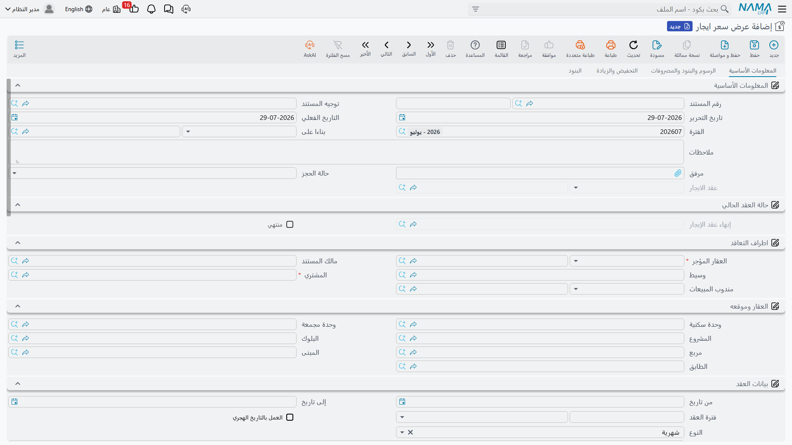

# عروض أسعار الإيجار وحجز الوحدة

قبل أن يوقّع أحد شيئاً، يريد المستأجر المحتمل رقماً: كم يكلّف المحل G-07 لثلاث سنوات، وكم التأمين؟ ووجود **عرض سعر الإيجار** هو للإجابة عن هذا السؤال مكتوباً. فهو عرض مسعَّر ومؤرَّخ لعقار واحد — ولأنه مبني على شكل الشاشة نفسها التي يُبنى عليها العقد، فالأرقام التي تعرضها هي حرفياً الأرقام التي سيحملها العقد حين يوافق المستأجر.

ويفعل العرض شيئاً لا يفعله عرض السعر المطبوع على ورق الشركة: يستطيع أن **يحجز الوحدة**. وهذا هو النصف الثاني من هذه الصفحة، وهو الجزء الذي تنشأ عنه الأخطاء التي يسأل عنها الناس.

وتجد المستندين تحت **العقارات و الممتلكات > الايجارات**: *عرض سعر ايجار* (Rent offer) و*إلغاء حجز عرض سعر إيجار* (Rent offer Cancel). وكلاهما يحتاج الرخصة `realestate-rent`.

## العرض هو شاشة العقد، منقوصاً منها ما لا يحتاجه عرض السعر

إن كنت تعرف [عقد الإيجار](/ar/modules/realestate/rent/realestate-rent-contract.md) فأنت تعرف العرض: صفحة *المعلومات الأساسية* نفسها بأطرافها وبالعقار وموقعه، وتاريخا البداية والنهاية وفترة العقد، وكتلة قيم التعاقد نفسها، وجدول *الايجارات* نفسه، ومن خلفه صفحات **الرسوم والبنود والمصروفات** و**التخفيض والزيادة** و**البنود**. وزر *إنشاء الايجارات* يعمل بالطريقة نفسها كذلك، فتستطيع أن تسلّم العميل جدولاً كاملاً فترةً بفترة — انظر [إنشاء جدول الإيجارات](/ar/modules/realestate/rent/realestate-rent-schedule.md) لمعرفة ما يحسبه ذلك الزر.

أما الفروق فمحدودة عن قصد:

| على العرض | السبب |
|---|---|
| حقل **حالة الحجز**، وحقل للقراءة فقط يعرض عقد الإيجار المُنشأ من هذا العرض | قرار الحجز، وأثر الوصول إلى العقد الذي صار إليه. |
| قيم عمولة التحصيل مخفية | فهي تخص عقداً قائماً لا عرض سعر. |
| لا يوجد جدول *رسوم أخري* | فأسطر الرسوم تُدخل على العقد. |
| خانة مرفق واحدة بدل خمس | |
| لا توجد صفحة *السجلات المرتبطة* | فلا شيء يُنشأ عن العرض ليُعرض فيها. |
| لا يوجد عمود تاريخ قيد الاستحقاق على أسطر الأقساط | فالعروض لا تولّد قيود استحقاق. |

وأزرار العرض هي الأزرار المعتادة — *إنشاء الايجارات*، و*اختيار جميع الاقساط*، و*إنشاء سند تحصيل للاقساط المختارة*، و*سداد عاجل* (وهو زر دمج الأقساط)، و*إنشاء سند قبض للاقساط المختارة* — يضاف إليها زر لا يوجد إلا هنا: **إنشاء عقد إيجار** (Create Rent contract).

::: tip املأ التوجيه ولو كان العرض يعمل بدونه من الناحية التقنية
من [توجيه](/ar/modules/realestate/document-terms/realestate-terms-rent.md) العرض يأتي إعداداه الحاسمان — حالة الحجز الافتراضية، وهل ينشئ تأثيراً محاسبياً أصلاً. والشاشة تطلب منك التوجيه، وينبغي أن تعطيه إياه؛ فالعرض الذي يُصدَر بلا توجيه يفقد هذين السلوكين معاً.
:::

## حالة الحجز — هل يحجز اعتماد هذا العرض الوحدة؟

لحقل **حالة الحجز** (Reservation Status) قيمتان، ويُملأ افتراضياً في كل عرض جديد من التوجيه، فتختاره عملياً مرة واحدة لكل توجيه ونادراً ما تمسّه على المستند:

- **حجز** (Reserve) — اعتماد العرض يكتب سطر حجز على العقار. فتظهر الوحدة محجوزة للإيجار، ويُرفض عند الاعتماد أي عرض أو عقد آخر عليها. وتبقى كذلك حتى يحوّل عقدٌ الحجزَ إلى تأجير، أو يحرّرها *إلغاء حجز عرض سعر إيجار*.
- **بدون حجز** (Without Reservation) — اعتماد العرض لا يغيّر شيئاً في إتاحة الوحدة. فيستطيع أي أحد أن يعرضها أو يحجزها أو يؤجرها.

استعمل *حجز* حين يكون العميل قد التزم بشيء — دفعة، أو قبول موقَّع، أو موعد جاد — واستعمل *بدون حجز* لعروض الأسعار الاستطلاعية التي توزّعها طوال اليوم. فلو عرضت المحل نفسه على أربعة عملاء بحالة *حجز*، لما اعتُمد إلا الأول، وقيل للثلاثة الباقين إن الوحدة محجوزة، وفي أي مستند.

والقاعدة المترتبة على الحجز هي أكثر ما يصل إلى الدعم الفني:

::: info العقار المحجوز بعرض سعر لا يُؤجَّر إلا عبر ذلك العرض
ما إن يحجز عرضٌ وحدةً، لا يُعتمَد عقد إيجار عليها إلا إذا كان حقل **من مستند** فيه هو ذلك العرض نفسه. وأي شيء غير ذلك يُرفض برسالة *العقار … محجوز في المستند …، وللمتابعة يجب اختيار عرض سعر الإيجار في حقل من مستند*.

وهذا ما يحمي عرضاً محجوزاً من أن يؤجّر زميلٌ الوحدةَ من تحته. والطريقة النظيفة لتحقيق الشرط ليست كتابة «من مستند» يدوياً، بل الضغط على زر *إنشاء عقد إيجار* من العرض نفسه، فيملؤه لك. والتسلسل الزمني وراء هذه القاعدة مشروح في [دورة التأجير](/ar/modules/realestate/rent/realestate-rent-cycle.md).
:::

## هل ينشئ العرض تأثيراً محاسبياً أصلاً؟

عرض السعر ليس إيراداً، ولذلك لا ينشئ العرض في العادة أي قيد. ويتحكم في ذلك خيار **إنشاء التأثير المحاسبى** (Create Accounting Effects) في توجيه العرض، وفي توجيه مخصص لعروض الأسعار تتركه مطفأً.

فإن فعّلته أنشأ العرض القيد نفسه الذي كان سينشئه العقد. وإن أطفأته لاحقاً على توجيه سبق لعروضه أن أنشأت قيوداً، فلن تترك Nama القيود القديمة قائمة: ففي المرة التالية التي يُحدَّث فيها مثل هذا العرض يُحذف قيده الموجود. أي أن الخيار آمن للتصحيح بعد الوقوع — لكنه أيضاً ليس وسيلة «لتثبيت» قيد أردت الاحتفاظ به.

## من العرض إلى العقد — زر *إنشاء عقد إيجار*

احفظ العرض أولاً (فالزر لا يعمل على سجل غير محفوظ)، ثم اضغط **إنشاء عقد إيجار**. تنسخ Nama العرض، وتحوّل النسخة إلى عقد إيجار، وتفتحه **سجلاً جديداً غير محفوظ** لتراجعه وتحفظه. وما ينتقل هو:

- كل ما في الرأس: العقار وموقعه، والمستأجر والمالك، وتاريخا البداية والنهاية والفترة، وكتلة القيم كاملة (أساس العقد السنوي، السعي، التأمين، الصيانة، المياه)، والضرائب، وإعدادات الزيادة السنوية، ومندوب المبيعات والوسيط، ومفتاح التاريخ الهجري.
- أسطر البنود والشروط، وأسطر المصروفات، وجدولا التخفيضات والزيادات.
- أسطر الأقساط، مطابَقةً سطراً بسطر **على كود القسط** — فالجدول الذي وافق عليه المستأجر هو الجدول الذي يحصل عليه.
- حقل **من مستند** مضبوطاً على العرض، وهو ما يجيز العقد أمام تحقق الحجز.

والقيم المدفوعة هي الاستثناء الوحيد. فهي لا تنتقل إلا إذا فُعِّل في [إعدادات وحدة العقارات](/ar/modules/realestate/realestate-configuration.md) خيار *نسخ المدفوع من الأقساط عند عمل عقد إيجار بناء على عرض سعر* — أي حين تكون منشأتك تحصّل فعلاً على عروض الأسعار. ومع إطفائه (وهو الوضع الافتراضي) يبدأ العقد الجديد وكل أقساطه غير مدفوعة.

ويحتفظ العرض برابط إلى العقد الذي صار إليه، فتستطيع دائماً الانتقال من عرض السعر إلى العقد.

## تحرير الحجز — *إلغاء حجز عرض سعر إيجار*

حين ينصرف عميل محجوز له، يجب تحرير الحجز وإلا بقيت الوحدة غير مرئية للآخرين. وهذه وظيفة **إلغاء حجز عرض سعر إيجار**. وهو الشاشة نفسها، واعتماده يكتب سطر إلغاء حجز يحرّر العقار.

ولا يصح إلا بعد حجز. فإن أصدرته على وحدة لا يحجزها أي عرض رُفض الاعتماد — وتذكر الرسالة المستند الذي يقع فعلاً في آخر التسلسل الزمني لذلك العقار، وتخبرك أنه يجب أن يكون عرض سعر إيجار. بعبارة أخرى: ألغِ حجزاً، لا عقداً. فالعقد يُنهى [بمستند إنهاء العقد](/ar/modules/realestate/rent/realestate-rent-renewal-and-termination.md) لا بإلغاء حجز.

ولاحظ أن الوحدة المحجوزة بعرض ثم المؤجَّرة عبر ذلك العرض لا تحتاج إلغاء حجز إطلاقاً — فالعقد يَجُبّ الحجز من تلقاء نفسه. ولا تحتاج إلغاء الحجز إلا حين ينتهي الحجز **دون** عقد.

## عميلان ومحل واحد

المحل G-07 في برج النخيل، والمطلوب 120,000 سنوياً على ثلاث سنوات بسداد ربع سنوي وتأمين 10%.

1. **العميل «أ»** جاد: اتفق على السعر ويجهّز التأمين. تصدر له عرض سعر إيجار من 1 يناير 2026 إلى 31 ديسمبر 2028، وتضغط *إنشاء الايجارات* ليرى الأقساط الاثني عشر بقيمة 30,000 لكل قسط إضافة إلى التأمين البالغ 12,000، وتترك **حالة الحجز** على *حجز* (وهي القيمة الافتراضية الآتية من توجيه عروض الأسعار). واعتماده يحجز المحل.
2. **العميل «ب»** يدخل في اليوم التالي سائلاً عن المحل نفسه. تعرض عليه أيضاً — تصدر عرضاً بالأرقام ذاتها، لكن تضبط **حالة الحجز** على *بدون حجز*. فيأخذ أوراقه، ويبقى المحل محجوزاً لـ«أ». ولو تركتها على *حجز* لرُفض الاعتماد ذاكراً عرض «أ».
3. **«أ» يوقّع.** تفتح عرضه وتضغط *إنشاء عقد إيجار*. فيصل العقد كاملاً، وحقل «من مستند» يشير إلى العرض، ويُعتمد بلا اعتراض. المحل الآن مؤجَّر، وعرض «ب» مجرد عرض سعر لم يُؤخذ به — ولا حاجة لإلغاء، لأن عرض «ب» لم يحجز شيئاً أصلاً.
4. **ولو انصرف «أ» بدلاً من ذلك**، لأصدرت *إلغاء حجز عرض سعر إيجار* على عرضه لتحرير المحل، وعندها فقط يمكن تحويل عرض «ب» إلى عقد.
