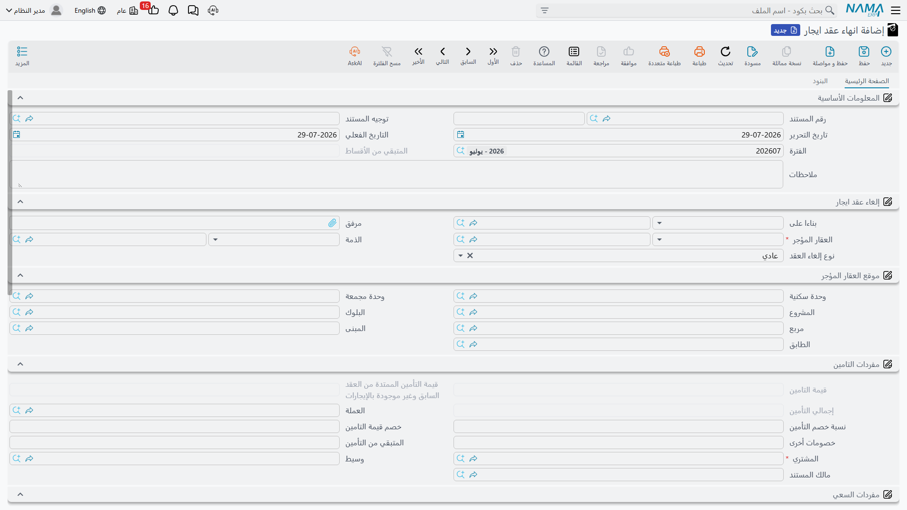

# تمديد عقد الإيجار وإنهاؤه

كل عقد إيجار ينتهي. أغلبها ينتهي بالتجديد، وبعضها ينتهي مبكراً لأن المستأجر يغادر، والحالتان يعالجهما
زران على شاشة [عقد الإيجار](/ar/modules/realestate/rent/realestate-rent-contract.md): **تمديد عقد
الايجار** و**انهاء العقد**. وأيٌّ منهما لا يعدّل العقد الذي تقف عليه؛ فنموذج النظام أن مدة التأجير
مستند: التجديد يُنتج عقداً **جديداً** للمدة الجديدة، والإنهاء يُنتج **مستند تسوية** يحسب ما يعود
للمستأجر.

وسنواصل متابعة محل برج النخيل: مؤجَّر من 1 مارس 2026 إلى 28 فبراير 2029، بأساس سنوي 120,000 يُسدَّد
ربع سنوياً، وبتأمين 12,000.

## التجديد: زر تمديد عقد الايجار

اضغط **تمديد عقد الايجار** على عقد معتمد فيقدّم لك النظام عقداً جديداً غير محفوظ ومملوءاً بالفعل
للمدة التالية. ولا يُكتب شيء حتى تراجعه وتحفظه، فالضغط على الزر والنظر في النتيجة آمنان.

ما الذي ينتجه الزر:

1. **نسخة من العقد الحالي** بكل شروطه التجارية ومصروفاته وبنوده وسطور أقساطه. وإذا ضغطته على
   [عقد إيجار افتتاحي](/ar/modules/realestate/opening/realestate-opening-rent-contracts.md) تُحوَّل
   النسخة إلى عقد إيجار عادي — وهذا هو مسار الترحيل المقصود: عقد افتتاحي للمدة التاريخية، ثم عقود
   عادية من أول تجديد فصاعداً.
2. **تواريخ جديدة**: «من تاريخ» الجديد هو اليوم التالي لـ«إلى تاريخ» القديم، و«إلى تاريخ» الجديد بعده
   بفترة عقد كاملة. فيتجدد عقد المحل من 1 مارس 2029 إلى 28 فبراير 2032. ويتبع تاريخ القيمة تاريخ
   البداية الجديد، وتُعاد السنة والفترة المالية من عنده. وإذا كان العقد محسوباً بالتاريخ الهجري فكل
   هذه الحسابات هجرية.
3. **إزاحة الأقساط**: يتقدم تاريخ استحقاق كل سطر بفترة عقد كاملة، وتُمسح أكواد الأقساط وتُولَّد من
   جديد — إلا إذا كان التوجيه مؤشَّراً على **تكويد يدوي** فتبقى أكوادك كما هي.
4. **مسح سجل السداد**: يأتي كل سطر بقيمة مدفوعة صفراً وبعلامة السداد مرفوعة. فالمدة الجديدة تبدأ
   مستحقة بالكامل، وهو المطلوب.
5. **تعليم سطور المصروفات بأنها منسوخة**: يُؤشَّر كل سطر مصروف في العقد الجديد بأنه منسوخ من العقد
   السابق. وتُحذف السطور التي ينص نوع مصروفها على عدم نسخها مع التمديد، وكذلك السطور المنسوخة سابقاً
   التي ينص نوعها على ألا تولّد قسطاً في نسخة تالية — وهكذا يتوقف تحميل تأسيسي لمرة واحدة عن التكرار
   مع كل تجديد.
6. **تأشير «إلغاء العقد السابق للعقار آليا»**، وهذا هو الجزء الذي يفاجئ الناس.

::: info التمديد يفرض الإلغاء الآلي — فيجب أن يكون التوجيه مهيأً له
يخرج العقد الجديد وخانة **إلغاء العقد السابق للعقار آليا** مؤشَّرة، وهذه الخانة ليست زينة. فعند الحفظ
يُنشئ النظام مستند إنهاء للعقد السابق ويعتمده، بتاريخ «إلى تاريخ» ذلك العقد، مستعملاً **دفتر سند
إلغاء عقد الايجار** و**توجيه سند إلغاء عقد الايجار** المذكورين في توجيه العقد الجديد.

وإذا كان أحدهما ناقصاً **فشل الحفظ** برسالة تشير مباشرة إلى حقل التوجيه. وهذه أكثر عقبة يصطدم بها
المستخدمون عند أول تجديد في تركيب جديد: العلاج ليس على العقد بل على **التوجيه**. اضبط الحقلين مرة
واحدة في كل توجيه عقد إيجار تستعمله ولن تعود المشكلة.
:::

وتأشير خانة الإلغاء الآلي هو أيضاً ما يسمح للتجديد بالوجود أصلاً. فالوحدة ما زالت مؤجَّرة بالعقد
القديم، وتسلسل حالة العقار الإيجارية كان سيرفض قيداً ثانياً بحالة «مؤجرة» — لكن هذه الفحوص تُتخطى
تحديداً لأن الخانة تضمن إغلاق العقد السابق في الوقت نفسه.

وهناك قواعد يحسن معرفتها قبل التجديد:

- **العقد المنتهي لا يُمدَّد.** فبعد أن يغلقه مستند إنهاء يرفضه زر التمديد؛ جدّد من العقد الحي لا من
  المنتهي.
- **خانة الإلغاء الآلي لا تُغيَّر بعد أول حفظ**، ولا يمكنك تغيير العقار على العقد وهي مؤشَّرة.
- التمديد يحتاج شيئاً يلغيه: فإذا لم يكن للعقار عقد سابق أصلاً فشل الاعتماد بدل أن يمضي بصمت.
- جدول العقد الجديد **إزاحة** للجدول القديم لا حساب جديد. فإذا تغيّرت قيمة الإيجار للمدة الجديدة فعدّل
  القيم ثم اضغط [إنشاء الايجارات](/ar/modules/realestate/rent/realestate-rent-schedule.md) — مع
  تذكّر أن الزر يستبدل الجدول كله.

## الإنهاء: مستند التسوية

مستند **انهاء عقد ايجار**، وتصل إليه من `العقارات و الممتلكات > الايجارات > انهاء عقد ايجار` أو من زر
**انهاء العقد** على العقد، هو مستند التسوية. وهو ليس «تراجعاً» عن العقد: فالتأجير قد وقع، والإيجار
اكتُسب، والمال تحرّك؛ وهذا المستند يحسب الرصيد بين الطرفين لحظة تسليم المستأجر المفاتيح.

### فتحه من العقد

ضغط **انهاء العقد** على عقد لم يُنهَ من قبل يفتح مستند إنهاء جديداً في نافذة منبثقة، مملوءاً من
العقد: المستند المصدر، ومن/إلى تاريخ، والمالك، والمستأجر، والعقار وموقعه، والعملة ومعدّلها، وقيمة
التأمين بوصفها التأمين المبدئي، وقيمة **المتبقي** التي تجمع المتبقي من سطور الإيجار وحدها — أي سطور
نوع **قسط**. أما بقية سطور العقد — سعي وتأمين ومياه وصيانة ومصروفات — فتُنسخ إلى جدول المصروفات في
المستند نفسه، لتُسوّى كل واحدة منها على حدة.

### ما الذي تحسبه التسوية

المستند مرتَّب بمجموعة لكل بند مالي، وكل مجموعة على الشكل نفسه: ما حُصِّل، وما يُحتجَز، وما يعود.

- **التأمين.** المبلغ المأخوذ في البداية، مضافاً إليه أي زيادة أُخذت عند التمديد، يعطي إجمالي
  المحتجَز. وأمامه تضع ما تحتجزه — بنسبة أو بقيمة — إضافة إلى خصومات أخرى، فيُظهر المستند صافي
  التأمين الذي يستلمه المستأجر فعلاً.
- **السعي.** إجمالي سعي الوساطة على العقد وما لم يُستهلك منه.
- **مصاريف المياه** و**تكاليف الصيانة**، ولكلٍّ نسبة خصم وقيمة خصم وإجمالي ومتبقٍّ — فالمستأجر لا يسترد
  حصة الخدمات التي استهلكها بالفعل.
- **الإيجار المدفوع.** رقمان: المتبقي من إيجار العام الحالي، والمدفوع مقدماً عن العام التالي. فالإيجار
  المسدَّد عن سنة لن يكون المستأجر فيها موجوداً ردٌّ مباشر، أما إيجار السنة الحالية فهنا يجري توزيع
  المغادرة المبكرة.
- **جدول المصروفات** الحامل لسطور العقد غير الإيجارية، وكل سطر مقسوم بين ما يخص العام الحالي وما
  دُفع مقدماً عن التالي.
- و**ذمة** في الرأس تحدد على من تقع التسوية: خزنة أو موظف أو مالك.

في محلنا، مستأجر يغادر قبل نهاية السنة الثالثة بأربعة أشهر مع احتجاز 10% للإنهاء المبكر يسترد 12,000
ناقص 1,200، أي **10,800** من التأمين، إلى جانب ما لم يُستهلك من المياه والصيانة وأي إيجار سُدِّد عن
فترات بعد مغادرته — وكلٌّ من ذلك يخرج عبر حساباته الخاصة.

### مبكر أم عادي

حقل نوع الإنهاء في الرأس إما **مبكر** أو **عادي**، والمستند الجديد يبدأ على *عادي*. وهو سجل المستند
لسبب انتهاء التأجير — مستأجر ترك المكان في منتصف المدة مقابل عقد أكمل مدته — وهو ما يُرشَّح عليه أي
تقرير أو **مسار كيان** حين تريد معرفة حجم احتجازات الإنهاء المبكر في محفظة عقارية خلال سنة.

### إنهاء العقد وعليه مبالغ غير مسددة

افتراضياً لا يسمح النظام بإغلاق عقد وعليه أقساط غير مسددة؛ فالمتأخرات يجب تحصيلها أو إعفاؤها أو
تسويتها أولاً. ويحمل توجيه الإنهاء خيار **السماح بانهاء عقد الايجار مع وجود اقساط غير مسددة** للحالات
التي لا يكون فيها ذلك واقعياً — مستأجر اختفى، أو عقد يُشطب. ومع تأشيره يمضي الإنهاء ويُحمَّل الرصيد
غير المسدد على الحسابات المضبوطة في صفحة *تاثيرات المتبقي* من التوجيه.

ويرافقه خيار **احتساب المتبقي من الإيجار بناءً على الإيجارات المدفوعة نظامياً**، وهو يغيّر طريقة
اشتقاق رقمي إيجار العام الحالي والعام التالي: فمع تأشيره يتبعان ما حُصِّل فعلاً عبر النظام بدل ما
يقوله جدول العقد إنه استُحق.

### ماذا يحدث لقيود الاستحقاق

العقد الذي ينتهي مبكراً يترك عادةً
[قيود استحقاق](/ar/modules/realestate/rent/realestate-rent-accrual-ledger.md) قائمة لفترات لن تُكتسب
أبداً. ولذلك خياران في توجيه الإنهاء:

- **حذف مسودات القيود عند إنشاء إنهاء العقد** — عند حفظ مستند الإنهاء تُحذف قيود استحقاق ذلك العقد
  التي ما زالت **مسودات**، حتى لا تُعتمد لاحقاً بصمت. وهو يعمل جنباً إلى جنب مع خيار *حفظ قيد إثبات
  استحقاق قسط الإيجار المنشأ كمسودة* في توجيه العقد: فإذا كانت القيود تُعتمد فوراً فلا مسودات تُحذف.
- **إعادة إنشاء القيود مع حذف إنهاء العقد** — إذا حُذف مستند الإنهاء لاحقاً أُعيد توليد قيود استحقاق
  العقد، فيعيد التراجع عن الإنهاء استحقاقات العقد بدل أن يترك فجوة.

### من أين تأتي المحاسبة

للإنهاء **توجيه** خاص به منفصل عن توجيه عقد الإيجار، بصفحة لكل بند مالي. وهي بترتيب الشاشة:

| الصفحة | العنوان | ما تسجّله |
|---|---|---|
| 0 | تاثيرات صافي التامين | صافي التأمين العائد للمستأجر، ومعه خيارا القيود المذكوران أعلاه |
| 1 | تاثيرات التامين | إجمالي التأمين المفرَج عنه |
| 2 | تأثيرات السعي | تسوية السعي |
| 3 | تأثيرات تكاليف المياه | تسوية تكاليف المياه |
| 4 | تأثيرات تكاليف الصيانة | تسوية تكاليف الصيانة |
| 5 | تاثيرات خصم التامين | الجزء المحتجَز من التأمين |
| 6 | تاثيرات الخصومات الأخرى | باقي المبالغ المحتجَزة |
| 7 | تاثيرات المتبقي | الرصيد غير المسدد، وإيجار العام الحالي والعام التالي، ومصروفات العام الحالي والمدفوع مقدماً منها، والخياران السلوكيان |

وكل صفحة زوج من جانبي القيد، وكما في كل الوحدة **لا ينتج الزوج سطور قيد إلا إذا مُلئ جانباه معاً**؛
فالصفحة نصف المضبوطة تُتخطى بصمت. ولذلك حين يغيب بند من القيد فأول ما يُراجَع هو ما إذا كان جانباه
مضبوطين. اضبط حسابات كل صفحة بحسب الغرض الذي تحمله الصفحة، وتأكد من النتيجة على مستند تجريبي قبل
الاعتماد عليها في التشغيل الفعلي. وبقية عائلة توجيهات الإيجار موصوفة في
[توجيهات مستندات الإيجار](/ar/modules/realestate/document-terms/realestate-terms-rent.md).

وكسائر مستندات الوحدة، يُنشئ حفظ الإنهاء محاسبته بوصفها **طلب أعمال** يُعالَج في الخلفية، ويُعاد
تشغيل الفاشل منها من شاشة طلبات الأعمال عبر **المزيد ← إعادة المعالجة / إعادة الاعتماد**.

## «انهاء العقد» مستند إيجار لا مستند بيع

الاسم يسبب لبساً، فيحسن قوله صراحة: هذا المستند يُنهي **عقد إيجار**. مكانه قائمة الايجارات، وهو مقيَّد
برخصة `realestate-rent`، ولا يشير إلا إلى عقود الإيجار وعقود الإيجار الافتتاحية.

أما فسخ **البيع** فقصة مختلفة تماماً بمستندات أخرى — انظر
[التنازل وفسخ عقد البيع](/ar/modules/realestate/sales/realestate-waiver-and-cancellation.md).
