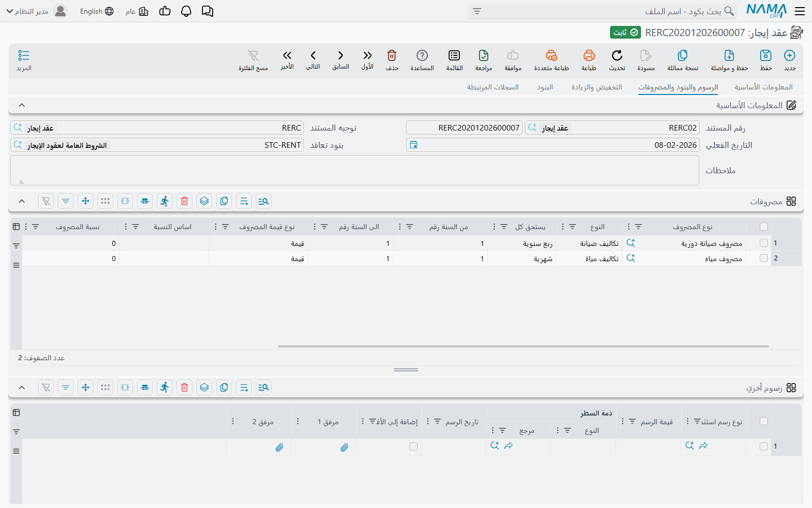
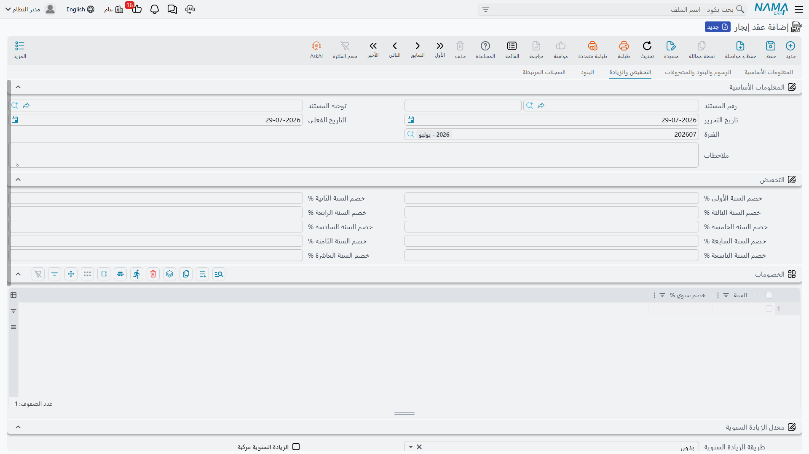
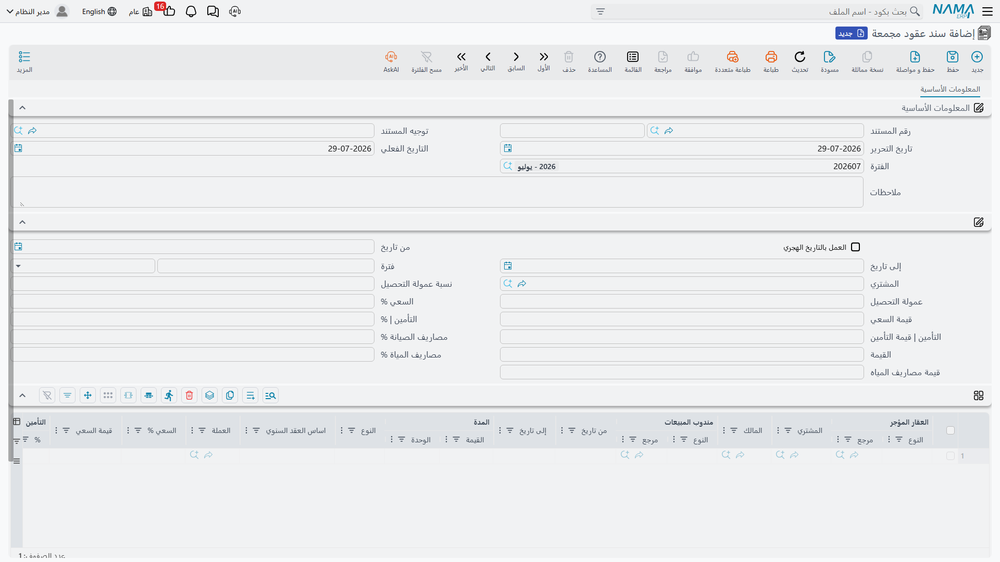

# إنشاء جدول الإيجارات

العقد يُوقَّع مرة واحدة، لكنه يُحصَّل مرات كثيرة. أنت تتفق مع المستأجر على قيمة إيجار سنوية، ومن هذا
الرقم الواحد على النظام أن يستخرج القائمة الفعلية للمبالغ وتواريخ استحقاقها: إيجار هذا الربع،
والتأمين المستحق في اليوم الأول، وسعي الوساطة، ونصيب المستأجر من تكاليف المياه، والزيادة السنوية التي
تبدأ من السنة الثانية، وعقد النظافة الذي يُحمَّل كل ثلاثة أشهر. هذه القائمة هي جدول **الايجارات** في
أسفل [عقد الإيجار](/ar/modules/realestate/rent/realestate-rent-contract.md)، وهي المرجع الذي يُقاس
عليه كل ما يأتي بعده: التحصيل وإثبات الاستحقاق والغرامات وإنهاء العقد.

وأنت لا تكتب هذا الجدول بيدك. تضغط زر **إنشاء الايجارات** فيُبنى الجدول كاملاً.

سنستعمل في هذه الصفحة عقداً واحداً: محل في «برج النخيل» مؤجَّر من **1 مارس 2026 إلى 28 فبراير 2029**،
بأساس سنوي **120,000**، يُسدَّد **ربع سنوي**، مع **تأمين 10%** (12,000) و**سعي 5%** (6,000) و**صيانة
2%** و**مصاريف مياه 1%**، و**زيادة سنوية مركبة 5%**.

## ما الذي يقرؤه الزر قبل أن يكتب شيئاً

زر *إنشاء الايجارات* لا يسألك شيئاً؛ كل ما يحتاجه موجود على العقد نفسه. ولهذا فترتيب العمل مهم: املأ
الرأس أولاً ثم اضغط الزر أخيراً.

يقرأ الزر تاريخي العقد و**فترة العقد**، والأساس السنوي (**اساس العقد السنوي**) و**نوع الايجار** الذي
يحدد كل كم يستحق الإيجار، وقيم السعي والتأمين والصيانة والمياه في مجموعة القيم، والتخفيضات والزيادة
السنوية في صفحة *التخفيض والزيادة*، وجدول **أنواع الايجارات سنوياً**، وجدول **مصروفات** في صفحة
*الرسوم والبنود والمصروفات*.

وهناك شرط واحد لا مفر منه: وحدة **فترة العقد** يجب أن تكون **بالسنوات أو بالشهور**؛ أي وحدة أخرى
توقف الزر برسالة تطالبك بتعديلها.

## كيف يعمل المولِّد خطوة بخطوة

يبدأ المولِّد من **من تاريخ** ويمشي إلى **إلى تاريخ**، فترة إيجار في كل خطوة، ويُصدر السطور في طريقه.

### 1. يحدد دورية هذه الخطوة

في كل خطوة ينظر أولاً إلى جدول **أنواع الايجارات سنوياً**: إذا وُجد سطر يغطي نطاق سنواته التاريخ الذي
وصل إليه، فنوع ذلك السطر هو المطبَّق. ولا يرجع إلى **نوع الايجار** في الرأس إلا إذا لم يطابق أي سطر.
بهذا يمكن أن يكون العقد شهرياً في سنتيه الأوليين ثم ربع سنوي من الثالثة — وهو ما تشرحه فقرة «تغيير
الدورية أثناء العقد» أدناه. جدول عقد المحل فارغ، فكل خطوة عنده ربع سنوية أي ثلاثة أشهر.

### 2. في التاريخ الأول فقط: السعي والتأمين

يحمل تاريخ بداية العقد سطرين إضافيين قبل أي إيجار: سطر من نوع **سعي** بقيمة السعي، وسطر من نوع
**تأمين** بقيمة التأمين. يصدران **مرة واحدة** فقط ولا يتكرران ولا يُجزَّآن على الفترات.

فيفتح عقدنا في 1 مارس 2026 بسطر سعي 6,000 وسطر تأمين 12,000.

### 3. يحسب إيجار الفترة

المعادلة ثابتة:

> **إيجار الفترة = (الأساس السنوي + الزيادة المتراكمة) × عدد شهور الفترة ÷ 12**، مقرَّباً حسب دقة
> العملة، ثم مخفَّضاً بنسبة تخفيض تلك السنة التعاقدية.

الزيادة المتراكمة تكبر مرة واحدة عند اكتمال كل سنة تعاقدية. فإذا كانت **الزيادة السنوية مركبة**
مؤشَّرة تُحسب زيادة كل سنة على الأساس *مضافاً إليه* كل ما تراكم قبلها؛ وإذا تُركت بلا تأشير تُضاف
القيمة نفسها ثابتة كل سنة.

في عقد المحل بزيادة مركبة 5%:

| السنة التعاقدية | الأساس + الزيادة المتراكمة | الإيجار في الربع |
|---|---|---|
| الأولى (مارس 2026 – فبراير 2027) | 120,000 | 30,000 |
| الثانية (مارس 2027 – فبراير 2028) | 126,000 | 31,500 |
| الثالثة (مارس 2028 – فبراير 2029) | 132,300 | 33,075 |

ولو تُركت الزيادة غير مركبة لأضافت السنة الثالثة 6,000 ثابتة بدل 6,300، فيصبح الأساس 132,000 والربع
33,000. الفرق في ثلاث سنوات صغير، وفي عقد عشر سنوات ليس كذلك.

والتخفيض يعمل في الاتجاه المعاكس: النسبة التي تضعها في *خصم السنة الأولى %* وأخواتها — أو في جدول
**التخفيضات** للسنوات بعد العاشرة — تُطبَّق على سطر إيجار تلك السنة بعد إضافة الزيادة.

### 4. يُصدر سطور المياه والصيانة

القيمتان تتصرفان بالطريقة نفسها، ولكلٍّ منهما مفتاح على العقد:

- **معاملة تكاليف الصيانة معاملة الأقساط** مؤشَّرة: تُوزَّع قيمة الصيانة على **كل** قسط بنسبة
  `القيمة × شهور الفترة ÷ 12`. وبدون تأشير تُحمَّل سطراً واحداً مرة في السنة في **شهر ذكرى** بداية
  العقد.
- **معاملة المياه معاملة الأقساط** تفعل الشيء نفسه بمصاريف المياه.

والصيانة تتبع الزيادة أيضاً: تُعاد قيمتها في كل فترة بوصفها نسبتها من أساس الإيجار **الحالي** لا من
الأساس الأصلي. فنسبة 2% في عقدنا تُنتج 600 في الربع في السنة الأولى (2% من 120,000 مقسومة على أربعة)،
ثم 630 في الثانية و661.50 في الثالثة. أما المياه بنسبة 1% ومفتاحها غير مؤشَّر فتُنتج سطراً واحداً
بقيمة 1,200 كل مارس.

### 5. يفكّ جدول المصروفات

كل سطر في جدول **مصروفات** هو تحميل متكرر له إيقاعه الخاص. وقبل أن تبدأ الجولة أصلاً يحسب المولِّد كل
التواريخ التي يقع فيها ذلك السطر، من فترة **يستحق كل** ومن نطاق **من السنة رقم** و**الى السنة رقم**؛
أما السطور المضبوطة على *مع كل قسط* فتُعالَج داخل الجولة تبعاً لفترة العقد نفسها.

وقيمة السطر تتوقف على **نوع قيمة المصروف**:

- *قيمة* — يُستعمل الرقم المكتوب في **قيمة المصروف** كما هو.
- *نسبة* — تُؤخذ النسبة من **إيجار السنة الأولى** أو من **إيجار السنة نفسها**، حسب ما اخترته في
  **اساس النسبة**، وهذا الاختيار إلزامي متى كان النوع نسبة.

ثم يُضرب الناتج في `شهور الفترة ÷ 12` — إلا إذا أُشِّر السطر بـ**عدم ضرب قيمة المصروف في الفترة**، أو
كان **يستحق كل** فيه *مرة واحدة* أو *سنوية*.

فعقد نظافة على محلنا بنسبة 1% من إيجار السنة نفسها يُستحق ربع سنوياً يخرج بقيمة 300 في الربع في السنة
الأولى ثم يرتفع مع الإيجار. ويأخذ السطر نوع القسط من سطر المصروف، فيمكن توجيهه إلى حساباته الخاصة
لاحقاً — والدليل الذي تُبنى منه هذه السطور موصوف في
[أنواع الرسوم والعمولات والوسطاء والمصروفات](/ar/modules/realestate/costs/realestate-fee-commission-and-expense-types.md).

### 6. يُصدر سطر الإيجار

آخر ما يصدر في الفترة هو الإيجار نفسه، سطراً من نوع **قسط**. وسطور هذا النوع وحدها هي التي تدخل في
**إجمالي ايجارات العقد**؛ أما البقية — سعي وتأمين ومياه وصيانة ومصروفات — فتدخل في **إجمالي قيمة
التعاقد** فقط.

وإذا كان [توجيه](/ar/modules/realestate/document-terms/realestate-terms-rent.md) العقد مؤشَّراً على
**قيمة الايجار تشمل السعي**، يُخفَّض سطر الإيجار بقيمة المصروف المحمَّل في الفترة نفسها، فتكون قيمة
الإيجار المعلنة للمستأجر شاملة لذلك التحميل بدل أن يظهر بجوارها.

### 7. الأكواد والضرائب ثم استبدال الجدول

عند انتهاء الجولة يُرقِّم المولِّد السطور: تاريخ الاستحقاق بصيغة `yyyyMMdd` يليه تسلسل من رقمين، فأول
سطرين في عقدنا هما `2026030101` و`2026030102`. وإذا أُشِّر التوجيه على **تكويد يدوي** تُترك الأكواد
فارغة لتكتبها بنفسك. ولأن أكواد الأقساط يجب أن تكون فريدة ولا يجوز تعديلها بعد الاعتماد، فمن الأفضل
حسم هذا الاختيار قبل توقيع أول عقد.

ثم تُحذف السطور المنسوخة من العقد السابق التي ينص نوع مصروفها على عدم توليد قسط لها، وتُحسب ضرائب كل
سطر — من جدول **السياسة الضريبية** في التوجيه، فإن كان فارغاً فمن الجدول نفسه في
[إعدادات الوحدة](/ar/modules/realestate/realestate-configuration.md)، وأخيراً من سياسة الضريبة على
العقار أو على المستأجر — ثم **يُستبدل** جدول الايجارات كاملاً بما أنتجه المولِّد.

ينتهي عقد المحل عندنا بـ29 سطراً: 12 سطر إيجار ربع سنوي، و12 سطر صيانة، و3 سطور مياه سنوية، وسطر سعي
وسطر تأمين.

::: warning زر إنشاء الايجارات يستبدل الجدول كله
الزر لا يدمج ولا يُكمِل الناقص، بل **يستبدل** جدول الايجارات بجدول مولَّد من جديد. فأي سطر أضفته
بيدك، وأي مبلغ عدّلته، وأي تاريخ حرّكته — كل ذلك يضيع لحظة ضغطك الزر مرة أخرى.

ولّد الجدول أولاً ثم عدّل عليه، ولا تضغط الزر بعد أن يبدأ التحصيل: السطور المسدَّدة لا يمكن حذفها ولا
تخفيضها، فعلى عقد قائم سيفشل الزر ويتركك تعالج الفروق يدوياً.
:::

## تغيير الدورية أثناء العقد

جدول **أنواع الايجارات سنوياً** موجود للعقود التي يتغير إيقاعها خلال عمرها — مستأجر يسدد شهرياً حتى
يقف نشاطه على قدميه ثم ربع سنوياً بعد ذلك. كل سطر فيه نطاق سنوات ونوع: من السنة 1 إلى 2 *شهرية*، ومن
السنة 3 إلى 3 *ربع سنوية*. والمولِّد يراجع الجدول في كل خطوة ولا يستعمل **نوع الايجار** في الرأس إلا
حين لا يطابق شيء، فالجدول المملوء جزئياً صحيح تماماً.

## العقود المحسوبة بالتاريخ الهجري

تأشير **العمل بالتاريخ الهجري** على العقد ليس تغييراً في شكل عرض التواريخ. إنه يحوّل **كل** حسابات
التواريخ في الوحدة إلى التقويم الهجري: التحويل بين تاريخي العقد و**فترة العقد**، والانتقال من تاريخ
استحقاق إلى الذي يليه، وشهر الذكرى الذي تُحمَّل فيه المياه والصيانة، وحدود السنوات التي تقرر أي زيادة
وأي تخفيض ينطبق — وأكواد الأقساط نفسها، إذ تُبنى حينها من التاريخ الهجري لتاريخ الاستحقاق.

::: tip احسم التقويم قبل التوليد
لأن الأكواد نفسها تتغير، فتبديل التقويم على عقد له جدول بالفعل يعني إعادة توليده، وهو ما يعيدنا إلى
تحذير الاستبدال أعلاه. اضبط الخيار عند إنشاء العقد.
:::

## فتح أربعين عقداً دفعة واحدة

مركز تجاري يسلّم أربعين محلاً في يوم واحد لا يحتاج أربعين دورة على شاشة العقد. **سند عقود مجمعة** هو
واجهة جماعية للمولِّد نفسه: تملأ الشروط التجارية مرة واحدة في الرأس، وتُدرِج الوحدات في الجدول، وتضغط
**إنشاء عقود الايجار** فيُنشئ النظام عقد إيجار حقيقياً لكل سطر.

يحمل الرأس التواريخ والفترة والمستأجر والقيم الافتراضية للسعي والتأمين والصيانة والمياه وعمولة
التحصيل، إضافة إلى نسبة تخفيض سنوي واحدة. وكل سطر في الجدول يسمّي العقار ويستطيع تجاوز أي من ذلك:
العقار والمستأجر والمالك والمندوب والتواريخ والفترة ونوع الايجار والأساس السنوي وكل النسب والقيم. وما
يتركه السطر صفراً يرث قيمة الرأس عند اعتماد السند، وكل تخفيض سنة فارغ يرث نسبة الرأس الواحدة.

ثم ينسخ الزر لكل سطر الدفتر والتوجيه المسمَّيين في توجيه السند المجمَّع، ويعيد بناء جدول أقساط العقد
بالمولِّد الموصوف أعلاه حرفياً، ويعتمد العقد، ويكتب مرجعه على السطر.

::: tip الزر قابل لإعادة التشغيل ولا يكرر العقود
ضغط **إنشاء عقود الايجار** مرة أخرى يفتح العقود التي أنشأها سابقاً ويحدّثها بدل إنشاء مجموعة ثانية.
أما أخذ **نسخة مماثلة** من السند المجمَّع فيمسح تلك الروابط، فتُنشئ النسخة عقوداً جديدة.
:::

وقبل أن تعتمد على المسار الجماعي هناك أمران. الأول تحقُّق بسيط: في كل من السعي والتأمين ومصاريف
المياه والصيانة تملأ **إما** النسبة **أو** القيمة على السطر، لا الاثنتين معاً، وإلا فشل الحفظ. والثاني
أهم: السند المجمَّع ضيّق عن قصد. فليس فيه **جدول مصروفات ولا رسوم أخرى ولا بنود تعاقد قياسية ولا بنود
وشروط ولا أنواع إيجارات سنوية ولا زيادة سنوية**، وليس له تأثير محاسبي خاص به — كل ذلك تحمله العقود
التي ينشئها. فهو الأداة الصحيحة حين تكون الأربعون عقداً متشابهة فعلاً، والخاطئة حين يكون لكل محل
خدماته الخاصة؛ فأي شيء يتجاوز الجدول البسيط يجب إضافته على العقود المولَّدة بعد ذلك، أي بضغط *إنشاء
الايجارات* على كل واحد منها وقبول الاستبدال.

وبمجرد وجود العقود تصبح عقود إيجار عادية في كل شيء: تُثبت استحقاقاتها عبر
[قيود إثبات استحقاق الأقساط](/ar/modules/realestate/rent/realestate-rent-accrual-ledger.md)،
ويُحصَّل عليها، و[تُمدَّد أو تُنهى](/ar/modules/realestate/rent/realestate-rent-renewal-and-termination.md)
بالأزرار المعتادة. والحسابات التي يصل إليها كل سطر مولَّد يحددها
[توجيه مستند الإيجار](/ar/modules/realestate/document-terms/realestate-terms-rent.md)، والتسلسل الأوسع
الذي يقع فيه هذا الجدول مشروح في
[دورة التأجير](/ar/modules/realestate/rent/realestate-rent-cycle.md).
