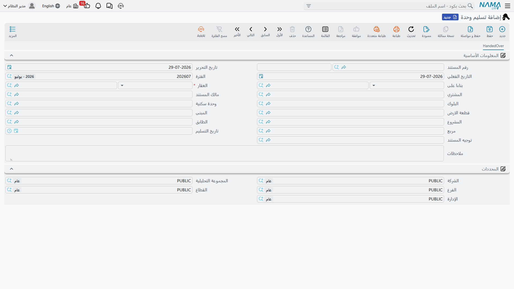
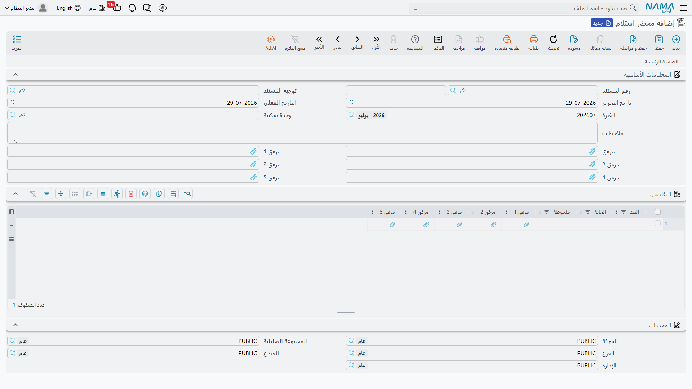
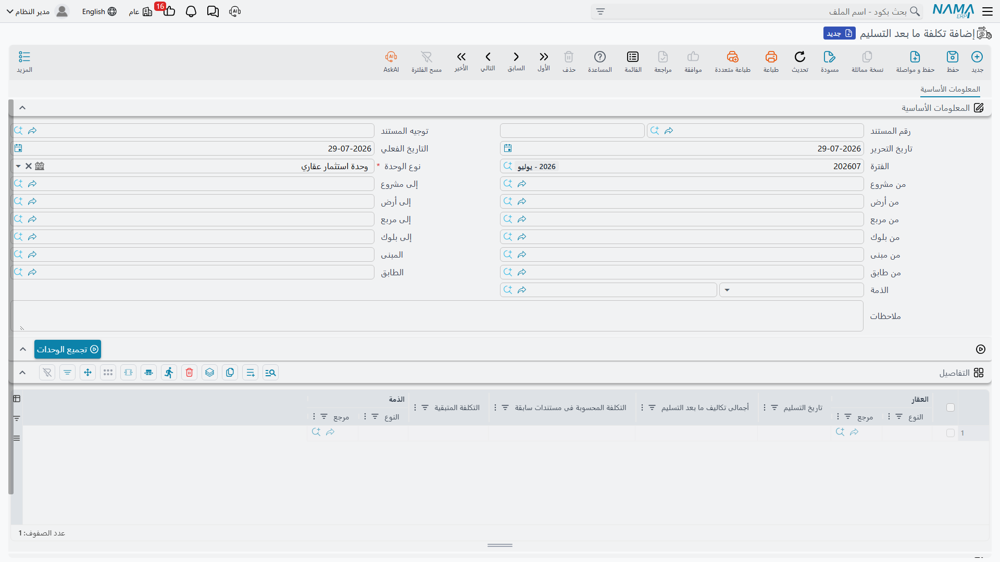

# تسليم الوحدة

التسليم هو اللحظة التي يتوقف فيها العقار عن كونه وعداً في عقد ويصير مفاتيح في يد صاحبه. فهو للعميل يوم الاستلام، وللمحاسب قد يكون اليوم الذي يتحول فيه البيع إلى إيراد، وللمطوّر هو الخط الذي لا يجوز بعده رسملة تكاليف الإنشاء على الوحدة.

وثلاثة مستندات تغطي هذه اللحظة، وفصلها عن بعضها مقصود:

- **مستند تسليم الوحدة**، الذي يسجّل التسليم ويستطيع إطلاق التأثير المحاسبي للعقد؛
- **محضر الاستلام**، الذي يسجّل **حالة** الوحدة عند انتقالها؛
- **تكلفة ما بعد التسليم**، التي تستوعب تكاليف الإنشاء الواصلة بعد تسليم المفاتيح.

ويسير المثال في الثلاثة: **الفيلا B-12 تُسلَّم في مارس، وفي يونيو تحمَّل عليها 40,000 تكاليف مقاولات إضافية.**

## مستند تسليم الوحدة

تجده في **العقارات و الممتلكات > المستندات > تسليم وحدة**، على ترخيص `realestate-sales`.

وهي شاشة صغيرة عن قصد — صفحة واحدة، بلا جداول وبلا أزرار. ترويسة المستند المعتادة، ثم:

- **بناءا على** — **إلزامي**، ويجب أن يكون [عقد بيع](/ar/modules/realestate/sales/realestate-sales-contract.md) أو عقد بيع افتتاحي. فكل ما يفعله المستند إنما يفعله بذلك العقد.
- **العقار** و**المشتري** و**مالك المستند**، مع سلسلة الموقع (المشروع، المربع، البلوك، المبنى، الدور، الأرض، الوحدة).
- **تاريخ التسليم**.
- **توجيه المستند** — اختياري هنا. فمستند التسليم من المستندات القليلة في الوحدة التي لا تشترط توجيهاً، لأن تسليماً لا يغيّر سوى الحالة لا يحتاج حسابات.

::: tip اجعل تاريخ التسليم وتاريخ القيمة يوماً واحداً
التاريخ الذي يُختم على سجل العقار هو **تاريخ قيمة المستند**، لا حقل «تاريخ التسليم». فاملأ الحقلين بالتاريخ نفسه ليتطابق ما تراه على العقد وما تراه على سجل العقار.
:::

وبينك وبين الاعتماد تحققان: أن يكون «بناءا على» عقد بيع أو عقد بيع افتتاحي (*«بناءا على يجب ان يكون عقد بيع أو عقد بيع إفتتاحى»*)، وألا يكون العقد قد سُلِّم من قبل — وإن كان قد سُلِّم فالرسالة تذكر المستند الذي سلّمه، وهو ما يكفي عادة لحل ازدواج التسليم.

### ماذا يحدث عند الاعتماد

1. **يُختم العقد.** تُضبط عليه علامة «تم التسليم» ويشير إلى هذا المستند. وتراها على شاشة العقد نفسه في المجموعة الصغيرة للقراءة فقط أسفل أطراف التعاقد.
2. **يُختم العقار.** تُكتب عليه حالة التسليم وتاريخ التسليم ومستند التسليم.
3. **يُطلَق القيد المؤجَّل**، إن كان توجيه العقد محتجزاً له — انظر أدناه.
4. **يُنشأ قيد ثانٍ**، إن طلبه توجيه مستند التسليم — انظر أدناه أيضاً.

وإلغاء مستند التسليم أو حذفه يعكس ذلك كله: يُرفع الوسم عن العقد والعقار ويُحذف أي قيد أنشأه التسليم. وتغيير «بناءا على» على مستند معتمد يرفع الوسم عن العقد والعقار القديمين قبل وسم الجديدين.

### خياران يجب أن يُقررا معاً

هذه هي النقطة التي تستحق التمهّل، لأن الخيارين يقعان على **توجيهين مختلفين** ولا معنى لأحدهما دون الآخر:

- في توجيه **عقد البيع**: *إنشاء تأثير محاسبى لمستندات التسليم فقط*؛
- في توجيه **مستند التسليم** نفسه: *إنشاء التأثير المحاسبى*.

| توجيه العقد | توجيه التسليم | النتيجة |
|---|---|---|
| مطفأ | مطفأ | العقد يُثبت كل شيء عند اعتماده، والتسليم تغيير حالة فقط بلا أي أثر محاسبي. وهذا هو الوضع الشائع. |
| **مفعّل** | مطفأ | يُعتمد العقد **بلا قيد**. توجد خطة المديونية وتصير الوحدة مباعة والأستاذ العام صامت حتى التسليم. ثم يعيد مستند التسليم تنفيذ التأثير المحاسبي للعقد فيُنتج قيد العقد من **توجيه العقد**. وهكذا تُضبط سياسة «الاعتراف بالإيراد عند التسليم». |
| **مفعّل** | **مفعّل** | يُطلَق قيد العقد المؤجَّل **ويُنتج التسليم قيداً ثانياً منفصلاً** مبنياً على أرقام العقد لكن بحسابات **توجيه التسليم**. لا تختر هذا إلا إذا كان التوجيهان يُثبتان أشياء مختلفة عمداً. |
| مطفأ | **مفعّل** | العقد يُثبت عند اعتماده والتسليم يُثبت مرة أخرى. وما لم يكن توجيه التسليم موجّهاً إلى حسابات مختلفة فعلاً، فهذا احتساب مزدوج للبيع. |

وأطراف الحسابات وراء الخيارين موصوفة في [صفحة توجيهات مستندات البيع](/ar/modules/realestate/document-terms/realestate-terms-sales.md). ولاحظ أن القيد الثاني — حين يوجد — يُبنى من بيانات **عقد البيع** نفسه: سعره ورسومه ووديعته وأقساطه، ولا يأتي من توجيه التسليم إلا الحسابات.

## محضر الاستلام

**العقارات و الممتلكات > المستندات > محضر استلام**، على ترخيص `realestate`، هو سجل الحالة — الجولة التي تقوم بها مع العميل أو المستأجر بنداً بنداً.

الشاشة وحدة وخمسة مرفقات وجدول. كل سطر في الجدول بند نظرت فيه — الدهانات، السباكة، التكييف، المفاتيح — بحالة وملاحظة وحتى خمس صور خاصة به. والبند والحالة كلاهما **نص حر** لا قائمة ثابتة، وهذا مقصود: فقائمة فحص شقة مفروشة ليست قائمة فحص محل تجاري، ولا توجد قائمة منسدلة تصلح للاثنين.

ولا أثر محاسبي له ولا توجيه ولا تغيير في حالة الوحدة — فهو توثيقي بحت، وهو المستند الوحيد في هذا الجزء الذي لا يحتاج توجيهاً أصلاً. ولا يرتبط به شيء تلقائياً كذلك، فامنح محاضر الاستلام كوداً أو ملاحظة تسمّي الوحدة والتاريخ إن أردت العودة إليها.

واستخدمه مرتين في الإيجار: مرة عند تسلّم المستأجر للوحدة ومرة عند إعادتها، لتقارن بين المحضرين عند [تسوية التأمين](/ar/modules/realestate/rent/realestate-rent-renewal-and-termination.md).

## تكلفة ما بعد التسليم

تكاليف المطوّر لا تتوقف يوم التسليم: أعمال المعالجة، والتشطيبات المتأخرة، ومستخلص مقاول أخير — كلها قد تصل بعد أشهر من انتقال العميل. وبعد تسليم الوحدة لا يمكن رسملة هذه التكلفة على العقار، فمحلها قائمة الدخل. ومستند **تكلفة ما بعد التسليم**، في **العقارات و الممتلكات > المستندات > تكلفة ما بعد التسليم**، هو ما يضعها هناك.

### تجميع الوحدات

الترويسة **مدى** لا عقاراً واحداً. اختر نوع العقار الذي تجمعه — وحدات سكنية افتراضياً، ويمكن كذلك أراضٍ أو بلوكات أو مبانٍ أو أدوار أو مجموعات وحدات — وحدّد مدى «من / إلى» على كل مستوى يهمك من الشجرة: المشروع، المربع، البلوك، المبنى، الدور، الأرض. وأضف الذمة التي تُحمَّل عليها التكلفة.

ثم اضغط **تجميع الوحدات**، فيمتلئ الجدول بكل عقار مسلَّم داخل هذا المدى.

### الحساب

كل سطر يحمل العقار وتاريخ تسليمه وثلاثة أرقام يتولاها النظام:

| العمود | كيف يُحسب |
|---|---|
| **إجمالي التكلفة بعد التسليم** | تكلفة ما بعد التسليم الفعلية المسجلة لذلك العقار في وحدة المقاولات |
| **التكلفة المحسوبة سابقاً** | مجموع «التكلفة المتبقية» في كل مستند تكلفة ما بعد تسليم **معتمد وأسبق** لنفس العقار |
| **التكلفة المتبقية** | الإجمالي ناقص المحسوب سابقاً — **وهي المبلغ الذي يُثبَّت** |

سُلِّمت الفيلا B-12 في مارس. وفي يونيو تراكم عليها 40,000 تكاليف مقاولات: المحسوب سابقاً صفر، فالتكلفة المتبقية 40,000 وهي ما يثبته مستند يونيو. وفي سبتمبر يبلغ الإجمالي 55,000، فيرى مستند سبتمبر أن 40,000 محسوبة سابقاً ويثبت الزيادة وحدها: **15,000**. فكل تكلفة تُثبَّت مرة واحدة مهما تكرر تشغيل المستند.

والتأثير المحاسبي بسيط بساطة الحساب: للتوجيه صفحة واحدة فيها *مدين التكلفة المتبقية* و*دائن التكلفة المتبقية*، ويأتي التحليل على القيد من العقار (الذي يقوم مقام الصنف) ومن ذمة الترويسة وذمة السطر. راجع [صفحة التوجيهات الأخرى](/ar/modules/realestate/document-terms/realestate-terms-other.md).

### الترتيب مهم

لأن كل مستند يخصم ما سبقه، فهذه المستندات **مرتبطة بالترتيب**، والنظام يفرض ذلك:

- لا يجوز أن يكون جدول التفاصيل فارغاً، ولا أن يتكرر العقار فيه؛
- يجب أن يكون العقار مسلَّماً فعلاً (*«العقار {0} لم يتم تسليمه»*)؛
- ولا يجوز أن يكون تاريخ تسليمه بعد تاريخ قيمة المستند؛
- ولا أن يكون العقار مستخدماً في مستند تكلفة ما بعد تسليم **لاحق ومعتمد**.

والأخيرة هي التي يصطدم بها الناس: لا يمكنك إدراج مستند مايو المنسي خلف مستند يونيو الذي اعتمدته. فإما أن تلغي اعتماد اللاحق وتدخل الأسبق ثم تعيد الاعتماد، وإما أن تترك الفرق للمستند التالي — فالحساب سيتكفل به على أي حال.

::: info التكلفة قبل التسليم قصة أخرى
التكلفة المتكبَّدة **قبل** التسليم تُرسمل على العقار وتصل إلى عقد البيع عبر زوج «ما قبل التسلم» في توجيهه. أما كيف تُنسب تكلفة المشروع إلى الوحدات فرادى ابتداءً فموضوع صفحة [توزيع تكاليف المشروع على العقارات](/ar/modules/realestate/costs/realestate-cost-distribution.md).
:::

## رسائل قد تظهر لك

| الرسالة | لماذا | ما تفعله |
|---|---|---|
| «بناءا على يجب ان يكون عقد بيع أو عقد بيع إفتتاحى» | حقل **بناءا على** في مستند التسليم فارغ، أو يشير إلى شيء ليس عقد بيع ولا عقد بيع افتتاحي. | اجعله يشير إلى العقد الذي يُسلَّم. فمستند التسليم لا معنى له وحده. |
| «لا يمكن تسليم المستند {0},حيث تم تسليمه بواسطة {1}» | ذلك العقد سُلِّم بالفعل، والرسالة تسمّي مستند التسليم الذي سلّمه. | افتح المستند المسمّى. وإن كان خطأ فألغِه قبل رفع مستند ثانٍ. |
| «العقار {0} مكرر» | العقار نفسه يظهر في سطرين من جدول تكلفة ما بعد التسليم. | احذف السطر المكرر؛ فلكل عقار سطر واحد. |
| «العقار {0} لم يتم تسليمه» | سطر في تكلفة ما بعد التسليم يسمّي عقاراً لم يُسلَّم قط، فلا تسليم تُحمَّل بعده تكاليف. | سلّم الوحدة أولاً، أو ارفع السطر. |
| «تم تسليم العقار {0} بتاريخ {1} و هو بعد ( او يساوى ) {2}» | تاريخ تسليم العقار بعد التاريخ الفعلي لمستند تكلفة ما بعد التسليم — أي أن التكلفة تقع قبل التسليم الذي يُفترض أن تتبعه. | أرِّخ مستند التكلفة في تاريخ التسليم المذكور في الرسالة أو بعده. |
| «لا يمكن ستخدام العقار {0} فى التاريخ الفعلى {1} لأنه مستخدم فى المستند {2}» | يوجد مستند تكلفة ما بعد تسليم آخر معتمد على العقار نفسه بتاريخ لاحق، والرسالة تسمّيه. | أدخِل هذه التكلفة بتاريخ بعد ذلك المستند، أو ألغِ المستند اللاحق وأعِد إدخاله. فتكاليف ما بعد التسليم تُدخَل بترتيب التواريخ. |
