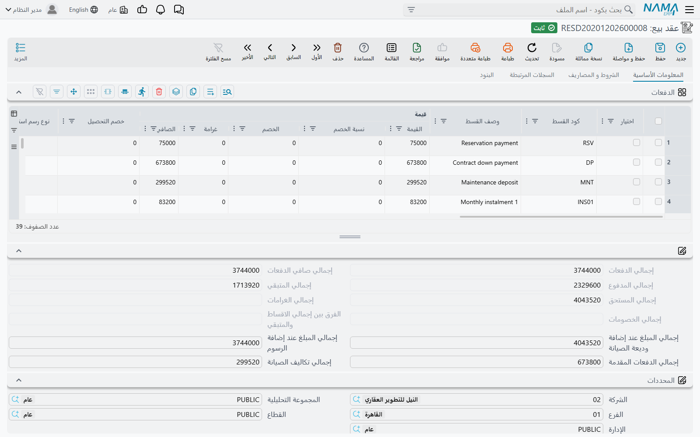

# إنشاء خطة الأقساط

العقار يُباع بالأجل. العميل الذي يوقّع على فيلا بمليون ومئتي ألف يدفع جزءاً منها في يومها ويسدّد الباقي على سنوات، في دفعات لكل منها تاريخ وكود، وتُحصَّل وتُخصم وتُغرَّم ويُقرَّر عنها كل واحدة على حدة. وهذه الخطة — مجموعة تفاصيل الدفع التي تنتج الرقم، ومجموعة بيانات إنشاء الأقساط التي تحدد شكله، وجدول الدفعات الناتج — هي النموذج المالي لوحدة العقارات كلها.

ويستحق تعلّمه مرة واحدة، لأنه **واحد في كل مستندات عائلة المبيعات**: [عقد البيع](/ar/modules/realestate/sales/realestate-sales-contract.md)، و[عقد البيع الافتتاحي](/ar/modules/realestate/opening/realestate-opening-sales.md)، و[سند التنازل](/ar/modules/realestate/sales/realestate-waiver-and-cancellation.md)، وعقد البيع المبدئي، و[مستند الحجز](/ar/modules/realestate/sales/realestate-reservations-and-initial-contracts.md)، وعقد شراء العقار — كلها تحمل المجموعات الثلاث نفسها والجدول نفسه. تعلّمه على عقد البيع تقرأ به بقيتها.

ويسير معنا المثال نفسه: **الفيلا B-12 بسعر 1,200,000، بدفعة مقدمة 20% قدرها 240,000، فيتبقى 960,000 تُقسَّم على 60 قسطاً شهرياً.**

## مجموعة تفاصيل الدفع

### من أين يأتي السعر

أعلى المجموعة عملية حسابية على المساحات: **مساحة الوحدة** × **سعر متر الوحدة**، زائد **مساحة الحديقة** × **سعر متر الحديقة**، يعطيان الأساس؛ ثم تُضاف **نسبة أو قيمة التمييز** (لقطعة ركنية أو إطلالة أفضل) و**نسبة أو قيمة الجراج**؛ فتستقر النتيجة في **السعر الكلي**.

ويمكنك ببساطة كتابة السعر. فهناك خيار على مستوى الوحدة يوقف اشتقاق سعر العقد من المساحات وأسعار المتر تماماً، وهو ما تريده حين تأتي أسعارك من قائمة أسعار لا من سعر للمتر. ويُضبط مرة واحدة لقاعدة البيانات في [إعدادات وحدة العقارات](/ar/modules/realestate/realestate-configuration.md).

الفيلا B-12: مساحة 300 م² بسعر 4,000 للمتر = 1,200,000.

### ما يُخصم من السعر

- **المدفوع من الحجز** — المبلغ الذي سبق أن دفعه العميل على [مستند الحجز](/ar/modules/realestate/sales/realestate-reservations-and-initial-contracts.md). وهناك خيار في التوجيه يقرر هل يُعتبر هذا المبلغ مسدداً من الأقساط أم لا.
- **التخفيض على السعر** — نسبة أو قيمة تُخصم من ثمن العقار نفسه، وله زوج حسابات خاص به في التوجيه، فيظهر التنازل السعري في القيد بدل أن يختفي داخل سعر أقل.
- **الدفعة المقدمة** — نسبة أو قيمة، ولها تاريخها. ويتتبع حقل نظامي ما تبقى منها غير مسدد. ويقرر خيار **الدفعة المقدمة بعد احتساب الخصم** هل تُحسب نسبة الدفعة قبل التخفيض على السعر أم بعده.

الفيلا B-12: بلا تخفيض، ودفعة مقدمة 20% = **240,000**، فيتبقى **960,000** للتقسيط.

### ما يُضاف فوق السعر

- **سعي المشتري** و**سعي المالك**، كل منهما نسبة أو قيمة — رسوم التسجيل والرسوم الإدارية موزعة بين الطرفين، ولكل منهما زوج حسابات في التوجيه.
- **وديعة الصيانة** — نسبة أو قيمة، مع **كيفية وديعة الصيانة**: إما **قسط منفرد** في تاريخ تحدده، أو **توزع على الاقساط** على امتداد الخطة، مع تاريخ سداد لأولها. وأيّ الحقلين (النسبة أم القيمة) هو الحقل الأصل إعدادٌ على مستوى الوحدة، كما أن هناك خياراً لاحتسابها بعد الخصم. ومسار الوديعة كاملاً في [صفحة ودائع الصيانة](/ar/modules/realestate/maintenance/realestate-maintenance-deposits-and-funds.md).
- **دفعة الاستلام** — نسبة أو قيمة بتاريخ. وهي الدفعة المستحقة عند تسلّم العميل للوحدة، وتُولَّد سطر قسط مستقلاً.

### الإجماليات

المجموعة السفلية نظامية بالكامل وتُعاد حسابيتها مع كل حفظ: إجمالي الأقساط، وصافي الأقساط، وإجمالي المدفوع، وإجمالي المتبقي، وإجمالي المستحق، وإجمالي الغرامات، وإجمالي الخصومات، وإجمالي الدفعات المقدمة، وإجمالي تكاليف الصيانة، والإجمالي عند إضافة وديعة الصيانة، والإجمالي عند إضافة الرسوم.

وأحدها أنفع من غيره عملياً: **الفرق بين إجمالي الاقساط والمتبقي**. فهذا الفرق تحديداً هو ما يقارنه تحقق الاعتماد بحد السماح المضبوط في إعدادات الوحدة، فإن رفض عقدٌ الاعتماد بسبب فرق تقريب فهذا هو الحقل الذي يخبرك بمقدار الفرق.

## مجموعة بيانات إنشاء الأقساط

هذه المجموعة **وصف** للخطة لا الخطة نفسها. تملؤها، وتضغط زراً، فتنتج السطور.

| الحقل | ماذا يفعل |
|---|---|
| **قيمة القسط** / **نسبة القسط** | حجم القسط الواحد: مبلغ، أو نسبة من المبلغ الجاري تقسيطه |
| **عدد الاقساط** | كم قسطاً |
| **فترة الاقساط** | المسافة بينها: *سنوية*، *نصف سنوي*، *ربع سنوية*، *شهرية*، *ثلث سنوي*، *سنتين*، *ثلاث سنوات*، *خمس سنوات*، *مرة واحدة*، *مع كل قسط* |
| **تاريخ بداية التقسيط** | متى يستحق أول قسط |
| **قيمة أول قسط** / **قيمة أخر قسط** | تجاوز قيمة السطر الأول أو الأخير، للخطط التي تُثقل البداية أو تنتهي بدفعة كبيرة |
| **جعل الأقساط مضاعفات للرقم** + **طريقة تقريب المضاعفات** | تقريب كل قسط إلى رقم صحيح مستدير: *التقريب لأعلى*، *التقريب لأسفل*، *لأقرب رقم* |
| **سياسة معالجة المبلغ المتبقي** | أين يذهب باقي التقريب: *يضاف للقسط الأول*، *يضاف للقسط الأخير*، *قسط أول منفرد*، *قسط أخير منفرد* |
| **نوع القسط** | ما نوع هذه السطور (انظر أدناه) |
| **توزيع كامل القيمة المتبقية على عدد الأقساط** | تجاهل القيمة والعدد أعلاه ووزّع ما تبقى |
| **قيمة القسط إجمالية وليست لكل قسط** | القيمة المكتوبة هي إجمالي هذا المقطع وتُقسم على العدد |
| **العمل بالتاريخ الهجري** | توليد تواريخ الاستحقاق على التقويم الهجري |

و[نموذج الدفع](/ar/modules/realestate/sales/realestate-price-lists-and-payment-methods.md) يخزّن هذه المجموعة بعينها مع فارق واحد: البداية فيه تُحفظ **كفترة إزاحة من تاريخ العقد** («بعد ثلاثة أشهر من التوقيع») لا كتاريخ مطلق، وتُحوَّل إلى تاريخ حقيقي عند تطبيق النموذج.

### الخطط ذات أكثر من شكل

الخطط الحقيقية نادراً ما تكون على وتيرة واحدة: 12 قسطاً ربع سنوي أثناء التنفيذ، ثم 40 قسطاً شهرياً بعد التسليم، ومقطع مستقل لتكاليف الصيانة. وجدول **بيانات الإنشاء المتعدد** هو مكان التعبير عن ذلك: سطر لكل مقطع، بنسبته أو قيمته وعدده وفترته وتاريخ بدايته وتقريبه ونوع قسطه وملاحظاته وخيار توزيع المتبقي. والمجموعة في الترويسة والجدول يُستخدمان معاً.

وثلاث قواعد يفرضها المولّد، كلها تظهر كرسالة لا كمفاجأة:

1. **لا يجوز تفعيل «توزيع كامل القيمة المتبقية» في أكثر من سطر واحد، ويجب أن يكون السطر الأخير.** فوظيفته استيعاب ما لم تستهلكه المقاطع السابقة، ولذلك لا يصح أن يقع في الوسط.
2. **هذا السطر لا يحمل قيمة ولا نسبة.** فتوزيع المتبقي وتحديد مبلغ تعليمتان متناقضتان.
3. **لا يمكن الجمع بين قيمة أو نسبة أو عدد أو فترة في الترويسة وبين «توزيع كامل القيمة المتبقية»** في الجدول.

### التقريب بالأرقام

الستون قسطاً تقسم 960,000 بالتمام: 16,000 لكل قسط ولا شيء للتقريب. غيّر الخطة إلى **55** قسطاً شهرياً فتفقد استواءها — 17,454.54 للقسط.

اضبط «جعل الأقساط مضاعفات للرقم» على 100 مع **التقريب لأسفل** فيصير كل سطر 17,400. وخمسة وخمسون منها = 957,000، فيتبقى **3,000**. وتحدد **سياسة معالجة المبلغ المتبقي** مصيرها: «يضاف للقسط الأخير» يجعل السطر الأخير 20,400، و«قسط أخير منفرد» يبقي 55 سطراً بقيمة 17,400 ويضيف سطراً سادساً وخمسين بقيمة 3,000. وفي الحالتين يبقى إجمالي الخطة 960,000، وهو ما يتحقق منه الاعتماد.

## سطر القسط عموداً عموداً

كل سطر متولد هو التزام واحد مؤرَّخ. وهذه أعمدة الجدول:

| العمود | ما هو |
|---|---|
| **اختيار** | لتحديد السطور التي تعمل عليها الأزرار أعلى الجدول |
| **كود القسط** | المعرّف الفريد للالتزام — ومستندات التحصيل تشير إليه بهذا الكود |
| **وصف القسط** | نص حر |
| **القيمة** | المبلغ الإجمالي للسطر |
| **نسبة الخصم** / **قيمة الخصم** | خصم متفق عليه مسبقاً ومبني داخل السطر |
| **خصم التحصيل** | نظامي — خصم تسوية يُمنح لاحقاً عند التحصيل |
| **غرامة** | نظامي — غرامة تأخير مضافة على السطر |
| **الصافي** | القيمة ناقص الخصومات زائد الغرامة، وهو المستحق فعلاً |
| **نوع رسم استثمار عقاري** | يُملأ حين يمثل السطر رسماً لا جزءاً من الثمن |
| **نوع القسط** | راجع القائمة أدناه |
| **تاريخ الاستحقاق** | متى يستحق |
| **مدفوع بالكامل** | يُقفل السطر دون تحصيل عليه — يُستخدم عند ترحيل التاريخ السابق |
| **المدفوع**، **مطلوب تحصيله**، **محصل باوراق قبض**، **المحصل نظاميا**، **المتبقي**، **مسدد** | نظامية — صورة التحصيل، يُعاد بناؤها من مستندات التحصيل |
| **الورقة التجارية** | نظامي — الشيك أو الورقة التي تغطي السطر |
| **سعر التحويل** | السعر المطبق على السطر |
| **قيمة مدمجة 1 … 5** | نظامية — ما دُمج في هذا السطر عند السداد العاجل |
| **ملاحظات** | نص حر |

والأعمدة النظامية هي أهم ما ينبغي فهمه عن هذا الجدول: **إنه صورة عن الواقع لا دفتر أستاذ.** فأنت لا تكتب مبلغاً مدفوعاً هنا أبداً؛ التحصيل يكتب سطور سداد في مكان آخر، ثم يُعاد حساب هذه الأعمدة منها. وأي عمود منها يتحرك عند وصول المال اختيارٌ يُضبط في توجيه مستند التحصيل، وهذه الآلية كاملة في [كيف يتم تحصيل الأقساط](/ar/modules/realestate/collections/realestate-collection-basics.md).

وأكواد الأقساط تُولَّد لك ما لم يكن خيار *تكويد يدوي* مفعّلاً في التوجيه. وبمجرد أن يُحصَّل السطر أو يُطلب تحصيله أو تغطيه ورقة تجارية يُجمَّد كوده ولا يمكن حذفه.

## زر إنشاء الأقساط

**إنشاء الأقساط**، في مجموعة الإجراءات أعلى الجدول، هو المولّد. يقرأ مجموعة بيانات إنشاء الأقساط، وجدول بيانات الإنشاء المتعدد، وسطور الرسوم، ومحتوى الجدول الحالي، ويطبّق القواعد الثلاث أعلاه، ثم **يعيد بناء جدول الدفعات**.

::: warning زر إنشاء الأقساط يستبدل الجدول بالكامل
هذا الزر لا يضيف سطوراً ولا يكمل نواقص — إنه يعيد توليد الجدول من مجموعة بيانات الإنشاء. وكل سطر موجود فيه يُلغى، بما في ذلك السطور التي كتبتها يدوياً والسطور التي عليها مبالغ محصَّلة بالفعل.

**ابنِ الخطة قبل أن تحصّل أي مبلغ.** وبعد أن يبدأ التحصيل عامل الجدول كأنه مغلق: فإن أسقطت إعادةُ البناء سطراً سبق سداده، سيرفض العقد الاعتماد برسالة *«لا يمكن حذف أو تغيير كود قسط مسدد»* — أي أن التحصيل نفسه في مأمن، لكن الجدول الذي كنت تعمل عليه ضاع ويحتاج إعادة بناء يدوية.

وإذا لزم فعلاً إعادة جدولة عقد قائم، فافعل ذلك بـ[ملحق](/ar/modules/realestate/sales/realestate-sales-contract.md) يضيف السطور الجديدة، أو بزر **دمج الأقساط** أدناه — لا بإعادة التوليد.
:::

## دمج الأقساط — السداد العاجل

العميل الذي سدّد عشرين قسطاً من ستين يأتيك عارضاً تصفية الباقي اليوم مقابل خصم. زر **دمج الأقساط** (سداد عاجل) هو هذه المعاملة.

حدّد مدى — إما من كود قسط إلى كود قسط، أو بين تاريخين — ثم اضغط الزر، فتنطوي السطور المحددة في **سطر واحد** يحمل نسبة خصم. تصير الأربعون سطراً بقيمة 16,000 سطراً واحداً بقيمة 640,000 ناقص الخصم المتفق عليه ومستحقاً الآن، وتسجّل أعمدة **القيمة المدمجة** ما انطوى فيه فلا يضيع التاريخ.

## أنواع الأقساط

كل سطر يحمل **نوع القسط**، والنوع ليس زينة. فهو يحدد ثلاثة أمور: كيف يوصَف السطر في الكشوف، وهل يُوجَّه إلى حسابات خاصة به عبر جدول **سطور إعدادات التوجيه** في [توجيه المستند](/ar/modules/realestate/document-terms/realestate-terms-basics.md)، وهل يدخل في الخصائص التي تستثني أنواعاً بعينها.

الأنواع التي ستستخدمها عملياً:

| النوع | ماذا يمثل السطر |
|---|---|
| **بيع** / **قسط** | أجزاء عادية من ثمن الشراء |
| **حجز** | مبلغ الحجز المرحَّل إلى العقد |
| **دفعة استلام** | الدفعة المستحقة عند التسليم |
| **المتبقي من الدفعة المقدمة** | الجزء غير المسدد من الدفعة المقدمة |
| **تكاليف صيانة** | وديعة الصيانة، سطراً واحداً أو موزعة |
| **تكاليف مياة** | تكاليف المياه، وأكثر استخدامها في جانب الإيجار |
| **تأمين** | التأمين المستَرد في جانب الإيجار |
| **سعي** / **سعي مالك** / **قيمة السعي** | عمولات الوساطة والسمسرة المحمولة كأقساط |
| **سنوية، نصف سنوي، ربع سنوية، شهرية، ثلث سنوي، سنتين، ثلاث سنوات، خمس سنوات** | سطور دورية الشكل للرسوم المتكررة |
| **أخرى 1 … أخرى 10** | عشر خانات حرة لما لا ينطبق عليه ما سبق |

وهناك موضعان يعاملان النوع معاملة خاصة: جدول **أنواع الأقساط المستثناة** في إعدادات الوحدة يُبعد أنواعاً مختارة عن الخصائص التي ترجع إليه، كما أن تقسيم القسط الواحد بين سنتين ماليتين لا يطبَّق أبداً على سطور تكاليف المياه والتأمين وتكاليف الصيانة والعمولة.

## المحرك نفسه في مكان آخر

لجانب الإيجار نظير خاص به: عقد الإيجار لا يحمل مجموعة إنشاء تملؤها بيدك، بل زر **إنشاء الإيجارات** الذي يشتق الجدول من الإيجار السنوي والفترة والزيادة السنوية وجدول المصروفات. وينتج سطور أقساط من النوع نفسه، في جدول من النوع نفسه، ويحمل التحذير نفسه بشأن استبدال الجدول. راجع [إنشاء جدول الإيجارات](/ar/modules/realestate/rent/realestate-rent-schedule.md).
