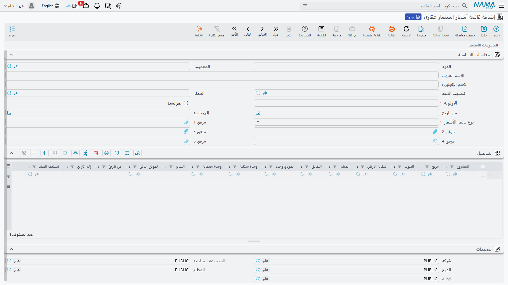
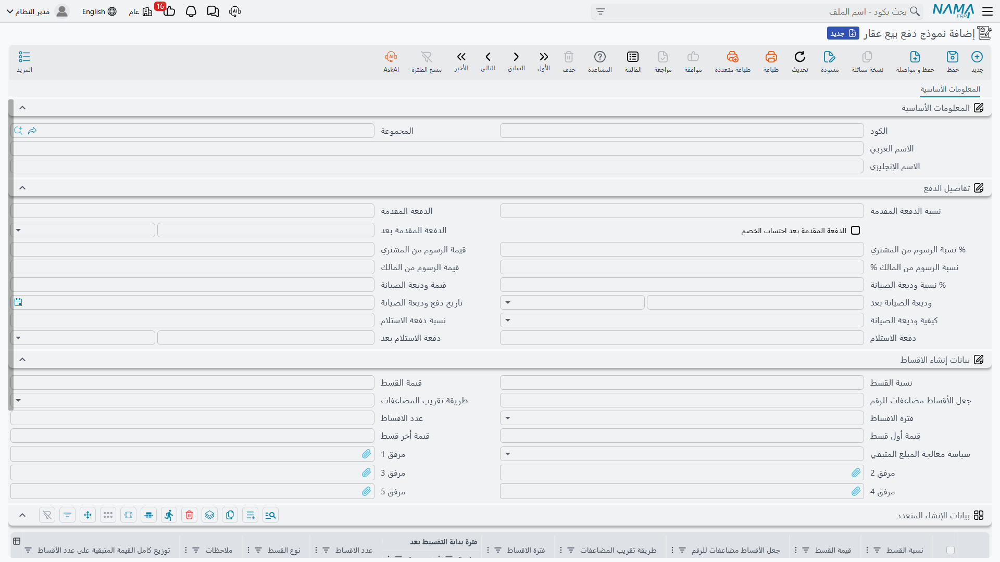

# قوائم الأسعار ونماذج الدفع

هناك رقمان لا ينبغي لمندوب المبيعات أن يكتبهما من ذاكرته: كم تساوي الوحدة، وكيف يُسمح للعميل أن
يدفع. كلاهما يعيش في ملف رئيسي، حتى يملأ عقد البيع نفسه بنفسه، وحتى يكون مدير المبيعات — لا المندوب —
هو من يقرر كم تساوي شقة الدور الثالث هذا الربع.

الملف الأول هو **قائمة أسعار استثمار عقاري**، وهي كتاب أسعار مؤرَّخ ومرتَّب بالأولوية. والثاني هو
**نموذج دفع بيع عقار**، وهو قالب خطة دفع يقول «20% مقدم ثم ستون قسطًا شهريًا» مرة واحدة بدل مائة مرة.

مثالنا العملي هو الفيلا B-12 في مجمع النخيل: وحدة بـ 1,200,000 تُباع بخطة مقدَّمها 20% وأقساطها ستون
شهرًا.

## قائمة أسعار استثمار عقاري

تُنشر قوائم الأسعار من **العقارات و الممتلكات > الملفات > قائمة أسعار استثمار عقاري** (الترخيص
`realestate-sales`). ويصف رأس القائمة **متى** تسري و**كم** تُفضَّل على غيرها:

| حقل الرأس | ما فائدته |
|---|---|
| **الأولوية** (إلزامي) | الفيصل عند التعارض. **الرقم الأصغر يفوز** — الأولوية 1 تتقدم على الأولوية 10. |
| **من تاريخ** / **إلى تاريخ** | مدة السريان. التاريخ الفارغ يعني مفتوحًا في ذلك الاتجاه. |
| **العملة** | العملة التي سُعِّرت بها الأسعار. |
| **نوع قائمة الأسعار** (إلزامي) | *بيع عقار* أو *إيجار عقار* — انظر أدناه. |
| **غير نشط** | يقاعد القائمة دون حذفها؛ القوائم غير النشطة لا تدخل المطابقة أبدًا. |
| تصنيف السجل | يجعل القائمة تسري على عقود تصنيف بعينه فقط. |

أما الجدول أسفل الرأس فيحمل الأسعار نفسها، سطرًا لكل قاعدة. وأعمدته تتبع شجرة العقار من أعلى لأسفل —
**المشروع** ثم **المربع** ثم **البلوك** ثم **قطعة الأرض** ثم **المبنى** ثم **الطابق** ثم **نموذج
الوحدة** ثم **الوحدة** ثم **مجموعة الوحدات** — يليها **السعر**، و**نموذج دفع بيع عقار** اختياريًا،
و**من تاريخ** و**إلى تاريخ** الخاصان بالسطر، وتصنيف السجل. أما الأولوية ونوع القائمة فليسا على السطر،
لأنهما ينزلان من الرأس، فالقائمة الواحدة دائمًا نطاق أولوية واحد.

وترك العمود فارغًا هو طريقتك في قول «أيًّا كان». فالسطر الذي يسمّي المشروع والسعر فقط قاعدة عامة
للمجمع كله، والسطر الذي يسمّي وحدة بعينها قاعدة لتلك الوحدة وحدها.

### نوعان من القوائم

**نوع قائمة الأسعار** يحدد أين يهبط السعر المطابق. فـ *بيع عقار* يغذّي السعر في مستندات عائلة البيع،
و*إيجار عقار* يغذّي قيمة الإيجار السنوي في شاشات الإيجار، ولهذا يظهر الملف الرئيسي نفسه في
[قسم التأجير](/ar/modules/realestate/rent/realestate-rent-contract.md) أيضًا. والقائمة التي تُترك بلا
نوع صريح تُعامَل معاملة قائمة بيع. والمطابقة لا تعبر بين النوعين إطلاقًا.

### كيف يُطابَق السعر فعليًا

حين يطلب العقد سعرًا، يفعل النظام ما يلي:

1. **يستبعد كل ما لا يمكن أن ينطبق:** القوائم النشطة فقط، والسطور التي تحوي مدة صلاحيتها تاريخ
   استحقاق المستند (والتاريخ الفارغ مفتوح)، والسطور التي يطابق نوعها النوع المطلوب.
2. **يفحص كل محدِّد في السطور الباقية.** والقاعدة واحدة في الوحدة ونموذج الوحدة والطابق والمبنى
   والبلوك وقطعة الأرض والمربع والمشروع ومجموعة الوحدات وتصنيف السجل ونموذج الدفع: قيمة السطر إما
   **تساوي قيمة العقار نفسه وإما تكون فارغة**. وانتبه للشق الثاني: إذا لم تكن للعقار قيمة في محدِّد ما
   — فقطعة الأرض مثلًا بلا طابق — فالسطر الذي يسمّي طابقًا لا يمكن أن يطابقها.
3. **يرتّب الناجين بالأولوية ويأخذ أفضل نطاق** أي الرقم الأصغر.
4. **وداخل ذلك النطاق يفضّل السطر الأكثر تحديدًا**: السطر الذي يسمّي العقار نفسه بوحدته أو مجموعته أو
   قطعة أرضه أو طابقه أو مبناه أو بلوكه أو مربعه أو مشروعه. وإلا أُخذ سعر أول مرشح.

وإذا لم يطابق شيء البتّة كان السعر العائد صفرًا — وهو ما يبدو على شاشة العقد خللًا في النظام، بينما هو
في الحقيقة «لا قاعدة تغطي هذه الوحدة اليوم».

::: details كتاب أسعار من سطرين لمجمع النخيل
انشر قائمة أولى بالأولوية **10** تسري من أول يناير، فيها سطر واحد يسمّي المشروع *مجمع النخيل* بسعر
1,000,000. ثم انشر قائمة ثانية بالأولوية **1** بالتواريخ نفسها، فيها سطر واحد يسمّي *المبنى B، الطابق
الثالث* بسعر 1,200,000.

شقة في الدور الأرضي بالمبنى A تطابق القائمة الأولى فقط فتُسعَّر بـ 1,000,000. أما الفيلا B-12 — المبنى
B والطابق الثالث — فتطابق القائمتين، وتفوز الأولوية 1، فيُسعَّر العقد بـ 1,200,000. وحين ينتهي تجميد
الأسعار تضع تاريخ انتهاء لقائمة الأولوية 1 بدل تعديل أسعارها، فيبقى تاريخ ما كنت تبيع به سليمًا.
:::

### التحقق من التداخل

لأن المطابقة تلقائية، فوجود قائمتين تدّعيان الوحدة نفسها في اليوم نفسه يجعل التسعير غير متوقع. ونَما
يرفض ذلك: يفشل حفظ القائمة إذا كانت هناك قائمة **نشطة** أخرى من النوع نفسه تحوي سطرًا بنفس تركيبة
المعايير تمامًا — نوع القائمة ونموذج الوحدة ومجموعة الوحدات وتصنيف السجل والمشروع والمربع والبلوك
والمبنى والطابق والوحدة وقطعة الأرض — ضمن **مدة متداخلة**. والرسالة تسمّي القائمة المتعارضة حتى تصل
إليها مباشرة. عالج الأمر بتعديل التواريخ، أو بتقاعد القائمة الأقدم، أو بجعل أحد السطرين أكثر تحديدًا.

### جعل قائمة الأسعار ملزِمة

قائمة الأسعار افتراضيًا تسهيل: تملأ السعر ويظل بوسع المندوب الكتابة فوقه. فإذا فعّلت خيار **الالتزام
بقوائم الأسعار** في توجيه المستند صارت قاعدة — فلا يُعتمد العقد إلا إذا ساوى سعره السعر الذي تنتجه
القائمة لتلك الوحدة، وتذكر رسالة الخطأ الأرقام الثلاثة: العقار، والسعر في القائمة، والسعر المكتوب.
والخيار متاح على عقد البيع وعقد البيع المبدئي ومستند الحجز وسند إلغاء الحجز وعقد شراء العقار، فتفرضه
حيث تحتاجه بالضبط. راجع
[توجيهات مستندات البيع](/ar/modules/realestate/document-terms/realestate-terms-sales.md).

## نموذج الدفع

نموذج الدفع (**العقارات و الممتلكات > الملفات > نموذج دفع بيع عقار**، الترخيص `realestate-sales`) هو
العرض التجاري مكتوبًا مرة واحدة. فكل ما كان المندوب سيكتبه في العقد يدويًا — الدفعة المقدمة والرسوم
ووديعة الصيانة ودفعة الاستلام وشكل جدول الأقساط نفسه — يُخزَّن هنا ويُطبَّق على العقد باختيار حقل مرجع
واحد.

والشاشة ثلاث مجموعات.

**تفاصيل الدفع** تحمل الأموال التي ليست أقساطًا عادية: الدفعة المقدمة بنسبة *أو* بقيمة ومعها فترتها؛
وخيار **الدفعة المقدمة بعد احتساب الخصم** الذي يحدد أتُحسب الدفعة قبل التخفيض على السعر أم بعده؛ ورسوم
المشتري ورسوم المالك، كل منهما بنسبة أو بقيمة؛ ووديعة الصيانة بنسبة أو بقيمة ومعها فترتها وتاريخ
سدادها وكيفيتها (**قسط منفرد** أو **توزع على الاقساط**)؛ ودفعة الاستلام — المستحقة عند تسلّم العميل
للوحدة — بنسبة أو بقيمة ومعها فترتها.

**بيانات إنشاء الاقساط** تصف الجدول: قيمة القسط أو نسبته، وعدد الأقساط، وفترة الأقساط، وقيمة أول قسط
وقيمة آخر قسط، و**جعل الأقساط مضاعفات للرقم** مع **طريقة تقريب المضاعفات**، و**سياسة معالجة المبلغ
المتبقي** بعد التقريب، وخيار **العمل بالتاريخ الهجري** الذي يغيّر حساب كل تاريخ في الخطة.

**بيانات الإنشاء المتعدد** هي الجدول الخاص بالخطط غير المنتظمة — سنة أولى بأقساط صغيرة ثم أقساط أكبر،
أو مسار منفصل لسطور تكاليف الصيانة. وكل سطر يكرر حقول الإنشاء ويضيف نوع القسط وبداية احتسابه.

::: tip التواريخ مخزَّنة كفترات لا كتواريخ
هذا هو الفارق البنيوي الوحيد بين القالب وشاشة العقد. فالعقد فيه **تاريخ بداية التقسيط** حقيقي، أما
القالب ففيه **فترة بداية التقسيط** — مدة مثل «شهر واحد» تُقاس **من تاريخ العقد**. والأمر نفسه ينطبق على
فترات الدفعة المقدمة ووديعة الصيانة ودفعة الاستلام. وهذا ما يجعل القالب الواحد صالحًا لعقود وُقّعت في
شهور مختلفة: تتحول الفترات إلى تواريخ حقيقية لحظة تطبيق القالب.
:::

### كيف يُطبَّق

لا تضغط شيئًا. فاختيار نموذج الدفع على عقد بيع أو عقد بيع افتتاحي أو سند تنازل ينسخ مجموعة الإنشاء من
القالب إلى المستند، ويدمج مجموعة تفاصيل الدفع في مجموعة سعر المستند، محوّلًا الفترات الثلاث إلى تواريخ
حقيقية أثناء ذلك. وإذا كانت الوحدة نفسها تسمّي نموذج دفع افتراضيًا فهو المستخدَم ما لم يختر المندوب
غيره — ولأن سطر قائمة الأسعار يستطيع هو أيضًا أن يسمّي نموذج دفع، فقد يأتي السعر والخطة معًا بمجرد
اختيار الوحدة.

::: details «20% مقدم و60 قسطًا شهريًا» على الفيلا B-12
القالب يقول: دفعة مقدمة 20% وفترتها شهر واحد؛ و60 قسطًا شهريًا، وفترة بداية التقسيط شهر واحد،
والمضاعفات 100.

بتطبيقه على فيلا بـ 1,200,000 في عقد مؤرخ في 1 مارس تنتج دفعة مقدمة 240,000 مستحقة في 1 أبريل،
و960,000 موزعة على 60 قسطًا شهريًا قيمة كل منها 16,000، أولها مستحق في 1 أبريل أيضًا. وإذا غيّرت تاريخ
العقد إلى 1 سبتمبر تحركت كل هذه التواريخ معه، والقالب كما هو لم يُمس.
:::

وينتهي دور القالب هنا: فهو يصف الخطة ولا يبنيها. جدول الأقساط يُنشأ على العقد نفسه بزر **إنشاء
الاقساط**، وهناك تظهر أهمية قواعد التقريب وسطر توزيع المتبقي وأنواع الأقساط، وكل ذلك في صفحة
[إنشاء خطة الأقساط](/ar/modules/realestate/sales/realestate-installment-plans.md).

## إلى أين بعد ذلك

- المستند الذي يستهلك الملفين معًا:
  [عقد البيع](/ar/modules/realestate/sales/realestate-sales-contract.md)
- كيف تُبنى الخطة من القالب:
  [إنشاء خطة الأقساط](/ar/modules/realestate/sales/realestate-installment-plans.md)
- استخدام قائمة الأسعار في جانب الإيجار:
  [إنشاء جدول الإيجارات](/ar/modules/realestate/rent/realestate-rent-schedule.md)
- موقع هذين الملفين من القصة كلها:
  [دورة بيع العقار](/ar/modules/realestate/sales/realestate-sales-cycle.md)
