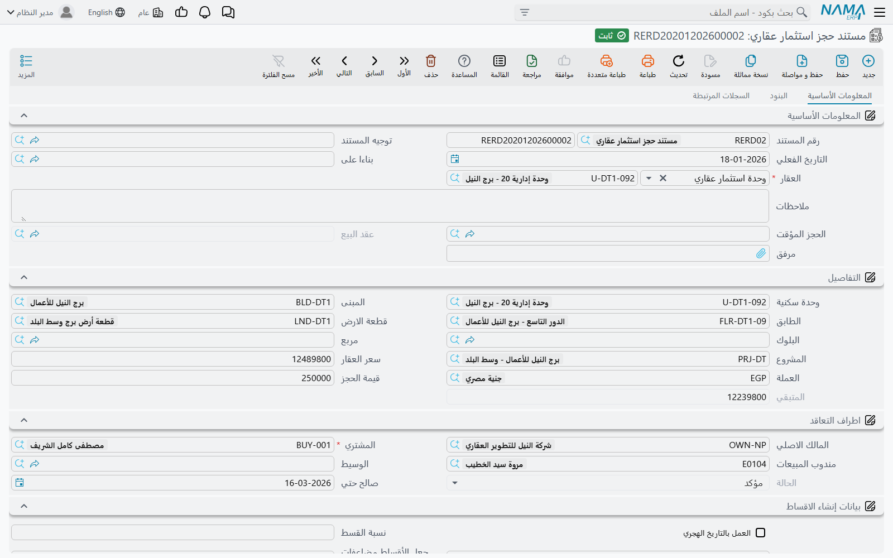
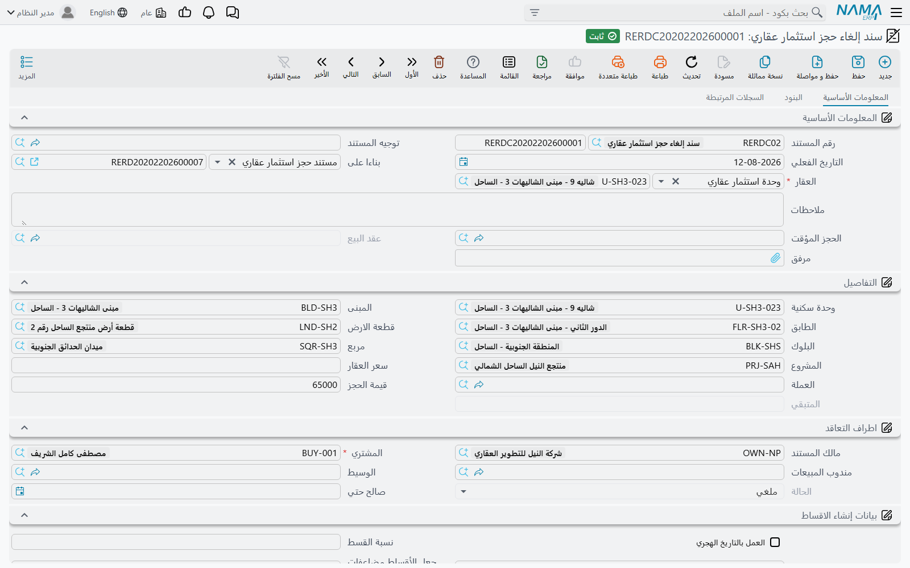
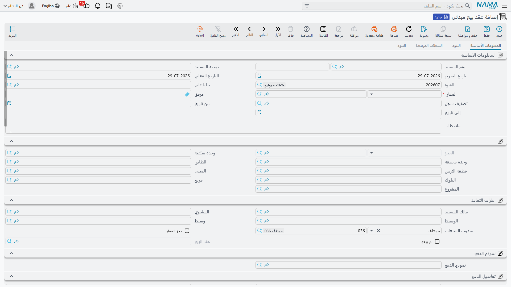

# الحجوزات وعقود البيع المبدئية

بين «العميل مهتم» و«العميل اشترى» فترة يجب أن تُرفع فيها الوحدة من المعروض دون أن يُعترف بأي إيراد.
وفي هذه الفترة تعيش ثلاثة مستندات، وكل منها يقفل الوحدة بطريقة مختلفة.

**مستند الحجز** يحتفظ بالدفعة ويقفل الوحدة — لكن من لحظة تأكيده فقط. و**سند إلغاء الحجز** يحرّرها
ويسوّي ما تحتفظ به الشركة. و**عقد البيع المبدئي** اتفاق تمهيدي كامل يستطيع هو أيضًا أن يقفل الوحدة ومع
ذلك لا ينتج عنه أي قيد محاسبي إطلاقًا.

ونتابع هنا الفيلا B-12 من [صفحة دورة البيع](/ar/modules/realestate/sales/realestate-sales-cycle.md):
سعرها 1,200,000، حُجزت بدفعة 20,000، ثم تحولت إلى عقد.

## مستند الحجز

تصدره من **العقارات و الممتلكات > مبيعات > مستند حجز استثمار عقاري**. وانتبه للترخيص: هذا المستند
مرتبط بترخيص `realestate` لا `realestate-sales`، أي أنه متاح حتى في تركيب لا يملك إلا الترخيص
الأساسي للعقارات.

الصفحة الأولى (**المعلومات الأساسية**) هي المستند كله. تبدأ بحقل **بناءا على** والعقار، ومعهما رابط
إلى الحجز المؤقت الذي جاء منه الحجز، وحقل نظامي سيشير لاحقًا إلى عقد البيع. ثم مجموعة التفاصيل التي
تحمل تسلسل العقار — الوحدة والمبنى والطابق وقطعة الأرض والبلوك والمربع والمشروع — ومعها سعر الوحدة
والعملة والمبلغ الذي دفعه العميل فعلًا للحجز والمتبقي الذي يحسبه النظام (السعر ناقص المدفوع). ثم
مجموعة **اطراف التعاقد** بالمالك والمشتري ومندوب المبيعات والوسيط، ومعها حقل **الحالة** وتاريخ نهاية
صلاحية الحجز. والصفحة الثانية جدول البنود، والثالثة تعرض سندات التحصيل الصادرة على هذا الحجز.

وقائمة اختيار العقار ضيقة عن قصد: لا تعرض إلا العقارات التي حالتها *Avaliable* ولم تُعلَّم كمحجوزة.
فإذا لم تجد الفيلا التي تتوقعها في القائمة فهي محجوزة أو مباعة بالفعل.

### الحالة هي القصة كلها

| الحالة | معناها |
|---|---|
| **مبدئي** | الحالة الافتراضية للسجل الجديد. المستند موجود، و**الوحدة غير مقفلة**. |
| **مؤكد** | الوحدة محجوزة. وهذه هي الحالة الوحيدة التي تقفل شيئًا. |
| **ملغي** | تُرك الحجز وحُرِّرت الوحدة. |
| **مباعة** | اعتُمد عقد بيع على هذا الحجز. |

وحقل **الحالة** للقراءة فقط، فلا تستطيع الكتابة فيه. إنه يتحرك حين تضغط زر **مؤكد** أو زر **ملغي** على
المستند، ويتحرك من تلقاء نفسه حين يُعتمد عقد البيع.

::: info الحجز الذي بقي «مبدئي» لا يحمي شيئًا
اعتماد المستند وحده لا يكفي. فما لم يضغط أحدهم **مؤكد** تظل الفيلا B-12 ظاهرة كمتاحة في كل شاشات
البحث عن العقارات، ويستطيع زميل أن يبيعها. وعقد البيع يفرض القاعدة نفسها من الجهة الأخرى: العقد
المبني على حجز ما زال *مبدئيًا* — أو صار *ملغيًا* — يُرفض برسالة تفيد بأن حالة مستند الحجز غير صالحة.
:::

والإلغاء يعكس القفل بالطريقة نفسها تمامًا: نقل حجز مؤكد إلى *ملغي* يحرّر الوحدة من جديد. وكذلك إلغاء
اعتماد المستند.

### ماذا يقيّد

مستند الحجز يقيّد في الأستاذ فعلًا، لكن للدفعة وحدها. يُنتَج سطر مدين وسطر دائن للمبلغ المدفوع —
20,000 في مثالنا — من حسابَي **مدين دفعة الحجز** و**دائن دفعة الحجز** في توجيه المستند. ويُستخدم
المالك كمورّد والمشتري كعميل على هذين السطرين، ويأتي معهما مندوب المبيعات والعقار كمصادر تحليل، حتى
يمكن تقرير القيد بالوحدة وبالمندوب.

وما عدا ذلك على الشاشة لا يُقيَّد. فالسعر 1,200,000 يجلس على المستند كمعلومة، ولا يصير مديونية إلا عند
اعتماد عقد البيع.

وإذا تُرك جانبا الحساب فارغين فلن يُنتَج قيد أصلًا — وهو إعداد مشروع إذا كانت شركتك تعامل دفعات الحجز
كمسألة خزينة وتسجّلها في مكان آخر.

أما الصفحة الثانية من التوجيه فتحمل إعدادين: **الالتزام بقوائم الأسعار** الذي يجعل سعر القائمة إلزاميًا
(راجع [قوائم الأسعار ونماذج الدفع](/ar/modules/realestate/sales/realestate-price-lists-and-payment-methods.md))،
و**اعتبار المدفوع من الحجز مسدد من الأقساط** الذي يحدد هل تُعامَل الدفعة المسددة هنا كسداد لأقساط العقد
التالي بدل أن تخفّض الرصيد فحسب.

### تحويله إلى عقد

حين يوقّع العميل، اضغط **إنشاء سند بيع** على مستند الحجز بعد حفظه. يفتح نَما عقد بيع جديدًا مملوءًا
مسبقًا بالعقار والمشتري والمالك والوسيط والبلوك وقطعة الأرض والوحدة والمربع والسعر — والأهم: العشرون
ألفًا في حقل **المدفوع من الحجز**، حتى تبدأ خطة العقد من الرصيد الصحيح.

وعند الاعتماد يجعل العقد حالة الحجز **مباعة** ويحتفظ برابط إليه. وإذا ألغيت اعتماد العقد عاد الحجز إلى
**مؤكد** وأُفرِغ الرابط، فيصلح للاستخدام مرة أخرى.

وهناك تحققان يمسكان الأخطاء الشائعة:

- الحجز الذي يشير بالفعل إلى عقد بيع **مختلف** لا يمكن إعادة استخدامه، ويُرفض الاعتماد برسالة تفيد بأن
  مستند الحجز مستخدَم من قبل.
- وإذا كانت الوحدة تحمل مستند حجز بينما حقل الحجز في العقد فارغ فشل الاعتماد برسالة تقول إن للعقار
  مستند حجز. وهذا الحقل يديره النظام: لا تملؤه بيدك، بل تضع الحجز في حقل **بناءا على** فيُنشأ الربط
  نيابة عنك.

ويحمل مستند الحجز أيضًا جدول أقساط خاصًا به مع زر **إنشاء الاقساط**، وأزرار إنشاء سند تحصيل أو سند قبض
من السطر المختار — وهي مفيدة حين تُدفع الدفعة على زيارتين أو ثلاث لا دفعة واحدة.

## إلغاء الحجز

يغيّر العميل رأيه. و**العقارات و الممتلكات > مبيعات > سند إلغاء حجز استثمار عقاري** (الترخيص
`realestate`) هو المستند الذي يفك الحجز ويسوّي المال: عادةً يُستقطع جزء من العشرين ألفًا كرسم إلغاء
ويُرد الباقي.

وهو يستخدم شاشة مستند الحجز نفسها، مضافًا إليها جدول **بيانات الإنشاء المتعدد** في الصفحة الأولى. أما
مجموعة الأزرار فهي التي تخبرك باتجاه المال: فبدل سند القبض تجد **إنشاء سند صرف للأقساط المختارة** —
لأن الشركة هنا تدفع.

واعتماده يحرّر الوحدة. وخلافًا لكل مستندات هذه العائلة لا يفحص هذا السند هل يمكن حجز الوحدة، للسبب
البديهي أنها محجوزة أصلًا.

ومحاسبته أغنى بكثير من سطرَي الحجز. فسند الإلغاء يبني قيدًا كاملًا بنمط عقد البيع: سطور إعدادات
التوجيه لكل نوع قسط، وتقسيم الأقساط بين الإيرادات والإيرادات المقدمة حسب تاريخ الاستحقاق، والسعر،
ورسوم المالك، ورسوم المشتري، ووديعة الصيانة، والخصومات، والغرامات — ولا تظهر أي كتلة منها إلا إذا
أُعدّت حساباتها، ولا يُنتَج قيد إطلاقًا إن لم يُعدّ أي منها. وتُضبَط الحسابات وتوجيه كل نوع قسط في
توجيه المستند، وميكانيكا ذلك في صفحة
[كيف تعمل توجيهات مستندات العقارات](/ar/modules/realestate/document-terms/realestate-terms-basics.md).

## عقد البيع المبدئي

كثير من المطورين يوقّعون اتفاقًا تمهيديًا — بالسعر الكامل والجدول الكامل وتوقيع الطرفين — قبل العقد
الموثق بأسابيع أو شهور. و**العقارات و الممتلكات > مبيعات > عقد بيع مبدئي** (الترخيص
`realestate-sales`) هو ذلك الاتفاق.

وعلى الشاشة يبدو كالعقد الحقيقي تمامًا: تسلسل العقار، وأطراف التعاقد ومنهم الوسيط ومندوب المبيعات،
ونموذج الدفع، ومجموعة السعر كاملة، وبيانات إنشاء الأقساط وجدول الدفعات، وصفحتا البنود. وفيه **من
تاريخ** و**إلى تاريخ** لصلاحية الاتفاق التمهيدي، وحقلان نظاميان — **تم بيعها** و**عقد البيع** — يسجلان
هل تحوّل إلى عقد حقيقي وأيّ عقد.

وأمران يميزانه، وكلاهما مهم.

**يستطيع أن يقفل الوحدة.** فعّل خيار **حجز العقار** فيصير اعتماد المستند حاجزًا للوحدة تمامًا كما يفعل
الحجز المؤكد. وإن أردت أن يكون ذلك قاعدة لا اختيارًا، فعّل *حجز العقار* في توجيه المستند فيفرض كل عقد
مبدئي صادر بهذا التوجيه العلامة على نفسه. وإلغاء الاعتماد يحرر الوحدة مجددًا.

**ولا ينشئ أي تأثير محاسبي على الإطلاق.** لا قيدًا مؤجلًا ولا قيدًا تذكيريًا — لا شيء. وتوجيه المستند
الخاص به فيه صفحة إعدادات وبلا حسابات إطلاقًا، لأنه لا ترحيل هنا لتتحكم فيه الحسابات. وهذا يفاجئ
الناس، لأن المستند يحمل سعرًا قدره 1,200,000 وستين قسطًا ويبدو من كل وجه عقدًا. لكن هذه الأقساط خطة لا
مديونية؛ فلا شيء مستحق لك في الأستاذ حتى يُعتمد عقد البيع.

أما الإعدادات الموجودة فعلًا في التوجيه فتخص التحقق وطريقة بناء الخطة:

| خيار التوجيه | ماذا يفعل |
|---|---|
| **له مشتري** | يجعل المشتري إلزاميًا قبل اعتماد المستند. |
| **حجز العقار** | يفرض علامة *حجز العقار* على المستند، فيقفل كل عقد بهذا التوجيه وحدته. |
| **دمج سطور الدفعات المتشابهة** | يدمج سطور الأقساط المتطابقة عند إنشاء الخطة. |
| **الالتزام بقوائم الأسعار** | يرفض الاعتماد ما لم يساوِ السعر سعر القائمة لتلك الوحدة. |
| **اعتبار المدفوع من الحجز مسدد من الأقساط** | يعامل ما دُفع في الحجز كسداد لأقساط بدل أن يخفّض الرصيد. |

### من التمهيدي إلى الملزِم

لا يوجد هنا زر «إنشاء عقد بيع». بل تفتح عقد بيع جديدًا وتضع العقد المبدئي في حقل **بناءا على**، ولأن
العقد المبدئي مستند حامل للحجز فإن العقد يلتقط الربط تلقائيًا. وعند الاعتماد يُختم العقد المبدئي بـ
**تم بيعها** ويشير إلى عقد البيع — ويُرفض أي عقد بيع ثانٍ مبني على العقد المبدئي نفسه لأنه بيع بالفعل.

::: tip ترحيل الأقساط المسددة
إذا كان العملاء يسددون أقساطًا على الاتفاق التمهيدي، فعّل خيار نقل الأقساط المسددة من العقد المبدئي
إلى عقد البيع في إعدادات الوحدة حتى لا تضيع تلك المدفوعات عند التحويل. راجع
[إعدادات وحدة العقارات](/ar/modules/realestate/realestate-configuration.md).
:::

## إلى أين بعد ذلك

- العقد الملزم الذي تغذّيه هذه المستندات:
  [عقد البيع](/ar/modules/realestate/sales/realestate-sales-contract.md)
- نموذج المال المشترك بين الشاشات الثلاث:
  [إنشاء خطة الأقساط](/ar/modules/realestate/sales/realestate-installment-plans.md)
- الحسابات خلف الحجز وإلغائه:
  [توجيهات مستندات البيع](/ar/modules/realestate/document-terms/realestate-terms-sales.md)
- موقع هذه المستندات من القصة كلها:
  [دورة بيع العقار](/ar/modules/realestate/sales/realestate-sales-cycle.md)
