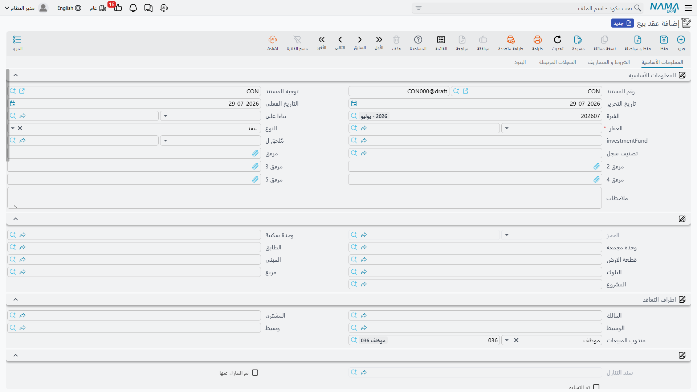
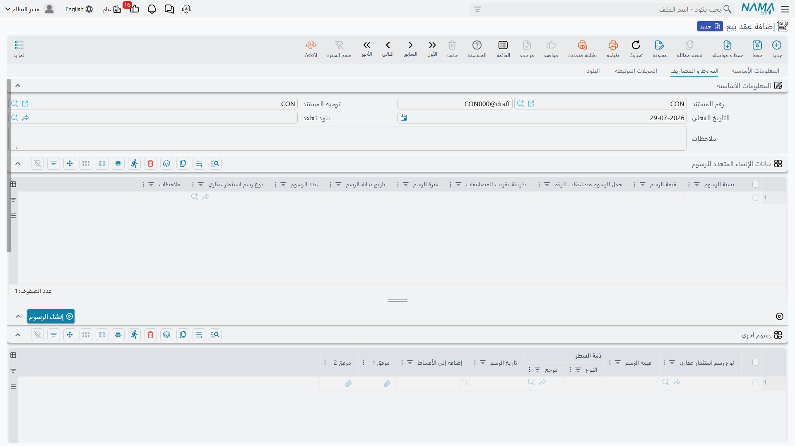

# عقد البيع

كل ما يسبق هذه الخطوة في [دورة بيع العقار](/ar/modules/realestate/sales/realestate-sales-cycle.md) هو تعبير عن نية لا أكثر. عرض السعر سعرٌ على ورق، والحجز المؤقت وعدٌ بالاحتفاظ بالوحدة أياماً معدودة، وحتى مستند الحجز المؤكد لا يُثبت سوى المبلغ الذي دفعه العميل عند الحجز، أما عقد البيع المبدئي فلا ينشئ أي قيد على الإطلاق.

عقد البيع هو اللحظة التي يصبح فيها البيع حقيقة. اعتماد العقد يجعل الوحدة **مباعة**، ويكتب المشتري عليها، ويحوّل خطة السداد إلى مديونية على العميل، وينتج القيد الوحيد الذي يُثبت ثمن العقار. **وهو المستند الوحيد في عائلة المبيعات الذي يُثبت إيراد البيع نفسه**، وكل ما يأتي بعده — سندات التحصيل، الغرامات، التسليم، التنازل — معلّق عليه.

تجده في **العقارات و الممتلكات > مبيعات > عقد بيع**، ويحتاج ترخيص `realestate-sales`.

سنسير في هذه الصفحة على مثال واحد: بيع **الفيلا B-12 في كمبوند النخيل** بمبلغ **1,200,000**، بدفعة مقدمة 20% قدرها **240,000**، وستين قسطاً شهرياً قيمة كل منها **16,000**، وعمولة وسيط **2%**.

## ملء العقد مجموعة تلو الأخرى

### البيانات الأساسية ومن أين جاء العقد

أعلى الصفحة الأولى هي ترويسة المستند المعتادة — الدفتر والكود، توجيه المستند، تاريخ الإصدار، تاريخ القيمة والفترة المالية — يليها الحقلان اللذان يحددان شكل بقية الشاشة.

**بناءا على** (From Document) هو الطريق الذي يرث به العقد تاريخه. وجّهه إلى مستند الحجز المؤكد للفيلا B-12 فينتقل إليه المشتري والعقار والمبلغ المدفوع عند الحجز ونموذج الدفع. وجّهه إلى عقد بيع مبدئي فيحدث الشيء نفسه من هناك. أما حقل **الحجز** (Reservation) الظاهر أسفل قليلاً فهو حقل نظامي — يُملأ من حقل «بناءا على» ولا يمكن الكتابة فيه. إن أردت ربط العقد بحجز فاضبط «بناءا على»، ولا تبحث عن طريقة لتحرير حقل الحجز.

**العقار** (Estate) هو الأصل المباع — وحدة أو قطعة أرض أو دور أو مبنى أو بلوك أو [مجموعة وحدات](/ar/modules/realestate/properties/realestate-buildings-floors-and-units.md). اختياره يملأ سلسلة الموقع أسفله (المشروع، المربع، البلوك، المبنى، الدور، الأرض، الوحدة، مجموعة الوحدات)، فلا تكتب العنوان مرتين. وقائمة الاختيار مفلترة: لا تعرض إلا العقارات المتاحة (*Avaliable* بالهجاء الظاهر على الشاشة) وغير المحجوزة، ولهذا لا تظهر أصلاً وحدة يحجزها زميل لك.

يكمل المجموعة حقل **النوع** (راجع فقرة «عقد أم ملحق» أدناه)، وصندوق الاستثمار إن كانت الوحدة تابعة له، وتصنيف السجل، وخمسة مرفقات وملاحظات.

### أطراف التعاقد

أربعة أطراف وموظف واحد:

| الحقل | من هو |
|---|---|
| **المالك** (Land Owner) | الطرف البائع — الجهة التي تُباع منها الوحدة |
| **المشتري** (Buyer) | العميل، وهو الطرف الذي تُقيَّد عليه المديونية |
| **الوسيط** (Mediator) | طرف ثالث وسيط يُسجَّل للعلم |
| **وسيط** (Broker) | الوسيط العقاري |
| **مندوب المبيعات** (Sales Man) | موظف لديك أو طرف ثالث |

نقطتان تستحقان الانتباه. الأولى أن **المشتري إلزامي** ما لم يُطفأ خيار *له مشتري* (Has Buyer) في توجيه المستند، وهو مفعّل افتراضياً وينبغي أن يبقى كذلك في بيع حقيقي. والثانية أن حقل **وسيط** في الترويسة للعلم فقط: تسمية وسيط هنا لا تنشئ سطر عمولة ولا تُنتج أي قيد. العمولات تُدخَل يدوياً في جدول العمولات لاحقاً، وهي وحدها ما يُحدث أثراً مالياً. أما ملف الوسيط نفسه فموصوف في [صفحة الأدلة](/ar/modules/realestate/costs/realestate-fee-commission-and-expense-types.md).

أسفل الأطراف مباشرة مجموعة صغيرة من ثلاثة حقول للقراءة فقط: سند التنازل، وعلامة «تم التنازل عنها»، وعلامة «تم التسليم». لا تملأ هذه الحقول أبداً؛ فهي تُضاء وحدها عند إصدار [سند تنازل](/ar/modules/realestate/sales/realestate-waiver-and-cancellation.md) أو [مستند تسليم](/ar/modules/realestate/sales/realestate-handover.md) على العقد.

### الجانب المالي

وسط الصفحة الأولى بالكامل — مجموعة تفاصيل الدفع، وبيانات إنشاء الأقساط، وجدول بيانات الإنشاء المتعدد، وأزرار الإجراءات، وجدول الدفعات — هو النموذج المالي المشترك بين كل مستندات عائلة المبيعات، وله [صفحة مستقلة](/ar/modules/realestate/sales/realestate-installment-plans.md) يُستحسن قراءتها قبل ملء أي شيء هنا. باختصار: مجموعة تفاصيل الدفع تشتق 1,200,000 من المساحات وأسعار المتر (أو تكتبها بنفسك)، وتخصم منها الدفعة المقدمة 240,000، وتضيف الرسوم ووديعة الصيانة، فيتبقى المبلغ الذي يجري تقسيطه؛ ثم تصف مجموعة بيانات إنشاء الأقساط كيف يتحول هذا المتبقي إلى ستين سطراً، ويقوم زر إنشاء الأقساط ببنائها.

وإن كانت منشأتك تعمل بقوائم أسعار ونماذج دفع جاهزة، فاختيار **نموذج الدفع** يجلب الخطة كاملة معبأة — راجع [قوائم الأسعار ونماذج الدفع](/ar/modules/realestate/sales/realestate-price-lists-and-payment-methods.md).

### الرسوم والعمولات

الصفحة الثانية **الشروط و المصاريف** تحمل ثلاثة جداول ينتهي كل منها إلى مبالغ.

**سطور بيانات الرسوم** ليست قائمة رسوم بل مولّد لها. السطر الواحد يصف رسماً **متكرراً**: نسبة أو قيمة، وعددها، وعلى أي فترة، وبدءاً من متى، ومقرَّبة إلى أي مضاعف، ومن أي نوع رسم. والضغط على **إنشاء الرسوم** (Create Fees) يفكّ هذه الأوصاف إلى سطور حقيقية في جدول **رسوم أخري**، مؤرخة من تاريخ الدفعة المقدمة (أو تاريخ قيمة المستند إن لم يكن هناك تاريخ دفعة)، ومرتبة بتاريخ الرسم.

**رسوم أخري** هو مكان الرسوم الفعلية، سواء وُلِّدت أو كُتبت مباشرة: نوع الرسم، وقيمته، وذمة السطر، وتاريخ الرسم، وخيار **إضافة إلى الأقساط** الذي يدمج الرسم في خطة السداد بدل أن يبقى قائماً بذاته. وحسابات هذه السطور تأتي من **مدين الرسم ودائن الرسم المعرَّفين على نوع الرسم نفسه** — وهو أحد المواضع القليلة في الوحدة التي تُقرأ فيها الحسابات من ملف رئيسي لا من توجيه المستند. وهناك خيار في التوجيه، *عدم إنشاء قيد محاسبي لسطور رسوم أخرى*، يوقف هذه القيود تماماً إن كنت تفضّل معالجة الرسوم بطريقة أخرى.

**جدول الشروط** في الصفحة نفسها يحمل نص شروط العقد، ويُنسخ عادة من ملف بنود التعاقد القياسية. أما صفحة **البنود** المستقلة فهي النسخة المهيكلة منه: سطر لكل بند قياسي بتاريخ انتهاء مخطط، وتاريخ ممدَّد، وتاريخ تنفيذ، وغرامات تمديد إن وُجدت. والاثنان موصوفان في [صفحة الملاك وبنود التعاقد](/ar/modules/realestate/properties/realestate-owners-and-contract-clauses.md).

## جدول العمولات

هذا هو الجدول الذي يدفع لمن باع الوحدة، ويستحق قراءة متأنية لأن **توقيت** إثباته يفاجئ كثيرين.

كل سطر يحمل **نوع العمولة**، و**مستحق العمولة** — موظف أو وسيط عقاري أو طرف ثالث — واسمه، و**النسبة**، و**القيمة**، إضافة إلى خيار **احتساب النسبة من القيمة** ومرفقين.

**الأساس الذي تُحسب عليه النسبة لا يُختار في العقد، بل يأتي من نوع العمولة.** فكل نوع عمولة يحمل إعداد *Calculate Commission Based On* (يظهر بهذا النص على الشاشة)، وهو ما يحدد ما تقتطع منه النسبة:

| الأساس | ما تُحسب النسبة منه |
|---|---|
| **سعر الوحدة** (الافتراضي) | إجمالي سعر العقد |
| **الصافي** | المتبقي على العقد |
| **رقم 1 … رقم 5 من الوحدة** | أحد الحقول الرقمية الحرة الخمسة على سجل العقار |
| **رقم 1 … رقم 5 من العقد** | أحد الحقول الرقمية الحرة الخمسة في ترويسة العقد |

اختيار نوع العمولة يملأ النسبة فوراً من النسبة الافتراضية المعرَّفة عليه ويحسب القيمة. في الفيلا B-12، نوع عمولة «عمولة مبيعات» بنسبة 2% على أساس سعر الوحدة يعطي **24,000** بمجرد اختياره.

وخيار **احتساب النسبة من القيمة** يعكس اتجاه هذه العملية. اتركه غير مفعّل — وهو الوضع الطبيعي — فتكتب النسبة ويحسب النظام القيمة. فعّله فتكتب القيمة التي اتُّفق عليها فعلاً مع الوسيط ويحسب النظام النسبة المقابلة للتوثيق. وفي الحالتين يبقى الرقمان متسقين مع كل حفظ.

::: info العمولات تُثبَّت عند اعتماد العقد لا عند صرفها للوسيط
عند اعتماد العقد يُنتج كل سطر عمولة طرفاً مديناً وطرفاً دائناً **مأخوذين من حسابي المدين والدائن المعرَّفين على نوع العمولة نفسه** — لا من توجيه المستند. فالمصروف والالتزام تجاه الوسيط يُثبتان هناك وحينها، بالعقد كمرجع ومستحق العمولة كذمة.

أما صرف المبلغ للوسيط لاحقاً فخطوة منفصلة تماماً: سند صرف عادي على ذمة الوسيط. ولا يتحرك شيء في عقد البيع عند هذا الصرف.

ولأن الطرفين يأتيان من نوع العمولة، فإن نوع عمولة معرَّف عليه طرف واحد فقط **لا يُنتج قيداً على الإطلاق** ودون رسالة. فإذا غابت العمولات عن قيد، فابدأ بمراجعة حسابات نوع العمولة.
:::

وإذا تُنُوزل عن البيع لاحقاً، يستطيع [سند التنازل](/ar/modules/realestate/sales/realestate-waiver-and-cancellation.md) إثبات أنواع العمولة نفسها بطرفين معكوسين، وهي الطريقة التي تُلغى بها العمولة المثبتة هنا.

## ماذا يحدث عند اعتماد العقد

الحفظ فوري، أما الآثار فتُنتَج كـ**طلب أعمال** يعالَج في الخلفية. وبالترتيب، الاعتماد:

1. **يجعل العقار مباعاً.** تتحول حالة العقار إلى «مباع»، وتُضبط علامة البيع، ويُكتب مشتري العقد عليه مشترياً ومالكاً، ويُشار من العقار إلى هذا العقد. وبيع بلوك أو مبنى ينزل بالحالة إلى كل ما تحته.
2. **يُغلق الحجز.** مستند الحجز المرتبط يتحول إلى «مباع»، والعقد المبدئي المرتبط يُختم بأنه بِيع ويُشار منه إلى هذا العقد. وإلغاء الاعتماد يعيد الحجز إلى «مؤكد».
3. **يكتب قيود النظام العقارية** التي تقود حالة البيع والحجز في شجرة العقارات وشاشات عرض حركات المبيعات. ويتخطى الملحق هذه الخطوة — انظر أدناه.
4. **ينشئ أوراقاً تجارية** لسطور الأقساط التي تحمل بيانات إنشائها. وتحديد أنواع المستندات المسموح لها بذلك أصلاً إعداد على مستوى الوحدة؛ راجع [إعدادات وحدة العقارات](/ar/modules/realestate/realestate-configuration.md).
5. **يعيد حساب تواريخ انتهاء البنود القياسية** إن كان العقد قد مُدِّد.
6. **يحدّث قيود إعادة التقييم الاستثمارية** إن كانت الوحدة تتبع صندوق استثمار.
7. **يبني القيد ويرسله للمعالجة.** وإن فشلت المعالجة يُعاد تنفيذها من شاشة عرض طلبات الأعمال: فلترة الطلبات الفاشلة ثم قائمة **المزيد ← إعادة معالجة / إعادة اعتماد**.

## القيد المحاسبي مجموعة تلو الأخرى

يُبنى القيد من مجموعات مستقلة، كل واحدة تأخذ حساباتها من زوج مختلف من الأطراف في [توجيه مستند البيع](/ar/modules/realestate/document-terms/realestate-terms-sales.md). وتسري هنا القاعدة العامة: **لا تُنتَج المجموعة إلا إذا كان طرفاها معاً معرَّفَين.** فالزوج نصف المعرَّف يُتخطى بصمت، وهذا هو السبب الأول لقيدٍ يبدو ناقصاً.

| ما يُثبَّت | من أين تأتي حساباته |
|---|---|
| سطور الأقساط الموجَّهة بحسب نوع القسط | جدول **سطور إعدادات التوجيه** (Confiuration List) في التوجيه — كل سطر يوجّه نوع قسط إلى زوج حسابات خاص به |
| الأقساط المستحقة **في السنة المالية الحالية** | *الايرادات - مدين* / *الايرادات - دائن* |
| الأقساط المستحقة **في سنوات لاحقة** | *الايرادات المقدمة - مدين* / *الايرادات المقدمة - دائن* |
| إجمالي السعر | زوج *مدين* / *دائن* المجرد في التوجيه |
| تكلفة الإنشاء المحمَّلة على العقار قبل التسليم | *مدين ما قبل التسلم* / *دائن ما قبل التسلم* |
| السعي على المالك | *السعي-مدين المالك* / *السعي-دائن المالك* |
| السعي على المشتري | *السعي-مدين المشتري* / *السعي-دائن المشتري* |
| وديعة الصيانة | *مدين دفعة الصيانة* / *دائن دفعة الصيانة* |
| إجمالي الخصومات | *إجمالي الخصومات - مدين* / *إجمالي الخصومات - دائن* |
| إجمالي الغرامات | *إجمالي الغرامات - مدين* / *إجمالي الغرامات - دائن* |
| التخفيض على السعر في الترويسة | زوج *قيمة التخفيض على السعر* |
| سطور رسوم أخري | **نوع الرسم** نفسه: مدين الرسم / دائن الرسم |
| سطور العمولات | **نوع العمولة** نفسه: المدين / الدائن |

### إيرادات السنة مقابل الإيرادات المقدمة

التفرقة بين زوجَي الإيراد تتم **لكل سطر قسط على حدة، بحسب تاريخ استحقاقه** مقارنة بالسنة المالية للمستند. الفيلا B-12 موقّعة في مارس 2026 وأقساطها الشهرية تبدأ في أبريل: سطر الدفعة المقدمة والأقساط التسعة المستحقة من أبريل إلى ديسمبر تُثبَّت إيراداً لسنة 2026 — 240,000 + (9 × 16,000) = **384,000** — بينما الأحد والخمسون قسطاً الباقية، **816,000**، تذهب إلى الإيرادات المقدمة وتُعترف مع حلول سنواتها.

وهناك خيار في التوجيه يذهب أدق من ذلك فيقسّم **القسط الواحد** الواقع بين سنتين ماليتين بالتناسب مع الأيام. ولا تخضع لهذا التقسيم أبداً سطور تكاليف المياه والتأمين وتكاليف الصيانة والعمولة.

### خياران يغيّران كل شيء

- **إنشاء تأثير محاسبى لمستندات التسليم فقط** يوقف **القيد كله** حتى تُسلَّم الوحدة. يُعتمد العقد، وتوجد خطة المديونية، ويصير العقار مباعاً — ولا شيء في الأستاذ العام. و[مستند التسليم](/ar/modules/realestate/sales/realestate-handover.md) هو ما يُطلقه أخيراً. وهكذا تُضبط سياسة «الاعتراف بالإيراد عند التسليم».
- **اختصار القيد** يضغط السطور المتولدة، فلا ينتج عن عقد بستين قسطاً قيدٌ من ستين سطراً.

## عقد أم ملحق

حقل **النوع** يعرض **عقد** و**ملحق**. والملحق إضافة على عقد قائم: زيادة سعر متفق عليها، أو رسم إضافي، أو إعادة جدولة. واختيار «ملحق» يجعل حقل **مٌلحق ل** إلزامياً — ويشير إلى عقد البيع أو عقد البيع الافتتاحي أو سند التنازل المُلحق به — بينما يشترط اختيار «عقد» أن يكون هذا الحقل فارغاً.

والفرق المهم سلوكي: الملحق **لا يعيد تنفيذ إجراءات العقار**. فهو لا يعيد وسم العقار ولا يمس الحجز ولا يعيد كتابة قيود النظام، وإنما يضيف سطوراً مالية إلى عقد قائم. والملحق المؤرخ في تاريخ التنازل عن العقد الذي يُلحق به أو بعده مرفوض، وكل ملحق يظهر في صفحة **السجلات المرتبطة** على العقد الأصل.

## أكثر التحققات التي ستواجهك عملياً

- **إجمالي الأقساط يجب أن يطابق المتبقي**، في حدود السماح المضبوط في [إعدادات وحدة العقارات](/ar/modules/realestate/realestate-configuration.md). هذا هو التحقق الذي يوقف عقداً بسبب فرق قرش واحد في التقريب، وهو تحديداً ما وُجد حد السماح من أجله. ويستطيع خيار *التحقق من مطابقة المتبقي لإجمالى الاقساط* في التوجيه إيقاف التحقق لكل توجيه على حدة.
- **لا يمكن حذف سطر مسدَّد ولا تغيير كوده.** فبمجرد أن يُحصَّل القسط أو يُطلب تحصيله أو تُغطّيه ورقة تجارية يُجمَّد كوده ولا يمكن أن يختفي السطر، وتظهر الرسالة *«لا يمكن حذف أو تغيير كود قسط مسدد»*. وهذه هي الحماية من إعادة بناء الجدول بالخطأ.
- **كود القسط فريد** داخل العقد، ويُولَّد آلياً ما لم يكن خيار *تكويد يدوي* مفعّلاً في التوجيه.
- **الحجز يجب أن يكون متسقاً.** فإذا كان على العقار مستند حجز ولم يرتبط به هذا العقد، يفشل الاعتماد برسالة *«العقار له مستند حجز»*.
- **وديعة الصيانة تحتاج طريقة سداد.** فإن وُجدت قيمة وديعة صار نوع السداد إلزامياً، وفي حالة «قسط منفرد» يصير تاريخ السداد إلزامياً كذلك. كما يجب أن يساوي إجمالي تكاليف الصيانة مجموع سطور أقساط تكاليف الصيانة مضافاً إليها قيمة الوديعة.
- **سطور بيانات الإنشاء يجب أن تكون متسقة** — لكل سطر إما قيمة أو نسبة، والسطر الذي يوزّع المتبقي لا يحمل أياً منهما.
- **العقد المتنازل عنه مجمَّد.** فبعد صدور سند تنازل عليه تظهر رسالة *«لا يمكن تعديل هذا العقد لوجود سند تنازل مبني عليه»*. وأي تغيير مطلوب بعدها يتم على سند التنازل لا على العقد.
- **الالتزام بقوائم الأسعار**، إن فُعِّل في التوجيه، يفرض تطابق سعر العقد مع السعر الذي تعطيه قائمة الأسعار لذلك العقار، وتذكر الرسالة الرقمين معاً.

## وماذا بعد

بعد اعتماد العقد يُحصَّل المال على **العقد نفسه** — فجدول الأقساط صورة تُحدِّثها [مستندات التحصيل](/ar/modules/realestate/collections/realestate-collection-basics.md). ويُسجَّل التسليم بـ[مستند تسليم الوحدة](/ar/modules/realestate/sales/realestate-handover.md)، وإن تخلى المشتري عن الوحدة فذلك [تنازل](/ar/modules/realestate/sales/realestate-waiver-and-cancellation.md).
