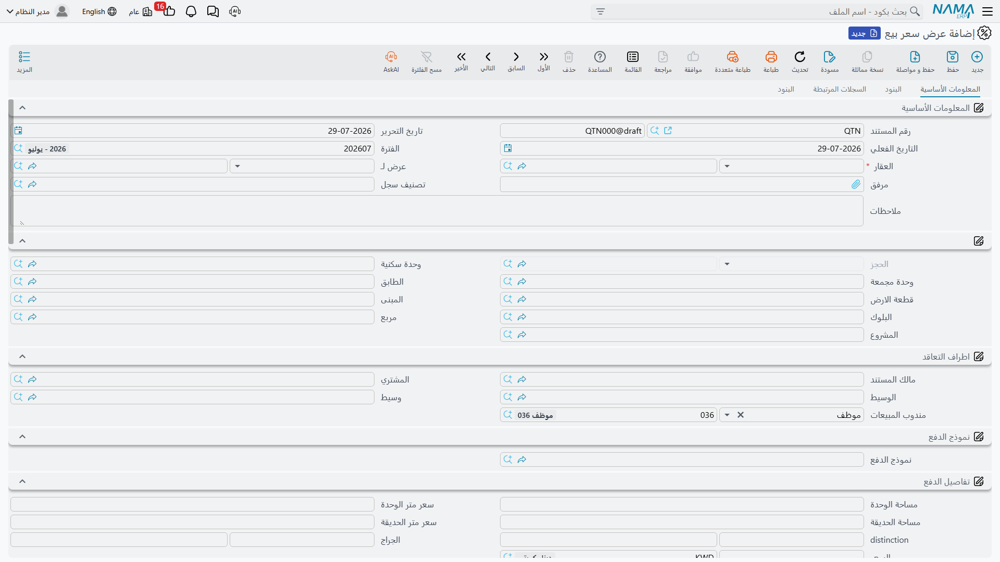
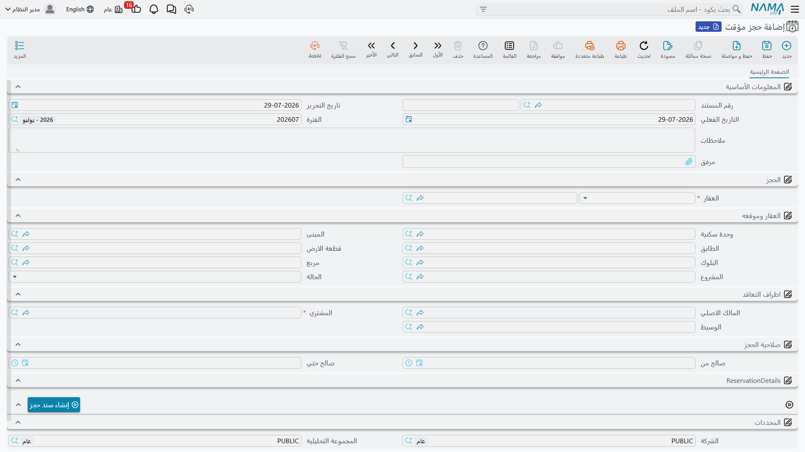

# دورة بيع العقار

بيع العقار نادرًا ما يتم بتوقيع واحد. يدخل عميل مكتب المبيعات يوم الثلاثاء وتعجبه الفيلا B-12 في
مجمع النخيل بسعر 1,200,000، فيطلب مهلة يومين ليتشاور مع زوجته ومع البنك. يوم الجمعة يعود ومعه 20,000
ويطلب رفع الفيلا من المعروض. بعد أسبوعين يُوقَّع العقد الموثق وتُعتمد خطة الأقساط، وبعد ثمانية أشهر
تُسلَّم المفاتيح.

نَما تعطيك مستندًا مستقلًا لكل لحظة من هذه اللحظات. هذه هي قوة الوحدة، وهي أيضًا مصدر الالتباس، لأن
هذه المستندات تكاد تتطابق على الشاشة: نفس تسلسل العقار، ونفس مجموعة السعر، ونفس جدول الأقساط. الفرق
بينها هو ما **يفعله** كل مستند فعليًا: هل يرفع الوحدة من المعروض، وهل يحرّك أي مبلغ في الأستاذ العام.

## سلسلة المستندات من أولها إلى آخرها

البيع الكامل يمر بالمسار التالي، وكل خطوة فيه اختيارية باستثناء عقد البيع:

1. **عرض سعر بيع** (RE Sales offer) — عرض سعر مطبوع للعميل المحتمل، ومعه محاكاة كاملة لخطة الأقساط.
2. **حجز مؤقت** (Temporary Reservation) — تحفّظ من صالة المبيعات لأيام قليلة ريثما يحسم العميل أمره.
3. **مستند حجز استثمار عقاري** (RE Reservation document) — الحجز الرسمي. تأكيده هو اللحظة التي تُرفع
   فيها الوحدة فعلًا من المعروض، وفيه تُسجَّل دفعة الحجز.
4. **عقد بيع مبدئي** (Initial sales contract) — اتفاق تمهيدي يحمل السعر الكامل وجدول الأقساط الكامل،
   يستخدمه المطورون الذين يوقّعون قبل العقد الموثق.
5. **عقد بيع** (Sales Contract) — البيع الملزم. هنا يُعترف بالإيراد وبالمديونية، وهنا تتحول خطة
   الأقساط إلى مبالغ مستحقة فعليًا.
6. **تسليم وحدة** (Estate Handover) — تسليم الوحدة للعميل، وهو أيضًا — إن أعددت التوجيهات بهذا الشكل —
   المستند الذي يُطلق أخيرًا القيد المؤجَّل الخاص بعقد البيع.
7. **سند تنازل عن ملكية** (Waiver Document) — تنازل المشتري عن الوحدة، إما للشركة وإما لمشترٍ آخر.

أغلب الشركات تستخدم ثلاثة من هذه السبعة: الحجز، ثم العقد، ثم التسليم. والبقية موجودة لمن يحتاجها.

::: info أين تجد المستندات في القوائم
الخطوات من 1 إلى 5 تحت **العقارات و الممتلكات > مبيعات**. أما تسليم الوحدة وسند التنازل وطلب فسخ
التعاقد فتحت **العقارات و الممتلكات > المستندات**. وعقد شراء عقار — وهو الصورة العكسية للعقد حين
**تشتري** شركتك عقارًا — تحت **العقارات و الممتلكات > استثمار**.
:::

## ماذا يفعل كل مستند فعليًا

هذا هو الجدول الذي ينبغي أن تقرأه قبل أن تصمّم أي شيء. كثيرون يفترضون أن عقد البيع المبدئي يثبت
الإيراد، أو أن الحجز المؤقت يحمي الوحدة. وكلا الافتراضين غير صحيح.

| المستند | هل يرفع الوحدة من المعروض؟ | هل ينشئ تأثيرًا محاسبيًا؟ | الترخيص |
|---|---|---|---|
| عرض سعر بيع | لا | **لا** | `realestate-sales` |
| حجز مؤقت | لا | **لا** | `realestate-sales` |
| مستند حجز استثمار عقاري | نعم — ولكن فقط عندما تصبح حالته **مؤكد** | نعم — دفعة الحجز وحدها، سطر مدين وسطر دائن | `realestate` |
| سند إلغاء حجز استثمار عقاري | يحرّر الوحدة | نعم — قيد كامل بنمط عقد البيع لما يُستقطع وما يُرد | `realestate` |
| عقد بيع مبدئي | نعم، إذا فُعّل خيار *حجز العقار* | **لا — لا شيء على الإطلاق** | `realestate-sales` |
| عقد بيع | يجعل الوحدة **مباعة** | نعم — هذا هو المستند الذي يقيّد البيع | `realestate-sales` |
| تسليم وحدة | يجعل الوحدة مُسلَّمة | فقط إذا أُعدَّت التوجيهات لذلك | `realestate-sales` |
| عقد شراء عقار | يسجّل الشركة مشتريًا | نعم | `realestate` |
| سند تنازل عن ملكية | يعيد الوحدة أو ينقلها لمشترٍ آخر | نعم | `realestate-sales` |
| طلب فسخ تعاقد | لا | **لا** | `realestate-sales` |

نتيجتان تستحقان التوضيح الصريح.

**عقد البيع المبدئي لا يقيّد شيئًا.** يمكن أن يحمل سعرًا قدره 1,200,000 وجدولًا من ستين قسطًا وعميلًا
موقّعًا، ويمكنه أن يحجز الوحدة — ومع ذلك لا ينتج عنه أي قيد محاسبي إطلاقًا. توجيه المستند الخاص به
يحتوي على صفحة إعدادات فقط بلا حسابات، ببساطة لأنه لا عمل للحسابات هنا. الإيراد يظهر عند اعتماد عقد
البيع، لا قبله.

**طلب فسخ التعاقد لا يفسخ شيئًا.** *طلب فسخ تعاقد* استمارة لتوثيق أن العميل طلب الخروج من الصفقة،
ومعها العمولات التي يجب تسويتها. اعتماده لا يُطلق أي عكس للقيود. العكس الحقيقي يتم بسند تنازل من نوع
*للشركة* أو بإلغاء اعتماد العقد — راجع
[التنازل وفسخ عقد البيع](/ar/modules/realestate/sales/realestate-waiver-and-cancellation.md).

::: tip كيف تُنشأ التأثيرات
حين ينشئ المستند تأثيرات، فهي لا تُكتب وأنت تنتظر. الحفظ والاعتماد ينشئان **طلب أعمال** يُعالَج في
الخلفية، فتعود إليك الشاشة فورًا. وإذا فشلت المعالجة — فترة مقفلة، أو حساب ناقص — يبقى الطلب في شاشة
**طلبات الأعمال**، حيث تُرشِّح حسب حالة المعالجة وتستخدم قائمة **المزيد** ← *Reprocess / Recommit*
لإعادة تشغيله.
:::

## عرض سعر البيع — عرض لا يكلّفك شيئًا

عرض سعر البيع (**العقارات و الممتلكات > مبيعات > عرض سعر بيع**) موجود ليعطي مندوب المبيعات ورقة
يسلّمها للعميل المحتمل تقول له بالضبط كم ستكلّفه الفيلا: السعر، والدفعة المقدمة، والرسوم، ووديعة
الصيانة، والأقساط الستين بتواريخ استحقاقها. وهو يحمل نفس مجموعة السعر ونفس زر **إنشاء الاقساط**
الموجود في العقد الحقيقي، فالمحاكاة ليست تقديرًا تقريبيًا بل هي الخطة نفسها التي سينتجها العقد.

وما يجعل توزيعه آمنًا هو كل ما **لا** يفعله:

- لا يحجز الفيلا B-12، ويستطيع مندوب آخر بيعها في اليوم نفسه.
- لا ينشئ أي تأثير محاسبي.
- لا يحتاج إلى توجيه مستند أصلًا، أي يمكنك إصدار العروض من أول يوم دون أن يُعدّ المحاسب أي شيء.
- المشتري ليس حقلًا إلزاميًا فيه. فالعرض يوجَّه عادةً إلى عميل محتمل أو فرصة بيع في وحدة إدارة علاقات
  العملاء عبر حقل المرجع المخصص لذلك — وهي النقطة الوحيدة في سلسلة البيع كلها التي تتصل بإدارة
  العلاقات.

الشاشة أربع صفحات: **المعلومات الأساسية** (العقار وأطراف التعاقد ومجموعة السعر وبيانات إنشاء الأقساط
وجدول الدفعات)، و**البنود**، و**السجلات المرتبطة**، وصفحة **البنود** القياسية.

ولا يوجد زر «حوّل هذا العرض إلى عقد». الربط يتم في الاتجاه المعاكس: تفتح مستند الحجز أو العقد وتضع
العرض في حقل **بناءا على**، فتنتقل البيانات معه.

## الحجز المؤقت — تحفّظ لا قفل

عميلنا يريد مهلة حتى الجمعة، والحجز المؤقت
(**العقارات و الممتلكات > مبيعات > حجز مؤقت**) مصنوع لهذا بالضبط: يسمّي الوحدة والمشتري والمالك
والوسيط، ويحمل مدة صلاحية — حقلا بداية ونهاية الصلاحية هما **تاريخ ووقت** معًا، فالحجز لثلاثة أيام
ثلاثة أيام حقيقية — إضافة إلى السعر والمبلغ المدفوع.

كن صريحًا مع فريق المبيعات في قيمة هذا المستند: الحجز المؤقت لا يكتب شيئًا على الوحدة. الفيلا B-12 لا
تصبح «محجوزة» في أي بحث، ويمكن أن يوجد أكثر من حجز مؤقت على الفيلا نفسها، ولا شيء في النظام يمنع
زميلًا من اعتماد عقد بيع عليها أثناء سريان الحجز. إنه إشعار بالنية يساعد صالة المبيعات على التنسيق،
أما القفل الفعلي فلا يأتي إلا مع مستند الحجز.

وهناك سلوكان يستحقان الانتباه على الشاشة:

- اختيار **البلوك** يملأ السعر والمالك الأصلي للبلوك والمربع، ويفرّغ قطعة الأرض — فابدأ من البلوك ثم
  انزل للتفاصيل، لا العكس.
- حقل **الحالة** للقراءة فقط، وزر الإلغاء هو ما ينقله إلى «ملغي».

وحين يعود العميل يوم الجمعة، اضغط **إنشاء سند حجز**. لا بد أن يكون السجل محفوظًا أولًا، وعندها يفتح
الزر مستند حجز جديدًا يحمل معه الحجز المؤقت والمشتري والمالك والوسيط والبلوك والمربع والعملة وسعر
قطعة الأرض كسعر للحجز. ومن هنا تكمل القصة في صفحة
[الحجوزات وعقود البيع المبدئية](/ar/modules/realestate/sales/realestate-reservations-and-initial-contracts.md)،
حيث تتحول العشرون ألفًا إلى حجز مؤكد ثم إلى عقد.

## إلى أين بعد ذلك

- الأسعار وخطط الدفع التي تغني المندوب عن كتابة الأرقام يدويًا:
  [قوائم الأسعار ونماذج الدفع](/ar/modules/realestate/sales/realestate-price-lists-and-payment-methods.md)
- قفل الوحدة والعقد التمهيدي:
  [الحجوزات وعقود البيع المبدئية](/ar/modules/realestate/sales/realestate-reservations-and-initial-contracts.md)
- مستند الإيراد نفسه:
  [عقد البيع](/ar/modules/realestate/sales/realestate-sales-contract.md)
- تسليم الوحدة وإطلاق الإيراد المؤجل:
  [تسليم الوحدة](/ar/modules/realestate/sales/realestate-handover.md)
- التراجع عن البيع:
  [التنازل وفسخ عقد البيع](/ar/modules/realestate/sales/realestate-waiver-and-cancellation.md)
- الحسابات خلف كل هذه المستندات:
  [توجيهات مستندات البيع](/ar/modules/realestate/document-terms/realestate-terms-sales.md)
