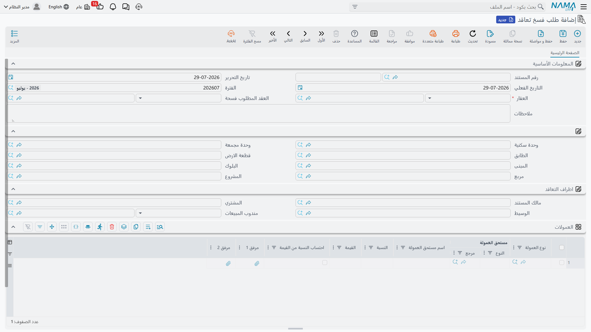
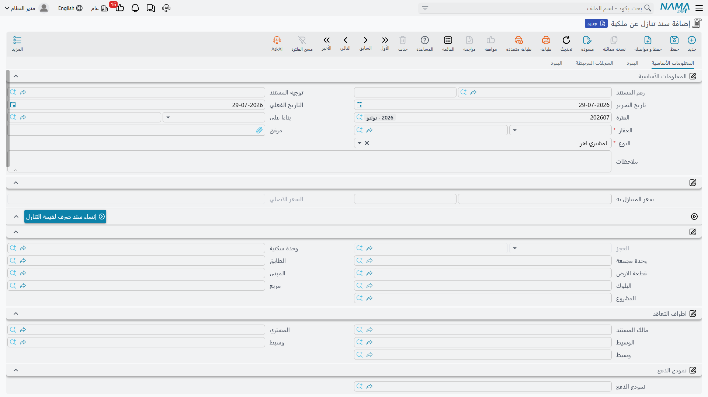

# التنازل وفسخ عقد البيع

يصل معظم القراء إلى هذه الصفحة بأحد سؤالين: إما أن مشترياً يريد الخروج من عقده وتحتاج معرفة كيف يُنقض البيع، وإما أن أحداً أخبرك بوجود مستند «فسخ عقد» فأنت تبحث عنه.

والسؤال الثاني إجابته أقصر، فلنبدأ به.

## لا يوجد مستند لفسخ عقد البيع

ليس في الوحدة ما يفسخ عقد بيع. وحين يلزم نقض بيع فأمامك طريقان لا ثالث لهما:

- **سند تنازل من نوع «للشركة»** — وهو الأداة الصحيحة. تعود الوحدة إلى الشركة، وتُسجَّل التسوية مع المشتري وتُثبَّت محاسبياً، ويبقى العقد الأصلي في السجل مختوماً بأنه متنازَل عنه. وهذا ما تستخدمه بمجرد أن يكون قد حدث أي شيء على العقد.
- **إلغاء اعتماد عقد البيع** — وهو الطريق الأمين وحده حين يكون العقد ما كان ينبغي أن يوجد أصلاً: أُدخل على وحدة خاطئة أو لمشترٍ خاطئ أو في شهر خاطئ ولم يُحصَّل عليه شيء. وإلغاء الاعتماد يعكس ما فعله الاعتماد: يعود العقار متاحاً، ويرجع الحجز إلى «مؤكد»، ويُسحب القيد.

وهناك بالفعل مستند اسمه **طلب فسخ تعاقد** في *العقارات و الممتلكات > المستندات > طلب فسخ تعاقد*. وهو سجل ورقي، ويجدر توضيح ما يعنيه ذلك: يسجّل الوحدة والعقد المطلوب فسخه وكل الأطراف وجدولاً بالعمولات التي سيلزم تسويتها أو استردادها — ولا يفعل شيئاً غير ذلك. لا توجيه له ولا أثر محاسبي ولا أتمتة خلفه. واعتماده لا يغيّر شيئاً؛ يظل على أحدهم أن يصدر سند التنازل.

وهذا يجعله مفيداً حقاً كسجل توجيه واعتماد — طلب العميل موثقاً ومعه العمولات المطلوب استردادها — ما دام الجميع يفهم أنه طلب لا نقض.

::: info تبحث عن إنهاء عقد الإيجار؟
هناك مستند ثانٍ اسمه قريب — **انهاء عقد ايجار**، في قائمة **الايجارات** — ولا علاقة له بالمبيعات رغم الاسم. فهو ينهي **عقد إيجار**: يسوّي التأمين، والسعي غير المستهلك، وتكاليف المياه والصيانة، والإيجار المدفوع مقدماً، كلٌّ عبر حساباته الخاصة.

إن كان هذا ما جئت من أجله فهو موصوف في [تمديد عقد الإيجار وإنهاؤه](/ar/modules/realestate/rent/realestate-rent-renewal-and-termination.md).
:::

## سند التنازل عن الملكية

**العقارات و الممتلكات > المستندات > سند تنازل عن ملكية**، على ترخيص `realestate-sales`، هو الطريق الذي تنتقل به ملكية العقد أو تعود.

وهو مبني على الهيكل نفسه الذي بُني عليه [عقد البيع](/ar/modules/realestate/sales/realestate-sales-contract.md) — سلسلة الموقع نفسها، و[مجموعة تفاصيل الدفع وجدول الأقساط](/ar/modules/realestate/sales/realestate-installment-plans.md) نفسهما، وجدولا الرسوم والعمولات نفساهما — لأن التنازل **بيع** ولكن من الطرف الآخر.

ومثالنا: عميل اشترى الفيلا B-12 بمبلغ 1,200,000 على عشرة أقساط، وسدّد ثلاثة منها، ويريد الآن نقل العقد إلى صديق له، والشركة تتقاضى 2% من السعر الأصلي مقابل الموافقة.

### النوعان

حقل **النوع** هو ما يحدد كل شيء، وقيمته الافتراضية «لمشتري اخر».

**لمشتري اخر** هو إعادة بيع قبل اكتمال السداد. تبقى الوحدة **مباعة** — فلا تعود إلى مخزون الشركة أصلاً — ويتسلّم المشتري الجديد الأقساط السبعة غير المسددة. وهذه هي الحالة الشائعة في سوق تتداول فيه الوحدات والمبنى ما زال قيد الإنشاء.

**للشركة** يعيد الوحدة. تُلغى علامة البيع على العقار وتعود حالته إلى *Avaliable* (بالهجاء الظاهر على الشاشة)، فيمكن بيعه من جديد لعميل آخر. وهذا أقرب ما في الوحدة إلى فسخ بيع.

وفي **الحالتين** يُختم العقار بأنه متنازَل عنه ويشير إلى هذا السند، ويُختم العقد الأصلي كذلك. وهذا الختم مهم: **العقد المتنازل عنه لا يمكن تعديله بعدها.** وأي تغيير تحتاجه بعد هذه النقطة يتم على سند التنازل لا على العقد الذي وراءه.

### ما يجلبه المستند معه

اختيار العقار على سند التنازل يملأ الشاشة تقريباً من العقد المتنازَل عنه:

- تُنسخ الأقساط **غير المسددة** من العقد الحالي إلى جدول الدفعات — أما الثلاثة المسددة فتبقى حيث تنتمي، على العقد الأصلي؛
- يُضبط **المالك** على مشتري العقد، لأن الطرف الذي تتعامل معه الشركة في هذا المستند هو المشتري الخارج؛
- تُنسخ مجموعة تفاصيل الدفع كاملة، و**السعر الأصلي**، ومجموعة بيانات إنشاء الأقساط، وسطور الإنشاء المتعدد، وسطور رسوم أخري، والعملة؛
- ويُضبط **بناءا على** على عقد البيع أو عقد البيع الافتتاحي.

ولهذا النسخ نتائج تستحق المعرفة. حقل **المدفوع من الحجز** معطَّل على هذه الشاشة. و**لا يمكن تغيير «بناءا على» بعد أول اعتماد** — *«لا يمكن تغيير المستند الأصل»* — فإن كان خاطئاً فألغِ المستند وابدأ من جديد. وبخلاف عقد البيع، **المشتري اختياري** هنا: فتنازل «للشركة» لا مشتري وارداً فيه ليُسمّى.

وإن تعذّر الوصول إلى العقد الأصلي عند اعتماد التنازل ستظهر رسالة *«برجاء إعادة اعتماد عقد البيع السابق لهذا التنازل»* — أعد اعتماد العقد ثم أعد المحاولة.

### قيمة التنازل

بجوار النوع أداة مركّبة صغيرة تحمل **قيمة التنازل ونسبتها**، وتبقى متسقة مع **السعر الأصلي** كلما عدّلت أحدهما. وفي الفيلا B-12 تساوي 2% من 1,200,000 مبلغ **24,000**.

والزر المجاور، **إنشاء سند صرف لقيمة التنازل**، يبني سند صرف بهذه القيمة باسم مالك المستند — وهو، كما رأينا، المشتري الخارج بحكم النسخ التلقائي. وهذا هو الجانب التسووي من المعاملة: مال يخرج من الشركة لا يدخل إليها.

### الصفحات

| الصفحة | ما فيها |
|---|---|
| **المعلومات الأساسية** | الترويسة، والنوع وقيمة التنازل، وسلسلة الموقع، وأطراف التعاقد، ومجموعة تفاصيل الدفع، ومجموعة بيانات إنشاء الأقساط، وأزرار الإجراءات، وجدول الدفعات، والإجماليات، والمحددات |
| **البنود** | مرجع بنود التعاقد القياسية، وجدول **رسوم أخري**، وجدول **العمولات**، وجدول الشروط |
| **السجلات المرتبطة** | سندات التحصيل وسندات الغرامة والملحقات الصادرة على هذا السند |
| **البنود** | جدول البنود القياسية المهيكل |

## ماذا يُثبِّت سند التنازل

يُنتج سند التنازل كل ما ينتجه عقد البيع — السعر، وتفرقة الإيراد والإيراد المقدم بحسب تاريخ استحقاق القسط، وسعي المالك والمشتري، ووديعة الصيانة، والخصومات والغرامات، والتخفيض على السعر، وسطور الرسوم من أنواعها، وسطور العمولات من أنواعها. وهذه القائمة كاملة مجموعةً مجموعة في [صفحة عقد البيع](/ar/modules/realestate/sales/realestate-sales-contract.md) ولا تتكرر هنا. كما يكتب سند التنازل قيود النظام العقارية تماماً كما يفعل بيع حقيقي، فتبقى حالة العقار وشاشات حركات المبيعات متسقة.

وفوق ذلك أمران يخصان التنازل وحده.

**قيمة التنازل لها زوج حسابات خاص بها** في توجيه سند التنازل — وهي الصفحة التي تحدد فيها أين تُثبَّت هذه القيمة. والـ 24,000 المحمَّلة على المشتري الخارج تستقر هناك.

**والعمولات يمكن عكسها.** فخيار **عكس التأثير المحاسبي للعمولات** في التوجيه يُثبت كل سطر عمولة على سند التنازل **بطرفين معكوسين**. وهذا هو المقابل لحقيقة ذكرناها في عقد البيع: العمولات تُثبَّت كاملة عند اعتماد **العقد** من حسابات نوع العمولة نفسه، لا عند صرفها للوسيط. فإذا نُقض البيع وجب أن يخرج هذا الإثبات، وهذا الخيار هو ما يُخرجه.

وأيّ الوضعين تريد يتوقف على نوع التنازل:

- في تنازل **للشركة** يُنقض البيع، فعكس العمولة الأصلية هو الصواب عادة — إذ لا ينبغي أن يبقى سعي على بيع لم يتم.
- وفي تنازل **لمشتري اخر** يستمر البيع باسم جديد وقد استُحقت الوساطة فعلاً، فعكسها يكون خطأً في الغالب.

ولأن الخيار يقع على توجيه المستند، فالطريقة النظيفة لتشغيل الحالتين هي **توجيهان**، واحد لكل نوع تنازل، بدل توجيه واحد يُعدَّل حسب الحالة.

ويحمل توجيه التنازل كذلك خيارات *التحقق من مطابقة المتبقي لإجمالى الاقساط* و*الالتزام بقوائم الأسعار* والخيار الذي يقرر اعتبار المدفوع من الحجز مسدداً من الأقساط. وهي تعمل تماماً كما تعمل على عقد البيع؛ راجع [توجيهات مستندات البيع](/ar/modules/realestate/document-terms/realestate-terms-sales.md).

## أي الطرق تختار

| الحالة | ما تفعله |
|---|---|
| العقد أُدخل بالخطأ ولم يحدث عليه شيء | ألغِ اعتماده |
| المشتري ينقل العقد إلى غيره، سدّد أقساطاً أو لم يسدّد | سند تنازل **لمشتري اخر** |
| المشتري ينسحب وتعود الوحدة إلى المعروض | سند تنازل **للشركة** |
| المشتري **طلب** الفسخ وتحتاج تسجيل الطلب واعتماده أولاً | طلب فسخ تعاقد، ثم سند التنازل |
| الملكية القانونية تنتقل بين ملاك خارج دورة البيع — بين ورثة أو بين شركات المجموعة | ليس تنازلاً أصلاً — راجع [تحويل الملكية بين الملاك](/ar/modules/realestate/properties/realestate-ownership-transfer.md) |
| **عقد إيجار** ينتهي | وليس تنازلاً كذلك — راجع [تمديد عقد الإيجار وإنهاؤه](/ar/modules/realestate/rent/realestate-rent-renewal-and-termination.md) |
