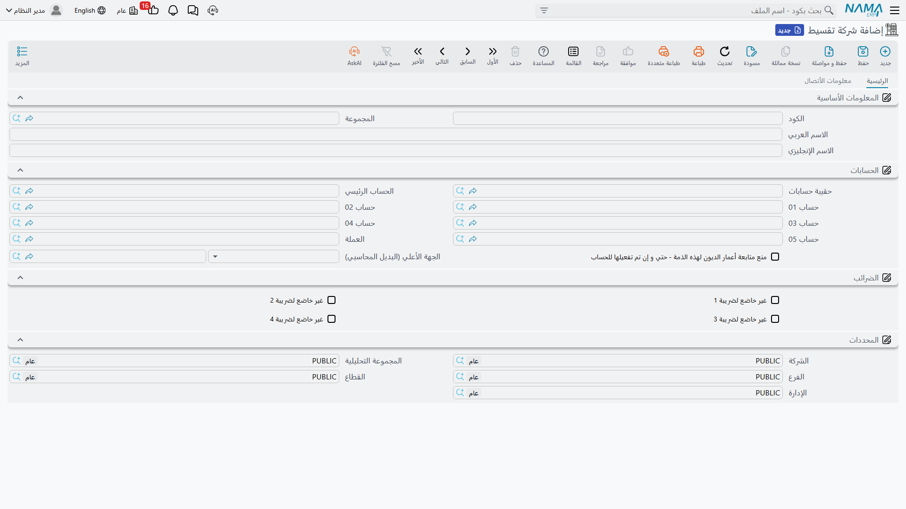
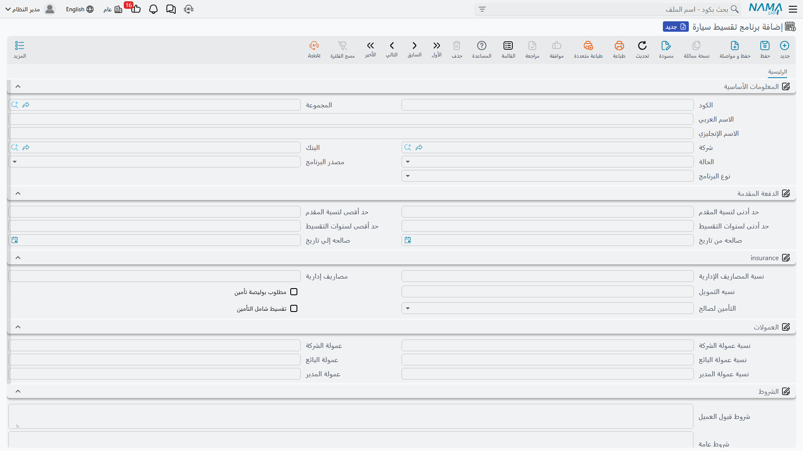

# شركات التقسيط وبرامج التقسيط

::: info الترخيص المطلوب
`srvcenter-insurance-and-installments`. وجذر قائمة **سيارات** الذي يحوي هذه المجموعة محكوم بذاته بـ`srvcenter-subitems`، فعملياً يلزم الكودان معاً قبل أن تظهر قائمة تقسيط السيارات أصلاً.
:::

أغلب عملاء الصحراء لا يدفعون ٨٧٬٠٠٠ نقداً. بل يدخلون سائلين عن ثمن رمال ٢٫٤ *في الشهر*، ويحتاج البائع جواباً قبل أن يمضي الحديث خطوة أخرى. ووُجدت **سيارات ← تقسيط سيارات** لتعين على هذا الحديث — ومن المهم أن تفهم من البداية أن إعانة الحديث هي *كل* ما تفعله.

هنا ملفان رئيسيان ومستند واحد:

| السجل | بالإنجليزية | ما هو |
|---|---|---|
| **شركة تقسيط** | Finance Company | ملف الممول الرئيسي |
| **برنامج تقسيط سيارة** | Car Installment Program | منتج التمويل: النسبة والمصاريف والحدود |
| **عرض سعر تقسيط سيارة** | Car Installment Quotation | ورقة العرض التي تُسلَّم للعميل — راجع [صفحتها](/ar/modules/servicecenter/car-installments/car-installment-quotation.md) |

## ملف شركة التقسيط

سجل شركة التقسيط هو الشاشة نفسها وقائمة الحقول نفسها التي لشركة التأمين وللمعرض الخارجي — صفحة **رئيسية** فيها الكود والأسماء والذمم والمحددات، وصفحة **بيانات الاتصال** فيها بيانات الاتصال والبيانات الضريبية وكتلة البنك.

وكما هو الحال مع شركة التأمين، الحقل الوحيد ذو الوزن اللاحق هو **الذمة**، وهي التي تجعل الممول قابلاً للمخاطبة محاسبياً.

وتنشئ الصحراء `FIN-03` **بيان للتمويل**.

::: info شركة التقسيط يُشار إليها ولا تُقرأ أبداً
انتبه إلى ضآلة دور هذا السجل. فيمكن اختيار شركة تقسيط في موضعين اثنين فقط — في سطر عرض سعر تقسيط، وفي كتلة التمويل في أمر بيع سيارة — و**لا يُقرأ أي من الاختيارين بأي حساب أو تحقق.** إنما يُسجَّل ليسمّي الورقُ الممولَ الصحيح، ولا شيء غير ذلك. فلا مستند يقيّد عليه تلقائياً، ولا سلوك تمويلي يتغير باختيار ممول دون آخر.
:::

## برنامج التقسيط

برنامج التقسيط منتجٌ لممول: *بيان للتمويل تموّل السيارات للعملاء الموظفين من سنة إلى خمس سنوات بنسبة ٦٪ ثابتة، بمصاريف إدارية ٢٪، وبحد أدنى للمقدم ٢٠٪.* وتنشئ سجلاً لكل ممول لكل منتج.

وتجمّع الشاشة الحقول كالآتي.

**الأساسية** — **الشركة** و**البنك** و**الحالة** (نشط أو غير نشط) و**مصدر البرنامج** (برنامج بنك أو برنامج داخلي) و**نوع البرنامج** (موظف أو صاحب عمل أو غير موظف).

**المقدم** — **حد أدنى / أقصى لنسبة المقدم**، و**حد أدنى / أقصى لسنوات التقسيط**، وزوج تاريخي **صالح من / صالح إلى**.

**التأمين** — **نسبة المصاريف الإدارية**، ومبلغ **مصاريف إدارية** ثابت، و**نسبه التمويل** (وهي النسبة، ونعم، العنوان مكتوب هكذا على الشاشة)، و**مطلوب بوليصة تأمين**، و**التأمين لصالح** (العميل أو البنك أو الشركة)، و**تقسيط شامل التأمين**.

**العمولات** — عمولة الشركة والبائع والمدير، كلٌّ نسبةً وقيمةً.

**الشروط** — كتلتا نص طويل: **شروط قبول العميل** و**شروط عامة**، لما تريد طباعته على العرض.

### ثلاثة حقول فقط تُستعمل

من كل ما على تلك الشاشة، ثلاثة حقول بالضبط يقرؤها شيء:

- **نسبه التمويل** — النسبة السنوية الثابتة، تُستعمل لحساب القسط الشهري في عرض السعر.
- **نسبة المصاريف الإدارية** — تُستعمل، مع الخلل الموصوف أدناه.
- **مصاريف إدارية** — المبلغ الثابت، يُضاف فوق ذلك.

وكل ما عداها مخزَّن ومعروض ولا يُستشار أبداً.

::: warning حدود البرنامج لا تحدّ شيئاً
**حد أدنى وأقصى لنسبة المقدم، وحد أدنى وأقصى لسنوات التقسيط، وصالح من وصالح إلى، والحالة، ومطلوب بوليصة تأمين، والتأمين لصالح، وتقسيط شامل التأمين — لا يقرؤها كودٌ في أي موضع.**

وليست تحققات ضعيفة ولا تحققات تعمل في بعض الأحوال. بل لا يُنظر إليها إطلاقاً. والنتائج تستحق التفصيل:

- يمكن بناء عرض سعر بـ**مقدم صفر٪** على برنامج حده الأدنى للمقدم ٣٠٪.
- يمكن توزيع عرض سعر على **١٠ سنوات** على برنامج حده الأقصى ٥ سنوات.
- ويُعرض البرنامج **غير النشط** ويُستعمل تماماً كالنشط.
- والبرنامج الذي **انتهت صلاحيته العام الماضي** يتصرف كالساري تماماً.
- و**مطلوب بوليصة تأمين** لا يشترط شيئاً — فلا عرض سعر ولا بيعة ولا تسليم يُمنع لغياب وثيقة.
- و**تقسيط شامل التأمين** لا يشمل شيئاً — فقيمة التأمين في عرض السعر لا تُضاف إلى المبلغ الممول مهما كان ضبطه.

فعامل هذه الكتلة كلها **توثيقاً لشروط الممول من أجل الإنسان الذي يقرأ الشاشة**. وإن احتاج عملك فرض تلك الحدود، فذلك الفرض لا بد أن يكون تحققاً خاصاً بالعميل أو خطوة اعتماد أو قائمة مراجعة مطبوعة يمشي عليها البائع — ولن يأتيك من سجل البرنامج.

والأمر نفسه ينطبق على سحب منتج من التداول. فوضع البرنامج على «غير نشط» أو ترك تواريخه تنتهي لا يخرجه من التداول. ولإيقاف استعماله احذفه أو أعد تسميته تسمية واضحة.
:::

::: info لا عمولة تُحسب أبداً
حقول العمولة الستة — الشركة والبائع والمدير، كلٌّ نسبةً وقيمةً — تظهر بارزة على الشاشة ولا يقرؤها شيء. فلا عمولة تُستحق ولا تُقيَّد ولا تظهر في تقرير ولا تُنقل إلى عرض سعر. وهذا يوافق جانب التأمين حيث نسب العمولة عاطلة كذلك؛ وتذكر [صفحة نظرة التأمين العامة](/ar/modules/servicecenter/car-insurance/car-insurance-overview.md) ذلك كاملاً. لا توجد آلية عمولات في أي موضع من هذه الوحدة.
:::

::: danger المصاريف الإدارية تُحسب أكبر مئة ضعف
هذا هو الحساب الحيّ الوحيد في البرنامج، وهو خاطئ.

فحين يستعمل عرض سعرٍ برنامجاً، تُحسب المصاريف الإدارية بأنها **قيمة التمويل × نسبة المصاريف الإدارية + المصاريف الثابتة** — **بغير قسمة على ١٠٠**. فمصاريف إدارية ٢٪ على ١٠٠٬٠٠٠ ممولة تُنتج **٢٠٠٬٠٠٠** لا ٢٬٠٠٠.

والخلل متطابق على الشاشة وعلى الخادم، فالحفظ لا يصححه: الرقم المتضخم هو المخزَّن، وهو الذي يظهر في إجمالي عرض السعر، وهو الذي يُطبع للعميل. وهو كذلك مخالف لبقية الحساب نفسه — فعمولة البنك وكل الخصومات في عرض السعر *تُقسم* على ١٠٠ صحيحاً.

**كيف تتحايل عليه:** اترك **نسبة المصاريف الإدارية** فارغة في كل برنامج، وضع الرسم في مبلغ **مصاريف إدارية** الثابت بدلاً منها. فالمبلغ الثابت يُضاف كما كُتب ولا يمسّه الخلل. وإن كان رسمك يتغير فعلاً بتغير المبلغ الممول، فاحسبه خارج النظام وأدخل ناتجه مبلغاً ثابتاً في البرنامج، أو اكتب الرسم فوق سطر عرض السعر.

ولا تعرض مصاريف إدارية من نسبة أبداً بغير مراجعة الرقم الذي أنتجته.
:::

## كتلة التمويل في أمر بيع السيارة

حين تُبرم البيعة فعلاً، تُدخل بيانات التمويل من جديد في [**أمر بيع السيارة**](/ar/modules/servicecenter/car-sales/car-sales-order.md)، في كتلة تحمل قيمة الحجز وطريقة الدفع وبرنامج التقسيط و**جهة التقسيط** (بنك أو شركة تقسيط) وبنك التمويل وشركة التقسيط والمقدم ومبلغ القرض وحقلي جواب البنك وشركة التأمين واسم المؤمَّن له.

وحقل واحد في تلك الكتلة يفعل شيئاً: **قيمة الحجز**، وهي التي تحرّك قيد عربون الحجز في أمر البيع على حسابي قيمة الحجز في [توجيه المستند](/ar/modules/servicecenter/document-terms/servicecenter-terms-cars-and-other.md). أما البقية فمسجَّلة للرجوع إليها — واثنان منها يستحقان التنبيه لأنهما يُقرآن كأدوات ضبط.

::: warning «حظر بيع السيارة» لا يحظر شيئاً
تحمل كتلة التمويل **حظر بيع السيارة** و**وصول جواب البنك** و**تاريخ جواب البنك**. وتبدو بوابة ائتمان: ضع الحظر حتى يجيب الممول، ثم ارفعه.

**ولا يقرأ أي تحقق أياً منها.** فوضع علامة *حظر بيع السيارة* لا يمنع اعتماد أمر البيع، ولا يمنع [تخصيص السيارة](/ar/modules/servicecenter/car-sales/car-allocation.md) ولا فوترتها ولا تسليمها، ولا يُنتج رسالة في أي موضع. وترك *وصول جواب البنك* بغير علامة لا يمنع شيئاً.

وكذلك **المقدم** و**مبلغ القرض** المكتوبان هنا لا يُقارنان أبداً بحدود البرنامج المختار — وهي على أي حال، كما سبق، غير مفروضة في أي موضع.

فإن احتجت حجز سيارة حتى يردّ البنك، فامذجه [بإعدادات حالة السيارة](/ar/modules/servicecenter/cars-setup/car-status-configurations.md) نفسها، أو بدورة اعتماد على أمر البيع. ولا تعتمد على مربع الاختيار هذا.
:::

أما جانب التأمين في الكتلة فيُقرأ فعلاً، لكن على سبيل التيسير وحده: فحين تنشئ وثيقة تأمين وتشير بها إلى أمر البيع هذا، تأخذ الوثيقة منه بنك التمويل وشركة التأمين واسم المؤمَّن له. وهذا موصوف في [صفحة وثيقة تأمين السيارة](/ar/modules/servicecenter/car-insurance/car-insurance-policy.md).
