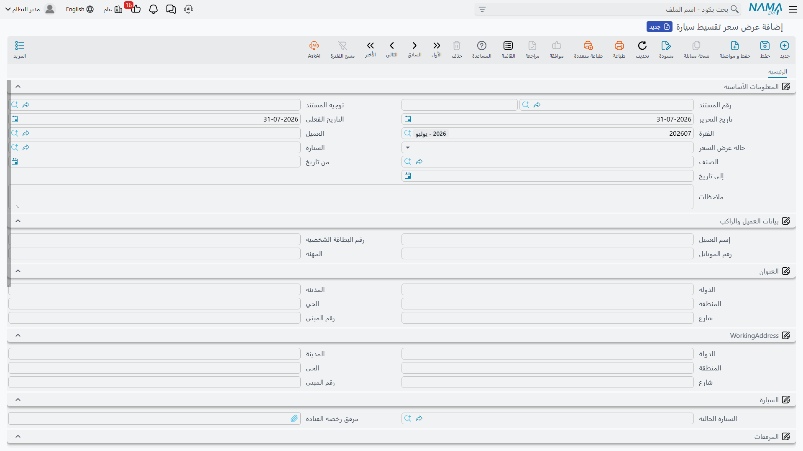

# عرض سعر التقسيط

::: info الترخيص المطلوب
`srvcenter-insurance-and-installments`. وجذر قائمة **سيارات** الذي يحوي هذه المجموعة محكوم بذاته بـ`srvcenter-subitems`.
:::

يدخل عميل معرض الصحراء ويسأل السؤال الوحيد الذي يهمّه: *كم تكلّف في الشهر؟* و**عرض سعر تقسيط سيارة** هو الشاشة التي يفتحها البائع ليجيب. تصل إليها من **سيارات ← تقسيط سيارات**.

اشترت ليلى الحربي رمالها نقداً، فتستعير هذه الصفحة النسخة البديلة من شرائها — تلك التي تموّلها فيها — لتمشي بالأرقام إلى آخرها.

::: warning عرض السعر آلة حاسبة تُطبع ولا شيء غير ذلك
اضبط توقعاتك قبل أن تمضي في القراءة، فاسم هذا المستند ومظهره الكامل كعرض سعر مبيعات يَعِدان بأكثر مما يقدّم.

**عرض السعر يُنتج رقماً على ورقة. ولا يُنتج شيئاً غير ذلك.**

- **لا يُنشئ أمر بيع**، ولا يوجد زر ولا [خيار توجيه](/ar/modules/servicecenter/document-terms/servicecenter-terms-basics.md) ولا إعداد يجعله يفعل.
- **ولا يُنتج جدول سداد.** فلا خطة دفعات، ولا قائمة أشهر، ولا سطور أقساط، ولا تواريخ استحقاق — في أي موضع وفي أي وقت. والرقم الشهري الواحد الذي يحسبه هو المخرج كله.
- **ولا يُنشئ مديونية** ولا يقيّد شيئاً في المحاسبة.
- **ولا يولّد مستنداً من أي نوع**، ولا يقرؤه شيء لاحق. فلا يوجد سجل آخر في النظام فيه حقل يشير إلى عرض سعر.
- وحقل **حالة عرض السعر** — مبدئي، مرفوض، مقبول، منتهٍ، **موافقة ائتمانية** — لا يغيّر شيئاً حين تضبطه. فوضع عرض سعر على «مقبول» لا أثر له على شيء.

وحين يوافق العميل، **يعيد البائع إدخال** البرنامج والممول والأرقام في كتلة التمويل [بأمر بيع السيارة](/ar/modules/servicecenter/car-sales/car-sales-order.md) بيده. وتلك الخطوة اليدوية هي الجسر الوحيد بين عرض السعر والبيعة؛ ولا جسر غيرها.

فإن استُعمل آلةً حاسبة وورقة عرض تُطبع وتُسلَّم، أدّى المستند وظيفته. وإن استُعمل أول خطوة في مسار تمويل، خذلك.
:::

## الشاشة

الرأس أكثره عن مقدّم الطلب، وهذا يخبرك بحقيقة المستند — فهو نموذج طلب تمويل بقدر ما هو عرض سعر.

**الأساسية** تحمل العميل و**حالة عرض السعر** والصنف والسيارة ومدى تاريخ صلاحية.

**بيانات العميل** تحمل اسم العميل ورقم الهوية ورقم الجوال و**المهنة**، تتبعها كتلة **عنوان** وكتلة **عنوان العمل** منفصلة.

**السيارة** تحمل **السيارة الحالية** للعميل — [سجل المركبة](/ar/modules/servicecenter/cars-setup/car-master-file.md) التي يستبدلها — و**مرفق رخصة القيادة**. وخانة مرفقات أخرى تحمل **مرفق صورة الهوية**، وكتلة ملاحظات تحمل ما قاله العميل مما يستحق التسجيل.

ثم الجدول، سطر لكل خيار تمويل تريد عرضه على العميل، ثم المحددات.

## الجدول

يحمل السطر السيارة والأطراف والمال والنتيجة.

**الأطراف:** **الصنف** (إجباري) و**السيارة** و**البنك** و**شركة التقسيط** و**شركة التأمين** و[**برنامج التأمين**](/ar/modules/servicecenter/car-insurance/car-insurance-overview.md) و**برنامج تقسيط سيارة**.

**المدخلات التي تكتبها:** **سعر سيارة** و**قيمة التمويل** و**المقدم** و**سنوات التقسيط** و**مصاريف أخرى**، والخصومات المختلفة — **خصم سعر سيارة** ونسبته، و**خصم مصاريف إدارية** ونسبته، و**قيمة خصم التأمين** ونسبته.

**الأرقام التي يستخرجها المستند:** **مصاريف إدارية** و**قيمة التأمين** و**إجمالي الخصومات** و**الإجمالي** و**القيمة الصافية** و — وهو المقصود من العملية كلها — **قيمة القسط الشهري**.

والحساب حول الأطراف مباشر: الإجمالي هو سعر السيارة زائد المصاريف الإدارية زائد المصاريف الأخرى زائد قيمة التأمين؛ وكل نسبة خصم تُطبق على أساسها الخاص؛ والقيمة الصافية هي الإجمالي ناقص الخصومات.

::: warning عمودان يحتاجهما الحساب وليسا على الجدول
يحسب المستند **نسبة المقدم** و**نسبة عمولة البنك**، لكن **لا واحد منهما عمود على الجدول القياسي**. فتستطيع كتابة المقدم مبلغاً لا نسبةً، ولا تستطيع إدخال نسبة عمولة بنك إطلاقاً — فعمولة البنك التي سيحسبها تكون صفراً دائماً.

فإن كان ممولوك يعرضون بالنسب، فلا بد من إضافة العمودين بتعديل على الشاشة قبل أن يُستعمل المستند على الوجه الذي صُمّم له.
:::

## كيف يُحسب القسط الشهري

نموذج الفائدة **فائدة ثابتة (بسيطة) على أصل المبلغ** — لا قرض متناقص ولا مستهلك. فالنسبة تُطبَّق مرة واحدة على المبلغ الممول كله للمدة كلها، ثم يُقسَّم الناتج بالتساوي على الأشهر.

مكتوبةً:

> **القسط الشهري = قيمة التمويل × (١٠٠ + النسبة × السنوات) ÷ (السنوات × ١٢ × ١٠٠)**

والنسبة تأتي من **نسبه التمويل** في [البرنامج المختار](/ar/modules/servicecenter/car-installments/car-installment-programs.md). وإذا غاب البرنامج أو النسبة أو قيمة التمويل أو عدد السنوات أو كان صفراً، خرج القسط الشهري صفراً لا خطأً.

خذ النسخة الممولة من شراء ليلى: سيارة بـ ٨٧٬٠٠٠، ومقدم ٢٠٪ قدره ١٧٬٤٠٠، فيبقى **٦٩٬٦٠٠** للتمويل على **٥ سنوات** بنسبة بيان للتمويل **٦٪** الثابتة.

> ٦٩٬٦٠٠ × (١٠٠ + ٦ × ٥) ÷ (٥ × ١٢ × ١٠٠)
> = ٦٩٬٦٠٠ × ١٣٠ ÷ ٦٬٠٠٠
> = **١٬٥٠٨٫٠٠ شهرياً**

وستون دفعة قدر كل منها ١٬٥٠٨ مجموعها **٩٠٬٤٨٠** — وهي ٦٩٬٦٠٠ × ١٫٣٠ تماماً كما تقتضي النسبة الثابتة. وقارنها بقرض مستهلك بنسبة اسمية ٦٪، فسيكلّف أقل بكثير في المجموع، وعندها تدرك لماذا يهمّ التمييز حين تشرح الرقم للعميل. **هذه نسبة ثابتة. فقلها حين تعرضها.**

والرقم الوحيد الذي يطبعه المستند هو ذلك الـ١٬٥٠٨. فلا تفصيل بين أصل وفائدة، ولا جدول شهرياً بشهر، ولا رصيد ختامي.

::: danger خللان في الحساب لا بد أن تتحايل عليهما
**المصاريف الإدارية أكبر مئة ضعف.** فالرسم يُحسب بأنه *قيمة التمويل × نسبة المصاريف الإدارية + المصاريف الثابتة*، **بغير قسمة على ١٠٠**. فرسم ٢٪ على ١٠٠٬٠٠٠ ممولة يُنتج ٢٠٠٬٠٠٠. والخلل متطابق على الشاشة وعلى الخادم، فالحفظ لا يصححه — بل يسري الرسم المتضخم مباشرةً إلى إجمالي السطر وقيمته الصافية، وإلى كل ما تطبعه.

**والحيلة** أن تترك نسبة البرنامج فارغة وتضع الرسم في مبلغ *مصاريف إدارية* الثابت بالبرنامج، أو أن تكتب الرسم على السطر مباشرةً. وكل نسبة أخرى في هذا المستند — عمولة البنك والخصومات الثلاثة — تُقسم على ١٠٠ صحيحاً، وهذا بالضبط ما يجعل خلل الرسم سهل الفوات.

**والمقدم لا يُطرح أبداً من المبلغ الممول.** ففي السطر عمود *مقدم*، وكتابة نسبة مقدم تحسب فعلاً مبلغ مقدم للعرض. لكن **لا شيء يخصمه من قيمة التمويل إطلاقاً.** فقيمة التمويل حقل يكتبه المستخدم، وانتهى، والقسط الشهري يُحسب مما فيه.

فلو كتب بائع سعر سيارة ٨٧٬٠٠٠ ومقدماً ١٧٬٤٠٠ وترك قيمة التمويل تدبّر نفسها، عُرض على العميل التكلفة الشهرية لتمويل **الـ٨٧٬٠٠٠ كاملة** بالمقدم وكل شيء. وسيكون الرقم أعلى بنحو الخمس، ولا شيء على الشاشة يشير إلى وجود خطأ.

**والحيلة** أن تجري الطرح بنفسك وتكتب الناتج: سعر السيارة ناقص المقدم، يُدخَل يدوياً في **قيمة التمويل**. وفي حالة ليلى ذلك ٨٧٬٠٠٠ − ١٧٬٤٠٠ = **٦٩٬٦٠٠**، مكتوبةً. اجعل هذا جزءاً من روتين البائع وراجعه في كل عرض سعر قبل الطباعة.
:::

::: warning قيمة التأمين لا تُموَّل، وتُحسب خاماً
اختيار برنامج تأمين على سطر عرض السعر يملأ عمود **قيمة التأمين** من شريحة البرنامج — بالضرب نفسه *بغير قسمة على ١٠٠* الذي يصيب فاتورة شراء التأمين، فقد يخرج الرقم أكبر مئة ضعف مما تتوقع. راجع [صفحة فاتورة شراء التأمين](/ar/modules/servicecenter/car-insurance/car-insurance-purchase-invoice.md) للشرح الكامل.

ومهما خرجت، فقيمة التأمين تلك **لا تُضاف إلى قيمة التمويل أبداً.** وخيار *تقسيط شامل التأمين* في البرنامج لا يغيّر ذلك — فلا شيء يقرؤه. فإن كان العميل يموّل قسط التأمين مع السيارة، فأضفه إلى قيمة التمويل التي تكتبها بيدك.
:::

::: info عمود القيد المحاسبي في هذا المستند لا يعني شيئاً
يحمل عرض السعر عمود طلب قيد محاسبي في سجله، وهذا يدفع موظفي الدعم أحياناً إلى البحث عن قيده. ولا قيد له. **فعرض السعر لا يُنتج أثراً محاسبياً من أي نوع** — لا قيداً ولا طلب أعمال ولا شيئاً يُعاد معالجته.
:::

## كيف تستعمله على وجهه

بعد كل ما سبق، يبقى عرض السعر جديراً بالاستعمال، بشرط أن تستعمله لما هو. وإليك روتيناً عملياً:

1. املأ كتلة بيانات العميل ملأً جاداً — الاسم والهوية والمهنة والجوال والعنوانين ومرفقي الرخصة والهوية. فهذا هو الجزء ذو القيمة الحقيقية في المستند: طلب تمويل محفوظ في الملف.
2. احسب قيمة التمويل بنفسك — سعر السيارة ناقص المقدم الذي يدفعه العميل فعلاً — و**اكتبها في قيمة التمويل**.
3. اختر البرنامج، واكتب السنوات، واقرأ القسط الشهري.
4. إن كانت هناك مصاريف إدارية، فاكتبها مبلغاً ثابتاً بدل أن تدع نسبةً تحسبها.
5. احفظ، وأعد الفتح، واقرأ الأرقام قبل أن تطبع شيئاً.
6. وحين يوافق العميل، افتح أمر بيع السيارة و**أعد إدخال** الممول والبرنامج والأرقام في كتلة التمويل بيدك.
