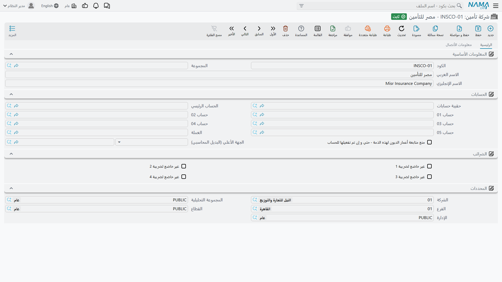
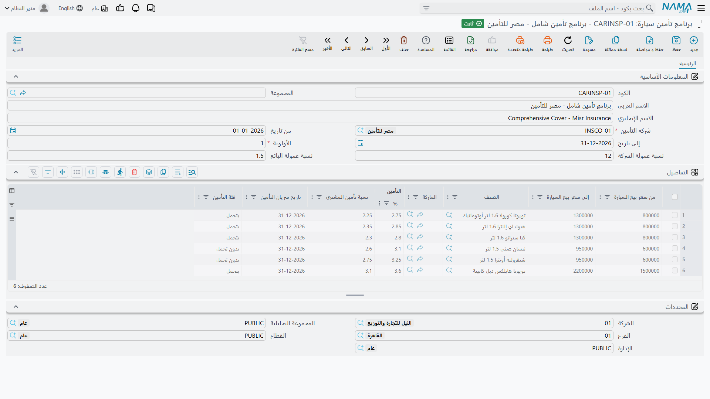

# تأمين السيارات مع البيع

::: info الترخيص المطلوب
`srvcenter-insurance-and-installments` — **ومعه** `srvcenter-subitems`. راجع التحذير التالي مباشرة؛ الكود الثاني ليس اختيارياً.
:::

توقّع ليلى الحربي على سيارتها ناوا رمال ٢٫٤ لدى شركة الصحراء للسيارات في ٢٤ فبراير ٢٠٢٦، في ختام [دورة بيع السيارة](/ar/modules/servicecenter/car-sales/car-sales-cycle.md) المعتادة. ولا تستطيع أن تخرج بها من المعرض بغير تأمين، ولا ترغب في أن تقضي صباحاً كاملاً في مكتب شركة تأمين، فتفعل الصحراء ما تفعله أغلب المعارض: تُصدر الوثيقة نيابة عنها لدى **وفاء للتأمين** (`INS-02`)، وتسلّمها الأوراق مع المفاتيح، ثم تسوّي حسابها مع شركة التأمين على حدة.

ووجدت منطقة تأمين السيارات لتحفظ سجل هذا الترتيب. تصل إليها من **سيارات ← تأمين سيارات**، وهي مبنية حول ملف رئيسي واحد — **وثيقة تأمين سيارة** — تحيط به سلسلة مستندات تنقل الوثيقة عبر حياتها: طلب إصدارها من شركة التأمين، ثم استلام الورقة، ثم تسليمها للعميل، ثم تجديدها أو تعديلها أو إلغاؤها لاحقاً. وتتولى فاتورة شراء منفصلة قيد ما تدين به الصحراء لوفاء للتأمين.

وقبل أن تمضي في القراءة، هناك أمران عن هذه المنطقة لا بد أن تعرفهما، لأن كل ما في الصفحات الأربع يقوم عليهما.

::: warning ترخيص التأمين ليس مكتفياً بذاته
العميل الذي رخّص `srvcenter-insurance-and-installments` وحده **لا يستطيع استخدام هذه المنطقة إطلاقاً.**

فملف **شركة التأمين** الرئيسي — وملف **المعرض الخارجي** بجواره — لا ينتميان إلى ترخيص التأمين. مكانهما في **سيارات ← ملفات السيارات**، وهذه القائمة تابعة [لوحدة السيارات](/ar/modules/servicecenter/cars-setup/servicecenter-cars-overview.md) `srvcenter-subitems`. وبغير هذا الكود لا تكون شاشة شركة التأمين مخفية من القائمة فحسب، بل لا يكون نوع السجل موجوداً في التركيب أصلاً، فلا يمكن إنشاء أي شركة تأمين.

وشركة التأمين مطلوبة في كل موضع. فـ**أمر إصدار وثيقة تأمين** لا يقبل الاعتماد بغيرها، وكذلك **برنامج تأمين سيارة** — وهو الذي يحمل شرائح الأسعار والنسبة. وكل وثيقة في النظام يوصل إليها عبر برنامج مقيّد بشركة، وكل مستند من مستندات الوثيقة يُفلتر بالشركة.

كذلك فإن جذر قائمة **سيارات** كله محكوم بالكود نفسه، فتختفي مجموعتا **تأمين سيارات** و**تقسيط سيارات** من القائمة بغير `srvcenter-subitems` وإن كانت المستندات داخلهما مرخّصة على حدة.

**عملياً: اطلب الكودين معاً.** وإذا طلب عميل «التأمين والتقسيط فقط»، فالجواب أن الميزة لا يمكن تسليمها بهذا الترخيص وحده.
:::

::: danger قيمة التأمين لا تُحسب أبداً — والدورة تُرحّل أصفاراً بغير إدخال يدوي
هذه أهم جملة في هذه الصفحات. **لا شيء في هذه المنطقة يحسب كم تكلّف الوثيقة.**

فبرنامج تأمين السيارة يبدو تماماً كقائمة أسعار: فيه شرائح أسعار، وفي كل شريحة *نسبة تأمين*، وهناك بحث يجد الشريحة الصحيحة من سعر السيارة. ومن الطبيعي أن يُظن أن اختيار برنامج يُنتج قيمة التأمين.

وليس الأمر كذلك. فالقيمة الوحيدة التي تصل إلى دفتر الأستاذ هي عمود **سعر التأمين** في جدول مستند الوثيقة، و**لا يوجد في النظام كود يملأ هذا العمود** — لا من البرنامج، ولا من سعر السيارة، ولا من أي مصدر. إنه رقم يُكتب باليد. ولو أدرت الدورة كلها بغير كتابته لخرج كل قيد محاسبي من مستندات التأمين بقيمة صفر.

وفوق ذلك خلل ثانٍ منفصل. فـ*نسبة التأمين* نفسها تُعامل رقماً صحيحاً في شاشة ونسبةً مئوية في أخرى: الرقم الذي تراه يُحسب أمامك والرقم الذي يُحفظ عند الضغط على «حفظ» قد يختلفان بمقدار مئة ضعف. وصفحة [فاتورة شراء التأمين](/ar/modules/servicecenter/car-insurance/car-insurance-purchase-invoice.md) تبيّن أين يقع ذلك بالضبط.

**كيف تعمل في هذه المنطقة بأمان:**

1. عامل برنامج التأمين **كجدول مرجعي تقرأه**، لا كآلة حاسبة. فهو يخبر من يملأ النموذج بأي شريحة تقع السيارة وما النسبة المتفق عليها لها.
2. **اكتب المبالغ بيدك** — قيمة الوثيقة على الوثيقة، وسعر التأمين في كل سطر من جدول كل مستند.
3. **أعد فتح المستند بعد الحفظ** واقرأ الأرقام المحفوظة قبل أن تعتمد عليها أو تدع القيد يصل إلى المحاسبة.

ولا توجد صفحة واحدة في هذا التوثيق تشتق قيمة تأمين من نسبة برنامج، وينبغي ألا تفعل أنت ذلك.
:::

## مكوّنات المنطقة

| السجل | بالإنجليزية | ما هو |
|---|---|---|
| **شركة تأمين** | Insurance Company | شركة التأمين. ملف رئيسي بذمة محاسبية وبيانات اتصال وضريبة وبنك. مكانه **سيارات ← ملفات السيارات**. |
| **برنامج تأمين سيارة** | Car Insurance Program | قائمة الأسعار: سطر لكل شريحة سعر سيارة، يحمل النسب المتفق عليها وفئة الوثيقة. |
| **وثيقة تأمين سيارة** | Car Insurance Policy | الوثيقة نفسها، سجل لكل سيارة مؤمَّنة. تناقشها [صفحة سجل الوثيقة](/ar/modules/servicecenter/car-insurance/car-insurance-policy.md). |
| **سبعة مستندات للوثيقة** | — | أمر الإصدار والاستلام والتسليم والتجديد وتعديل القيمة وتعديل الفترة والإلغاء. تناقشها [صفحة دورة الوثيقة](/ar/modules/servicecenter/car-insurance/car-insurance-policy-documents.md). |
| **فاتورة شراء تأمين سيارة** | Car Insurance Purchase Invoice | ما يدين به المعرض لشركة التأمين. لها [صفحتها الخاصة](/ar/modules/servicecenter/car-insurance/car-insurance-purchase-invoice.md). |

## ملف شركة التأمين

ثلاثة ملفات رئيسية في هذه الوحدة تتشارك شاشة واحدة وقائمة حقول واحدة: **شركة التأمين** و**شركة التقسيط** و**المعرض الخارجي**. وهي سجلات متطابقة بأسماء مختلفة.

صفحة **الرئيسية** تحمل الكود والأسماء وكتلة **الذمم المحاسبية** والمحددات. وصفحة **بيانات الاتصال** تحمل بيانات الاتصال وكتلة الضريبة وكتلة البنك (اسم البنك والفرع واسم الحساب والدولة والسويفت والآيبان والبنك الوسيط).

وحقل واحد فقط في السجل كله له أثر لاحق: **الذمة**. فهي التي تجعل شركة التأمين قابلة للمخاطبة محاسبياً، حتى يستطيع [توجيه فاتورة الشراء](/ar/modules/servicecenter/document-terms/servicecenter-terms-cars-and-other.md) أن يقيّد المبلغ المستحق عليها. أما بقية الحقول فبيانات مرجعية تحتفظ بها لأن آيبان شركة التأمين يفيدك، لا لأن النظام يستهلكها.

وتنشئ الصحراء سجلاً واحداً: `INS-02` **وفاء للتأمين**، بذمة على نمط ذمم الموردين.

::: info ملف المعرض الخارجي ليس جزءاً من أي مسار
يجلس **المعرض الخارجي** بجوار شركة التأمين في مجموعة القائمة نفسها ويستخدم الشاشة نفسها، فيظن القراء أنه يشارك في دورة السيارة أو التأمين. وليس كذلك. فلا يوجد مستند واحد في النظام كله فيه حقل يشير إليه. هو ملف رئيسي تستطيع إنشاءه ومنحه ذمة وبيانات ضريبية واستخدامه كطرف محاسبي — ولا شيء غير ذلك.
:::

## برنامج التأمين — قائمة أسعار تقرأها

يسجّل برنامج التأمين اتفاقاً أبرمته الصحراء مع شركة تأمين واحدة: *للسيارات في هذه الشريحة السعرية، من هذه الماركة أو هذا الموديل، تكلّف الوثيقة هذه النسبة وحصة المشتري تلك النسبة*. وتنشئ الصحراء **`INSP-WAFA-COMP` وفاء الشامل** مقابل `INS-02`.

الرأس قصير — شركة التأمين (إجبارية)، وفترة صلاحية، ورقم أولوية، ونسبتا عمولة، وخمس خانات مرفقات للاتفاقية الموقّعة.

والقيمة كلها في الجدول: **سطر لكل شريحة سعرية**.

| العمود | بالإنجليزية | ما يحمله |
|---|---|---|
| **من سعر بيع السيارة** | From Car Sale Price | الحد الأدنى للشريحة. إجباري. |
| **إلى سعر بيع السيارة** | To Car Sale Price | الحد الأعلى. إجباري. |
| **الصنف** | Item | اختياري. يضيّق السطر على موديل واحد. |
| **الماركة** | Brand | اختياري. يضيّق السطر على [ماركة](/ar/modules/servicecenter/workshop-setup/servicecenter-brands-and-models.md) واحدة. |
| **نسبة التأمين** | Insurance Percentage | النسبة المتفق عليها للشريحة. إجبارية. |
| **نسبة تأمين المشتري** | Buyer Insurance Percentage | نسبة المشتري. تغذّي حقل *نسبة شراء الوثيقة* في فاتورة شراء التأمين. |
| **فئة الوثيقة** | Policy Category | *بتحمل* أو *بدون تحمل*. إجبارية. تُنسخ على الوثيقة. |

ورمال ٢٫٤ لدى الصحراء تُباع بـ ٨٧٬٠٠٠، فالسطر الذي يغطيها هو شريحة **٥٠٬٠٠٠ ← ١٥٠٬٠٠٠**، بنسبة تأمين **٣٫٧٥٪** ونسبة مشترٍ **٣٫٦٪**.

وهذان الرقمان هما ما يذكره مستشار الخدمة للعميل وما يراجع به محاسب الحسابات كشف شركة التأمين. وليسا ما يرحّله النظام. أعد قراءة صندوق الخطر أعلاه إن لم تكن هذه النقطة قد استقرّت بعد.

والتحقق الوحيد الذي يجريه البرنامج هو أن الحد الأدنى للشريحة لا يتجاوز حدها الأعلى. أما تداخل الشرائح، والفجوات بينها، وشريحة تغطي كل سيارة بيعت يوماً، فكلها مقبولة.

### كيف يُختار البرنامج — وما الذي يُتجاهل

عندما تختار برنامجاً على وثيقة، يعرض عليك البحث البرامج المطابقة في ثلاثة أمور: **شركة التأمين**، و**وقوع سعر السيارة داخل شريحة**، و**تطابق الماركة والصنف أو تركهما فارغين**. وحين تغطي أكثر من شريحة السعرَ نفسه، تفوز الأكثر تحديداً — فشريحة تسمّي الماركة والصنف معاً تسبق شريحة تسمّي الماركة وحدها، وهذه تسبق شريحة لا تسمّي شيئاً. والتعادل يُحسم اعتباطاً.

وثلاثة حقول تبدو معايير اختيار لا تشارك في ذلك:

- **من تاريخ** و**إلى تاريخ** في رأس البرنامج لا يُنظر إليهما إطلاقاً. فالبرنامج الذي انتهت صلاحيته العام الماضي يُعرض عليك كأنه ساري تماماً. وإذا أردت إخراج قائمة أسعار قديمة من التداول، فاحذف شرائحها أو احذف السجل — تغيير تواريخه لا يحقق شيئاً.
- **الأولوية** حقل إجباري لا يقرؤه شيء. ولا يستطيع حسم التعادل بين برنامجين متداخلين، لأنه لا يُنظر إليه أصلاً.

::: warning عمودان تجاهلهما
يحمل جدول الشرائح عموداً إجبارياً عنوانه الإنجليزي **Insurance Expiry Date** (تاريخ انتهاء التأمين) وعنوانه العربي *تاريخ سريان التأمين* — أي المعنى المضاد. وأنت مضطر لملئه لأنه إجباري، لكن لا يوجد كود يقرؤه، فلا القراءة الأولى صحيحة ولا الثانية خاطئة. وليس له أي أثر على تواريخ أي وثيقة.

ويحمل الجدول كذلك عمود **العميل** في النموذج، وهو غير موضوع على الشاشة ولا يُقرأ أبداً.
:::

## لا توجد آلية عمولات في أي موضع

يستحق هذا عنواناً مستقلاً لأن الشاشات تَعِد به وعداً مقنعاً.

فرأس برنامج التأمين يعرض **نسبة عمولة الشركة** و**نسبة عمولة المندوب**. و[برنامج التقسيط](/ar/modules/servicecenter/car-installments/car-installment-programs.md) يعرض ستة حقول عمولة. وفاتورة شراء التأمين فيها عمود **قيمة العمولة** يُرحَّل إلى زوج حسابات خاص به.

**ولا واحدة من هذه النسب تُطبَّق على شيء إطلاقاً.** لا حساب يقرؤها، ولا مستند يشتق منها رقماً، ولا عمولة مندوب تُستحق، ولا شيء يُقيَّد بسببها. نسب العمولة نصٌّ مخزَّن على شاشة.

والعمولة الوحيدة التي تصل إلى المحاسبة هي عمود **قيمة العمولة** في فاتورة شراء التأمين — وهو رقم يكتبه إنسان بيده، سطراً سطراً. لا يُشتق من نسبة البرنامج، ولا يُقارن بها.

فإذا كان معرضك يدفع عمولة على مبيعات التأمين، فالحساب يجري خارج نظام نعمة وتُدخَل النتيجة يدوياً.

## اقرأ بعد ذلك

- [وثيقة تأمين السيارة](/ar/modules/servicecenter/car-insurance/car-insurance-policy.md) — ملف الوثيقة نفسه، وما يُكتب فيه وما تختمه مستنداته.
- [دورة حياة وثيقة التأمين](/ar/modules/servicecenter/car-insurance/car-insurance-policy-documents.md) — المستندات السبعة، وترتيب اعتمادها الملزم، وأيها يمكن التراجع عنه.
- [فاتورة شراء التأمين](/ar/modules/servicecenter/car-insurance/car-insurance-purchase-invoice.md) — الفاتورة وقيودها الثلاثة المستقلة.
