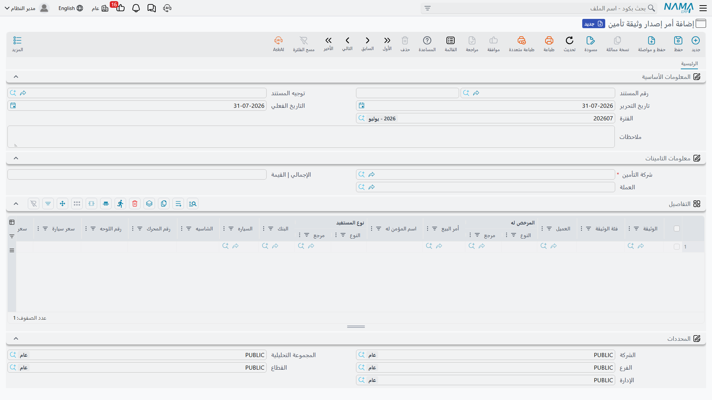

# دورة حياة وثيقة التأمين

::: info الترخيص المطلوب
`srvcenter-insurance-and-installments` **ومعه** `srvcenter-subitems`. وتشرح [صفحة النظرة العامة](/ar/modules/servicecenter/car-insurance/car-insurance-overview.md) سبب الحاجة إلى الكودين.
:::

وثيقة ليلى `POL-2026-7741` صارت سجلاً في ٥ مارس ٢٠٢٦، لكن لم يحدث لها شيء بعد. وخلال الأسبوع التالي تنقلها ثلاثة مستندات عبر حياتها:

| التاريخ | المستند | ما يسجّله |
|---|---|---|
| ٥ مارس | `SIIPO-2026-0212` **أمر إصدار وثيقة تأمين** | الصحراء تطلب الوثيقة من وفاء للتأمين |
| ١٠ مارس | `SIIPRP-2026-0198` **استلام وثيقة تأمين سيارة** | وصول الوثيقة الورقية |
| ١٢ مارس | `SIIPD-2026-0187` **تسليم وثيقة تأمين سيارة** | تسليمها لليلى مع المفاتيح |

ولاحقاً، إن تغيّرت التغطية، تتوفر ثلاثة مستندات أخرى — التجديد وتعديل القيمة وتعديل الفترة — وفي أي وقت بعد المستند الأول يمكن إلغاء الوثيقة.

وللمستندات السبعة شكل واحد. الرأس يحمل [أمر البيع](/ar/modules/servicecenter/car-sales/car-sales-order.md) والبرنامج والفئة ورقم الوثيقة وبيانات [السيارة](/ar/modules/servicecenter/cars-setup/car-master-file.md)؛ والجدول يحمل **سطراً لكل وثيقة**، فيستطيع مستند واحد أن ينقل دفعة كاملة من الوثائق دفعة واحدة. ولا يجوز أن تظهر الوثيقة نفسها مرتين في مستند واحد.

## الترتيب ملزم — وهذا يعمل فعلاً

من بين كل ما في هذه الصفحات الأربع، هذا هو الجزء الذي يتصرف كما أراد تصميمه تماماً، فيستحق أن يُقال بوضوح.

فكلما اعتمدت أحد هذه المستندات، يجمع النظام **كل المستندات المعتمدة من الأنواع السبعة** التي تمسّ كل وثيقة في جدولك، ويرتبها بتاريخ القيمة، ثم يتحقق من أن التسلسل الناتج مشروع. فإن لم يكن، رُفض الاعتماد.

والتسلسل المشروع هو:

```
أمر الإصدار  ←  الاستلام  ←  التسليم  ←  { تجديد | تعديل قيمة | تعديل فترة }*
                                            (متكررة، بأي ترتيب)

الإلغاء — مسموح بعد أي مستند
```

بعبارة أخرى:

- **أمر إصدار الوثيقة وحده يجوز أن يكون الأول.** فالاستلام على وثيقة لم تُطلب مرفوض، وكذلك التسليم على وثيقة لم تُستلم.
- **الاستلام لا يأتي إلا بعد أمر الإصدار**، و**التسليم لا يأتي إلا بعد الاستلام**.
- **تعديلا القيمة والفترة** يجوز أن يأتيا بعد التسليم أو بعد تجديد أو بعد تعديل آخر — لا بعد أمر إصدار ولا بعد استلام. فلا بد أن تصل الوثيقة إلى العميل قبل تعديل شروطها.
- **الإلغاء** يجوز بعد أي شيء.

ولأن الفحص يُعاد عند كل اعتماد على التاريخ كله، فللتأريخ الرجعي أثر: المستند الذي تُدخله بتاريخ قيمة أسبق يُوضع في موضعه من التسلسل، فإن جعل ذلك التسلسل غير مشروع رُفض الاعتماد وإن لم يكن في المستند نفسه ما يعيبه.

::: warning التجديد هو المستند الوحيد الذي لا يجري هذا الفحص
**تجديد وثيقة تأمين سيارة** هو الاستثناء. فيمكن اعتماده على وثيقة لم تُطلب ولم تُستلم ولم تُسلَّم قط، لأن التجديد لا يجري فحص الترتيب الذي تجريه إخوته الستة — بل يكتفي بالتحقق من أن جدوله غير فارغ.

ولا يمرّ الخطأ دون أن يُلاحظ إلى الأبد. ففي المرة التالية التي يُعتمد فيها أي مستند *آخر* من السلسلة على تلك الوثيقة، يُفحص التسلسل كاملاً، ويُكتشف التجديد السابق لأمر إصداره، ويُرفض ذلك المستند البريء المتأخر. وستشير رسالة الخطأ إلى المستند الذي تعتمده أنت، لا إلى التجديد الذي سبّب المشكلة.

فإذا فشل اعتماد برسالة ترتيب لا تفهمها، فافتح صفحة **المستندات المرتبطة** للوثيقة وابحث عن تجديد وصل قبل أمر إصداره.
:::

## ماذا يفعل كل مستند

### أمر إصدار وثيقة تأمين

أول مستند في السلسلة، وهو الذي يصل إلى المحاسبة. الرأس يحمل العملة و**شركة التأمين** (إجبارية) وإجمالياً محسوباً؛ والجدول يحمل الوثائق.



وعند الاعتماد يختم كل وثيقة بـ**تمت معالجتها بواسطة** مشيراً إلى نفسه، و — فقط إن لم تكن الوثيقة قد استُلمت بعد — يضع *الحالة المادية* على **مطلوبة من المورد** و*حالة السداد* على **مسددة كلياً أو جزئياً** و*حالة الوثيقة* على **أول مرة**. وإلغاء الاعتماد يمسح الأربعة، فيعيد الحالة المادية إلى *مبدئية* وحالة السداد إلى *غير مسددة*.

وبحث الوثائق فيه لا يعرض إلا الوثائق التي لا «تمت معالجتها بواسطة» لها — أي التي لم تُطلب بعد.

**المحاسبة:** نعم. زوج سطور قيد لكل سطر في الجدول، على حسابي **مدين / دائن قيمة التأمين** في توجيهه، بالمبلغ الموجود في عمود **سعر التأمين** بذلك السطر. راجع صندوق الخطر في آخر الصفحة.

::: warning اختيار شركة التأمين قد يملأ الجدول بآلاف السطور
اختيار شركة تأمين في الرأس لا يفلتر البحث فحسب — بل **يستبدل الجدول كله** بسطر لكل وثيقة غير مطلوبة لتلك الشركة، بلا تقسيم صفحات وبلا فلترة بفرع ولا بشركة.

وعلى تركيب جديد يكون ذلك تيسيراً. أما على معرض عامل فيه بضعة آلاف وثيقة مفتوحة فينتج مستنداً لا يمكن استعماله وربما لا يُفتح مرة أخرى.

اختر الوثائق من بحث الجدول نفسه بدلاً من ذلك، ولا تضع شركة الرأس إلا على تركيب عدد الوثائق المفتوحة فيه صغير — أو بعد أن يكون الجدول قد بُني.
:::

### استلام وثيقة تأمين سيارة

يسجّل وصول الورقة من شركة التأمين. الرأس يحمل **تاريخ الاستلام**، ويُنسخ إلى كل سطر في الجدول عند الحفظ، وجدولاً ثانياً لـ**مستندات الدفع الخارجية** — أدوات الدفع التي سلّمتها الصحراء لشركة التأمين، لكل منها قيمة وتاريخ.

وعند الاعتماد يضع *الحالة المادية* لكل وثيقة على **تم استلامها من المورد** (فقط إن لم تكن استُلمت من قبل) ويكتب تاريخ الاستلام على الوثيقة. وإلغاء الاعتماد يمسح تاريخ الاستلام ويعيد الحالة إلى *مطلوبة من المورد*.

وبحثه لا يعرض إلا الوثائق التي لا تاريخ استلام لها، مقيّدة بشركة التأمين في الرأس إن وُضعت.

**المحاسبة:** نعم — زوج حسابات قيمة التأمين نفسه الذي يستعمله أمر الإصدار، للعمود نفسه، **بالإضافة إلى** سطور مديونية مبنية من جدول الدفعات الخارجية.

::: warning «منع حفظ إذا كانت الوثيقة غير مسددة» لا يعمل أبداً
يحمل توجيه الاستلام خياراً عنوانه **منع حفظ إذا كانت الوثيقة غير مسددة**، ويُقرأ كأنه سيمنع تسجيل استلام لوثيقة لم يسدّدها المعرض بعد.

وهو لا يستطيع أن يعمل. فالفحص يقرأ إعداداً جديداً فارغاً بدل التوجيه الذي أعددته، فيكون الجواب دائماً «لا» مهما اخترت. وتفعيل الخيار لا يغيّر شيئاً على الإطلاق.

فإن احتجت هذا الضبط فلا بد أن يكون قاعدة تنظيمية أو تحققاً خاصاً بالعميل — ولا تعتمد على الخيار.
:::

### تسليم وثيقة تأمين سيارة

هو التسليم نفسه. الرأس يحمل **تاريخ التسليم**، ويُنسخ إلى كل سطر، وخمس خانات مرفقات لإيصال موقّع.

والشيء الوحيد الذي يتحقق منه أن تاريخ التسليم لا يسبق تاريخ استلام الوثيقة. وعند الاعتماد يضع *الحالة المادية* على **تم تسليمها للعميل** ويكتب تاريخ التسليم على الوثيقة؛ وإلغاء الاعتماد يمسح الاثنين.

**المحاسبة:** لا شيء.

::: warning املأ تاريخ التسليم في الرأس قبل الاعتماد
اعتماد تسليم تاريخ رأسه فارغ يُنتج خطأً لا رسالة تحقق نظيفة، لأن تاريخ السطر لا يُملأ إلا من الرأس. فاكتب تاريخ التسليم في الرأس دائماً أولاً.
:::

### تجديد وثيقة تأمين سيارة

يمدّ التغطية إلى فترة جديدة. الرأس يحمل **تاريخ التأمين الجديد** و**تاريخ الانتهاء الجديد**، ويُنسخان إلى السطور، ويمكن تجاوز كل منهما في السطر.

وعند الاعتماد يكتب التاريخين الجديدين على كل وثيقة — تاريخها الفعلي وتاريخ انتهائها — ويضع *حالة الوثيقة* على **تجديد**.

**المحاسبة:** نعم، بزوج الحسابات نفسه وعائلة التوجيه نفسها التي لأمر الإصدار، لعمود *سعر التأمين* في سطوره. ولاحظ أنه يرحّل بعملة الشركة نفسها لا بعملة تُختار على المستند.

::: danger إلغاء اعتماد التجديد لا يتراجع عنه
إلغاء اعتماد التجديد يعكس **قيده المحاسبي فقط**. أما الوثيقة فتحتفظ بالتاريخ الفعلي المجدَّد وتاريخ الانتهاء المجدَّد وحالة *تجديد*؛ ولا شيء يُعاد.

وخلفه فخ ثانٍ. فالتجديد لا يمسّ **مدة الوثيقة** إطلاقاً، فعلى تركيب أُظهر فيه هذا الحقل ومُلئ، يعيد *الحفظ العادي التالي للوثيقة* حساب تاريخ الانتهاء من المدة القديمة ويستبدل به التاريخ المجدَّد في صمت.

فإن احتجت التراجع عن تجديد، فألغِ اعتماده لعكس المحاسبة، ثم صحّح تواريخ الوثيقة عمداً — وراجعها بعد الحفظ.
:::

### إلغاء وثيقة تأمين سيارة

يسجّل انتهاء التغطية. الرأس يحمل **تاريخ الإلغاء** و**سبب الإلغاء** نصاً حراً، ومرفقاً.

وعند الاعتماد يكتب تاريخ الإلغاء على كل وثيقة، ويضع *حالة الوثيقة* على **ملغاة**، ويسجّل نفسه مستنداً مُلغياً. وإلغاء الاعتماد يمسح الثلاثة — لكن للوثائق التي ألغاها هذا المستند بعينه فقط، فلا يستطيع إلغاء ثانٍ أن ينقض عمل الأول. واعتماد إلغاء على وثيقة ألغاها مستند آخر مرفوض برسالة تسمّي ذلك المستند.

**المحاسبة:** لا شيء. **الإلغاء لا يقيّد شيئاً ولا يسترد شيئاً.** فإن عاد مال من شركة التأمين فذلك مستند محاسبي منفصل.

### التعديلان

**تعديل قيمة وثيقة تأمين سيارة** يغيّر ما تساويه الوثيقة. اكتب **القيمة الجديدة** في الرأس؛ وعند الاعتماد تُستبدل قيمة كل وثيقة بها وتصير *حالة الوثيقة* **تعديل قيمة**. وقيمة الرأس هي المستعملة لكل سطر، فعمود *القيمة الجديدة* في السطر زخرفي — وملؤه بقيم مختلفة لكل سطر لا يحقق شيئاً. والتحقق الوحيد أن القيمة الجديدة لا تكون صفراً.

**تعديل فترة وثيقة تأمين سيارة** يغيّر متى تنتهي الوثيقة. اكتب **تاريخ الانتهاء الجديد** في الرأس؛ وعند الاعتماد يُستبدل تاريخ انتهاء كل وثيقة به وتصير *حالة الوثيقة* **تعديل فترة**.

::: danger لا التعديلان بأثر رجعي، وتعديل الفترة لا يمكن التراجع عنه إطلاقاً
**كلا المستندين ختم محض.** اقرأها حرفياً:

- **لا شيء يُعاد حسابه.** لا قيمة تأمين تُعاد، ولا مدة وثيقة تُحدَّث، ولا حساب تناسبي للفترة المقصورة أو الممدودة، ولا فرق من أي نوع يُشتق.
- **ولا واحد منهما يقيّد شيئاً.** فمدّ وثيقة ستة أشهر أو تنصيف قيمتها لا يُنتج قيداً محاسبياً ولا إشعاراً دائناً ولا تعديلاً لما يُستحق لشركة التأمين. والجانب المالي يُعالَج كله يدوياً كمستند محاسبي منفصل.
- **وتعديل الفترة لا سلوك تراجع له إطلاقاً.** فإلغاء اعتماده — أو حذفه — يترك تاريخ الانتهاء الجديد وحالة *تعديل فترة* على الوثيقة إلى الأبد. ولا سبيل إلى الرجوع عنه بالمستند؛ بل عليك أن تفتح الوثيقة وتصحح التاريخ بنفسك، وحتى حينها تبقى الحالة على ما هي.

أما تعديل القيمة فيستعيد القيمة السابقة عند إلغاء اعتماده، بتحفظ واحد: إنه يستعيد القيمة المخزَّنة في سطره هو، لا «قيمة قديمة» محفوظة على حدة. فلو عدّل أحدهم عمود قيمة الوثيقة في ذلك السطر بعد الاعتماد، فإلغاء الاعتماد يستعيد الرقم المعدَّل لا الأصلي.

**والقاعدة العملية للاثنين:** اعتبر التعديل المعتمد نهائياً، وسجّل أثره المالي على حدة.
:::

## ما الذي يصل إلى دفتر الأستاذ فعلاً

ثلاثة من المستندات السبعة تقيّد: **أمر الإصدار** و**الاستلام** و**التجديد**. أما التسليم والإلغاء والتعديلان فلا يقيّد أي منها شيئاً.

والثلاثة تقيّد الشيء نفسه بالطريقة نفسها — زوج مدين/دائن لكل سطر في الجدول، على حسابي **مدين / دائن قيمة التأمين** المضبوطين في [توجيه المستند](/ar/modules/servicecenter/document-terms/servicecenter-terms-cars-and-other.md)، بالمبلغ الموجود في عمود **سعر التأمين** بذلك السطر.

::: danger عمود سعر التأمين لا يُملأ لك أبداً
هذا هو الخلل الموصوف في [صفحة النظرة العامة](/ar/modules/servicecenter/car-insurance/car-insurance-overview.md)، وهنا يظهر أثره.

**سعر التأمين هو الرقم الوحيد الذي تقيّده هذه المستندات، ولا شيء يكتبه.** فاختيار برنامج تأمين لا يملؤه. واختيار وثيقة لا يملؤه. وسعر السيارة لا يشتقّه. هو عمود فارغ ينتظر من يكتب فيه.

واعتمد أمر إصدار وهذا العمود فارغ — وهو بالضبط ما يحدث إن ظننت أن البرنامج سعّر الوثيقة — فيُنتج المستند **قيداً محاسبياً بصفر**، نظيفاً، بلا تحذير، ويكتمل طلب الأعمال بنجاح.

**اكتب سعر التأمين في كل سطر من جدول كل أمر إصدار واستلام وتجديد**، وخذ الرقم من عرض شركة التأمين نفسها، وراجع القيد بعد معالجته قبل إقفال الفترة. وفي أمر ليلى الرقم المكتوب هو **٣٬١٥٠** الذي عرضته وفاء للتأمين — لا رقماً استنبطه النظام.
:::
