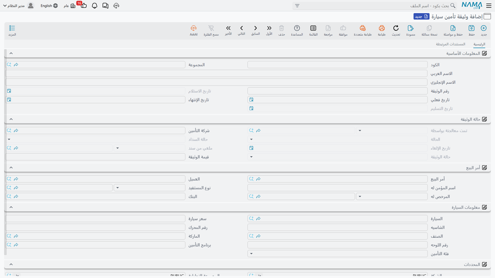

# وثيقة تأمين السيارة

::: info الترخيص المطلوب
`srvcenter-insurance-and-installments` **ومعه** `srvcenter-subitems`. وتشرح [صفحة النظرة العامة](/ar/modules/servicecenter/car-insurance/car-insurance-overview.md) سبب الحاجة إلى الكودين.
:::

لوثيقة ليلى رقم وتاريخ بداية وتاريخ انتهاء وقيمة وسيارة. ولها كذلك حياة: تُطلب، ثم تصل، ثم تُسلَّم، وقد تُجدَّد أو تُلغى بعد ذلك. ويحفظ نظام نعمة هذين النصفين في موضعين مختلفين. فحقائق الوثيقة تعيش في **سجل رئيسي** — **وثيقة تأمين سيارة**، تصل إليه من **سيارات ← تأمين سيارات** — أما الأحداث فتعيش في مستندات تشير إليه.

وتنشئ الصحراء سجلاً كهذا لسيارة ليلى: الوثيقة `POL-2026-7741` لدى `INS-02` وفاء للتأمين، البرنامج `INSP-WAFA-COMP`، تغطي [سجل السيارة](/ar/modules/servicecenter/cars-setup/car-master-file.md) `CAR-000318` (الشاسيه `NWA7R24C26K000318`).

وهذه الصفحة عن ذلك السجل. أما المستندات فعلى [الصفحة التالية](/ar/modules/servicecenter/car-insurance/car-insurance-policy-documents.md).

## ابدأ من أمر البيع ودع الشاشة تملأ نفسها

أكفأ طريقة لإنشاء وثيقة ألّا تكتبها. افتح وثيقة جديدة واختر [**أمر البيع**](/ar/modules/servicecenter/car-sales/car-sales-order.md) أولاً — `SISO-2026-0233` في حالة ليلى — فتصبّ الشاشة بيانات البيعة في نفسها.

فمن هذا الاختيار الواحد تأخذ الوثيقة **العميل** و**اسم المؤمَّن له** و**المرخَّص له** و**البنك** و**شركة التأمين** و**برنامج التأمين** من أول سطر في الأمر، و**فئة الوثيقة** من أول شريحة في ذلك البرنامج، و**سعر السيارة**، و**السيارة والشاسيه ورقم المحرك والصنف** من سطر الأمر. أما حقل *التأمين لصالح* فيُملأ من طبيعة البيعة: في البيع النقدي هو العميل، وفي البيع بالتمويل هو بنك التمويل المذكور في [كتلة التمويل بأمر البيع](/ar/modules/servicecenter/car-installments/car-installment-programs.md).

وأمران يستحقان الانتباه في هذا الملء:

- **لا يملأ إلا الحقول التي ما زالت فارغة.** فما كتبته أنت أولاً يُترك على حاله — وهذا مريح، ويعني كذلك أن قيمة قديمة كتبتها بالخطأ لن تُصحَّح.
- **بحث أمر البيع يخفي الأوامر التي عليها وثيقة بالفعل**، فلا تستطيع أن تؤمّن البيعة نفسها مرتين بالخطأ. وعلى تركيب فيه تاريخ وثائق ضخم يكون فتح هذا البحث بطيئاً، لأنه يبني قائمة الاستبعاد كاملة قبل أن يعرض لك شيئاً.

ويبقى عليك أن تكتب ما لا تستطيع البيعة معرفته: **رقم الوثيقة** الذي أصدرته شركة التأمين، و**قيمة الوثيقة**، و**التاريخ الفعلي** لبدء السريان.

## ما تكتبه أنت وما يخص المستندات

تخلط شاشة الوثيقة نوعين من الحقول، والتفريق بينهما هو مهارة استخدام هذا السجل كلها.

**تكتبها المستندات، وهي للقراءة فقط على الشاشة** — تراها تُملأ كلما تقدمت الدورة، ولا تستطيع تعديلها:

| الحقل | يكتبه |
|---|---|
| تمت معالجتها بواسطة | أمر إصدار الوثيقة (ويُمسح عند إلغاء اعتماده) |
| الحالة المادية | أمر الإصدار والاستلام والتسليم |
| حالة السداد | أمر الإصدار، وفاتورة شراء التأمين |
| حالة الوثيقة | أمر الإصدار والتجديد والتعديلان والإلغاء |
| تاريخ الاستلام | مستند استلام الوثيقة |
| تاريخ التسليم | مستند تسليم الوثيقة |
| تاريخ الإلغاء و«ملغاة من مستند» | مستند الإلغاء |

**تكتبها أنت بحرية وفي أي وقت** — رقم الوثيقة، وقيمة الوثيقة، والتاريخ الفعلي، وتاريخ الانتهاء، وسعر السيارة، وشركة التأمين، وبرنامج التأمين، وفئة الوثيقة.

::: warning السجل قد يخالف مستنداته في صمت
انظر إلى القائمة الثانية مرة أخرى. **قيمة الوثيقة وتاريخ الانتهاء والتاريخ الفعلي ورقم الوثيقة كلها حقول تُكتب باليد بلا أي قفل عليها — وهي في الوقت نفسه حقول تكتبها مستندات معتمدة.**

فمستند تعديل القيمة يكتب قيمة الوثيقة. والتجديد يكتب التاريخ الفعلي وتاريخ الانتهاء. وتعديل الفترة يكتب تاريخ الانتهاء. وبمجرد اعتماد أي منها، لا شيء يمنع مستخدماً من فتح شاشة الوثيقة بعد ذلك والكتابة فوق النتيجة. لا تحذير ولا تأكيد ولا ملاحظة على الشاشة؛ الحقل يقبل الرقم الجديد ببساطة، ويبقى المستند المعتمد يصف واقعاً لم يعد قائماً.

القواعد العملية:

- متى مرّت وثيقة بتجديد أو تعديل، **فاعتبر قيمتها وتواريخها ملكاً للمستندات** ولا تغيّرها إلا بمستند تعديل آخر.
- إذا بدا رقم على وثيقة خاطئاً، فلا تصلحه على الشاشة الرئيسية. افتح صفحة **المستندات المرتبطة** (أدناه)، واعرف ما تقوله المستندات فعلاً، وصحّحه من هناك.
- لا تُحمّل قيم الوثائق أو تواريخها عبر استيراد أو تكامل بعد بدء الدورة — فالاستيراد سيكتب فوق ما كتبته المستندات في صمت.
:::

## حالات الوثيقة الثلاث

تحمل الوثيقة ثلاثة محاور حالة مستقلة، تكتبها المستندات جميعاً، ويعينك أن تقرأها كثلاثة أسئلة مختلفة.

**الحالة المادية** — *أين الورقة؟*

| القيمة | يضعها |
|---|---|
| مبدئية | الحالة الابتدائية؛ وتُستعاد عند إلغاء اعتماد أمر الإصدار |
| مطلوبة من المورد | أمر إصدار الوثيقة |
| تم استلامها من المورد | مستند استلام الوثيقة |
| تم تسليمها للعميل | مستند تسليم الوثيقة |

ويحمل السجل كذلك *تم استلامها من العميل* و*تم تسليمها للمورد*، ولا يضعهما أي مستند في الدورة.

**حالة السداد** — *هل دُفع ثمنها؟* والقيم: *غير مسددة*، و**مسددة كلياً أو جزئياً** يضعها أمر الإصدار، و**مدفوعة للمورد** تضعها فاتورة شراء التأمين.

**حالة الوثيقة** — *في أي طور من حياتها هي؟* والقيم: **أول مرة**، و*تجديد*، و**تعديل فترة**، و**تعديل قيمة**، و*ملغاة*. وكل مستند من المستندات المقابلة يختم قيمته هنا، فيخبرك هذا الحقل دائماً بآخر ما جرى للوثيقة — لكن راجع التحذير الخاص بتعديل الفترة في [صفحة الدورة](/ar/modules/servicecenter/car-insurance/car-insurance-policy-documents.md)، فذلك الختم بالذات دائم.

## تاريخ الانتهاء

::: warning اكتب تاريخ الانتهاء ثم راجعه بعد الحفظ
تحمل الوثيقة **مدة الوثيقة** بالأشهر، والنظام يستخدمها: فعند كل حفظ للوثيقة، إذا كان التاريخ الفعلي والمدة كلاهما مملوءاً، **يُعاد حساب تاريخ الانتهاء منهما ويُكتب فوق ما كان في الحقل** — بما في ذلك تاريخ وضعه تجديد معتمد أو تعديل فترة معتمد.

وأمران آخران يزيدان الأمر سوءاً لا تحسناً:

- **مدة الوثيقة ليست على شاشة الوثيقة القياسية.** فهي موجودة في السجل وتحرّك الحساب، لكنك لا تستطيع رؤيتها أو ضبطها بغير تعديل على الشاشة. وفي التركيب القياسي تكون فارغة عادةً، وهذا وحده سبب ألا يؤذيك الاستبدال في أغلب الحالات.
- وحيث أُظهرت المدة، تختلف الشاشة والخادم بشهر كامل في تفسيرها. فوثيقة مدتها اثنا عشر شهراً تبدأ في الأول من يناير تعرض تاريخ انتهاء وأنت تكتب، وتحفظ تاريخاً آخر.

**الطريقة الآمنة:** اترك المدة وشأنها، واكتب **التاريخ الفعلي** و**تاريخ الانتهاء** صراحةً، ثم احفظ، ثم أعد فتح الوثيقة واقرأ تاريخ الانتهاء قبل أن تعتمد عليه. ولا تشتق تاريخ انتهاء من مدة في عرض سعر أو خطاب لعميل أبداً.
:::

وتكتب الصحراء تواريخ ليلى مباشرةً: التاريخ الفعلي **١٢ مارس ٢٠٢٦** والانتهاء **١١ مارس ٢٠٢٧**. والتحقق الوحيد الذي يفرضه السجل أن تاريخ الانتهاء لا يسبق التاريخ الفعلي.

## صفحة المستندات المرتبطة

الصفحة الثانية من شاشة الوثيقة هي أنفع شاشة في المنطقة كلها، ويسهل ألا يُنتبه إليها.

فيها سبع قوائم قابلة للطي، واحدة لكل نوع مستند: **أوامر الإصدار، والاستلامات، والتسليمات، والتجديدات، وتعديلات القيمة، وتعديلات الفترة، والإلغاءات**. وتعرض كل قائمة المستندات التي يحتوي جدولها على هذه الوثيقة. وهذا هو تاريخ السجل كاملاً في موضع واحد — وبسبب مشكلة الكتابة فوق البيانات المذكورة أعلاه، فهو التاريخ الموثوق. فمتى بدت قيمة الوثيقة أو تواريخها خاطئة، فهذه الصفحة تخبرك بما سجّلته المستندات فعلاً.

## حقول موجودة ولا تفعل شيئاً

توجد حفنة حقول على الوثيقة أو على مستنداتها لا يقرؤها شيء. ونذكرها هنا فقط حتى لا يضيّع أحد فترة بعد الظهر في محاولة معرفة فائدتها:

- **المبلغ المدفوع** و**المبلغ المتبقي** على مستندات الوثيقة. فلا توجد متابعة سداد جزئي في هذه المنطقة؛ المستحق والمدفوع يعيشان في المحاسبة لا هنا.
- **حالة طلب الوثيقة** و**تاريخ الشحن** و**العميل المستفيد** و**البنك المستفيد** و**طريقة التأمين** على مستندات الوثيقة.

ولا يظهر أي منها على الشاشات القياسية، ولا يؤثر أي منها في حساب أو حالة أو قيد.
