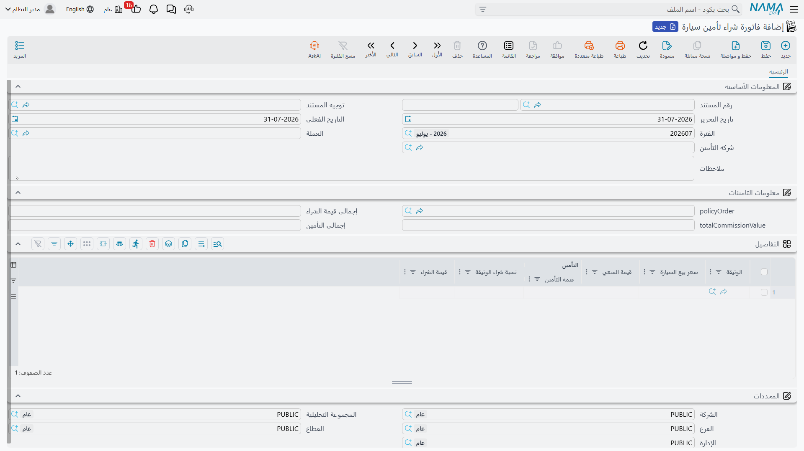

# فاتورة شراء التأمين

::: info الترخيص المطلوب
`srvcenter-insurance-and-installments` **ومعه** `srvcenter-subitems`. وتشرح [صفحة النظرة العامة](/ar/modules/servicecenter/car-insurance/car-insurance-overview.md) سبب الحاجة إلى الكودين.
:::

رتّبت الصحراء وثيقة ليلى، وقبضت مالها، وسلّمتها الأوراق. ويبقى الجانب الآخر من الترتيب: أن الصحراء اشترت تلك الوثيقة من وفاء للتأمين، بخصم عن قيمتها الاسمية عادةً، وأنها تكسب شيئاً مقابل توسيطها. و**فاتورة شراء تأمين سيارة** هي موضع قيد ذلك. تصل إليها من **سيارات ← تأمين سيارات**.

وتحرّر الصحراء `SIIPI-2026-0074` بسطر واحد: الوثيقة `POL-2026-7741`، سعر بيع السيارة **٨٧٬٥٠٠**، نسبة شراء الوثيقة **٣٫٦٪**.

## الشاشة

صفحة واحدة وثلاث كتل.

**البيانات الأساسية** تحمل الكود وتاريخ القيمة والعملة و**شركة التأمين**.

**بيانات التأمين** تحمل مرجعاً إلى **أمر إصدار الوثيقة** الذي تسوّيه الفاتورة، وثلاثة إجماليات: إجمالي قيمة الشراء وإجمالي قيمة العمولة وإجمالي قيمة التأمين. والثلاثة محسوبة من الجدول وللقراءة فقط عملياً.

**جدول التفاصيل** هو موضع المال، سطر لكل وثيقة:

| العمود | بالإنجليزية | مكتوب أم محسوب |
|---|---|---|
| **وثيقة تأمين سيارة** | Insurance Policy | يُختار |
| **سعر بيع السيارة** | Car Sale Price | يُكتب — وهو الثمن الذي بيعت به السيارة في [فاتورة بيعها](/ar/modules/servicecenter/car-sales/car-sales-invoice.md) |
| **نسبة شراء الوثيقة** | Policy Purchase Percentage | تُكتب — وهي عادةً *نسبة تأمين المشتري* من شريحة البرنامج |
| **قيمة التأمين** | Insurance Value | **تُكتب** |
| **قيمة العمولة** | Commission Value | **تُكتب** |
| **قيمة الشراء** | Purchase Value | **محسوبة** من سعر بيع السيارة والنسبة |

انتبه إلى التمييز. **قيمة التأمين والعمولة رقمان تكتبهما**؛ ولا شيء يشتقهما من البرنامج ولا من الوثيقة ولا أحدهما من الآخر. والمحسوب وحده هو قيمة الشراء — وهي العمود الذي فيه المشكلة.

وسطر الصحراء يقرأ: قيمة تأمين **٢٬٨٣٥**، وقيمة عمولة **٣١٥**، كلتاهما مكتوبة، وقيمة شراء تُحفظ **٣٬١٥٠**.

::: danger قيمة الشراء تُحسب على الشاشة أكبر مئة ضعف
الشاشة والخادم لا يتفقان على معنى النسبة المئوية.

فبينما تكتب، تضرب الشاشة سعر بيع السيارة في النسبة **دون قسمة على ١٠٠**. اكتب ٨٧٬٥٠٠ و٣٫٦ فيعرض عمود *قيمة الشراء* **٣١٥٬٠٠٠**. وحين تضغط «حفظ» يعيد الخادم حساب العمود نفسه *مع* القسمة ويخزّن **٣٬١٥٠** — أي جزءاً من مئة مما كنت تنظر إليه للتوّ.

والرقم المخزَّن هو المعقول، وهو الذي يصل إلى دفتر الأستاذ. لكن الرقم على شاشتك وأنت تبني المستند خاطئ بمقدار مئة ضعف، وخاطئ في الاتجاه الذي يجعل الإجمالي يبدو كارثياً.

**كيف تتعامل مع هذا:**

- **لا تنقل ولا تطبع ولا تراجع قيمة الشراء المعروضة على الشاشة أبداً.** احفظ المستند، وأعد فتحه، واقرأ الرقم المخزَّن.
- **وافعل الشيء نفسه مع إجماليات الرأس الثلاثة.** فهي محسوبة من الجدول، أي أنها قبل أول حفظ مبنية من الأرقام المتضخمة المعروضة.
- وإذا أبلغك أحد عن فاتورة شراء تأمين بإجمالي سخيف، فاسأله هل قرأه قبل الحفظ. وهذا هو الجواب في الغالب.
- والضرب الخام نفسه يظهر في قيمة التأمين على عرض سعر التقسيط — راجع [صفحة عرض السعر](/ar/modules/servicecenter/car-installments/car-installment-quotation.md).
:::

## ثلاثة قيود مستقلة

هذا هو الجزء غير المألوف في المستند، ويستحق أن يُفهم على وجهه. فالفاتورة لا تقيّد مبلغاً صافياً واحداً. **بل تقيّد ثلاثة مبالغ منفصلة، لكل سطر، على ثلاثة أزواج حسابات مختلفة، وليس مطلوباً منها أن تتوافق في مجموع.**

| المبلغ المقيَّد | الحساب المدين (في التوجيه) | الحساب الدائن (في التوجيه) |
|---|---|---|
| **قيمة التأمين** | مدين تحمل التأمين | دائن تحمل التأمين |
| **قيمة العمولة** | عمولة التأمين - مدين | عمولة التأمين - دائن |
| **قيمة الشراء** | قيمة الشراء - مدين | قيمة الشراء - دائن |

فكل عمود يُنتج مدينه ودائنه على حساباته المضبوطة، مجموعةً لكل سطر في الجدول. ولا شيء يوفّق بينها: قيمة التأمين ليست قيمة الشراء زائد العمولة، والنظام لا يتحقق من ذلك أبداً. وفي حالة ليلى صادف أن ٢٬٨٣٥ + ٣١٥ = ٣٬١٥٠، لأن هذه هي الطريقة التي اختارت بها الصحراء تفصيل الرقم — لا لأن شيئاً فرضها.

وأي طرف يقع عليه كل قيد أمر تحسمه إعدادات الجانب المحاسبي في التوجيه وحده. وعادةً تكون ذمة شركة التأمين على جانب وحساب مصروف تأمين أو إيراد عمولة على الآخر. ولا شيء في المستند يربط شركة التأمين بالقيد ربطاً ثابتاً، فإن نزل القيد على الطرف الخطأ فإعدادات حسابات التوجيه هي ما يحتاج التصحيح.

::: warning شاشة التوجيه لا تستطيع ضبط القيد الثالث
في [شاشة توجيه المستند](/ar/modules/servicecenter/document-terms/servicecenter-terms-cars-and-other.md) خللان يهمّانك عند الإعداد لأول مرة.

**زوج قيمة التأمين موضوع مرتين.** فحقلا *مدين تحمل التأمين* و*دائن تحمل التأمين* يظهران في مجموعتين مختلفتين على شاشة التوجيه. وهما إعداد واحد معروض في موضعين لا إعدادان — فضبط أحدهما يضبط الآخر، ولا يوجد قيد ثانٍ وراء المكرر.

**وزوج قيمة الشراء غير موجود على الشاشة إطلاقاً.** فحسابا *قيمة الشراء - مدين* و*قيمة الشراء - دائن* هما ما يستعمله القيد الثالث، ولا أحد منهما موضوع في أي مكان من شاشة التوجيه القياسية. وعلى تركيب قياسي لا تستطيع ضبطهما، ومعنى ذلك أن **قيد قيمة الشراء لا يمكن إعداده بغير تعديل على الشاشة.**

والأثر العملي: تستطيع جاهزاً أن تضبط قيدي قيمة التأمين والعمولة ولا شيء غيرهما. فإن كان تصميمك المحاسبي يحتاج قيد قيمة الشراء أيضاً، فخطّط لتعديل شاشة على توجيه فاتورة شراء التأمين قبل التشغيل — وإن لم تكن قيمة الشراء قيداً تحتاجه حساباتك، فاترك العمود على ما يُحسب واعلم أنه لا ينزل في أي مكان.
:::

## أثرها على الوثيقة

وراء دفتر الأستاذ، تمسّ الفاتورة كل وثيقة تسمّيها. فعند الاعتماد تختم كلاً منها بمرجع إلى نفسها وتضع **حالة السداد** على **مدفوعة للمورد**. وإلغاء الاعتماد يمسح المرجع ويعيد حالة السداد إلى *مسددة كلياً أو جزئياً*.

وإن أعدت تحرير الفاتورة واعتمادها بعد تغيير الوثائق التي تغطيها، فالوثائق التي أُخرجت من الجدول تُمسح أختامها أولاً، فتبقى العلامات متسقة مع السطور الحالية.

وهي لا تحرّك مخزوناً — فلا شيء مادي في وثيقة — ولا تمسّ الحالة المادية للوثيقة ولا قيمتها ولا تواريخها.

::: warning ثلاثة حقول في الرأس لا تفعل شيئاً
يحمل نموذج الفاتورة **العميل** و**خطة الضريبة** و**نوع البيع**. ولا واحد من الثلاثة على الشاشة القياسية، ولا واحد منها يؤثر في القيد المحاسبي — فالقيود تُبنى من سطور الجدول ومن المستند وحدهما. ولا يُمرَّر إلى القيد لا عميل الرأس ولا شركة التأمين في الرأس؛ إعدادات حسابات التوجيه وحدها تحدد الأطراف.
:::
