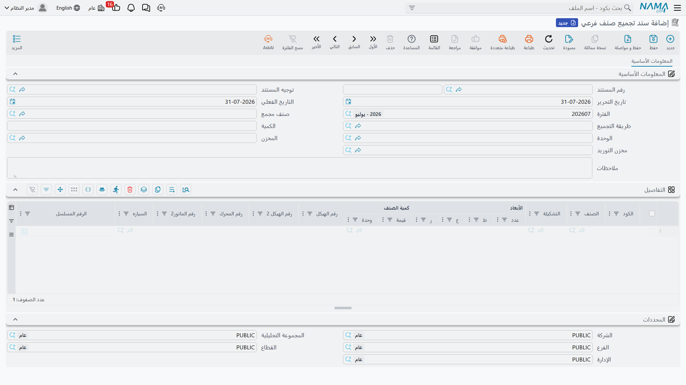

# تجميع السيارة من الهيكل والمحرك

ليس كل تاجر يشتري سيارات جاهزة. فبعضهم يشتري الهيكل من مورّد والمحرك من آخر ثم يركّب أحدهما على
الآخر — صانع هياكل يركّب كبائن على شاصيهات الشاحنات، أو مجمِّع يعمل برخصة مصنع، أو متخصص يحوّل
الفانات. ولهذا وُجد آخر بند في مجلد مشتريات السيارات، وهو مستند من طراز آخر.

**مستند تجميع الصنف الفرعي / Sub Item Assembly Document** —
`سيارات > مشتريات السيارات`، آخر بند في المجموعة بعد مردود المشتريات.

وهو يفعل شيئين في آن. ينشئ
[ملفات السيارات](/ar/modules/servicecenter/cars-setup/car-master-file.md) المفردة للمركبات التي
يجمّعها، ويُنتج مستند تجميع مخزنياً
حقيقياً يستهلك الهيكل والمحرك ويُخرج المركبات المكتملة منتجات مشتركة. حفظ واحد، وأثران.

::: info الترخيصان المطلوبان — تحتاج اثنين
**`supplychain-assembly`** *و* **`srvcenter-subitems`**.

وهذا هو المستند الوحيد في نصف السيارات المرخَّص خارج مركز الخدمة. فهو مصنّف مع كيانات التجميع
المخزنية، وهو متسق مع ما يفعله فعلاً، لكنه يوقع الناس: فمع `srvcenter-subitems` وحده تظهر مجموعة
مشتريات السيارات ويغيب هذا البند منها، ومع `supplychain-assembly` وحده يوجد المستند ولا تُبنى قائمة
«سيارات» التي تحتويه أصلاً. فأنت محتاج إلى الكودين معاً قبل أن يفتحه أحد.

:::

## الشاشة

صفحة واحدة، **المعلومات الأساسية**.

يسمّي الرأس ما يُبنى وممّ يُبنى:

| الحقل | بالإنجليزية | ملاحظات |
|---|---|---|
| صنف التجميع | Assembly Item | صنف المركبة المكتملة |
| قائمة مكونات التجميع | Assembly BOM | **إجباري.** يوفّر صنف الهيكل وصنف المحرك |
| كمية التجميع | Assembly Quantity | كم مركبة يبنيها هذا المستند |
| المخزن | المخزن المصدر | من أين تُسحب الهياكل والمحركات |
| مخزن الاستلام | Receipt Warehouse | أين تنزل المركبات المكتملة |

ثم جدول السطور — سطر لكل مركبة — يحمل **رقم الهيكل**، و**رقم الهيكل ٢**، و**رقم المحرك**، و**رقم
المحرك ٢**، إلى جانب أعمدة السطر المعتادة ومنتقي **السياره (Customer Car)**.

وتلك الأعمدة الأربعة تستحق وقفة. فكما ذُكر في هذا المجلد كله، **لا** تعرض أي شاشة من شاشات مشتريات
السيارات عمود هيكل أو محرك في التركيب الافتراضي — إلا هذه. فهي الشاشة الوحيدة المُسلَّمة في الوحدة
التي تكتب فيها رقم هيكل بلا أن تطلب تعديل شاشة أولاً.

## إلامَ تتحول الأرقام الأربعة

يمرّر المستند معرّفاته إلى محددات التتبع الخاصة بالمخزون عند كل حفظ:

| ما تكتبه | إلامَ يتحول |
|---|---|
| رقم الهيكل | **المسلسل الثاني** للسطر |
| رقم المحرك | **الرقم المسلسل** للسطر |
| رقم المحرك ٢ | **رقم اللوط** للسطر |
| رقم الهيكل ٢ | **الصندوق** للسطر |

وهذا مقصود، وهو ما يجعل الفقرة التالية ممكنة: إذ يستطيع التجميع عندئذ أن يتحقق من أن الهيكل والمحرك
اللذين تدّعي استعمالهما وحدتان حقيقيتان متتبَّعتان موجودتان فعلاً.

## ماذا يفحص قبل أن يقبل الاعتماد

تحققان، كلاهما صارم وكلاهما لكل سطر:

- **الكمية لا بد أن تساوي واحداً بالضبط.** فالسطر يمثّل مركبة واحدة. وما عدا ذلك يُرفض برسالة
  *«الكمية الرئيسية يجب ان تساوي الواحد الصحيح»*. وخلافاً لباقي نصف السيارات فإن هذه القاعدة مطلقة
  هنا — لا تتوقف على إعدادات حالة الصنف.
- **الهيكل والمحرك لا بد أن يكونا موجودين حقاً.** فمسلسل الهيكل في كل سطر يُفحص على اللوط المسمّى
  لـ**صنف الهيكل** في قائمة المكونات، ومسلسل المحرك على اللوط المسمّى لـ**صنف المحرك**. ورقم لم
  يُستلم قط، أو استُلم في لوط آخر، يوقف الاعتماد.

وبهما معاً لا تستطيع تجميع مركبة من قطع لا تملكها، ولا بناء مركبتين في سطر واحد بهدوء.

## ماذا يفعل عند الاعتماد

1. **ينشئ ملفات السيارات** — واحداً لكل سطر، بالروتين نفسه المستعمل في كل مستندات هذا المجلد، وبنفس
   الشروط: الصنف معلَّم بأن له أصنافاً فرعية، وله **إعدادات حالة السيارة** مربوطة، و*مجموعة الصنف
   الفرعي المُنشأ* مملوءة. وكما في كل موضع يحكم خيار
   [توجيه المستند](/ar/modules/servicecenter/document-terms/servicecenter-terms-cars-and-other.md)
   *إنشاء صنف فرعي من السطر* وقوع الإنشاء من عدمه.
2. **ينشئ مستند تجميع مخزنياً** — لكن **فقط إذا سمّى توجيه المستند دفتر مستند التجميع وتوجيهه معاً**.
   وهذان الخياران هما كل محتوى إعداد توجيه هذا المستند، مضافين فوق مجموعة خيارات الصنف الفرعي
   المشتركة. وإن كان أحدهما فارغاً توقف المستند عند الخطوة الأولى: ملفات السيارات موجودة، ولا تجميع
   منتَج.

ومستند التجميع المُنشأ هو الذي يقوم بالعمل المخزني والتكلفي. **منتجاته المشتركة** هي المركبات
المجمَّعة، و**مكوناته** هما صنف الهيكل وصنف المحرك من قائمة المكونات. ويُعتمد تلقائياً، ويُحفظ مرجعه
على مستند التجميع فتفتحه من هنا.

::: danger إلغاء هذا المستند يحذف ملفات السيارات التي أنشأها حذفاً نهائياً
هذا هو السلوك الوحيد في الوحدة الذي يتلف بيانات رئيسية بدل أن يعكس أثراً.

فإلغاء اعتماد مستند تجميع الصنف الفرعي لا يفصل مركباته، ولا يعلّمها ملغاة، ولا ينقل حالتها. بل
**يحذف حذفاً نهائياً** ملف السيارة في كل سطر، ومعه سطور الكمية والتكلفة المحفوظة على تلك السيارة.
ويحذف كذلك مستند التجميع المُنشأ.

ولا تراجع، ولا رسالة تنبّهك إلى ما هو ذاهب. وإن كانت إحدى تلك المركبات قد استُلمت أو خُصّصت أو
فُوترت أو سُلّمت بعد ذلك، بقيت المستندات التي أشارت إليها تشير إلى سجل لم يعد موجوداً.

**قبل الإلغاء افحص هل استُعملت أي من المركبات المجمَّعة في مستند لاحق.** فإن كانت كذلك فعالج الموقف
بمردود أو تسوية لا بإلغاء اعتماد التجميع.
:::

## موضعه من بقية السلسلة

سلسلة المجمِّع تشبه سلسلة الشراء مع وضع هذا المستند مكان
[فاتورة شراء](/ar/modules/servicecenter/car-purchasing/car-purchase-invoice.md) المركبة المكتملة:

1. يُشترى **الهيكل** و**المحرك** ويُستلمان صنفين عاديين، متتبَّعَي المسلسل واللوط، بمستندات الشراء
   المخزنية المعتادة. وليسا ملفات سيارات.
2. يبني **مستند تجميع الصنف الفرعي** المركبة: هنا تُولد ملفات السيارات، ويستهلك مستند التجميع
   المُنشأ المكونات ويُخرج الوحدات المكتملة إلى مخزن الاستلام.
3. ومن تلك النقطة يصير كل شيء مطابقاً لسيارة مشتراة — تخصيص، وخطاب مرور،
   و[فاتورة بيع](/ar/modules/servicecenter/car-sales/car-sales-invoice.md)، وتسليم نهائي —
   وكلها مقودة بـ
   [إعدادات حالة السيارة](/ar/modules/servicecenter/cars-setup/car-status-configurations.md) نفسها.

ولأن ملفات السيارات تُولد هنا فهذا هو المستند الذي ينبغي أن يحمل توجيهه خيار *إنشاء صنف فرعي من
السطر* — وكما في كل سلسلة، ينبغي أن يحمله **مستند واحد فقط**. فإن فعّلته كذلك على مستند لاحق غير
مبني على هذا حصلت على ملفات سيارات مكررة للمركبات التي جمّعتها للتو، ولا شيء يفحص رقم الهيكل ليمسك
ذلك.

## التكلفة النهائية

آلية التكاليف الإضافية الموصوفة في
[الشحن والجمارك والتكلفة النهائية](/ar/modules/servicecenter/car-purchasing/car-landed-cost.md) تخص
فاتورة شراء السيارة لا هذا المستند. فتكلفة المركبة المجمَّعة هي تكلفة مكوناتها، يجمعها مستند التجميع
المُنشأ بالطريقة المخزنية المعتادة. والمصاريف التي ينبغي أن تصل إلى مركبة مجمَّعة تُرسمل على مشتريات
**المكونات** قبل تشغيل التجميع.
