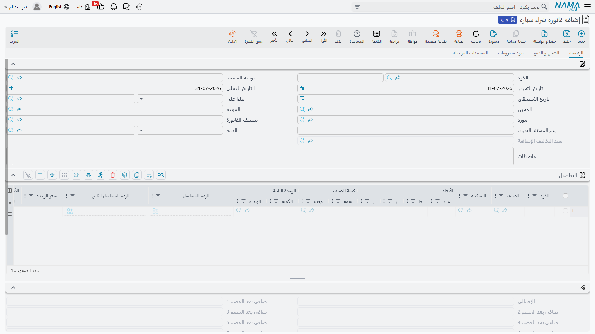

# فاتورة شراء السيارة

**فاتورة شراء سيارة / Car Purchase Invoice** —
`سيارات > مشتريات السيارات > فاتورة شراء سيارة`.

هذا هو المستند الذي يحوّل الأمر إلى شراء. يقيّد دائماً، ويُدخل السيارات إلى المخزن، وهو المستند
الوحيد في السلسلة الذي يحمل التكلفة النهائية، وفي أكثر المعارض هو الذي تُولد فيه ملفات السيارات
المفردة. أربع مسؤوليات على شاشة واحدة — تستحق التأني.

::: info الترخيص المطلوب
`srvcenter-subitems`.
:::

## المثال العملي

تحرّر الصحراء `SIPI-2026-021` في **١٠ فبراير ٢٠٢٦** على `SUP-77` شركة ناوا لاستيراد السيارات، مبنية
*بناءا على* أمر الشراء `SIPO-2026-014`. ستة سطور، **رقم هيكل واحد في كل سطر**:

| السيارة | الهيكل | المحرك | المفتاح | الموقع | السعر |
|---|---|---|---|---|---|
| `CAR-000318` | `NWA7R24C26K000318` | `R24-360318` | `K-318` | `A-14` | ٧٤٬٠٠٠ |
| `CAR-000319` | `NWA7R24C26K000319` | `R24-360319` | `K-319` | `A-15` | ٧٤٬٠٠٠ |
| `CAR-000320` … `CAR-000323` | `…000320` … `…000323` | | | | ٧٤٬٠٠٠ لكل واحدة |
| | | | | **الإجمالي** | **٤٤٤٬٠٠٠** |

وثلاثة سطور خدمية على الفاتورة نفسها تحمل مصاريف الاستيراد — ٩٬٠٠٠ شحناً بحرياً، و٤٬٢٠٠ تخليصاً
جمركياً، و١٬٨٠٠ نقلاً برياً — وموضوعها صفحة
[الشحن والجمارك والتكلفة النهائية](/ar/modules/servicecenter/car-purchasing/car-landed-cost.md).

## الصفحات الأربع

### الرئيسية

الرأس: الدفتر والكود، و**توجيه المستند**، وتاريخ الإصدار والتاريخ المؤثر وتاريخ الاستحقاق،
و**بناءا على**، والمخزن والموقع، والمورّد، وتصنيف الفاتورة، والمرجع اليدوي، و**الذمة**، والملاحظات —
ومرجع **سند التكاليف الإضافية** للقراءة فقط، يملأ نفسه حين تنتج الفاتورة مستند تكلفة نهائية.

وجدول السطور هو جدول فاتورة الشراء المعياري: الصنف، والتشكيلة والوحدات، والكمية الرئيسية والثانوية،
والأرقام المسلسلة، وسعر الوحدة والسعر الإجمالي، وعلامة الصنف المجاني، ومجموعات الخصم الثماني،
ومجموعات الضرائب الأربع، وصافي القيمة، والصندوق والمراجعة والمقاس واللون واللوط، وعمود
**السياره (Customer Car)**، وتواريخ الإنتاج والانتهاء، والمخزن والموقع، والمحددات العامة، والمرفق
والملاحظات ونوع السطر — وأربعة أعمدة للقراءة فقط هي بيت القصيد في التكلفة النهائية: **قيمة التكلفة
الإضافية**، و**تكلفة الوحدة**، و**التكلفة الإجمالية**، ومعها **الكمية المرتجعة** و**المتبقي**.

ثم الإجماليات: مجموعة القيمة بمراحل الخصم الثماني، وخصم الرأس، والضريبتان ٣ و٤، وصافي القيمة،
والمبلغ النقدي، وإجمالي المسدد، والمتبقي، والعملة وسعرها.

### الشحن و الدفع

مندوب المشتريات، وجهة الاتصال، ومدة السداد، وعنوانا الشحن والفوترة، وآلة الدفع — قالب دفعات وزر
**إنشاء الدفعات**، وجدول **الدفعات**، وجدول **سندات الدفع**، وأزرار لإنشاء سند دفع، أو إنشائه
للدفعات المختارة، أو تجميع سندات قائمة. ورقمان للقراءة فقط هنا، الكمية المنفَّذة والكمية المتبقية،
يخبرانك كم استُلم فعلاً من الفاتورة.

### بنود مصروفات

قائمتان للقراءة فقط — **تكاليف إستلام إضافية** و**بنود المصروفات (الإجماليات)**. وهذه هي قراءة
التكلفة النهائية.

### المستندات المرتبطة

جدول **السندات المخزنية** — كل سند استلام ملحق بهذه الفاتورة، مُنشأً كان أو مجمَّعاً — وثلاثة أزرار:
**تجميع** لجلب السندات القائمة، و**تطبيق** لمطابقتها على السطور، و**إنشاء سند مخزني**.

## ماذا تفعل عند الاعتماد

- **المحاسبة: دائماً.** تقيّد الفاتورة بلا شرط — طرف المخزون أو المصروف مقابل المورّد، ومعه
  الضرائب، ومراحل الخصم، وطرف التكلفة الإضافية، وأي أطراف أتعاب خدمة يضبطها التوجيه. ولا يوجد هنا
  سلوك «فقط إن ملأ التوجيه الحسابات» كما في
  [أمر شراء السيارة](/ar/modules/servicecenter/car-purchasing/car-purchase-order.md).
- **المخزون: نعم — عبر سند استلام مُنشأ.** تنشئ الفاتورة سندات الاستلام المدرجة في جدول سنداتها
  المخزنية وفق إعداد الإنشاء في التوجيه. والحركة المخزنية وقيودها تخص ذلك السند المُنشأ، بدفتره
  وتوجيهه.
- **[ملفات السيارات](/ar/modules/servicecenter/cars-setup/car-master-file.md)**، حين يكون خيار
  *إنشاء صنف فرعي من السطر* مفعّلاً في التوجيه.
- **حركات الحالة** على كل سيارة، وأختام المراجع — فاتورة الشراء، وسند الاستلام، وأمر الشراء — لأي من
  خيارات *تحديث … في الصنف الفرعي* يفعّلها التوجيه.

وكل هذه التأثيرات تُنشأ **طلبات أعمال** تُعالَج في الخلفية، فتُحفظ الفاتورة فوراً. وإن فشل تأثير
فأعد تشغيله من شاشة **طلبات الأعمال**: افرز بحالة الفشل، واختر السطور، ثم **المزيد ← إعادة
المعالجة / إعادة الاعتماد**.

## إعدادها بحيث تُنشأ ملفات السيارات فعلاً

أكثر المعارض تجعل هذا هو مستند ميلاد السيارات. وفعل ذلك يحتاج أربعة أشياء، ويُنتج تخلّف كل واحد منها
عرَضاً مربكاً مختلفاً.

1. **ألا تكون [خاصية الأصناف الفرعية](/ar/modules/servicecenter/cars-setup/servicecenter-cars-overview.md)
   في قائمة «الخصائص الممنوعة» بمجموعة الإعدادات** — فبرنامج ترقية يضعها هناك، وعلى قاعدة مُرقّاة
   تبدأ مطفأة فلا يظهر عمود السيارة على أي شاشة أصلاً.
2. **أن يحمل الصنف علامة *له صنف فرعي*** وأن يحمل سجل
   **[إعدادات حالة السيارة](/ar/modules/servicecenter/cars-setup/car-status-configurations.md)** في
   *الصنف ▸ الإعدادات*. وبدون الإعداد يفشل الاعتماد برسالة *«الصنف … ليس له إعدادات حالة السيارة»* — والرسالة
   تظهر على عمود **الصنف** في السطر، فانظر إلى إعدادات الصنف لا إلى السطر.
3. **أن تكون *مجموعة الصنف الفرعي المُنشأ* في الإعداد مملوءة**، وإلا فشل الاعتماد شاكياً أن المجموعة
   فارغة.
4. **أن يكون خيار *إنشاء صنف فرعي من السطر* في
   [توجيه المستند](/ar/modules/servicecenter/document-terms/servicecenter-terms-cars-and-other.md)
   مفعّلاً** — وعلى هذا المستند وحده.

::: danger عمود رقم الهيكل غير موجود على هذه الشاشة في التركيب الافتراضي
جدول سطور فاتورة شراء السيارة — وكذلك الفاتورة المبدئية وأمر الشراء ومردود المشتريات — يحمل منتقي
**السياره (Customer Car)** و**لا يحمل أي عمود من خصائص السيارة**: لا رقم هيكل، ولا رقم محرك، ولا
ناقل حركة، ولا رقم مفتاح أو موقع.

والإنشاء التلقائي يقرأ رقم الهيكل *من السطر*. وكما تُسلَّم الشاشة لا موضع فيها لكتابته. **أضف أعمدة
خصائص السيارة إلى جدول السطور بتعديل شاشة قبل أن تعتمد على الإنشاء التلقائي** — وإلا حصلت على ست
ملفات سيارات صحيحة الإنشاء بستة أرقام هياكل فارغة، ولا تنتبه إلا بعد أسابيع.
:::

::: danger فعّل «إنشاء صنف فرعي من السطر» على نوع مستند واحد فقط
يتصرف الخيار تصرفاً واحداً على أمر الشراء والفاتورة المبدئية وهذه الفاتورة ومردود المشتريات. وإن
فُعّل على مستندين في السلسلة نفسها:

- **إن بُني أحدهما على الآخر** — وجد اللاحق السيارة الموجودة وأعاد تحريرها، فأعاد اشتقاق مجموعتها،
  وأعاد تطبيق قاعدة الترقيم، وأعاد ضبط الحالة الافتراضية، واستبدل المخزن والموقع والتصنيفات
  ومصنّفات السعر من السطر الجديد؛
- **وإن كُتبت السطور من جديد** — أُنشئ **ملف سيارة مكرر**. ولا يتحقق شيء من تفرّد رقم الهيكل في أي
  موضع، فينتهي بك الأمر إلى سجلَّين لسيارة واحدة، لكل منهما مخزونه وتكلفته.
:::

### سطر لكل رقم هيكل

على هذا يقوم النموذج كله. فملف السيارة يُنشأ **لكل سطر** لا لكل وحدة كمية، فسطر بست سيارات ينتج ملف
سيارة واحداً. وخيار *تفريد سطور الصنف الفرعي إذا كانت الكمية أكبر من واحد* لا يفرّد السطور إلا حين
يُبنى المستند *على* مستند آخر — ولا يفعل شيئاً لسطر مكتوب باليد.

فاكتب ستة سطور بكمية واحدة. وفعّل *الكمية الرئيسية يجب ان تساوي الواحد الصحيح* في إعدادات حالة الصنف
حتى يُرفض ما عدا ذلك.

## قاعدة الإدخال إلى المخزون

::: danger يمكن استلام السيارة في المخزون مرتين
تنشئ هذه الفاتورة سند استلام. وكذلك يفعل
[سند توريد السيارة](/ar/modules/servicecenter/car-purchasing/car-receipt.md). و**لا يرى أي منهما ما
أنشأه الآخر** — إذ يبحث كل منهما عن سند استلام محرَّر منه هو فقط — ولا شيء في أي موضع يفحص هل
السيارة على المخزون أصلاً.

اسلك المسار الذي يبدو طبيعياً *أمر شراء ← توريد ← فاتورة شراء* والتوجيهان معاً مضبوطان على الإنشاء،
تُستلم كل سيارة **مرتين**: رصيد ٢ لسيارة موجودة مرة واحدة، وسطر تكلفة يحمل القيمتين. يقع ذلك بصمت
بلا خطأ، ويُحمِّل البيع اللاحق واحدة من الاثنتين فقط.

**القاعدة: املأ دفتر الإنشاء وتوجيه الإنشاء في توجيه واحد فقط من الاثنين.** وعامل سند التوريد
وفاتورة الشراء **بديلين** لإدخال المخزون، لا خطوتين متتاليتين.

- إن كانت الفاتورة هي مستند الإدخال عندك — وهو اختيار الصحراء — فاترك دفتر الإنشاء وتوجيهه في توجيه
  سند التوريد **فارغين**، واستعمل السند سجلاً للوصول الفعلي فقط.
- وإن كان السند هو مستند الإدخال، فأوقف الإنشاء على الفاتورة واستعمل **تجميع** و**تطبيق** في صفحة
  المستندات المرتبطة لربط سند السند المخزني بالفاتورة.

وأياً كان التوجيه المُنشئ، فعّل عليه
*عدم إنشاء مستندات إذا وجدت مستندات يدوية* حتى يمنع السند المجمَّع إنشاءً ثانياً.

وانتبه إلى أن رفع علامة *إنشاء مستند* على توجيه **سند التوريد** لا يوقفه — فذلك المفتاح مُهمَل هناك،
ولا ينفع إلا تفريغ الدفتر والتوجيه.
:::

## بعد الفاتورة

بعد معالجة `SIPI-2026-021`:

- توجد السيارات الست، كل واحدة على الحالة التي تمنحها سطور التحديث لفاتورة الشراء — *الجمارك* في
  إعداد الصحراء؛
- أدخلها سند الاستلام `STR-2026-0552` إلى `WH-SHOW`؛
- ظهرت الفاتورة في صفحة إحصائيات كل سيارة، ومعها سند الاستلام؛
- ووزّع سند التكاليف الإضافية `RAC-2026-009` مبلغ ١٥٬٠٠٠ من مصاريف الاستيراد على الست، فصارت التكلفة
  النهائية للواحدة **٧٦٬٥٠٠**.

أما أوراق الجمارك — رقم البيان ورقم الفسح وتاريخه والباخرة والناقل — فتُكتب بعد ذلك في صفحة بيانات
متابعة المستندات في ملف السيارة. وهي نص وصفي لا صلة له بالـ ١٥٬٠٠٠.
