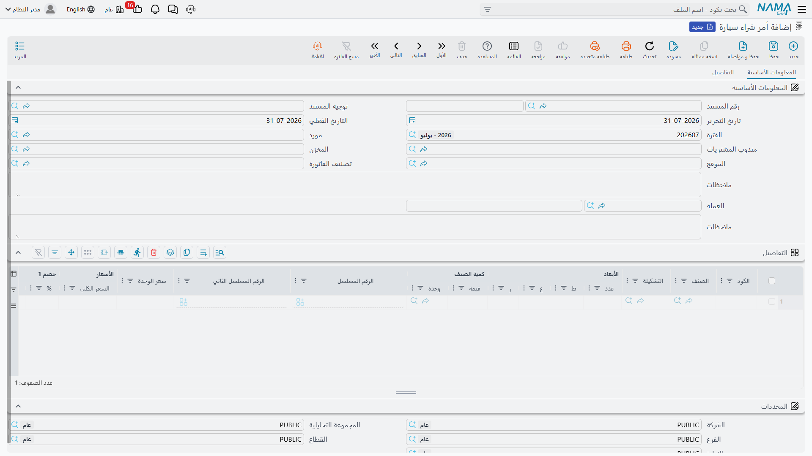

# أوامر شراء السيارات

يفتح سلسلة الشراء مستندان، وليس أي منهما حدثاً مالياً بالمعنى المعتاد. **أمر شراء السيارة** هو ما
ترسله الصحراء إلى المستورد، و**فاتورة مشتريات السيارة المبدئية** هي ما يرسله المستورد رداً عليه.
وكلاهما في `سيارات > مشتريات السيارات`، وكلاهما عملياً ورق تعلّق به جدول دفعات.

::: info الترخيص المطلوب
`srvcenter-subitems`.
:::

## أمر شراء السيارة

**أمر شراء سيارة / Car Purchase Order** — `سيارات > مشتريات السيارات > أمر شراء سيارة`.

في **١ فبراير ٢٠٢٦** تطلب الصحراء **ست سيارات ناوا رمال ٢٫٤ بسعر ٧٤٬٠٠٠ للواحدة — ٤٤٤٬٠٠٠** من
`SUP-77` شركة ناوا لاستيراد السيارات، بالمستند `SIPO-2026-014`.

### الصفحة الرئيسية

تحمل المجموعة الأساسية المورّد، ومندوب المشتريات، ومخزن الوجهة وموقعه، وتصنيف الفاتورة، ومجموعة
قيمة الفاتورة، ومصنّفات السعر الخمسة، والملاحظات. ثم جدول السطور: الصنف، والوحدات والكميات، وسعر
الوحدة والإجمالي، ومجموعات الخصم الثماني، ومجموعات الضرائب، وصافي القيمة، والصندوق والمراجعة والمقاس
واللون واللوط، وعمود **السياره (Customer Car)**، وتواريخ الإنتاج والانتهاء، والقسم، والمخزن والموقع،
ومرفق وملاحظات ونوع السطر.

### صفحة التفاصيل

هنا تعيش الشروط التجارية للأمر:

- **جدول الدفعات** — قالب دفعات وجدول **الدفعات** بكود القسط ونسبته وقيمته وتاريخه وعلامة السداد،
  يُملأ باليد أو بزر *إنشاء الدفعات*؛
- **سندات الدفع** — سندات الدفع المحرَّرة على الأمر؛
- **شروط الشراء القياسية** — جدول الشروط القياسية التي تلحقها بأوامر الموردين، لكل شرط ملاحظاته؛
- وعنوان الشحن ومجموعة المحددات.

### ماذا يفعل عند الاعتماد

- **المخزون: لا شيء.** لا استلام ولا صرف. والاستثناء الوحيد **الحجز** — فإن كان خيار *حجز* مفعّلاً
  في التوجيه رفع الأمر حجزاً للوارد المتوقع، وهو مطالبة بكمية قادمة لا حركة.
- **المحاسبة: لا شيء عادةً.** وخلافاً لأمر الشراء المعتاد يستطيع هذا المستند أن يقيّد: فهو يبني قيداً
  إن — وفقط إن — كان طرف المدين أو الدائن في التوجيه مملوءاً. وأكثر المواقع تتركهما فارغين فلا قيد،
  وهو الافتراض المعقول. ومسح الطرفين من التوجيه لاحقاً يزيل القيد عن المستندات التي يُعاد
  معالجتها.
- **تتبّع الكميات**، ليُبنى عليه لاحقاً *بناءا على* الفاتورة المبدئية أو فاتورة الشراء مع معرفة
  المتبقي.
- **[ملفات السيارات](/ar/modules/servicecenter/cars-setup/car-master-file.md)**، إن نصّ التوجيه على
  ذلك — انظر أدناه.

## فاتورة مشتريات السيارة المبدئية

**فاتورة مشتريات سيارة مبدئية / Car Proforma Purchase Invoice** —
`سيارات > مشتريات السيارات > فاتورة مشتريات سيارة مبدئية`.

هي بروفورما المورّد: السعر الذي سيفوتر به فعلاً، وخطة السداد، والدفعة المقدمة التي يطلبها قبل الشحن.
حرّرها *بناءا على* الأمر فينسكب كل شيء.

والشاشة هي شاشة فاتورة الشراء بعد حذف صفحة **المستندات المرتبطة**. وتلك الصفحة الغائبة هي القصة
كلها: فليس للفاتورة المبدئية جدول مستندات مخزنية أصلاً، فهي **لا تستطيع** إدخال شيء إلى المخزون
أبداً.

وما وُجدت له حقاً:

1. تسجيل بروفورما المورّد وخطة السداد، بما فيها الدفعات المقدمة وسندات الدفع؛
2. اختياراً، أن تكون المستند الذي تُولد فيه ملفات السيارات؛
3. أن تكون مصدر *بناءا على* لفاتورة الشراء الحقيقية؛
4. تتبّع الكمية لتعرف الفاتورة ما تبقى.

::: danger الفاتورة المبدئية لا تقيّد — لكن إجراء «إعادة إنشاء التأثيرات المحاسبية» يجعلها تقيّد
يعرض توجيهها صفحة تأثيرات مالية **كاملة**: طرفَي مدين ودائن، ونقدية، وضرائب، وثمانية حسابات خصم،
وأطراف أتعاب الخدمة — الحزمة كلها. **ولا يُقرأ منها شيء عند اعتماد المستند.** املأ كل حساب في تلك
الصفحة وتظل الفاتورة المبدئية لا تقيّد شيئاً، بصمت، وبلا رسالة تخبرك لماذا.

والأسوأ أن الإجراء العام **المزيد ← إعادة إنشاء التأثيرات المحاسبية** لا يسلك الطريق نفسه. فهو يصل
إلى روتين القيد المعياري للفواتير و**سينشئ** قيداً من تلك الحسابات — قيداً لم ينتجه اعتماد المستند
ولا إعادة اعتماده ولا إلغاؤه قط.

فتعامل مع فاتورة مشتريات السيارة المبدئية بوصفها مستنداً **غير مالي**، واترك صفحة المحاسبة في
توجيهها فارغة، ولا تشغّل عليها *إعادة إنشاء التأثيرات المحاسبية*. وإن كنت شغّلتها فابحث عن القيد
الناتج واعكسه عمداً.
:::

ويحسن أيضاً بيان ما **ليست** به الفاتورة المبدئية، فالاسم يغري بالتخمينين معاً: هي **ليست مستند
رسملة** و**ليست أساس توزيع**. فقيمتها لا تُوزَّع على شيء، ولا تقرؤها آلية التكلفة النهائية. ولا تصل
مصاريف الاستيراد إلى تكلفة السيارة إلا عبر فاتورة الشراء الحقيقية — انظر
[الشحن والجمارك والتكلفة النهائية](/ar/modules/servicecenter/car-purchasing/car-landed-cost.md).

## أين تُولد ملفات السيارات

هذا القرار يشكّل سلسلتك كلها، وموضعه هنا لأن أمر الشراء أول موضع يمكن اتخاذه فيه.

::: danger أي من مستندات مشتريات السيارات الأربعة ينشئ ملفات سيارات — فعّله على واحد فقط
الخيار هو **إنشاء صنف فرعي من السطر / Create Sub Item From Line Information** في
[توجيه المستند](/ar/modules/servicecenter/document-terms/servicecenter-terms-cars-and-other.md). فإذا
كان مفعّلاً أنشأ حفظُ المستند ملف سيارة لكل سطر مؤهل، من البيانات المكتوبة في ذلك السطر.

وهو متاح ويتصرف تصرفاً واحداً على **الأربعة**: أمر شراء السيارة، والفاتورة المبدئية، وفاتورة الشراء،
و[مردود مشتريات السيارة](/ar/modules/servicecenter/car-purchasing/car-purchase-return.md). و**فاتورة الشراء ليست مميزة في شيء** — هي فقط ما يختاره أكثر المعارض. فعّل الخيار
على **نوع مستند واحد** في سلسلتك.

وماذا يقع إن فُعّل على مستندين في السلسلة نفسها:

- **إن كان اللاحق مبنياً *بناءا على* السابق**، حمل السطر مرجع السيارة، فيجد المستند اللاحق السيارة
  الموجودة *ويعيد تحريرها*. لا نسخة مكررة — لكنه يعيد تشغيل روتين الإنشاء كاملاً، فيعيد اشتقاق
  المجموعة، ويعيد تطبيق قاعدة الترقيم، ويعيد ضبط الحالة الافتراضية، **ويستبدل المخزن والموقع
  وتصنيفات الصنف ومصنّفات السعر** من السطر الجديد. فقد يُعاد كتابة سيارة قيد الاستخدام بصمت.
- **وإن كُتبت سطور اللاحق من جديد** — بلا مستند مبني عليه، أو بعمود السيارة فارغاً — أُنشئ **ملف
  سيارة مكرر**، بكوده ومخزونه وتكلفته. ولا شيء يفحص رقم الهيكل: فلا قيد تفرّد عليه في أي موضع.
:::

::: danger سطر مكتوب باليد بكمية ٥ ينشئ ملف سيارة واحداً لا خمسة
يوجد خيار في التوجيه اسمه *تفريد سطور الصنف الفرعي إذا كانت الكمية أكبر من واحد*، وهو يفعل ما يقوله
تماماً — **لكن فقط حين يكون المستند مبنياً على مستند آخر**. فهو جزء من روتين النسخ من مستند ولا وجود
له خارجه.

اكتب سطراً باليد بكمية ٦ واحفظ تحصل على ملف سيارة **واحد** يمثّل ست سيارات، برقم هيكل واحد. ولا شيء
ينبّهك.

ودفاعان، استعملهما معاً: أدخل **سطراً لكل رقم هيكل**، وفعّل
*الكمية الرئيسية يجب ان تساوي الواحد الصحيح* في
[إعدادات حالة السيارة](/ar/modules/servicecenter/cars-setup/car-status-configurations.md) الخاصة
بالصنف حتى يُرفض الخطأ بدل أن يُقبل.
:::

وتحمل الشاشتان كذلك إجراء **المزيد ← إنشاء صنف فرعي من السطر**، وهو يشغّل الروتين نفسه عند الطلب على
الجدول الذي تنظر إليه.

::: warning الزر لا يفعل شيئاً بصمت حين يكون خيار التوجيه مطفأً
فهو محكوم بالخيار نفسه. ومع إطفائه يحدّث الضغط عليه الجدول ولا ينشئ شيئاً ولا يعرض أي رسالة. فإن بدا
أن شيئاً لم يحدث فافحص التوجيه قبل أن تفحص أي شيء آخر.
:::

وتذكّر الشرط المذكور في
[إدارة معارض السيارات في Nama](/ar/modules/servicecenter/cars-setup/servicecenter-cars-overview.md):
**لا تعرض أي من هاتين الشاشتين عمود رقم هيكل في التركيب الافتراضي.** فالأمر والفاتورة المبدئية
يعرضان منتقي **السياره (Customer Car)** فقط، فلا موضع لكتابة رقم الهيكل الذي يُفترض أن يقرأه روتين
الإنشاء. أضف أعمدة خصائص السيارة بتعديل شاشة أولاً.

## ما الذي يحرّك حالة السيارة

لا شيء، حتى تُعدّه. فإن كانت سطور التحديث عندك تستهدف أمر الشراء انتقلت الرمالات الست إلى *بالطريق*
عند اعتماد `SIPO-2026-014`؛ وإن استهدفت الفاتورة المبدئية انتقلت عند اعتمادها. وتبدأ الصحراء سلسلتها
من فاتورة الشراء، فلا يحرّك الأمر ولا الفاتورة المبدئية في المثال شيئاً.

## التالي في السلسلة

- [فاتورة شراء السيارة](/ar/modules/servicecenter/car-purchasing/car-purchase-invoice.md) — المستند
  الذي يقيّد الشراء.
- [توريد السيارات](/ar/modules/servicecenter/car-purchasing/car-receipt.md) — سجل الوصول الفعلي،
  والموضع البديل لتحريك المخزون.
