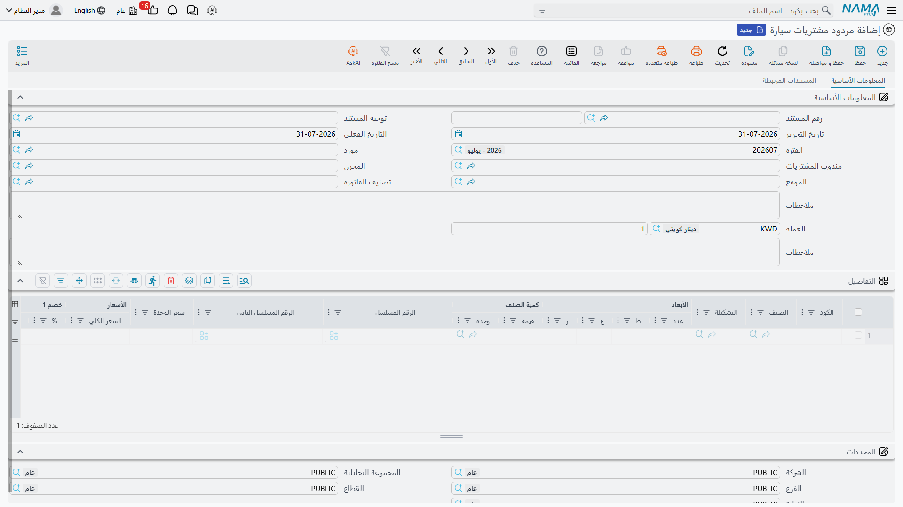

# مردود مشتريات السيارات

**مردود مشتريات سيارة / Car Purchase Return** —
`سيارات > مشتريات السيارات > مردود مشتريات سيارة`.

أحياناً تعود السيارة. وصلت متضررة، أو بمواصفة خاطئة، أو أرسل المستورد سبعاً والأمر يقول ستاً. ومردود
مشتريات السيارة يعيدها ويعكس المال.

وخلافاً لأكثر المستندات ذات النكهة الإلغائية في هذه الوحدة، هذا مستند مالي حقيقي. يقيّد دائماً،
ويحرّك المخزون دائماً.

::: info الترخيص المطلوب
`srvcenter-subitems`.
:::

## الشاشة

يشترك المردود في تصميمه مع
[أمر شراء السيارة](/ar/modules/servicecenter/car-purchasing/car-purchase-order.md): مجموعة أساسية
فيها المورّد، ومندوب المشتريات، والمخزن والموقع، وتصنيف الفاتورة، ومجموعة القيمة، ومصنّفات السعر، والملاحظات؛ ثم جدول سطور فيه الصنف
والوحدات والكميات والأسعار والخصومات والضرائب وصافي القيمة وعمود **السياره (Customer Car)** والمحددات
والملاحظات.

ويحمل كل سطر كذلك مرجعاً إلى
**[الفاتورة المصدر](/ar/modules/servicecenter/car-purchasing/car-purchase-invoice.md)**، وبه يحدّث
المردود الكمية المرتجعة والمتبقية في الفاتورة الأصلية. وهو ليس في الجدول الافتراضي — أضفه بتعديل شاشة إن احتاجته إجراءاتك ظاهراً.

قائمة المزيد: **إنشاء صنف فرعي من السطر** — وينبغي أن تتركه مطفأً على هذا التوجيه، للسبب المذكور
أدناه.

## ماذا يفعل عند الاعتماد

- **المحاسبة: دائماً.** يقيّد المردود عبر حسابات
  [توجيه المستند](/ar/modules/servicecenter/document-terms/servicecenter-terms-cars-and-other.md)
  الخاص **به هو** — طرفَي المدين والدائن ومعهما حسابا **فرق مردود المشتريات** المخصصان، ومراحل الخصم والضرائب. ولا يعيد قراءة توجيه الفاتورة الأصلية.
  وأساس تسعير العكس يضبطه خيار *احتساب الفاتورة المصدر* في التوجيه.
- **المخزون: نعم** — ينشئ **سند صرف مخزني**، مدرجاً في جدول سنداته المخزنية، يُخرج السيارة من المخزن.
- **أرقام سطر الفاتورة المصدر** — الكمية المرتجعة والمتبقي — تُحدَّث.
- **حركات الحالة** على السيارة، إن أعددت للمردود شيئاً منها.

## ماذا يحدث لملف السيارة

لا شيء، إلا أن تقول أنت.

فمردود مشتريات السيارة **لا** يحذف ملف السيارة، ولا يبطله، ولا يعلّمه ملغى. ويبقى السجل حيث كان،
ولا تنتقل حالته **إلا** إن كتبت سطر تحديث يستهدف نوع المردود أو دفتره أو توجيهه في
[إعدادات حالة السيارة](/ar/modules/servicecenter/cars-setup/car-status-configurations.md) الخاصة
بالصنف. وبلا سطر مطابق تبقى السيارة على حالتها السابقة — وهو ما سيبدو خاطئاً لمن يقرأ ملف السيارة
بعد خروج المخزون.

فأعدّه عمداً. وأكثر المعارض ترسل السيارة المرتجعة إلى إحدى حالات *أخرى*، أو ترجعها إلى الحالة
المبدئية، وتضيف سطر الحركة المقابل ليكون الانتقال مشروعاً. وإن كان التوجيه يحمل كذلك *تحديث المستند
المُلغي* ختم المردود نفسه في حقل «المستند المُلغي» على السيارة.

::: danger لا تفعّل «إنشاء صنف فرعي من السطر» على توجيه مردود أبداً
يعمل روتين إنشاء السيارات على مردود المشتريات كما يعمل على أمر الشراء وفاتورة الشراء تماماً. ومع
تفعيل الخيار فإن **حفظ المردود ينشئ ملفات سيارات جديدة** — وهو نقيض الغاية من المردود بالضبط.

فإن كان المردود مبنياً *بناءا على* الفاتورة حملت السطور السيارات القائمة فأعاد الروتين تحريرها بدلاً
من ذلك، فأعاد كتابة مجموعتها ومخزنها وموقعها وتصنيفاتها ومصنّفات سعرها من سطور المردود بصمت. وإن
كُتبت السطور من جديد حصلت على ملفات سيارات مكررة لسيارات أنت في طريقك إلى إعادتها — ولأن شيئاً لا
يتحقق من تفرّد رقم الهيكل في أي موضع فلا شيء يخبرك.

اترك الخيار **مطفأً** على كل توجيه مردود. والمثل ينطبق على
[مردود مبيعات السيارة](/ar/modules/servicecenter/car-sales/car-sales-return.md).
:::

## عكس سيارة دخلت المخزون بالفعل

المردود هو المستند الذي يُخرج السيارة المستلمة فعلاً من المخزون ومن حساب المورّد. ولا تمدّ يدك إلى
**إلغاء توريد السيارة** بدلاً منه — فهو يبدو العكس البديهي وليس عكساً.

::: warning إلغاء توريد السيارة لا يعكس شيئاً
لا يحذف **إلغاء توريد السيارة** سند الاستلام الذي أنشأه سند التوريد الأصلي، ولا يعكس أي محاسبة.
**فتبقى السيارات في المخزون وتبقى بتكلفتها.** وما يفعله أنه يكتب حركة حالة، وهذا كل أثره — انظر
[توريد السيارات](/ar/modules/servicecenter/car-purchasing/car-receipt.md).

فمن يحرّره متوقعاً أن التوريد قد نُقض فهو مخطئ، وعليه أن يعكس الحركة المخزنية بنفسه: إما بإلغاء
اعتماد **سند التوريد الأصلي** أو حذفه، وإما — إن كانت السيارات عائدة إلى المورّد حقاً — بتحرير هذا
المردود.
:::

## ما لا يعكسه المردود

أمران يتوقعهما القارئ بحق ولا يجدهما:

- **التكلفة النهائية.** فـ[آلية التكاليف الإضافية](/ar/modules/servicecenter/car-purchasing/car-landed-cost.md)
  تعيش على فاتورة الشراء وحدها. والمردود يعكس قيمة الشراء عبر حساباته الخاصة؛ ولا يفكّ توزيع الشحن والجمارك التي وُزّعت على الشحنة. فإن أعدت سيارة من
  ست بعد أن وزّع `RAC-2026-009` مبلغ ١٥٬٠٠٠ عليها، ظلت الخمس الباقية تحمل ٢٬٥٠٠ لكل واحدة وأخذت
  المرتجعة ٢٬٥٠٠ معها. عالج الأمر عمداً إن كان المصروف قابلاً للاسترداد فعلاً.
- **أختام المراجع على السيارة.** فما كتبته فاتورة الشراء على
  [ملف السيارة](/ar/modules/servicecenter/cars-setup/car-master-file.md) — مرجع الفاتورة، ومرجع سند
  الاستلام، والمخزن — يبقى مكانه ما لم يمسحه مستند صراحةً.
