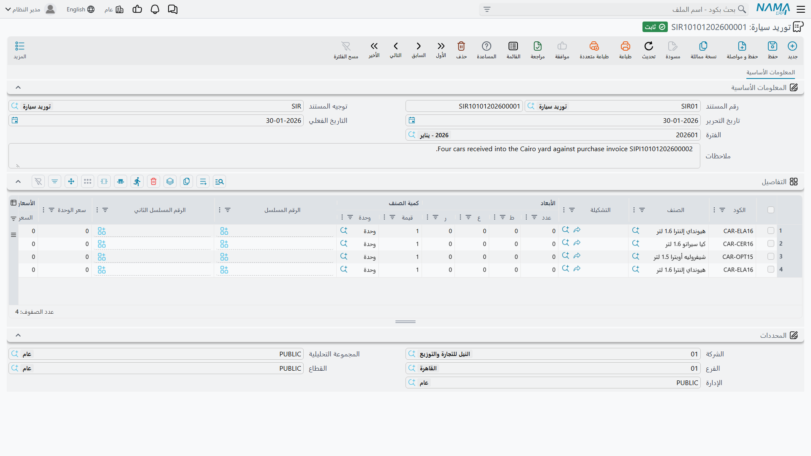

# توريد السيارات

**توريد سيارة / Car Receipt** — `سيارات > مخازن السيارات > توريد سيارة`.

الاسم يضلّل أكثر الناس عند أول لقاء، فلنحسمه في سطر: **هذا معدن لا مال.** سند توريد السيارة يسجّل
وصول مركبة فعلياً إلى الساحة. ولا علاقة له باستلام مبلغ من عميل — فالمال تتولاه سطور الدفع وسندات
الدفع في [مستندات البيع](/ar/modules/servicecenter/car-sales/car-sales-cycle.md)، لا هنا أبداً.

::: info الترخيص المطلوب
`srvcenter-subitems`.
:::

## ماذا على الشاشة

تحمل المجموعة الأساسية الدفتر والكود، والتوجيه، والتواريخ، و**بناءا على**، ومخزن الوجهة وموقعه،
وتصنيف الفاتورة، والملاحظات. ولا توجد مجموعة مورّد — فالسند سجل حركة داخلية لا معاملة مورّد.

ثم جدول السطور: الصنف، والوحدات والكميات، وسعر الوحدة والإجمالي، والخصومات والضرائب، وصافي القيمة،
والصندوق والمراجعة والمقاس واللون واللوط، وعمود **السياره (Customer Car)**، والتواريخ، والقسم،
والمخزن والموقع، والمرفق والملاحظات ونوع السطر.

والجزء المميز لهذا المستند وحده — **خمس خانات ملحقات في كل سطر**:

| العمود | بالإنجليزية |
|---|---|
| كتالوج | Has Catalog |
| دواسات | Has Mats |
| عدة | Has Toolkit |
| مفتاح احتياطي | Has Spare Key |
| ضمان | Has Warranty |

وهذه القائمة هي السبب العملي لوجود سند التوريد. فحين ينزل الناقل ست سيارات يمشي أحدهم على الصف
مؤكداً أن كل واحدة وصلت بكتيّبها ودواساتها وعدتها ومفتاحها الاحتياطي، وهنا يُسجَّل ذلك. وتُنسخ
العلامات إلى ملفات السيارات، فيجيب
[ملف السيارة](/ar/modules/servicecenter/cars-setup/car-master-file.md) بعدها عن سؤال «هل جاءت هذه
بمفتاح احتياطي؟».

قائمة المزيد: **إنشاء صنف فرعي من السطر**، وهو يشغّل روتين إنشاء السيارات على الجدول — ولا يفعل
شيئاً بصمت إن كان خيار التوجيه مطفأً.

## ماذا يفعل عند الاعتماد

- **المحاسبة: لا شيء من نفسه.** سند التوريد لا يقيّد أبداً. ومع ذلك يعرض توجيهه أطرافاً محاسبية
  موروثة من عائلة توجيهات الشراء المشتركة — وهي مُهمَلة هنا. اتركها فارغة.
- **المخزون: نعم، بطريق غير مباشر** — فهو ينشئ **سند استلام مخزني**، وذلك المستند المُنشأ هو الذي
  يحمل الحركة المخزنية وقيودها، بدفتره وتوجيهه.
- **حركات الحالة** على كل سيارة، كما ترسمها
  [إعدادات حالة السيارة](/ar/modules/servicecenter/cars-setup/car-status-configurations.md) الخاصة
  بالصنف. وفي إعداد الصحراء السند هو ما ينقل السيارة من *الجمارك* إلى *مخزون متاح*.
- **ختم مرجع سند الاستلام** على السيارة، إن كان خيار *تحديث سند الاستلام في الصنف الفرعي* مفعّلاً.
- **ملفات السيارات**، إن كان خيار *إنشاء صنف فرعي من السطر* مفعّلاً — بالسلوك نفسه الموجود في مستندات
  الشراء، وبالتحذير نفسه: فعّله على نوع مستند واحد في سلسلتك.

### ما الذي يجعله ينشئ سند استلام

إعدادان اثنان لا غير في
[توجيه المستند](/ar/modules/servicecenter/document-terms/servicecenter-terms-cars-and-other.md):
**دفتر الإنشاء** و**توجيه الإنشاء** داخل إعداد الإنشاء. املأهما معاً فينشئ كل اعتماد سند استلام. واترك أحدهما فارغاً فلا ينشئ شيئاً.

::: danger رفع علامة «إنشاء مستند» لا يوقف سند التوريد
في إعداد الإنشاء مفتاح **إنشاء مستند**، وهو على هذا المستند **مُهمَل**. فلا يُفحص إلا الدفتر
والتوجيه. والمواقع التي ترفع علامة *إنشاء مستند* وتفترض أن السند توقف عن تحريك المخزون تصدمها
النتيجة.

**لإيقاف سند التوريد عن تحريك المخزون فرّغ دفتر الإنشاء وتوجيه الإنشاء.** وهذا وحده ما ينفع.
:::

## قاعدة الإدخال إلى المخزون

::: danger سند التوريد وفاتورة الشراء يستطيع كل منهما استلام السيارة نفسها
كلا المستندين ينشئ سند استلام، و**لا يرى أي منهما ما أنشأه الآخر**. فكل منهما يبحث عن سند استلام
محرَّر منه هو فقط، ولا شيء في أي موضع يفحص هل الهيكل على المخزون أصلاً — إذ لا تحقق على ملف السيارة
من كونه في المخزون بتاتاً.

نفّذ التسلسل الذي يبدو طبيعياً —
[أمر شراء السيارة](/ar/modules/servicecenter/car-purchasing/car-purchase-order.md) ← توريد ← فاتورة
شراء — والتوجيهان مضبوطان على الإنشاء، تُستلم كل سيارة **مرتين**. رصيد ٢ لسيارة موجودة مرة واحدة. وتكلفة مضاعفة في سطر التكلفة. بلا خطأ ولا
تنبيه ولا سطر في سجل. ويحمّل البيع اللاحق واحدة من الاثنتين، وتبقى الأخرى وهماً في المخزون حتى يجرد
أحدهم الساحة.

**القاعدة: املأ دفتر الإنشاء وتوجيه الإنشاء في توجيه واحد فقط من الاثنين.** فسند التوريد
و[فاتورة شراء السيارة](/ar/modules/servicecenter/car-purchasing/car-purchase-invoice.md) **بديلان**
لإدخال السيارات إلى المخزون، لا خطوتان متتاليتان.

وتحرّك الصحراء المخزون على **فاتورة الشراء**، فالتوجيه المستعمل في `SIR-2026-0088` دفتر إنشائه
وتوجيه إنشائه **فارغان** — فالسند يسجّل الوصول الفعلي وقائمة الملحقات وأرقام المواقع، ولا يحرّك
مخزوناً.

وإن اخترت العكس فأوقف الإنشاء على الفاتورة واستعمل **تجميع** و**تطبيق** في صفحة المستندات المرتبطة
بالفاتورة لإلحاق سند السند المخزني بها، مع تفعيل
*عدم إنشاء مستندات إذا وجدت مستندات يدوية*.
:::

## التراجع عن التوريد

طريقان، وواحد منهما فقط يفعل ما يتوقعه الناس.

**إلغاء سند التوريد نفسه أو حذفه** يحذف سند الاستلام الذي أنشأه. وهذا هو العكس الحقيقي: تخرج الكمية
ويخرج معها القيد المخزني.

أما **مستند إلغاء توريد السيارة** (`إلغاء توريد سيارة`، في مجلد مخازن السيارات نفسه) فلا يفعل ذلك.
ويحسن الدقة في وصفه:

::: warning إلغاء توريد السيارة لا يعكس شيئاً
ليس لإلغاء توريد السيارة إنشاء مخزني خاص به ولا أي تأثيرات عاكسة من أي نوع. فهو لا يحذف سند الاستلام
الذي أنشأه سند التوريد الأصلي، ولا يعكس أي محاسبة. **فتبقى السيارات في المخزون وتبقى بتكلفتها** كما
كانت قبل تحريره تماماً. بل لا يستطيع حتى تعليم سند التوريد الأصلي بأنه مُلغى، لأن مستندات جانب الشراء
لا تحمل تلك العلامة.

فمن يحرّر هذا المستند متوقعاً أن التوريد قد نُقض فهو مخطئ، وعليه أن يعكس الحركة المخزنية بنفسه.

وما **يفعله** أنه يكتب حركة حالة خاصة به. وهذا كل أثره: مستند مرقّم محفوظ يقول «أُلغي هذا الوصول»،
مع ما تُعدّه له من نقل حالة — عادةً *مخزون متاح ← الجمارك*، أو رجوعاً إلى الحالة المبدئية.

فـ **لعكس المخزون ألغِ سند التوريد الأصلي أو احذفه.** ولا تحرّر إلغاء توريد السيارة إلا إن أردت
تسجيل الحدث ونقل الحالة. وتذكّر أن نقل حالته، كأي نقل آخر، لا بد أن يكون سطراً مشروعاً في جدول
الحركات، وإلا رُفض الإلغاء نفسه.
:::

## المثال العملي

يسجّل `SIR-2026-0088` وصول سيارات ناوا رمال ٢٫٤ الست إلى الصحراء. يسمّي كل سطر هيكله عبر عمود
**السياره**، ويحمل علامات الملحقات الأربع التي أكدها الناقل، ويأخذ موقعه في الساحة — `CAR-000318` في
`A-14`، و`CAR-000319` في `A-15`، وهكذا.

وتوجيهه **بلا دفتر إنشاء وبلا توجيه إنشاء**، فلا يحرّك مخزوناً. وقد دخل المخزون على `STR-2026-0552`
المُنشأ من فاتورة الشراء `SIPI-2026-021`. وهذه قاعدة الصحراء كلها، وبها تظهر السيارات الست برصيد
واحد لكل منها لا اثنين.
