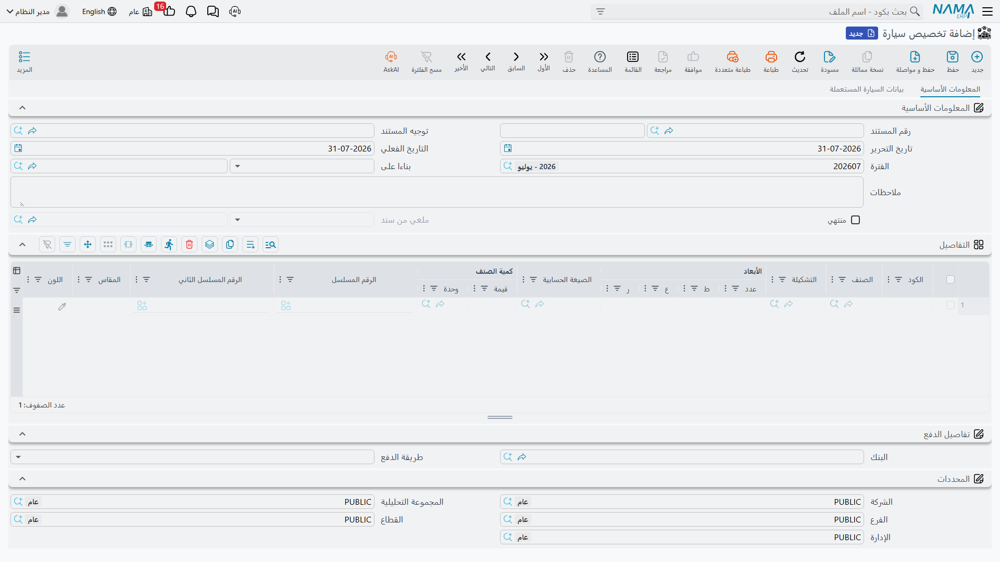

# تخصيص السيارة

[أمر البيع](/ar/modules/servicecenter/car-sales/car-sales-order.md) يقول إن «ليلى تشتري ناوا رمال
٢٫٤». لكنه لا يقول **أيّ** رمال ٢٫٤. في ساحة المعرض ست منها
مصطفّة، ولا بد في لحظة ما أن يخرج أحدهم بورقة، ويختار الهيكل `NWA7R24C26K000318`، ويكتب اسمها عليه.

مستند **تخصيص سيارة** هو المكان الذي يُسجَّل فيه هذا القرار. تجده في
**سيارات > مبيعات السيارات > تخصيص سيارة**.

::: info الترخيص المطلوب
`srvcenter-subitems`.
:::

## ماذا يكتب

السطر الواحد سيارة واحدة. تذكر في السطر الهيكل في عمود **السياره (Customer Car)**، ثم تملأ خمسة
أعمدة تخصيص موجودة في هذا المستند دون سواه:

| العمود | معناه |
|---|---|
| مُخصصة لعميل (Allocated To Customer) | المشتري الذي حُجزت له السيارة |
| مُخصصة لفرع (Allocated To Branch) | الفرع صاحب الصفقة |
| مُخصصة لقسم (Allocated To Department) | القسم |
| مُخصصة لمندوب مبيعات (Allocated To Sales Man) | المندوب الذي تُحسب له |
| مُخصصة لمخزن (Allocated To Warehouse) | حيث تُحفظ السيارة للعميل |

وعند الاعتماد تُنسخ هذه القيم الخمس إلى
[بطاقة السيارة نفسها](/ar/modules/servicecenter/cars-setup/car-master-file.md)، فتظهر في تبويب
**بيانات المبيعات**. وهي
هناك للقراءة فقط: مستند التخصيص هو الوحيد الذي يكتبها، ومستند إلغاء التخصيص هو الوحيد الذي يمسحها.

ويكتب المستند كذلك سطر حالة على السيارة — عادةً بنقلها إلى *مخصص (Allocated)* — إن كان في الإعدادات
سطر تحديث حالة يستهدف التخصيص.

::: warning التخصيص لا يحجز السيارة
هذه أكثر جملة يخطئ فيها القراء، فلنكن صريحين: **لا توجد قاعدة عمل واحدة في النظام تقرأ حقل «مُخصصة
لعميل».** يُكتب، ويُعرض في شاشة السيارة، وينتهي الأمر عند هذا الحد.

وبعبارة ملموسة: سيارة مخصصة لليلى الحربي يمكن أن
[تُفوتَر](/ar/modules/servicecenter/car-sales/car-sales-invoice.md) لعميل آخر تماماً، ولن ينبّه أحد. لا تحقق
يفحصه، ولا قائمة اختيار تستعمله، ولا تقرير يعتمد عليه. تعامَل مع الحقول الخمسة بوصفها **ختماً
معلوماتياً** — مفيداً جداً للإجابة على سؤال «لمن وُعدت هذه السيارة؟» على الشاشة وفي التقارير، وغير
مفيد لأي شيء آخر.
:::

## ما الذي يمنع مندوباً آخر من بيع السيارة نفسها

إن لم تكن حقول التخصيص هي الحارس، فما الحارس؟ ثلاثة أشياء، وكلها أشياء **تُعدّها أنت**:

1. **[آلة حالات السيارة](/ar/modules/servicecenter/cars-setup/car-status-configurations.md).**
   إن كان سطر تحديث الحالة عندك ينقل السيارة إلى *مخصص*، فإن تخصيصاً ثانياً
   يعني انتقالاً من *مخصص* إلى *مخصص*. وما لم تُجِز الإعدادات هذا الانتقال صراحةً، رُفض اعتماد
   المستند الثاني. هذه هي الآلية التي تؤدي العمل الحقيقي — ولاحظ أنها أثر جانبي لدورة الحياة التي
   رسمتها، لا فحص «مخصصة سلفاً» كتبه أحد لهذا الغرض.
2. **فلتر قائمة اختيار السيارة.** تستطيع الإعدادات أن تحدد أي حالات سيارة تكون قابلة للاختيار في أي
   مستند. استبعِد *مخصص* من فلتر مستند التخصيص، فلا يجد المندوب الثاني السيارة في القائمة أصلاً.
3. **منع البيع (Prevent Sales)** في بطاقة السيارة. السيارة الموسومة بهذا الوسم تُرفض في أي مستند
   مبيعات سيارات وتختفي من القائمة.

::: danger بلا إعدادات حالة، لا يكتب التخصيص شيئاً على الإطلاق
حقول التخصيص تُنسخ إلى السيارة **من خلال** آلة الحالات. فإن لم يطابق أي سطر تحديث حالة مستندَ
التخصيص، لم تكتب الآلة سطر تاريخ — ولم يُبلغ أصلاً موضعُ الشيفرة الذي ينسخ الحقول الخمسة.

والنتيجة مستند يُعتمد بنظافة، ويعرض القيم الخمس على أسطره، ويترك تبويب بيانات المبيعات في السيارة
فارغاً تماماً. ولا شيء يخبرك. فإذا بدا أن «التخصيص لا يعمل»، فهذا هو السبب في الغالب.
:::

## ما لا يفعله

| | |
|---|---|
| المحاسبة | **لا شيء.** المستند لا يرحّل أبداً، مهما ضُبط من حسابات في توجيهه |
| المخزون | **لا شيء**، إلا إذا كان خيار **الحجز** في التوجيه مفعّلاً — فيُنشأ حجز كمية معتاد، منفصل تماماً عن حقول التخصيص |
| المستندات المُنشأة | لا شيء |

::: warning كتلة الحسابات في توجيه التخصيص مُهمَلة
تعرض [شاشة توجيه التخصيص](/ar/modules/servicecenter/document-terms/servicecenter-terms-cars-and-other.md)
— وتوجيه إلغاء التخصيص — مجموعة كاملة من حسابات المدين والدائن والنقدية
والضرائب والخصومات. **ولا يرحّل أي من المستندين شيئاً.** كل ما يُدخل هناك يُهمَل بصمت؛ فلا تنفق وقتك
في ضبطه ولا تنتظر قيداً.
:::

## المثال العملي

في **25 فبراير 2026**، في اليوم التالي لأمر ليلى، تصدر سارة الدوسري التخصيص `SIA-2026-0311` مبنياً
على أمر البيع `SISO-2026-0233`. ولأن الأمر مذكور في *بناءا على*، لا تعرض قائمة السيارات إلا سيارات
ذلك الأمر.

| السطر | القيمة |
|---|---|
| السيارة | `CAR-000318`، الهيكل `NWA7R24C26K000318` |
| مُخصصة لعميل | `CUS-1105` ليلى الحربي |
| مُخصصة لفرع | الرياض |
| مُخصصة لمندوب مبيعات | `EMP-131` سارة الدوسري |

تنتقل السيارة إلى *مخصص*، وتظهر القيم الخمس في تبويب بيانات المبيعات — ولأن إعدادات الصحراء لا تتضمن
حركة من *مخصص* إلى *مخصص*، لا يمكن اعتماد تخصيص ثانٍ للسيارة `CAR-000318` ما دامت في تلك الحالة.

## التراجع عن التخصيص

مستند **إلغاء تخصيص سيارة** يقيم مع بقية إلغاءات المبيعات، في
**سيارات > الغاء مبيعات سيارات > إلغاء تخصيص سيارة**. اربطه بالتخصيص الأصلي عبر **بناءا على**، وضع
السيارة على سطر، واعتمده.

يفعل شيئين: يختم التخصيص الأصلي بأنه ملغي، و**يمسح حقول التخصيص الخمسة** في السيارة. ويكتب سطر حالته
الخاص، فتستطيع إعادة السيارة إلى حالة قابلة للبيع — مرة أخرى، فقط إن كانت الإعدادات تتضمن حركة لذلك
الانتقال.

::: danger املأ «بناءا على» دائماً
إلغاء التخصيص المحفوظ و*بناءا على* فارغ **يُعتمد بنظافة ويمسح مع ذلك حقول التخصيص** لأي سيارة على
أسطره، وينقل حالتها. والتخصيص الأصلي لا يُختم ملغياً أبداً — فينفصل المستندان أحدهما عن الآخر بلا أي
خطأ في أي مكان.

ولاحظ كذلك أن الإلغاء يمسح الحقول الخمسة **بلا شرط**. فهو لا يتحقق من أن السيارة خُصصت بالتخصيص الذي
يذكره، ومن ثمّ فإن إلغاءً موجهاً إلى المستند الخطأ سيمسح مع ذلك حقول السيارة الموجودة على أسطره هو.
:::

وكل ما عدا ذلك يبقى كما هو تماماً: لا محاسبة تُعكس (فلا أحد من المستندين يرحّل شيئاً لتُعكسه)، ولا
مخزون يتحرك، ولا حجز يُفَك. وللاطلاع على النمط العام، انظر
[مستندات الإلغاء](/ar/modules/servicecenter/car-sales/car-cancellation-documents.md).
