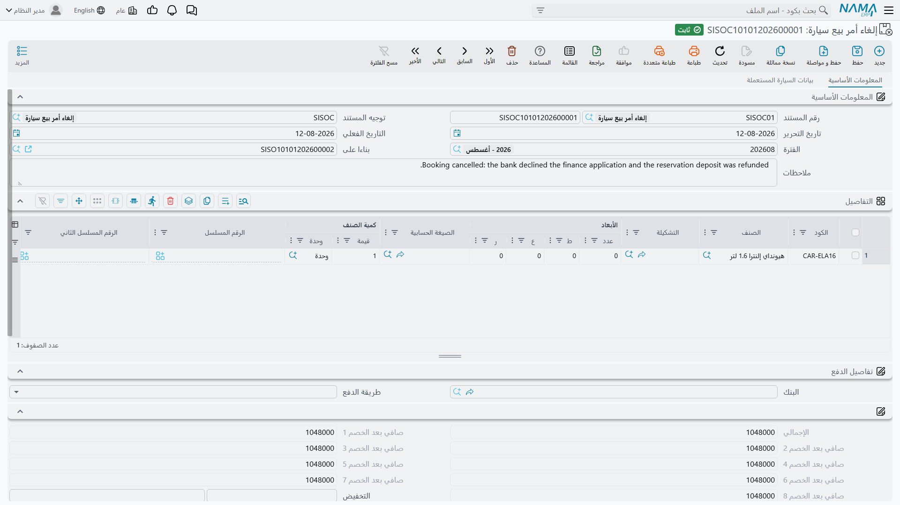

# مستندات الإلغاء

تلغي معظم الأنظمة المستندَ بتبديل حالته. أما منطقة السيارات هنا فتفعل شيئاً آخر: لكل مستند
قابل للإلغاء **نوع مستند مستقل** مهمته كلها أن يشير إلى الأصل ويختمه. فالتخصيص يُلغى بمستند «إلغاء
تخصيص سيارة»، و[أمر البيع](/ar/modules/servicecenter/car-sales/car-sales-order.md) بـ«إلغاء أمر بيع
سيارة»، و[التسليم النهائي](/ar/modules/servicecenter/car-sales/car-final-delivery.md) بـ«إلغاء تسليم
سيارة نهائي».

وفهم ما تفعله هذه العلامة — والأهم بكثير، ما **لا** تفعله — يوفّر عليك ارتباكاً كبيراً لاحقاً.

::: info الترخيص المطلوب
`srvcenter-subitems`.
:::

## الجملة التي ينبغي حفظها

> **مستند الإلغاء علامة دفترية وحركة حالة. لا يعكس مالاً ولا يعكس مخزوناً.**

وكل ما يلي شرحٌ لهذه الجملة.

## كيف يعمل النمط

1. تفتح مستند الإلغاء المطابق للأصل — فلكل مستند قابل للإلغاء نوعٌ خاص به، وهي غير متبادلة.
2. تربطه بالأصل عبر حقل **بناءا على (From Document)** المعتاد. هذا هو الرابط الوحيد؛ فليس على المستند
   الأصلي زر «إلغاء».
3. تضع السيارة على سطر وتعتمد المستند.
4. عند الاعتماد يُختم المستند الأصلي بأنه **ملغي**، ويشير حقل **ملغي من سند (Cancelled From Doc)** فيه
   إلى مستند الإلغاء. والحقلان للقراءة فقط في الأصل ولا يكتبهما أحد.
5. ويكتب مستند الإلغاء **سطر حالته الخاص** على السيارة، كأي مستند سيارات آخر.

وإلغاء اعتماد مستند الإلغاء أو حذفه يعيد الحقلين إلى حالتهما، وإعادة توجيه حقل *بناءا على* فيه إلى
مستند آخر تُلغي إلغاء المستند السابق. أما اعتماد مستند إلغاء ثانٍ لمستند ملغي سلفاً فمرفوض، برسالة
تسمّي المستند الذي ألغاه أولاً.

ومستندات الإلغاء الستة متطابقة الشكل تقريباً؛ وهذه شاشة إلغاء أمر بيع سيارة:

## أين تجدها في القائمة

هي موزّعة على ثلاثة مجلدات، وهذه أول مشكلة عملية يواجهها القارئ:

| مستند الإلغاء | مسار القائمة |
|---|---|
| إلغاء أمر بيع سيارة | `سيارات > الغاء مبيعات سيارات > إلغاء أمر بيع سيارة` |
| إلغاء تخصيص سيارة | `سيارات > الغاء مبيعات سيارات > إلغاء تخصيص سيارة` |
| إلغاء توريد سيارة | `سيارات > مخازن السيارات > إلغاء توريد سيارة` |
| إلغاء تسليم سيارة نهائي | `سيارات > مخازن السيارات > إلغاء تسليم سيارة نهائي` |
| إلغاء طلب خطاب مرور سيارة | `سيارات > مبيعات السيارات > إلغاء طلب خطاب مرور سيارة` |
| إلغاء خطاب مرور سيارة | `سيارات > مبيعات السيارات > إلغاء خطاب مرور سيارة` |

ولاحظ أن إلغاءي خطاب المرور يقيمان مع مستندات المبيعات لا مع بقية الإلغاءات — وهذا ليس خطأً في هذه
الصفحة.

## ماذا يعكس كل منها فعلاً

| مستند الإلغاء | يختم المصدر ملغياً | يعكس المحاسبة | يعكس المخزون | شيء آخر |
|---|---|---|---|---|
| إلغاء أمر بيع سيارة | نعم | **لا** — قيد الأمر، بما فيه دفعة الحجز، يبقى كما هو | لا | سطر حالته الخاص |
| إلغاء تخصيص سيارة | نعم | لا — فلا أحد من المستندين يرحّل | لا | **يمسح حقول التخصيص الخمسة في السيارة** |
| إلغاء تسليم سيارة نهائي | نعم | لا | **لا** — إذن صرف التسليم يبقى مكانه | سطر حالته الخاص |
| إلغاء توريد سيارة | **لا — ولا يستطيع** | لا | **لا** — إذن إضافة التوريد يبقى مكانه | سطر حالته الخاص |
| إلغاء خطاب مرور / إلغاء طلب خطاب مرور | نعم | لا | لا | سطر حالته الخاص |

::: danger ثلاثة مزالق في هذا الجدول
**١. لا شيء يُعكس إلا العلامة والحالة.** أمر بيع ملغي يبقى قيد دفعة الحجز الخاص به. وتسليم نهائي ملغي
يبقى له إذن صرفه، فتظل السيارة خارج المخزون. وتوريد ملغي يبقى له إذن إضافته، فتظل السيارة داخل
المخزون. الإلغاء يغيّر ما تقوله الأوراق، لا ما يقوله الأستاذ والمخزن.

**٢. «إلغاء توريد سيارة» لا يستطيع حتى ختم مصدره.**
فـ[توريد السيارة](/ar/modules/servicecenter/car-purchasing/car-receipt.md) مستند من جانب المشتريات وليس فيه
حقل إلغاء أصلاً، فليس لمستند الإلغاء موضع يكتب فيه. يُعتمد، ويكتب سطر حالة على السيارة، ولا يظهر على
التوريد الأصلي أي أثر لما جرى له. فلا تعتمد على شاشة التوريد نفسها لتخبرك أنه أُلغي.

**٣. مستند إلغاء محفوظ بلا «بناءا على» يُعتمد ويُلغي نصف إلغاء.** فلا يوجد تحقق يشترط الرابط. احفظه
والحقل فارغ فلا يُختم الأصل أبداً — ومع ذلك يكتب المستند سطر حالته، ويظل **إلغاء التخصيص** يمسح حقول
التخصيص لأي سيارة على أسطره. بصمت، وجزئياً، وبلا شيء على الشاشة يدل على ذلك. **املأ «بناءا على»
دائماً.**
:::

## فكيف تتراجع فعلاً؟

| للتراجع عن | افعل هذا |
|---|---|
| حركة مخزنية أنشأها توريد سيارة أو تسليم نهائي | **ألغِ اعتماد المستند الأصلي أو احذفه.** هذا ما يزيل المستند المخزني المُنشأ عنه — ولن يفعله مستند الإلغاء. |
| [فاتورة مبيعات](/ar/modules/servicecenter/car-sales/car-sales-invoice.md) معتمدة | أصدر [مردود مبيعات سيارة](/ar/modules/servicecenter/car-sales/car-sales-return.md). فليس للفاتورة مستند إلغاء، والمال الذي وصل الأستاذ ينبغي أن يعود بمردود. |
| تخصيص | [إلغاء تخصيص سيارة](/ar/modules/servicecenter/car-sales/car-allocation.md)، وهو يمسح فعلاً حقول التخصيص الخمسة. |
| قيد دفعة الحجز في أمر البيع | الطريق المحاسبي المعتاد. فالإلغاء لا يمسّه. |
| اعتماد بيع | احذفه. **لا يستهدف اعتمادَ البيع أي مستند إلغاء** — حقول الإلغاء موجودة عليه ولا شيء يستطيع ضبطها. |

## العكس الحقيقي هو حركة الحالة

إن كان الإلغاء يعكس هذا القدر القليل، فلماذا نستعمله؟ لأن **حالة** السيارة في هذه الوحدة هي ما ينظر
إليه الجميع، وحركة الحالة هي بالضبط الغرض من مستند الإلغاء.

والحركات من تصميمك أنت. وعادةً يضبط الموقع:

- *مخصص ← تم تسليمه* لإلغاء التخصيص، فتعود السيارة إلى السوق؛
- *توصيل نهائي ← مفوتر كلياً* لإلغاء التسليم النهائي؛
- *مُصدر له خطاب مرور ← مخصص* لإلغاء خطاب المرور.

وبدون أسطر الحركة هذه في
[إعدادات حالة السيارة](/ar/modules/servicecenter/cars-setup/car-status-configurations.md)، يُعتمد
مستند الإلغاء ولا تتزحزح حالة السيارة — وهذا
أشيع سبب لشكوى المواقع من أن «الإلغاء لا يفعل شيئاً».

::: warning كتلة الحسابات في توجيه مستند الإلغاء مُهمَلة
تعرض شاشة توجيه كل مستند إلغاء مجموعة كاملة من حسابات المدين والدائن والنقدية والضرائب والخصومات.
**ولا يرحّل أي من هذه المستندات.** كل ما يُضبط هناك يُهمَل بصمت.
:::

## أمر أخير تفعله علامة الإلغاء

هناك سلوك واحد مرتبط بالعلامة نفسها، ويسهل أن يفوتك: **المستند البيعي الملغي يتوقف عن تحديث أختام
المراجع والمحددات في السيارة.** فما إن يُختم أمر أو تسليم بأنه ملغي، حتى يتوقف إعادةُ حفظه عن تحديث
المراجع التي كان قد ختمها في
[تبويب الإحصائيات في بطاقة السيارة](/ar/modules/servicecenter/cars-setup/car-master-file.md)، وعن
نسخ الفرع والقطاع والقسم والضرائب. أما الأختام
المكتوبة سلفاً فتبقى مكتوبة؛ لكنها تتوقف عن التحديث فحسب.
