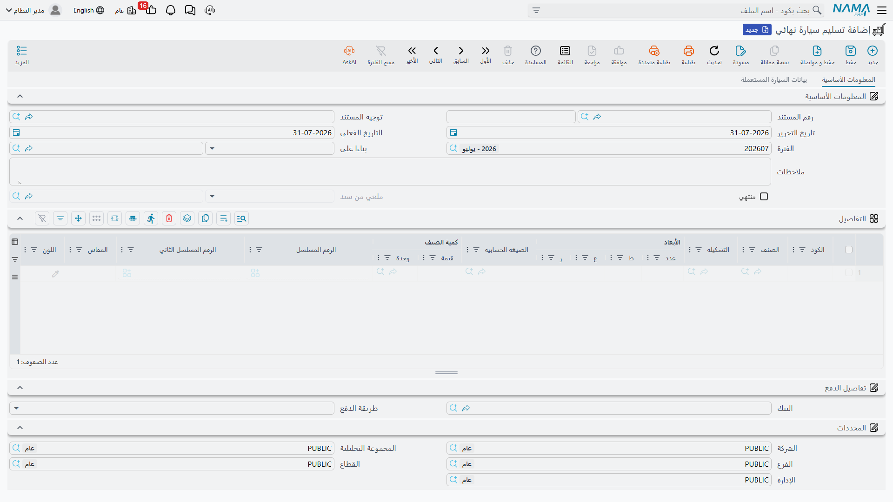

# تسليم السيارة نهائياً

الفاتورة هي البيع، أما **تسليم السيارة النهائي** فهو لحظة انتقال المفاتيح. مستند يصدره المعرض حين
ينطلق العميل بالسيارة فعلاً — سجل يقول: *هذا الهيكل غادر المعرض، في هذا التاريخ، إلى هذا العميل*.

ولأنه يقع في نهاية السلسلة ويحمل كلمة «تسليم» في اسمه، فهو أيضاً المستند الذي تتعلق به أكثر التوقعات
الخاطئة. اثنان منها يستحقان أن يُقالا قبل كل شيء: إنه **لا** يملأ حقول التسليم في بطاقة السيارة،
و**قد** يُخرج السيارة من المخزون مرة ثانية إن أعددته بلا انتباه.

تجده في مجلد المخازن لا في مجلد المبيعات:
**سيارات > مخازن السيارات > تسليم سيارة نهائي**.

::: info الترخيص المطلوب
`srvcenter-subitems`.
:::

## ماذا يفعل المستند فعلاً

أربعة أشياء، لا خامس لها:

1. **يُنشئ إذن صرف مخزني — فقط، وحصراً، إن ذكر توجيهه دفتر إنشاء وتوجيه إنشاء.** فإذا مُلئا، أُنشئ
   إذن صرف من التسليم يحمل مخزن التسليم وموقعه، بسطر لكل سطر من أسطره. والحركة المخزنية والقيود
   المخزنية تخصّ إذنَ الصرف المُنشأ، تحت دفتره وتوجيهه هو — لا التسليم.
2. **ينقل حالة السيارة**، عادةً إلى *توصيل نهائي (Final Delivered)*، إن كان هناك
   [سطر تحديث حالة](/ar/modules/servicecenter/cars-setup/car-status-configurations.md) يستهدف
   التسليم النهائي.
3. **ينسخ الخصائص الفنية من أسطره إلى
   [بطاقة السيارة](/ar/modules/servicecenter/cars-setup/car-master-file.md)** — رقم الهيكل ورقم المحرك وناقل الحركة ونوع
   الهيكل وعدد الركاب ومدة الضمان ورقم المفتاح ورقم الموقع الفرعي. ولا تُستبدل إلا القيم غير الفارغة،
   والنسخ في اتجاه واحد، من المستند إلى السيارة.
4. **يختم تاريخ التسليم** على السيارة، إن كان خيار تحديث تاريخ التسليم في التوجيه مفعّلاً — إضافة إلى
   أي من أختام المراجع الأخرى التي يفعّلها التوجيه.

ولا يرحّل **شيئاً**. فليس للتسليم أثر محاسبي خاص به إطلاقاً.

::: warning كتلة الحسابات في توجيه التسليم النهائي مُهمَلة
تعرض [شاشة توجيهه](/ar/modules/servicecenter/document-terms/servicecenter-terms-cars-and-other.md)
مجموعة كاملة من حسابات المدين والدائن والنقدية والضرائب والخصومات. والمستند لا يرحّل
أبداً، فكل ما يُدخل هناك يُهمَل بصمت. لا تضبطه، ولا تنتظر قيداً.
:::

## قاعدة المخزون — اقرأها قبل ضبط أي شيء

::: danger قد تخرج السيارة من المخزون مرتين
كل من [**فاتورة مبيعات السيارة**](/ar/modules/servicecenter/car-sales/car-sales-invoice.md) وهذا
المستند يستطيع إنشاء إذن صرف، و**لا يرى أي منهما إذن الآخر**.
إذ لا يبحث كل منهما إلا عن إذن صادر عن نفسه. ولا يتحقق أي منهما من أن السيارة خرجت من المخزون بالفعل،
ولا ينظر أي منهما إلى الكميات المتبقية.

اتبع المسار الطبيعي — تفوتر السيارة ثم تسلّمها — والتوجيهان مضبوطان على الإنشاء، فيخرج الهيكل نفسه
**مرتين**: تُحمَّل التكلفة النهائية على تكلفة المبيعات مرتين، ويصبح الرصيد **سالب واحد**. وحيث يُسمح
بالرصيد السالب على الصنف، يُعتمد المستندان بصمت ولا شيء في الوحدة ينبّه. وحيث يُمنع، يفشل المستند
الثاني الذي تحفظه برسالة عجز مخزني عامة تسمّي مستنداً مخزنياً مُنشأ آلياً — فتبدو مشكلةً مخزنية لا
خطأً في الإعداد.

**القاعدة: املأ *دفتر المستند* و*توجيه المستند* في تبويب الإنشاء على توجيه واحد فقط من الاثنين في أي
مسار.** في البيع العادي — حيث تسبق الفاتورة — اترك دفتر وتوجيه الإنشاء في توجيه **التسليم النهائي**
**فارغين**، ودع الفاتورة تحرّك المخزون. ولا تستعمل التسليم النهائي مستنداً لتحريك المخزون إلا في مسار
لا فاتورة فيه تقوم بذلك: بضاعة أمانات، أو ترتيب «سلّم الآن وفوتر لاحقاً».

**وإزالة علامة «أنشاء مستندات تلقائيا (Generate Document)» لا توقف التسليم النهائي.** فهذا الخيار —
وخيار «إنشاء يدوي» بجانبه — مُهمَل في هذا المستند. تفريغ دفتر الإنشاء أو توجيه الإنشاء هو الشيء
الوحيد الذي ينفع.

تعامَل مع الفاتورة والتسليم النهائي بوصفهما **بديلين** لتحريك المخزون، لا خطوتين متتاليتين.
:::

في شركة الصحراء للسيارات تُنشئ الفاتورةُ إذنَ الصرف، ولذلك يُترك دفتر وتوجيه الإنشاء في توجيه التسليم
النهائي فارغين، ولا يحرّك `SIFD-2026-0357` أي مخزون. وهذا هو الإعداد الذي تفترضه كل الأمثلة في هذا
التوثيق.

## ما لا يكتبه

::: warning حقول التسليم في بطاقة السيارة تُكتب يدوياً — كلها
بعد اعتماد التسليم النهائي، افتح بطاقة السيارة تجد هذه الحقول **ما زالت فارغة**. لا مستند في النظام
يكتب أياً منها:

- **حالة التسليم (Delivery Status)** — بيعت ولم تُسلَّم / أمانات / نهائي / فحص …
- **العميل المُستلم (Delivered To Customer)** و*التسليم لجهة ذات صلة*
- **رقم اللوحه (Plate Number)**
- كتلة الفحص قبل التسليم كاملة — تم الفحص، وتاريخه، ومن أجراه
- **الحالة** و**قراءة العداد**
- كل حقول الجمارك والترخيص، بما فيها حقول ختم خطاب المرور

والحقل الوحيد في السيارة الذي يمسّه التسليم هو **تاريخ التسليم**، وفقط إن كان خيار تحديث تاريخ
التسليم في التوجيه مفعّلاً.

فالتعليمات العملية إذن بسيطة، ويجب أن تُعطى لموظفي المعرض صراحةً: **بعد التسليم، افتح شاشة السيارة
واملأ كتلة التسليم يدوياً.** فإن كانت هذه الحقول مهمة لتقاريرك، فهي خطوة يدوية في إجراءاتك، لا شيء
يفعله المستند نيابةً عنك.
:::

وأكثر ما يفاجئ الناس هنا رقم اللوحة، لأن خطابات المرور وُجدت أصلاً للحصول على اللوحات. وحتى هي لا
تستطيع تسجيل اللوحة — انظر [خطابات المرور](/ar/modules/servicecenter/car-sales/car-traffic-letters.md).
اللوحة تسكن في بطاقة السيارة وتُكتب هناك، بعد ذلك، بيد إنسان.

## المثال العملي

تستلم ليلى السيارة `CAR-000318` يوم **3 مارس 2026**. التسليم النهائي `SIFD-2026-0357` مبني على فاتورة
المبيعات، فيحمل سطره الهيكل الصحيح سلفاً.

| | |
|---|---|
| العميل | `CUS-1105` ليلى الحربي |
| السيارة | `CAR-000318`، الهيكل `NWA7R24C26K000318` |
| دفتر وتوجيه الإنشاء في توجيه التسليم | **فارغان — لا إذن صرف** |
| حالة السيارة بعد الاعتماد | *توصيل نهائي* |
| ما كُتب على السيارة | تاريخ التسليم فقط |

وبعد يومين تعود اللوحات من إدارة المرور، فتُكتب `ر ط ص 8318` يدوياً على `CAR-000318`، مع حالة التسليم
والعميل المُستلم.

## التراجع عن التسليم

مستند **إلغاء تسليم سيارة نهائي** يجاوره في **سيارات > مخازن السيارات > إلغاء تسليم سيارة نهائي**.
اربطه بالتسليم عبر **بناءا على** واعتمده. يختم التسليم بأنه ملغي ويكتب سطر حالته الخاص، فيمكن إعادة
السيارة — إن كانت الإعدادات تتضمن حركة لذلك الانتقال.

::: danger الإلغاء لا يعيد السيارة إلى المخزون
إن كان التسليم النهائي قد أنشأ إذن صرف، فإن **مستند الإلغاء لا يحذفه**. تبقى السيارة خارج المخزون
وتبقى التكلفة محمّلة.

ولعكس الحركة المخزنية عليك **إلغاء اعتماد التسليم النهائي نفسه أو حذفه** — فإلغاء اعتماد المستند
الأصلي هو ما يزيل إذن الصرف المُنشأ عنه. أما مستند الإلغاء فعلامة ورقية وحركة حالة، لا أكثر.

وكما هو الحال في كل مستندات الإلغاء هنا: إلغاء التسليم المحفوظ و*بناءا على* فارغ يُعتمد بنظافة، ولا
يختم شيئاً، وينقل حالة السيارة مع ذلك.
:::

والنمط كاملاً، بما فيه ما يستطيع كل مستند إلغاء ختمه وما لا يستطيع، في
[مستندات الإلغاء](/ar/modules/servicecenter/car-sales/car-cancellation-documents.md).
