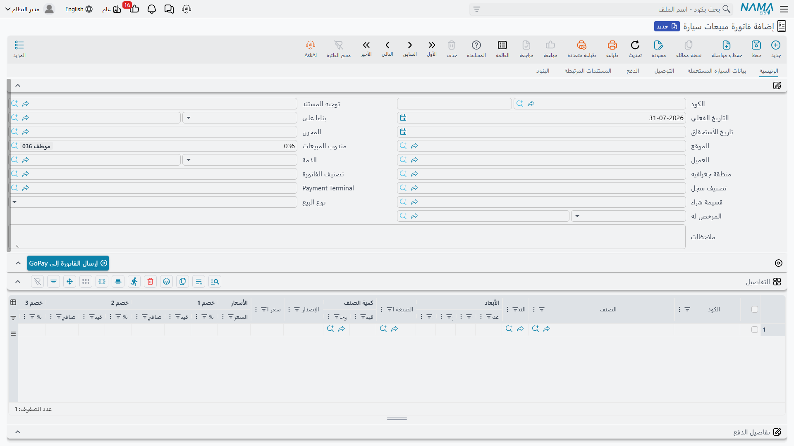

# فواتير بيع السيارات

في القائمة مستندان يحمل اسم كل منهما كلمة «فاتورة»، ويكادان يتطابقان على الشاشة، وواحد منهما فقط هو
عملية بيع. وضبط الفرق بينهما أنفع ما في هذه الصفحة.

- **فاتورة مبيعات سيارة مبدئية** (`سيارات > مبيعات السيارات > فاتورة مبيعات سيارة مبدئية`) — مستند
  مسعّر كامل الشكل يمكن طباعته وتسليمه لبنك أو شركة تأمين أو مخلّص جمركي. ولا يقيّد شيئاً ذا بال.
- **فاتورة مبيعات سيارة** (`سيارات > مبيعات السيارات > فاتورة مبيعات سيارة`) — عملية البيع. الإيراد
  والضريبة ومديونية العميل وتكلفة البضاعة المباعة وإذن الصرف والفاتورة الإلكترونية، كلها من هنا، ومن
  هنا وحدها.

::: info الترخيص المطلوب
`srvcenter-subitems`.
:::

## المستندان جنباً إلى جنب

| | الفاتورة المبدئية | **فاتورة المبيعات** |
|---|---|---|
| الإيراد والمديونية | **لا.** زوج مدين/دائن عام فقط، وفقط إن صادف أن ملأه التوجيه | **نعم، دائماً** |
| الضريبة | لا | **نعم** — الضرائب من الأولى إلى الرابعة وضرائب الرأس |
| تكلفة البضاعة المباعة | لا | **نعم**، عبر إذن الصرف |
| حركة المخزون | **لا شيء إطلاقاً** | **خروج** — إذن صرف بالسيارة |
| الإرسال لهيئة الضرائب | لا | **نعم** |
| قابلية الإرتجاع | لا يستهدفها أي مستند مردود | **نعم** — مردود مبيعات سيارة |
| نوع البيع / المرخص له على الشاشة | لا | نعم |
| أسطر السداد والجدول والسداد الخارجي | نعم | نعم |

اقرأ الجدول مرة أخرى من أوله: **الفاتورة المبدئية ليست مستنداً مالياً.** لا تقدّمها لأحد بوصفها
«ترحيلاً مؤقتاً» أو «فاتورة تنتظر التأكيد» — لا شيء ينتظر، لأن لا شيء قُيّد. قيمتها كلها في أنها
مستند كامل مسعّر قابل للطباعة، له دفتر ورقم، آمن لإصداره خارج الشركة دون أن يمسّ أستاذك أو إقرارك
الضريبي أو مخزونك.

والشيء الوحيد الذي تشترك فيه المبدئية مع بقية مستندات السيارات هو أثرها في السيارة نفسها: فهي تكتب
سطر حالة، وتستطيع ختم مرجعها في تبويب الإحصائيات. فمن أراد أن تظهر واقعة «صدرت فاتورة مبدئية» على
السيارة، أمكنه أن يمثّلها حالةً بالضبط.

## فاتورة مبيعات السيارة

هذه هي نقطة اللاعودة. فما إن تُعتمد حتى يصبح التراجع عن البيع مرهوناً بإصدار **مردود مبيعات سيارة**
— والحذف ليس هو الحل، ومستندات الإلغاء في هذه الوحدة لا تمسّ مالاً ولا مخزوناً.

### ماذا تقيّد

عند الاعتماد تنتج الفاتورة، بالطريقة المعتادة ودائماً:

- **مديونية العميل** (أو النقدية، إن وجّهها التوجيه إلى هناك) مقابل **الإيراد**؛
- **الضريبة** على السطر وضرائب الرأس؛
- **خصومات** الفاتورة والأسطر، وأي من جوانب أتعاب الخدمات التي يضبطها التوجيه؛
- **إذن الصرف** الذي يُخرج السيارة من مخزن المعرض، ومعه قيد **تكلفة البضاعة المباعة** الذي يحمّل
  [تكلفة السيارة النهائية](/ar/modules/servicecenter/car-purchasing/car-landed-cost.md).

وكل هذا يُنشأ بوصفه **طلبات أعمال** تُعالَج في الخلفية — والفاتورة نفسها تُحفظ فوراً. وإن فشل أثر ما،
أعِد تنفيذه من قائمة **طلبات الأعمال**: صفِّ على «فشل»، وحدّد الأسطر، ثم **المزيد ← إعادة المعالجة /
إعادة الاعتماد**.

### حقول تلقاها هنا وحدها

إلى جانب تخطيط فاتورة المبيعات القياسي، تحمل فاتورة بيع السيارة **نوع البيع (Sale Type)** — نقدي أو
تقسيط — و**المرخص له (Licensee)**، إضافة إلى
[كتلة التقسيط](/ar/modules/servicecenter/car-installments/car-installment-quotation.md) وتبويب
**بيانات السيارة المستعملة** المنقول من أمر البيع.

ويُذكر الهيكل في عمود **السياره (Customer Car)** في السطر، كما في كل مستندات هذه العائلة. وحين تُبنى
الفاتورة على تخصيص أو أمر عبر **بناءا على**، لا تعرض القائمة إلا سيارات ذلك المصدر.

::: warning لا شيء يتحقق ممن خُصصت له السيارة
تبيع الفاتورةُ عن طيب خاطر سيارةً كانت مخصصة لشخص آخر. فحقول التخصيص ختم معلوماتي لا تقرأه أي قاعدة
— انظر [تخصيص السيارة](/ar/modules/servicecenter/car-sales/car-allocation.md). والشيء الوحيد الذي
يستطيع رفض البيع هو إعدادات حالة السيارة نفسها، أو وسم **منع البيع (Prevent Sales)** في
[بطاقة السيارة](/ar/modules/servicecenter/cars-setup/car-master-file.md).
:::

## المثال العملي

تُفوتَر `CAR-000318` لليلى الحربي في **1 مارس 2026** بالفاتورة `SISI-2026-0498`:

| | المبلغ |
|---|---|
| سعر البيع المتفق عليه | **87,000** |
| ضريبة القيمة المضافة 15 % | 13,050 |
| **إجمالي الفاتورة** | **100,050** |
| تكلفة المبيعات — التكلفة النهائية للسيارة | **76,500** |
| **مجمل الربح** | **10,500** |

والـ 76,500 هي ما كلّفت السيارةُ الصحراءَ فعلاً: 74,000 للمستورد و2,500 شحناً وجمارك موزعة على
السيارات الست في الشحنة. وتُنشئ الفاتورة إذن الصرف `STI-2026-1201` من مخزن المعرض `WH-SHOW`، وهذا
الإذن هو الذي يحمّل الـ 76,500 على تكلفة المبيعات.

ولاحظ ما حدث قبل هذا المستند: أمر البيع رحّل دفعة حجز مقدارها **5,000** على حسابات قيمة الحجز يوم
24 فبراير. ولا تمسّ الفاتورة ذلك القيد؛ فتسويته تجري بالطريق المعتاد عبر حساب العميل.

## قاعدة الإعداد الوحيدة التي تحفظ المخزون سليماً

::: danger قد تخرج السيارة من المخزون مرتين
فاتورة مبيعات السيارة تُنشئ إذن صرف. وكذلك يفعل
[**تسليم السيارة النهائي**](/ar/modules/servicecenter/car-sales/car-final-delivery.md). و**لا يرى أي
من المستندين إذن الآخر** — إذ لا يبحث كل منهما إلا عن إذن صادر عن نفسه — ولا يتحقق أي منهما من أن السيارة خرجت
بالفعل.

اتبع المسار الطبيعي والتوجيهان مضبوطان على الإنشاء، فيخرج الهيكل نفسه **مرتين**: تُحمَّل التكلفة
النهائية على تكلفة المبيعات مرتين، ويصبح رصيد السيارة **سالب واحد**. وحيث يُسمح بالرصيد السالب،
يُعتمد المستندان بصمت ولا شيء في الوحدة ينبّه. وحيث يُمنع، يفشل المستند الثاني برسالة عجز مخزني عامة
تسمّي مستنداً مخزنياً مُنشأ آلياً بدلاً من مستند السيارة الذي كنت تحفظه — فتُقرأ كأنها مشكلة مخزنية
لا علاقة لها بالأمر.

**القاعدة: املأ *دفتر المستند* و*توجيه المستند* في تبويب الإنشاء على
[توجيه](/ar/modules/servicecenter/document-terms/servicecenter-terms-cars-and-other.md) واحد فقط من
الاثنين.** فإن كانت الفاتورة هي مستند إخراج المخزون عندك — وهو الاختيار المعتاد في البيع العادي،
وهو اختيار الصحراء — فاترك دفتر وتوجيه الإنشاء في توجيه التسليم النهائي **فارغين**.

وإزالة علامة **أنشاء مستندات تلقائيا (Generate Document)** من توجيه التسليم النهائي **لا توقفه**: فهذا
الخيار مُهمَل هناك. تفريغ الدفتر أو التوجيه هو الشيء الوحيد الذي ينفع. أما الفاتورة فتحترم هذا الخيار
— لكن الاعتماد على هذا التفاوت هو ما يوقع المواقع في المشكلة، فانشر القاعدة البسيطة بدلاً منه.
الفاتورة والتسليم النهائي **بديلان** لتحريك المخزون، لا خطوتان متتاليتان.
:::

## بعد الفاتورة

- تنتقل حالة السيارة — عادةً إلى *مفوتر كلياً (Invoiced)* — إن كان هناك
  [سطر تحديث حالة](/ar/modules/servicecenter/cars-setup/car-status-configurations.md) يستهدف فاتورة
  المبيعات، ويُختم مرجع الفاتورة في تبويب الإحصائيات.
- يُسجَّل التسليم الفعلي على مستند
  [تسليم السيارة نهائياً](/ar/modules/servicecenter/car-sales/car-final-delivery.md)، وهو سجل وحركة
  حالة، لا واقعة مالية.
- وإن انهارت الصفقة، أصدر
  [مردود مبيعات سيارة](/ar/modules/servicecenter/car-sales/car-sales-return.md). فليس لفاتورة
  المبيعات مستند إلغاء، ولا ينبغي أن يكون — فالمال الذي وصل إلى الأستاذ يعود بمردود، لا بعلامة.
