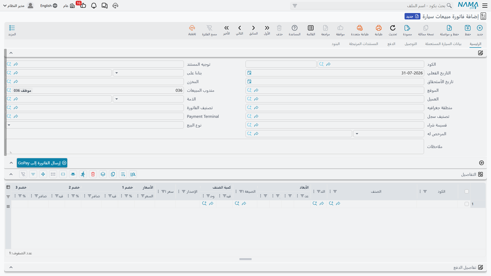
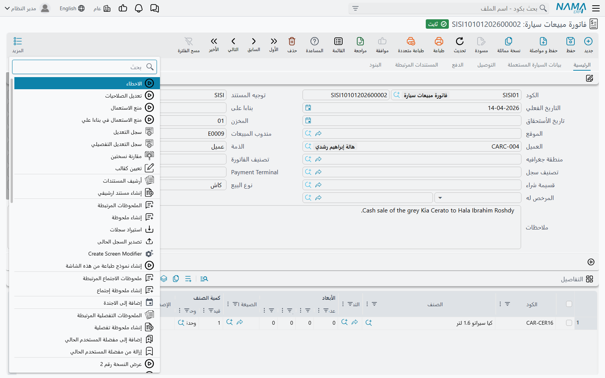

# فواتير بيع السيارات

في القائمة مستندان يحمل اسم كل منهما كلمة «فاتورة»، ويكادان يتطابقان على الشاشة، وواحد منهما فقط هو
عملية بيع. وضبط الفرق بينهما أنفع ما في هذه الصفحة.

- **فاتورة مبيعات سيارة مبدئية** (`سيارات > مبيعات السيارات > فاتورة مبيعات سيارة مبدئية`) — مستند
  مسعّر كامل الشكل يمكن طباعته وتسليمه لبنك أو شركة تأمين أو مخلّص جمركي. ولا يقيّد شيئاً ذا بال.
- **فاتورة مبيعات سيارة** (`سيارات > مبيعات السيارات > فاتورة مبيعات سيارة`) — عملية البيع. الإيراد
  والضريبة ومديونية العميل وتكلفة البضاعة المباعة وإذن الصرف والفاتورة الإلكترونية، كلها من هنا، ومن
  هنا وحدها.

::: info الترخيص المطلوب
`srvcenter-subitems`.
:::

## المستندان جنباً إلى جنب

| | الفاتورة المبدئية | **فاتورة المبيعات** |
|---|---|---|
| الإيراد والمديونية | **لا.** زوج مدين/دائن عام فقط، وفقط إن صادف أن ملأه التوجيه | **نعم، دائماً** |
| الضريبة | لا | **نعم** — الضرائب من الأولى إلى الرابعة وضرائب الرأس |
| تكلفة البضاعة المباعة | لا | **نعم**، عبر إذن الصرف |
| حركة المخزون | **لا شيء إطلاقاً** | **خروج** — إذن صرف بالسيارة |
| الإرسال لهيئة الضرائب | لا | **نعم** |
| قابلية الإرتجاع | لا يستهدفها أي مستند مردود | **نعم** — مردود مبيعات سيارة |
| نوع البيع / المرخص له على الشاشة | لا | نعم |
| أسطر السداد والجدول والسداد الخارجي | نعم | نعم |

اقرأ الجدول مرة أخرى من أوله: **الفاتورة المبدئية ليست مستنداً مالياً.** لا تقدّمها لأحد بوصفها
«ترحيلاً مؤقتاً» أو «فاتورة تنتظر التأكيد» — لا شيء ينتظر، لأن لا شيء قُيّد. قيمتها كلها في أنها
مستند كامل مسعّر قابل للطباعة، له دفتر ورقم، آمن لإصداره خارج الشركة دون أن يمسّ أستاذك أو إقرارك
الضريبي أو مخزونك.

والشيء الوحيد الذي تشترك فيه المبدئية مع بقية مستندات السيارات هو أثرها في السيارة نفسها: فهي تكتب
سطر حالة، وتستطيع ختم مرجعها في تبويب الإحصائيات. فمن أراد أن تظهر واقعة «صدرت فاتورة مبدئية» على
السيارة، أمكنه أن يمثّلها حالةً بالضبط.

## فاتورة مبيعات السيارة

هذه هي نقطة اللاعودة. فما إن تُعتمد حتى يصبح التراجع عن البيع مرهوناً بإصدار **مردود مبيعات سيارة**
— والحذف ليس هو الحل، ومستندات الإلغاء في هذه الوحدة لا تمسّ مالاً ولا مخزوناً.

### ماذا تقيّد

عند الاعتماد تنتج الفاتورة، بالطريقة المعتادة ودائماً:

- **مديونية العميل** (أو النقدية، إن وجّهها التوجيه إلى هناك) مقابل **الإيراد**؛
- **الضريبة** على السطر وضرائب الرأس؛
- **خصومات** الفاتورة والأسطر، وأي من جوانب أتعاب الخدمات التي يضبطها التوجيه؛
- **إذن الصرف** الذي يُخرج السيارة من مخزن المعرض، ومعه قيد **تكلفة البضاعة المباعة** الذي يحمّل
  [تكلفة السيارة النهائية](/ar/modules/servicecenter/car-purchasing/car-landed-cost.md).

وكل هذا يُنشأ بوصفه **طلبات أعمال** تُعالَج في الخلفية — والفاتورة نفسها تُحفظ فوراً. وإن فشل أثر ما،
أعِد تنفيذه من قائمة **طلبات الأعمال**: صفِّ على «فشل»، وحدّد الأسطر، ثم **المزيد ← إعادة المعالجة /
إعادة الاعتماد**.

### حقول تلقاها هنا وحدها

إلى جانب تخطيط فاتورة المبيعات القياسي، تحمل فاتورة بيع السيارة **نوع البيع (Sale Type)** — نقدي أو
تقسيط — و**المرخص له (Licensee)**، إضافة إلى
[كتلة التقسيط](/ar/modules/servicecenter/car-installments/car-installment-quotation.md) وتبويب
**بيانات السيارة المستعملة** المنقول من أمر البيع.

ويُذكر الهيكل في عمود **السياره (Customer Car)** في السطر، كما في كل مستندات هذه العائلة. وحين تُبنى
الفاتورة على تخصيص أو أمر عبر **بناءا على**، لا تعرض القائمة إلا سيارات ذلك المصدر.

::: warning لا شيء يتحقق ممن خُصصت له السيارة
تبيع الفاتورةُ عن طيب خاطر سيارةً كانت مخصصة لشخص آخر. فحقول التخصيص ختم معلوماتي لا تقرأه أي قاعدة
— انظر [تخصيص السيارة](/ar/modules/servicecenter/car-sales/car-allocation.md). والشيء الوحيد الذي
يستطيع رفض البيع هو إعدادات حالة السيارة نفسها، أو وسم **منع البيع (Prevent Sales)** في
[بطاقة السيارة](/ar/modules/servicecenter/cars-setup/car-master-file.md).
:::

## المثال العملي

تُفوتَر `CAR-000318` لليلى الحربي في **1 مارس 2026** بالفاتورة `SISI-2026-0498`:

| | المبلغ |
|---|---|
| سعر البيع المتفق عليه | **87,000** |
| ضريبة القيمة المضافة 15 % | 13,050 |
| **إجمالي الفاتورة** | **100,050** |
| تكلفة المبيعات — التكلفة النهائية للسيارة | **76,500** |
| **مجمل الربح** | **10,500** |

والـ 76,500 هي ما كلّفت السيارةُ الصحراءَ فعلاً: 74,000 للمستورد و2,500 شحناً وجمارك موزعة على
السيارات الست في الشحنة. وتُنشئ الفاتورة إذن الصرف `STI-2026-1201` من مخزن المعرض `WH-SHOW`، وهذا
الإذن هو الذي يحمّل الـ 76,500 على تكلفة المبيعات.

ولاحظ ما حدث قبل هذا المستند: أمر البيع رحّل دفعة حجز مقدارها **5,000** على حسابات قيمة الحجز يوم
24 فبراير. ولا تمسّ الفاتورة ذلك القيد؛ فتسويته تجري بالطريق المعتاد عبر حساب العميل.

## قاعدة الإعداد الوحيدة التي تحفظ المخزون سليماً

::: danger قد تخرج السيارة من المخزون مرتين
فاتورة مبيعات السيارة تُنشئ إذن صرف. وكذلك يفعل
[**تسليم السيارة النهائي**](/ar/modules/servicecenter/car-sales/car-final-delivery.md). و**لا يرى أي
من المستندين إذن الآخر** — إذ لا يبحث كل منهما إلا عن إذن صادر عن نفسه — ولا يتحقق أي منهما من أن السيارة خرجت
بالفعل.

اتبع المسار الطبيعي والتوجيهان مضبوطان على الإنشاء، فيخرج الهيكل نفسه **مرتين**: تُحمَّل التكلفة
النهائية على تكلفة المبيعات مرتين، ويصبح رصيد السيارة **سالب واحد**. وحيث يُسمح بالرصيد السالب،
يُعتمد المستندان بصمت ولا شيء في الوحدة ينبّه. وحيث يُمنع، يفشل المستند الثاني برسالة عجز مخزني عامة
تسمّي مستنداً مخزنياً مُنشأ آلياً بدلاً من مستند السيارة الذي كنت تحفظه — فتُقرأ كأنها مشكلة مخزنية
لا علاقة لها بالأمر.

**القاعدة: املأ *دفتر المستند* و*توجيه المستند* في تبويب الإنشاء على
[توجيه](/ar/modules/servicecenter/document-terms/servicecenter-terms-cars-and-other.md) واحد فقط من
الاثنين.** فإن كانت الفاتورة هي مستند إخراج المخزون عندك — وهو الاختيار المعتاد في البيع العادي،
وهو اختيار الصحراء — فاترك دفتر وتوجيه الإنشاء في توجيه التسليم النهائي **فارغين**.

وإزالة علامة **أنشاء مستندات تلقائيا (Generate Document)** من توجيه التسليم النهائي **لا توقفه**: فهذا
الخيار مُهمَل هناك. تفريغ الدفتر أو التوجيه هو الشيء الوحيد الذي ينفع. أما الفاتورة فتحترم هذا الخيار
— لكن الاعتماد على هذا التفاوت هو ما يوقع المواقع في المشكلة، فانشر القاعدة البسيطة بدلاً منه.
الفاتورة والتسليم النهائي **بديلان** لتحريك المخزون، لا خطوتان متتاليتان.
:::

## الإجراءات في هاتين الشاشتين

الشاشتان مبنيتان على شاشة فاتورة المبيعات في المخازن وتحملان معظم أزرارها. وهذه هي التي يستعملها بيع
السيارات فعلاً:

**الصفحة الرئيسية:**

- **تجميع الشحنات** (Sales Collect Lots) و**تحميع المواقع** (=Supplychain  Collect Locators) — يملآن
  الشحنة والموقع في كل سطر مما هو متاح في مخزن الرأس. ويظهر اسم الثاني في الواجهة الإنجليزية كما هو
  مكتوب هنا تماماً.
- **ادفع الفاتورة** (Pay Invoice)، و**دفع جزء من الفاتورة** (Pay Part Of Invoice)، و**ايجاد اخر عمليه
  دفع تمت ولم تصل معلوماتها** (Fetch Last Terminal Payment Transaction)، و**Request Redeem Customer
  Amount**، و**إرسال الفاتورة إلى GoPay** (Upload Invoice To GoPay) — أزرار جهاز الدفع والولاء وبوابة
  الدفع، وتعمل كما في
  [فاتورة المبيعات](/ar/modules/supplychain/sales-journey.md). ويظهر *Request Redeem Customer Amount*
  بالإنجليزية في الواجهة العربية أيضاً.

**صفحة الدفع:**

- **إنشاء الدفعات** (GeneratePayments) — يقسّم القيمة المتبقية إلى جدول أقساط، ويسأل عن عدد الدفعات
  والفترة بينها ووحدتها، وتاريخ البدء، وفترة السماح، وقيم الدفعة المقدمة والأولى والثانية والأخيرة،
  وطريقة التقريب. ويظهر اسمه في الواجهة الإنجليزية بهذا الاسم الخام.
- **إنشاء سند قبض** (Generate Receipt Voucher) — ينشئ سند قبض بكامل القيمة المتبقية على العميل. و**إنشاء
  سند قبض للدفعات المختارة** (Generate Receipt Voucher For Selected Payments) يفعل الشيء نفسه لأسطر
  الأقساط التي أشّرت عليها فقط، ويُرفض إن لم تختر سطراً أو لم يكن في المختار شيء متبقٍ. و**تجميع سندات
  القبض** (Collect Receipt Vouchers) يجلب سندات قائمة إلى الفاتورة.

**صفحة السندات المرتبطة (فاتورة مبيعات السيارة وحدها):**

- **تجميع** (Collect) — يسأل عن تاريخ من وتاريخ إلى، ويملأ جدول السندات المخزنية بسندات الصرف التي
  صُرفت لهذا العميل من المخزن نفسه ولم تُفوتر بعد.
- **تطبيق** (Apply Receipts) — يحوّل سندات الصرف الموجودة في ذلك الجدول إلى أسطر فاتورة مسعّرة.
- **إنشاء سند مخزني** (Create Inventory Doc.) — للفاتورة المكتوبة باليد، ينشئ سند الصرف ويفتحه. وراعِ
  قاعدة المخزون المذكورة أعلاه قبل أن تضغطه.

**قائمة المزيد:**

- **عكس المستند** (Reverse Document، لفاتورة مبيعات السيارة وحدها) — يجب حفظ الفاتورة أولاً؛ يفتح
  [مردود مبيعات سيارة](/ar/modules/servicecenter/car-sales/car-sales-return.md) جديداً غير محفوظ
  منسوخة إليه أسطر هذه الفاتورة.
- **تجميع بدون تواريخ** (Collect Without Dates، لفاتورة مبيعات السيارة وحدها) — مثل *تجميع* في صفحة
  السندات المرتبطة، دون السؤال عن نطاق تواريخ.
- **إنشاء مستند بناءا على** (Generate Doc) — يسأل عن نوع المستند المطلوب (صرف مخزني، استلام مخزني،
  تحويل مخزني، فاتورة مشتريات، مردود مشتريات، مردود مشتريات سيارة، فاتورة مبيعات، فاتورة مبيعات سيارة)
  ويفتح مستنداً جديداً غير محفوظ مبنياً على هذا المستند.
- **حذف الضرائب** (Remove Taxes) و**احتساب الضرائب** (Restore Taxes) — الأول يسأل عن الضرائب المراد
  مسحها ويفرّغها من كل الأسطر، والثاني يعيد حسابها. ويُرفض كلاهما إن لم يكن المستند خاضعاً للضريبة.
- **إضافة السطر الحالي الي مستند النواقص** (Add Current Line To Shortage Document) — يُلحق السطر الذي
  تقف عليه بـ[مستند نواقص](/ar/modules/supplychain/sales-operations-documents.md).
- **سندات سداد الدفعات** (Installment Payments) — يفتح قائمة بالسندات التي سددت أقساط هذا المستند.
- **إلغاء الحجز** (Cancel Reservation Of Related Docs) و**تطبيق الحجز** (Apply Reservation) — يجب حفظ
  المستند أولاً؛ يحرران حجوزات المخزون المرتبطة به أو يعيدان تطبيقها.
- **إضافة مستند** (Add Document) — يسأل عن مستند آخر ويُلحق أسطره.
- أدوات التسعير والمخزون المشتركة مع فاتورة المبيعات: **عرض الكميات المتاحة** (View Available
  Quantities)، و**تجميع الكميات المتاحة للسطور المدخلة** (Sales Collect Available Quantities For
  Inserted Lines)، و**حساب تواريخ الصلاحية من كود الشحنة** (Update Expiry Dates from Lot Code)،
  و**تطبيق العروض وتحديث الأسعار** (Apply Offers And Update Prices)، و**تطبيق قسائم الخصم** (Apply
  Coupons)، و**تطبيق العروض وقسائم الخصم** (Apply Offers And Coupons)، و**حساب خصم الفاتوره من العروض**
  (Calculate Discounts From Offers)، و**نسخ لأول سطر طريقة دفع نقدية** (Copy To First Cash Line).
  وتضيف فاتورة مبيعات السيارة **تبديل صنف مجاني** (Replace Free Item)، و**تطبيق عروض الأصناف المجانية
  على الأصناف** (Add Free Items Offer)، و**إضافة عروض الفاتورة** (Add Invoice Offers).
- القراءات والتكاملات المشتركة مع فاتورة المبيعات: **مدخلات المستند في متابعة الكميات** (Owner Document
  Quantity Tracking Entries)، و**مدخلات المستند الرئيسي في متابعة الكميات** (Root Document Quantity
  Tracking Entries)، و**عرض سندات الدفع و الصرف المرتبطة بالفاتورة** (Payment/Receipt System Entries
  Related To Invoices)، و**التأكد من صحة المستند بالنسبة للضرائب** (Validate Tax Authority Document)،
  و**عرض الفاتورة في موقع الفاتورة الإلكترونية** (View Invoice At E Invoice Site)، و**عرض الفاتورة في
  موقع الفاتورة الإلكترونية للغير مسجل** (View Invoice At E Invoice Site For Not Loggend In)، و**إعادة
  قراءة الأمر من الموقع** (Re Read Order From Ecommerce Site).

وفي شاشة القائمة، يعيد **تحديث الأسعار** (Update Prices، قائمة المزيد) حساب أسعار الوحدات في كل مستند
مختار ويحفظه.

## بعد الفاتورة

- تنتقل حالة السيارة — عادةً إلى *مفوتر كلياً (Invoiced)* — إن كان هناك
  [سطر تحديث حالة](/ar/modules/servicecenter/cars-setup/car-status-configurations.md) يستهدف فاتورة
  المبيعات، ويُختم مرجع الفاتورة في تبويب الإحصائيات.
- يُسجَّل التسليم الفعلي على مستند
  [تسليم السيارة نهائياً](/ar/modules/servicecenter/car-sales/car-final-delivery.md)، وهو سجل وحركة
  حالة، لا واقعة مالية.
- وإن انهارت الصفقة، أصدر
  [مردود مبيعات سيارة](/ar/modules/servicecenter/car-sales/car-sales-return.md). فليس لفاتورة
  المبيعات مستند إلغاء، ولا ينبغي أن يكون — فالمال الذي وصل إلى الأستاذ يعود بمردود، لا بعلامة.
