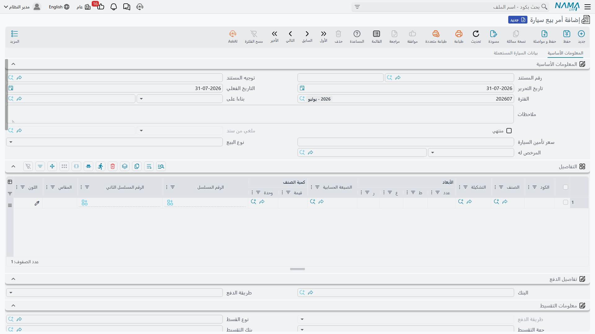

# أوامر بيع السيارات واعتمادها

أمر البيع هو المكان الذي يتحول فيه الحديث إلى التزام. حتى هذه اللحظة لم يتبادل المعرض والعميل غير
الأسعار؛ وهنا يُكتب في مكان واحد: العميل، والسيارة، والمبلغ المتفق عليه، وكيف ستدفع، ومتى — ولأول
مرة في السلسلة، يتحرك شيء من المال.

تجده في **سيارات > مبيعات السيارات > أمر بيع سيارة**
(بالإنجليزية `cars > Car Sales > Car Sales Order`).

::: info الترخيص المطلوب
`srvcenter-subitems`.
:::

## ماذا تحمل الشاشة

### البيانات الأساسية

يحمل الرأس هوية المستند المعتادة — الدفتر والكود،
و[**توجيه المستند**](/ar/modules/servicecenter/document-terms/servicecenter-terms-cars-and-other.md)،
وتاريخ الاستحقاق — إضافة إلى
حقل **بناءا على (From Document)** الذي يربط هذا الأمر بعرض الأسعار الذي جاء منه، والعميل، والمندوب،
والمخزن والموقع، والملاحظات.

وثلاثة حقول تظهر هنا ولا تجدها في معظم مستندات السيارات الأخرى:

| الحقل | فائدته |
|---|---|
| نوع البيع (Sale Type) | نقدي أم تقسيط. يصنّف الصفقة فقط؛ ولا يفتح شيئاً ولا يغلقه. |
| المرخص له (Licensee) | هل تُرخَّص السيارة للعميل أم لطرف ثالث. |
| سعر تأمين السيارة (Car Insurance Price) | قيمة التأمين المتفق عليها مع البيع. |

وهناك حقلان آخران هنا للقراءة فقط لا يكتبهما أحد: علامة **الإلغاء** و**ملغي من سند (Cancelled From
Doc)**. يختمهما مستند «إلغاء أمر بيع سيارة» — انظر
[مستندات الإلغاء](/ar/modules/servicecenter/car-sales/car-cancellation-documents.md).

### الأسطر

السطر الواحد سيارة واحدة. ويحمل الجدول الصنف والكمية وسعر الوحدة والقيمة والضرائب والقسم والمندوب
والمحددات — والعمود الأهم هنا: **السياره (Customer Car)**، وهو الهيكل بعينه الذي يخصّه السطر —
بطاقة في [ملف السيارة](/ar/modules/servicecenter/cars-setup/car-master-file.md).

::: tip دع «بناءا على» يفلتر قائمة الاختيار
حين يُبنى الأمر على عرض أسعار، لا تعرض قائمة *السياره* إلا السيارات التي كانت على ذلك العرض، ومنها
فقط ما تسمح الإعدادات بحالته الحالية على أمر بيع. هذا الفلتر أرخص حاجز أمان في الوحدة كلها — فلا
تعطّله في التوجيه بلا سبب وجيه.
:::

وعمودان يظهران في سطر أمر البيع ولا يظهران في غيره من سلسلة المبيعات: **برنامج التأمين** و**فئة
التأمين** المراد بيعهما مع السيارة. وهما يغذيان
[وثيقة تأمين السيارة](/ar/modules/servicecenter/car-insurance/car-insurance-policy.md) التي قد تصدر
لاحقاً، ولا يغيران شيئاً في الأمر نفسه.

أما تبويب **بيانات السيارة المستعملة** فيسجّل سيارة الاستبدال — رقمها وموديلها وسنة صنعها وقراءة
عدادها ولونها والسعر الذي يطلبه العميل مقابلها ورقم هيكلها ومحركها وكيفية تسويتها. يظهر هذا التبويب
في كل مستندات عائلة مبيعات السيارات تقريباً، لكنه لا يُحمل إلى الأمام بمعنى حقيقي إلا من أمر البيع
وفاتورة المبيعات.

### خطة السداد

هذا هو الجزء الذي لا نظير له في السلسلة كلها إلا في اعتماد البيع:

- **أسطر طرق السداد** — كيف يدفع العميل، بما في ذلك أعمدة البطاقات وبوابات الدفع.
- **قالب السداد** مع إجراء **توليد الدفعات**، الذي يبني لك الجدول.
- **أسطر الجدول** — أقساط السعر المتفق عليه بتواريخها.
- **مستندات السداد الخارجية** — دفعات محصّلة على مستندات أخرى.
- **الشروط النمطية** — البنود التعاقدية التي تُطبع مع الأمر.

وعند الاعتماد يتحقق الأمر من أن جدول السداد يطابق المبلغ المتبقي، وأن الأسعار ملتزمة بقائمة أسعار
المبيعات (ما لم يعطّل التوجيه هذا الفحص)، وأن أكواد التقسيط صحيحة، وأن أسطر السداد والشروط النمطية
مكتملة.

### كتلة التمويل

في الصفقة الممولة يحمل الأمر كتلة تقسيط: بنك التمويل أو شركة التقسيط، وقيمة الحجز، والدفعة المقدمة،
ومبلغ القرض، وردّ البنك — وهي الأرقام التي يعيد المندوب كتابتها يدوياً من
[عرض سعر التقسيط](/ar/modules/servicecenter/car-installments/car-installment-quotation.md). وحقل
واحد فقط في هذه الكتلة يفعل شيئاً.

**قيمة الحجز (Reservation Value) هي دفعة الحجز، وهي تُرحَّل.** فإذا كان توجيه المستند قد مُلئ فيه
حسابا المدين والدائن الخاصان بقيمة الحجز، والقيمة ليست صفراً، أنتج الأمر قيداً بها. وهذا هو الأثر
المحاسبي الوحيد في سلسلة مبيعات السيارات قبل الفاتورة، والموضع الوحيد في الوحدة كلها الذي يُستعمل
فيه هذان الحسابان.

::: warning مسجَّل، لا مُطبَّق
بقية كتلة التمويل التقاط بيانات لا أكثر:

- **حظر بيع السيارة (Block Car Sale)** — لا يحظر شيئاً. وضع العلامة عليه بلا أثر في أي موضع.
- **وصول جواب البنك** و**تاريخ جواب البنك** — يُسجَّلان، ولا تقرأهما أي قاعدة.
- **الدفعة المقدمة** و**مبلغ القرض** — يُسجَّلان، ولا تقرأهما أي قاعدة. لا شيء يطرح الدفعة المقدمة من
  مبلغ القرض، ولا شيء يقارن أياً منهما بحدود برنامج تمويل.

سجّلها لتقاريرك إن كانت مفيدة لك؛ ولا تبنِ عليها رقابة.
:::

## ماذا يفعل الأمر

| الأثر | التفصيل |
|---|---|
| المحاسبة | فقط إن ملأ التوجيه حسابي المدين والدائن — إضافة إلى دفعة الحجز على زوج حسابات قيمة الحجز |
| المخزون | لا شيء. السيارة لا تُحجَز إلا إذا كان خيار **الحجز** في التوجيه مفعّلاً، فيُنشأ حجز كمية معتاد؛ أما تثبيت هيكل بعينه للعميل فهو عمل [تخصيص السيارة](/ar/modules/servicecenter/car-sales/car-allocation.md) |
| المستندات المُنشأة | لا شيء |
| السيارة | سطر حالة إن كان هناك سطر تحديث حالة يستهدف أمر البيع؛ وختم مرجعي أمر البيع والمندوب في تبويب الإحصائيات إن فعّل التوجيه ذلك |

ولا شيء من الأمر مُلزِم لما بعده. فلا قاعدة تقول إن
[فاتورة المبيعات](/ar/modules/servicecenter/car-sales/car-sales-invoice.md) يجب أن تُبنى على أمر،
ولا قاعدة تمنعك من الفوترة بسعر مختلف عن السعر المتفق عليه هنا.

## المثال العملي

توافق ليلى الحربي على شراء `CAR-000318`، ناوا رمال ٢٫٤، يوم **24 فبراير 2026**. أمر البيع
`SISO-2026-0233`:

| | |
|---|---|
| العميل | `CUS-1105` ليلى الحربي |
| المندوبة | `EMP-131` سارة الدوسري |
| السيارة على السطر | `CAR-000318`، الهيكل `NWA7R24C26K000318` |
| نوع البيع | نقدي |
| السعر المتفق عليه | **87,000** |
| قيمة الحجز | **5,000** |

تُرحَّل الـ 5,000 على حسابات قيمة الحجز في توجيه الأمر. ولا شيء آخر في هذا المستند يصل إلى الأستاذ،
ولا تتحرك السيارة قيد أنملة في المخزون.

## اعتماد بيع السيارة

**سيارات > مبيعات السيارات > اعتماد بيع سيارة**.

هذا المستند نسخة شبه طبق الأصل من أمر البيع: الأسطر نفسها، وطرق السداد نفسها، وقالب السداد والجدول
نفساهما، والسداد الخارجي والشروط النمطية نفسها، والتحققات نفسها. وُجد ليتمكن المعرض من تسجيل موافقة
داخلية على صفقة — بخطة سدادها كاملة، متفقاً عليها وموثقة — قبل الأمر نفسه أو بالتوازي معه.

::: warning إنه سجل، لا بوابة
مستند الاعتماد **لا يعتمد شيئاً من الناحية التقنية**. لا يفتح مستنداً، ولا يفحصه أي تحقق، ولا يرفض أي
مستند آخر الاعتماد بسبب غيابه. هو سجل داخلي كامل بالمال، باسم يوحي بأنه خطوة في دورة موافقات.

فإن احتجت بوابة اعتماد حقيقية، فابنِها كما تُبنى في سائر مستندات النظام: دورة الاعتماد القياسية
على المستند الذي تريد ضبطه فعلاً، مع — إن أردت أن تعكس حالةُ السيارة ذلك — سطر تحديث حالة يستهدف هذا
المستند. هذه **إعدادات**، لا خاصية في المنتج.
:::

وفرقان أصغر عن أمر البيع يستحقان الذكر:

- يستطيع الاعتماد ترحيل **زوج المدين والدائن العام** إن ملأه التوجيه، لكن **حسابات قيمة الحجز لا تعمل
  عليه**. فترحيل دفعة الحجز خاص بأمر البيع وحده.
- **لا يستهدف اعتمادَ البيع أي مستند إلغاء.** حقول الإلغاء موجودة عليه، لكن لا شيء يستطيع ضبطها أبداً.
  وللتراجع عن اعتماد، احذفه.
